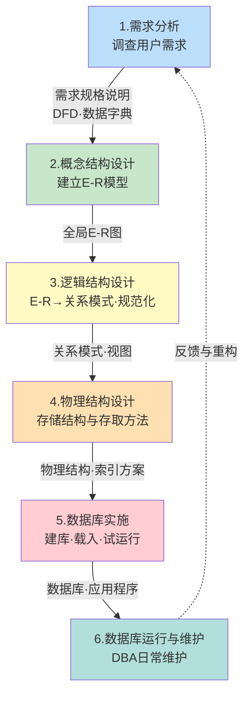

# 7.1 数据库设计概述

数据库设计是数据库应用系统建设的核心环节。本节回答三个根本问题：**什么是数据库设计**、**它有哪些特点**、**用什么方法和流程来完成**。它为后续 7.2–7.7 各阶段提供整体框架——明确了六阶段流程后，各节再分别展开每一阶段的任务、方法与产物。

## 数据库设计的定义与目标

> [!definition] 数据库设计
> 数据库设计（Database Design）是指对于一个给定的应用环境，构造（设计）优化的数据库逻辑模式和物理结构，并据此建立数据库及其应用系统，使之能够有效地存储和管理数据，满足各种用户的应用需求（信息处理要求和数据约束要求）。

> [!note] 目标解读
> 数据库设计的目标可拆为两层：
> 1. **数据层目标**：构造结构合理（满足 [[6.3 范式（1NF、2NF、3NF、BCNF）]]）、冗余小、完整性好、性能优的数据库模式。
> 2. **应用层目标**：建立能方便地存储、检索、更新数据的应用系统，满足不同用户（管理人员、操作员、决策者等）的多样化需求。
>
> 设计不是单纯写 SQL，而是从需求到模式的工程化建模过程。

## 数据库设计的特点

> [!tip] 数据库建设是"三分技术，七分管理"
> 这是数据库设计最经典的论断。意思是：数据库建设过程中，技术（数据模型、SQL、规范化等）只占三成，**管理**（业务调研、需求管理、组织协调、项目管理）占七成。设计的成败往往取决于对业务的理解程度，而非技术本身的精巧程度。

数据库设计的主要特点：

| 特点 | 含义 | 工程意义 |
| ---- | ---- | ---- |
| **三分技术，七分管理** | 管理与业务理解比技术更重要 | 设计前必须深入业务调研，避免"闭门造车" |
| **反复性（iterative）** | 设计不可能一次完成，需反复迭代 | 每个阶段都可能回头修正前一阶段产物 |
| **试探性（heuristic）** | 多种方案并存，需试探比较后择优 | 设计是"求解"而非"计算"，存在多解 |
| **分步进行（multi-stage）** | 划分为多个阶段，逐步细化 | 控制复杂度，每阶段有明确输入输出 |
| **团队协作** | 需 DBA、分析员、程序员、用户共同参与 | 需求与实现的桥梁需多方共同维护 |

> [!warning] 反复性的两面性
> 反复性允许设计者修正前期错误，但也意味着**不能无限期推迟交付**。工程实践中常给每阶段设里程碑，必要时冻结需求再迭代，避免"分析瘫痪"（Analysis Paralysis）。

## 数据库设计方法

### 新奥尔良法（New Orleans Approach）

> [!definition] 新奥尔良法
> 1978 年 10 月，在美国新奥尔良（New Orleans）召开的数据库设计会议上，提出了一种公认的数据库设计方法框架，将数据库设计分为四个阶段：
> 1. **需求分析**（Requirement Analysis）
> 2. **概念结构设计**（Conceptual Design）
> 3. **逻辑结构设计**（Logical Design）
> 4. **物理结构设计**（Physical Design）
>
> 这一方法也称为**New Orleans 四阶段法**，是后续所有数据库设计方法学的基础。

> [!note] 四阶段与六阶段的关系
> 新奥尔良法的四阶段是**设计阶段**的核心。教材在此基础上扩展为**六阶段**：在物理设计之后增加"数据库实施"和"数据库运行与维护"两个工程阶段，覆盖了数据库从设计到运行的全生命周期。四阶段回答"如何设计"，六阶段回答"如何交付与运维"。

### 其他设计方法

| 方法 | 要点 | 适用场景 |
| ---- | ---- | ---- |
| **基于 E-R 模型的方法** | 用 E-R 图作为概念设计的核心工具 | 业务结构清晰，可手工建模（本章主线） |
| **基于 3NF 的方法** | 直接从函数依赖出发，规范化到 3NF | 数据约束明确、关系为主的小型库 |
| **面向对象的方法** | 用 UML 类图等建模，再映射到关系或对象数据库 | OO 系统集成、对象数据库 |
| **计算机辅助设计（CASE 工具）** | PowerDesigner、ERwin、MySQL Workbench 等工具辅助建模 | 中大型工程，提高效率与一致性 |

> [!tip] 实践中的综合
> 现代数据库设计常以 **新奥尔良法为框架、E-R 模型为概念工具、3NF 为规范化准则、CASE 工具为辅助**，四者结合使用。本章 7.2–7.5 即按此思路展开。

## 数据库设计六阶段流程

下表列出六个阶段的任务、输入、产物与所属环节：

| 阶段 | 主要任务 | 输入 | 产物 | 所属环节 |
| ---- | ---- | ---- | ---- | ---- |
| **1. 需求分析** | 调查用户业务与数据需求，明确系统边界 | 用户、业务流程、现有系统 | 需求规格说明、数据流图（DFD）、数据字典 | 设计 |
| **2. 概念结构设计** | 将需求抽象为独立于 DBMS 的概念模型 | 需求规格说明 | 全局 E-R 图 | 设计 |
| **3. 逻辑结构设计** | 将 E-R 图转换为 DBMS 支持的数据模型（关系模型），并规范化 | 全局 E-R 图 | 关系模式（含主码外码）、子模式（视图） | 设计 |
| **4. 物理结构设计** | 为逻辑模型选取物理存储结构与存取方法 | 关系模式、DBMS 特性 | 物理结构说明、索引方案、配置参数 | 设计 |
| **5. 数据库实施** | 定义数据库结构、载入数据、调试应用程序、试运行 | 物理结构、应用程序 | 可运行的数据库与应用系统 | 工程 |
| **6. 数据库运行与维护** | 投入运行后的日常维护、性能监督、重组重构 | 运行中的数据库 | 转储日志、性能报告、变更记录 | 运维 |

> [!example] 阶段衔接示例
> 以学生选课系统为例：
> - **需求分析**：调研教务处与教师，得知"学生选修课程，教师评定成绩"。
> - **概念结构设计**：抽象出"学生—选修—课程"的 E-R 图。
> - **逻辑结构设计**：转换为 `Student(Sno, Sname, ...)`、`Course(Cno, Cname, ...)`、`SC(Sno, Cno, Grade)` 三个关系模式。
> - **物理结构设计**：在 `SC(Sno, Cno)` 上建主键索引，在 `Grade` 上考虑是否建二级索引。
> - **数据库实施**：用 MySQL 8.0 写 `CREATE TABLE` 脚本，导入历史成绩数据。
> - **运行与维护**：定期备份，监控慢查询，必要时重建索引。

## 设计阶段与其他各章的关系

> [!note] 本章与前序理论的衔接
> 数据库设计不是孤立的章节，它把前序理论转化为工程产物：
> - 第 2 章 [[2.1 关系数据结构及形式化定义]]、[[2.3 关系的完整性]] 提供关系模型基础；
> - 第 3 章 [[3.2 数据定义]]、[[3.5 视图]] 提供 SQL 实现语言；
> - 第 6 章 [[6.3 范式（1NF、2NF、3NF、BCNF）]]、[[6.5 模式分解]] 提供逻辑设计的规范化准则。
>
> 设计产物（数据库模式与运行系统）进入运行阶段后，由第 8 章 [[MOC - 第8章|数据库恢复技术]] 与第 9 章 [[MOC - 第9章|并发控制]] 保障其正确性。

## 小结

> [!summary] 本节核心
> 1. 数据库设计是在给定 DBMS 环境下构造优化的数据库模式与应用系统的工程过程，目标是结构合理、性能良好、易于维护。
> 2. 设计特点："三分技术，七分管理"，强调业务理解；并具有反复性、试探性、分步性、团队协作性。
> 3. 经典方法是新奥尔良法（四阶段：需求分析→概念设计→逻辑设计→物理设计）；教材扩展为六阶段，增加实施与运维。
> 4. 六阶段流程是后续 7.2–7.7 的展开框架，各阶段有明确的输入、产物与边界。

## 关联

- 本章 MOC：[[MOC - 第7章]]
- 下一节：[[7.2 需求分析]]（六阶段的第一阶段）
- 理论依据：[[6.3 范式（1NF、2NF、3NF、BCNF）]]、[[6.5 模式分解]]（逻辑设计的规范化准则）
- 工程衔接：[[MOC - 第8章]]（恢复技术保障运行阶段数据安全）、[[MOC - 第9章]]（并发控制保障多用户正确性）
