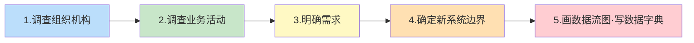
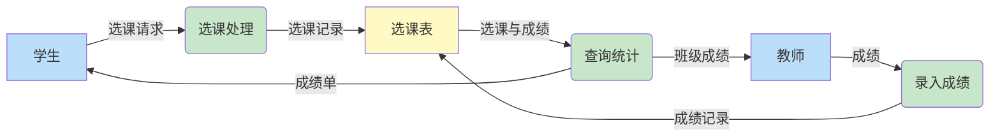

# 7.2 需求分析

需求分析是数据库设计六阶段的第一步。它的任务是**准确了解并描述用户的需求**，回答"系统要做什么、要处理哪些数据、数据如何流动"。本节解决两个核心问题：如何**调查并整理需求**（步骤与方法），以及如何**用图形与文档表达需求**（数据流图 DFD 与数据字典）。需求分析的质量直接决定后续概念设计与逻辑设计的成败——"垃圾进，垃圾出"。

## 需求分析的任务

> [!definition] 需求分析的任务
> 需求分析的任务是：通过详细调查现实世界要处理的对象（组织、部门、企业等），充分了解原系统（手工系统或计算机系统）的工作概况，明确用户的各种需求，然后在此基础上确定新系统的功能与边界，最终形成**需求规格说明书**（Requirement Specification）。

需求分析中需重点明确的需求类型：

| 需求类型 | 含义 | 示例 |
| ---- | ---- | ---- |
| **信息需求** | 用户需要在数据库中存储哪些数据 | 学生学号、姓名、课程、成绩 |
| **处理需求** | 用户要完成什么处理功能 | 选课、查成绩、统计平均分 |
| **安全性与完整性需求** | 数据的保密级别、约束规则 | 学生只能查自己成绩，成绩 0–100 |

> [!warning] 需求调查的常见误区
> 1. **只问技术人员**：实际用户（教师、教务员、学生）才是需求的真正来源，不能只问 IT 部门。
> 2. **把"现有系统"等同于"需求"**：现有系统可能本身有缺陷，应理解业务本质而非照搬现状。
> 3. **需求过早固化**：业务会变化，需求应保留可扩展空间，但要设里程碑冻结基线。

## 需求分析的步骤



> [!example] 各步骤详解（以学生选课系统为例）
> 1. **调查组织机构**：了解学校有教务处、各院系、教师、学生等角色及其层级关系。
> 2. **调查业务活动**：了解各角色的日常工作——教务员排课、教师录入成绩、学生选课查成绩。
> 3. **明确需求**：
>    - 信息需求：学生、课程、教师、成绩；
>    - 处理需求：选课、退课、录入成绩、查询成绩、统计；
>    - 完整性需求：成绩 0–100，学号唯一，课程号唯一。
> 4. **确定新系统边界**：明确哪些功能由数据库系统承担（选课、成绩管理），哪些不承担（如财务发薪）。
> 5. **画数据流图、编写数据字典**：用 DFD 描述数据流向，用数据字典定义所有数据项。

常用的需求调查方法：

| 方法 | 适用场景 |
| ---- | ---- |
| **跟班作业** | 深入了解实际操作流程 |
| **开调查会** | 与多类用户座谈，澄清共性需求 |
| **请专人介绍** | 快速获取业务全貌 |
| **询问** | 对个别细节追问 |
| **设计调查表请用户填写** | 大范围收集需求 |
| **查阅记录** | 了解原有系统的数据与日志 |

## 数据流图（DFD）

> [!definition] 数据流图
> 数据流图（Data Flow Diagram, DFD）是一种图形化工具，用于描述系统中数据的**流动方向**、**处理过程**和**存储位置**。它从数据传递与处理的角度刻画系统的逻辑功能，是需求分析阶段的核心产物之一。

### DFD 的四要素

| 要素 | 符号 | 含义 | 示例 |
| ---- | ---- | ---- | ---- |
| **数据流** | 带箭头的直线 → | 数据的流动方向与内容 | "选课请求"、"成绩单" |
| **处理** | 圆形（或圆角矩形）○ | 对数据的加工变换 | "计算平均分"、"录入成绩" |
| **数据存储** | 双横线（或开口矩形）═ | 数据的保存位置 | "学生表"、"成绩表" |
| **外部实体** | 矩形 □ | 系统之外的数据来源或去向 | "学生"、"教师" |

> [!tip] DFD 分层
> 实际系统复杂时，DFD 采用**分层细化**方式：顶层图（Context Diagram）描述系统与外部实体的交互；0 层图细化系统主要功能；1 层、2 层图进一步细化各处理。每层图的输入输出必须与上层一致，保证"平衡"。

### DFD 示例

下面用 Mermaid `flowchart` 模拟学生选课系统的 DFD（Mermaid 无原生 DFD 符号，用矩形表示外部实体、圆角矩形表示处理、平行四边形表示数据存储）：



> [!example] DFD 要素对照
> - 外部实体：`学生`、`教师`（矩形）
> - 处理：`选课处理`、`录入成绩`、`查询统计`（圆角矩形）
> - 数据存储：`选课表`（平行四边形/双横线）
> - 数据流：`选课请求`、`成绩`、`成绩单`等（带箭头的边）

## 数据字典

> [!definition] 数据字典
> 数据字典（Data Dictionary, DD）是关于数据库中数据的描述，即**元数据**（metadata）的集合。它对数据流图中的所有数据流、数据存储和处理过程进行严格定义，是需求分析阶段的另一核心产物。
>
> 数据流图给出系统的"骨架"，数据字典则赋予每根骨头以"血肉"——把图形中抽象的数据流与处理细化为可被设计与实现引用的精确说明。

### 数据字典的五部分

| 部分 | 描述对象 | 内容 | 示例 |
| ---- | ---- | ---- | ---- |
| **数据项** | 不可再分的数据单位 | 名称、别名、类型、长度、取值范围、含义 | `Sno`：学号，字符型，8 位，唯一标识学生 |
| **数据结构** | 数据项的有意义组合 | 名称、组成（数据项或子结构）、含义 | `学生` = {学号, 姓名, 性别, 出生日期, 所在系} |
| **数据流** | 数据结构在系统内的流动 | 名称、来源、去向、组成、流量 | `选课请求`：来源=学生，去向=选课处理，组成={学号, 课程号} |
| **数据存储** | 数据结构停留与保存处 | 名称、编号、流入/流出的数据流、组成、存取频率 | `选课表 SC`：组成={学号, 课程号, 成绩}，存取频率=高 |
| **处理过程** | 对数据的加工 | 名称、输入数据流、输出数据流、处理逻辑简述 | `录入成绩`：输入=成绩，输出=成绩记录，逻辑=按学号课程号更新成绩 |

> [!example] 数据项条目示例
> ```
> 数据项：Sno（学号）
>   别名：学生编号
>   类型：CHAR(8)
>   长度：8
>   取值范围：入学年(4位)+院系码(2位)+顺序号(2位)
>   含义：唯一标识一名在校学生的编号
> ```

> [!example] 数据结构条目示例
> ```
> 数据结构：Student（学生）
>   组成：{Sno, Sname, Ssex, Sage, Sdept}
>   含义：描述一名学生的基本信息
>   关键字：Sno
> ```

> [!example] 数据流条目示例
> ```
> 数据流：选课请求
>   来源：学生（外部实体）
>   去向：选课处理（处理过程）
>   组成：{Sno, Cno}
>   流量：约 5000 次/学期初
> ```

> [!example] 数据存储条目示例
> ```
> 数据存储：SC（选课表）
>   编号：D3
>   流入数据流：选课记录、成绩记录
>   流出数据流：选课与成绩查询
>   组成：{Sno, Cno, Grade}
>   关键字：(Sno, Cno)
>   存取频率：高（选课期与查询期峰值）
> ```

> [!example] 处理过程条目示例
> ```
> 处理过程：录入成绩
>   编号：P2
>   输入数据流：成绩（来自教师）
>   输出数据流：成绩记录（写入 SC）
>   处理逻辑：教师按课程号查询选课学生列表，
>             逐条输入成绩，校验 0≤Grade≤100，
>             更新 SC 表对应记录
> ```

> [!tip] DFD 与数据字典的配合
> - DFD 描述"系统做什么、数据如何流动"——**直观但不精确**。
> - 数据字典描述"数据的细节是什么"——**精确但不直观**。
> 二者**互为补充**，缺一不可。仅有 DFD 无法实现，仅有数据字典难以理解全局。

## 需求分析阶段的产物

> [!summary] 产物清单
> 需求分析阶段最终交付：
> 1. **需求规格说明书**（Requirement Specification）——需求分析的总报告；
> 2. **数据流图（DFD）**——分层数据流图，描述系统逻辑功能；
> 3. **数据字典（DD）**——数据项、数据结构、数据流、数据存储、处理过程的详细定义；
> 4. **系统边界说明**——明确系统承担与不承担的功能。
>
> 这些产物是 [[7.3 概念结构设计（E-R模型）]] 的输入：数据字典中的"数据结构"是实体的雏形，"数据流"反映联系的方向。

## 小结

> [!summary] 本节核心
> 1. 需求分析的任务是调查用户需求并形成需求规格说明，明确信息需求、处理需求与安全完整性需求。
> 2. 调查步骤：调查组织机构→调查业务活动→明确需求→确定新系统边界→画 DFD 与数据字典。
> 3. 数据流图（DFD）四要素：数据流、处理、数据存储、外部实体；分层细化，保持上下层平衡。
> 4. 数据字典五部分：数据项、数据结构、数据流、数据存储、处理过程，是 DFD 的精确补充。
> 5. DFD 与数据字典互为表里，共同构成需求规格说明的核心内容。

## 关联

- 本章 MOC：[[MOC - 第7章]]
- 上一节：[[7.1 数据库设计概述]]（六阶段框架）
- 下一节：[[7.3 概念结构设计（E-R模型）]]（将需求转换为概念模型）
- 数据字典中的"数据结构"概念对应 [[2.1 关系数据结构及形式化定义]] 中的关系结构
- DFD 与数据存储的概念在 [[3.2 数据定义]] 中由 SQL 的 `CREATE TABLE` 实现
