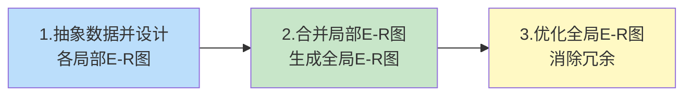
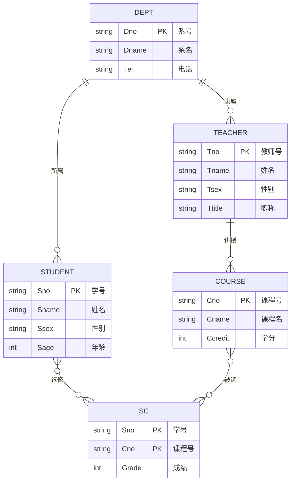

# 7.3 概念结构设计（E-R 模型）

概念结构设计是数据库设计的**核心环节**，也是本章的**重点**。它将需求分析阶段得到的数据流图与数据字典抽象为独立于任何 DBMS 的**概念模型**——通常用 **E-R（Entity-Relationship，实体-联系）模型**表达。E-R 模型既忠实反映现实世界，又易于向关系模型转换，是连接"用户业务"与"数据库实现"的关键桥梁。本节系统讲解 E-R 模型的基本概念、图形表示、属性分类、概念结构设计方法（重点为自底向上法）、E-R 图设计步骤、以及局部 E-R 图合并时的冲突识别与解决，最后给出贯穿学生-课程-教师-系的完整 E-R 图示例。

## 概念结构设计的定义与特点

> [!definition] 概念结构设计
> 概念结构设计是将需求分析得到的用户需求抽象为**概念模型**的过程。概念模型独立于具体的 DBMS 与硬件，是现实世界到信息世界的第一次抽象。最常用的概念模型工具是 **E-R 模型**，其图形表示称为 **E-R 图**。

> [!tip] 概念模型的四大特点
> 一个好的概念模型应具备以下特点：
> 1. **能真实地反映现实世界**——准确表达事物的本质、属性与联系，满足应用需求。
> 2. **易于理解**——便于非计算机专业人员（用户、业务方）阅读与确认，是用户与设计者沟通的桥梁。
> 3. **易于更改**——当应用需求变化时，可方便地修改概念模型，而无需推翻重来。
> 4. **易于向数据模型转换**——能顺利地转换为关系、网状、层次等 DBMS 支持的逻辑数据模型（本章统一转换为关系模型，见 [[7.4 逻辑结构设计]]）。

> [!note] 为什么不直接设计关系模式？
> 跳过概念设计、直接画关系模式表的弊端：
> - 关系模式是"实现层面"的产物，非专业用户难以理解，无法确认是否反映了真实需求；
> - 一旦业务变化，关系模式改动牵涉外码、索引等多处，成本高；
> - E-R 模型抽象层次更高、更接近业务本质，先建模再转换能避免实现细节污染需求理解。

## E-R 模型的基本概念

E-R 模型由 P.P.S. Chen 于 1976 年提出，它从现实世界中抽象出两类基本对象：**实体**与**联系**，并用**属性**刻画它们的特征。

### 实体（Entity）

> [!definition] 实体
> 实体是客观存在并可相互区别的事物。实体可以是**具体的人、物、对象**（如一名学生、一门课程、一辆汽车），也可以是**抽象的事件或概念**（如一次选课、一份合同、一个部门）。

> [!example] 实体举例
> - 学生选课系统：学生、课程、教师、系都是实体；
> - 电商系统：用户、商品、订单、店铺都是实体；
> - 图书借阅系统：读者、图书、借阅记录都是实体。

### 属性（Attribute）与码（Key）

> [!definition] 属性
> 属性是实体所具有的某一特性。一个实体由若干属性刻画。例如学生实体有学号、姓名、性别、年龄、所在系等属性。

> [!definition] 码（Key）
> 能唯一标识实体的属性或属性组称为**码**（或关键字）。例如学号是学生实体的码；课程号是课程实体的码。

> [!definition] 域（Domain）
> 属性的取值范围称为该属性的**域**。例如性别的域为 {男, 女}；成绩的域为 [0, 100]；年龄的域为正整数。域对应关系模型中的 [[2.1 关系数据结构及形式化定义|域]] 概念。

### 实体型与实体集

> [!definition] 实体型
> **实体型**（Entity Type）是对同类实体的抽象定义，用**实体名及其属性名集合**表示。例如 `学生(学号, 姓名, 性别, 年龄, 所在系)` 是一个实体型。

> [!definition] 实体集
> **实体集**（Entity Set）是同型实体的集合。例如"全体学生"是一个实体集；"全体课程"是另一个实体集。
>
> 区分：实体型是"类型"（int 之于变量），实体集是"值"的集合（具体变量的集合）。E-R 图绘制的是**实体型**；数据库中存储的是**实体集**。

### 联系（Relationship）

> [!definition] 联系
> 联系是实体（集）之间的关联关系。例如"学生选修课程"、"教师讲授课程"都是联系。联系也可以有自身的属性，如"选修"联系可带"成绩"属性。

> [!note] 联系的元数（度数）
> 联系可涉及多个实体集，涉及的实体集数目称为联系的**元数**或**度数**：
> - **一元联系**（递归联系）：同一实体集内部实体的联系，如"职工"实体内部的"领导"联系；
> - **二元联系**：两个实体集之间的联系，最常见，如学生-课程；
> - **三元联系**：三个实体集之间的联系，如"供应商-零件-工程"的供应联系。
>
> 本章主要讨论二元联系。

### 联系的基数（1:1、1:n、m:n）

> [!definition] 联系的基数
> 联系的基数（cardinality ratio）刻画两个实体集之间在数量上的对应关系，分为三种：

| 联系类型 | 定义 | 示例 |
| ---- | ---- | ---- |
| **1:1（一对一）** | 实体集 A 中每个实体至多与 B 中一个实体联系，反之亦然 | 学校与校长、部门与经理 |
| **1:n（一对多）** | 实体集 A 中每个实体可与 B 中多个实体联系，但 B 中每个实体只与 A 中一个联系 | 系与学生、母亲与子女 |
| **m:n（多对多）** | 实体集 A 中每个实体可与 B 中多个实体联系，反之亦然 | 学生与课程、读者与图书 |

> [!example] 三种联系的判定
> - "学生—所属—系"：一名学生只属于一个系，一个系有多名学生 → **1:n**（系:学生 = 1:n）。
> - "课程—讲授—教师"：一门课由一名教师讲，一名教师可讲多门课 → **1:n**（教师:课程 = 1:n）。
> - "学生—选修—课程"：一名学生选多门课，一门课被多名学生选 → **m:n**。
> - "班级—班长—学生"：一个班有一个班长，一名学生只当一个班的班长 → **1:1**。

> [!warning] 联系的方向性
> 1:n 联系必须明确"谁是 1、谁是 n"。说"系与学生是 1:n"是指一个系对应多名学生，反过来"学生与系是 n:1"。描述时建议写成"系—1:n—学生"以避免歧义。

## E-R 图的图形表示

E-R 图用四种基本图形符号表示实体、属性、联系及其连接：

| 符号 | 形状 | 表示对象 | 示例 |
| ---- | ---- | ---- | ---- |
| **矩形** | ▭ | 实体 | 学生、课程 |
| **椭圆** | ○ | 属性 | 学号、姓名 |
| **菱形** | ◇ | 联系 | 选修、讲授 |
| **无向边** | — | 实体与属性、实体与联系的连接 | 连接学生与其学号属性 |

> [!note] 图形约定
> - 实体与其属性之间用无向边连接；
> - 联系用无向边连接相关的实体；
> - 联系自身的属性也用无向边连到菱形；
> - 在实体与联系的无向边上标注联系的基数（1 或 n 或 m）；
> - 主码属性在属性名下加下划线。

> [!example] 标准 E-R 图（学生-课程 m:n 选修）
> ```
>   [学号]──[姓名]──[年龄]
>      │       │       │
>      └───────┴───────┘
>              │
>           (学生)◇──m──(选修)──n──(课程)
>                              │
>                         [成绩]
> ```
> 图中：`学生`、`课程` 是实体（矩形），`选修` 是联系（菱形），`成绩` 是联系的属性，边上标 m、n 表示多对多。

### 用 Mermaid erDiagram 表达 E-R 图

标准 E-R 图的矩形/椭圆/菱形在 Mermaid 中无原生支持，但 Mermaid 提供了 `erDiagram` 语法表达实体与联系。`erDiagram` 用实体框直接列出属性，用连线表示联系基数，是工程文档中表达 E-R 模型的常用方式。

> [!tip] Mermaid erDiagram 连线语法
> Mermaid `erDiagram` 支持以下基数标记（左侧为左实体到右实体的基数，右侧为右实体到左实体的基数）：
> - `||--||` 1:1
> - `||--o{` 1:0..n（一对多，可选）
> - `||--|{` 1:1..n（一对多，至少一）
> - `}o--o{` 0..n:0..n（多对多，可选）
> - `}|--|{` 1..n:1..n（多对多，至少一）
>
> 属性格式：`类型 名称 "注释"`；主键可用注释标注，或用 PK / FK 关键字。

## 属性的分类

属性按不同维度可分为若干类型，理解这些分类有助于正确建模：

### 按是否可分：简单属性与复合属性

| 类型 | 定义 | 示例 |
| ---- | ---- | ---- |
| **简单属性** | 不可再分的原子属性 | 学号、性别、年龄 |
| **复合属性** | 可再分为更小子属性的属性 | 姓名（姓+名）、地址（省+市+街道） |

> [!note] 复合属性的处理
> 关系模型要求属性原子（[[6.3 范式（1NF、2NF、3NF、BCNF）|1NF]]），故逻辑设计时复合属性需拆分为多个简单属性。例如 `地址` 拆为 `省份`、`城市`、`街道` 三个属性。E-R 图中可保留复合属性以贴近业务，转换阶段再拆分。

### 按取值个数：单值属性与多值属性

| 类型 | 定义 | 示例 |
| ---- | ---- | ---- |
| **单值属性** | 对一个实体只有一个取值 | 学号、年龄 |
| **多值属性** | 对一个实体可有一组取值 | 联系电话（一人可有多号码）、技能 |

> [!warning] 多值属性的处理
> 多值属性在 E-R 图中用**双线椭圆**表示。逻辑设计时不能直接放入关系模式（违反 1NF），通常有三种处理：
> 1. 拆为独立关系模式（如 `电话(学号, 号码)`）；
> 2. 限定最大个数后拆为多个属性（`电话1`、`电话2`）；
> 3. 用 JSON/数组类型存储（现代 DBMS 支持，但偏离规范关系模型）。

### 派生属性

> [!definition] 派生属性
> 派生属性的值可从其他属性或相关实体推导得到，**不必显式存储**。E-R 图中用**虚线椭圆**表示。

> [!example] 派生属性示例
> - `年龄` 可由 `出生日期` 推导；
> - `平均成绩` 可由各科成绩计算；
> - `选课人数` 可由 SC 表统计。
>
> 派生属性一般不存入数据库，而用视图或计算列实现（见 [[3.5 视图]]）。

| 属性分类维度 | 类型 | E-R 图表示 | 关系模型处理 |
| ---- | ---- | ---- | ---- |
| 可分性 | 简单 / 复合 | 单椭圆 / 嵌套椭圆 | 复合属性拆分为多个简单属性 |
| 取值数 | 单值 / 多值 | 单椭圆 / 双线椭圆 | 多值属性拆为独立关系或多个属性 |
| 推导性 | 存储 / 派生 | 实线椭圆 / 虚线椭圆 | 派生属性用视图或计算列实现 |

## 概念结构设计的方法

> [!note] 三种设计策略
> 概念结构设计常用的策略有三种，对应不同的抽象方向：

| 方法 | 方向 | 要点 | 适用场景 |
| ---- | ---- | ---- | ---- |
| **自顶向下（Top-Down）** | 先全局后局部 | 先设计全局概念框架，再逐步细化 | 业务结构稳定、可先把握全局 |
| **自底向上（Bottom-Up）** | 先局部后全局 | 先设计各局部 E-R 图，再合并为全局 E-R 图 | 中大型系统，分模块并行设计（**教材重点**） |
| **混合策略** | 上下结合 | 先自顶向下规划框架，再自底向上设计各部分，最后合并 | 大型复杂系统 |

> [!tip] 教材重点：自底向上法
> 自底向上法是本科教材重点讲解的方法，也是工程中最常用的方法。原因：
> - 现实业务常分属不同部门，可由各模块负责人并行设计局部 E-R 图，效率高；
> - 局部 E-R 图规模小，易于理解与确认；
> - 合并阶段集中解决冲突，保证全局一致性。

### 自底向上法的三步流程



下面分步展开。

## 第一步：抽象数据并设计局部 E-R 图

### 数据抽象方法

> [!definition] 数据抽象
> 数据抽象是从现实世界的具体事物中抽取共性、忽略非本质细节，形成概念模型的过程。E-R 建模常用三种抽象方法：

| 抽象方法 | 含义 | 在 E-R 图中的应用 |
| ---- | ---- | ---- |
| **分类（Classification）** | 将现实世界中具有共同性质的对象归为同一类型 | 定义实体型（如"学生"是所有学生的抽象） |
| **聚集（Aggregation）** | 将若干属性聚集成一个实体型 | 定义实体的属性集合（如学生由学号、姓名等聚集而成） |
| **概括（Generalization）** | 从多种实体型中抽取共同性质，形成更一般的实体型 | 定义超类与子类（如"人"是"学生"和"教师"的超类） |

### 局部 E-R 图设计步骤

1. **划分局部结构范围**：按部门、业务功能或用户视图划分，每个局部结构对应一个相对独立的业务子领域。
2. **识别实体**：从数据字典的"数据结构"与"数据存储"中识别实体。
3. **定义属性**：为每个实体定义属性，并确定码。
4. **确定联系**：识别实体间的联系，判断基数（1:1、1:n、m:n），并为联系设置属性。
5. **绘制局部 E-R 图**：用矩形、椭圆、菱形表达，标注基数。

> [!example] 局部 E-R 图示例（学生选课子系统）
> 范围：教务处学生选课业务。识别出的实体与联系：
> - 实体：`学生`（属性：学号、姓名、性别、年龄）、`课程`（属性：课程号、课程名、学分）
> - 联系：`选修`（学生—课程 m:n，带属性：成绩）
>
> 用 Mermaid `erDiagram` 表示：
> ```mermaid
> erDiagram
>     STUDENT ||--o{ SC : "选修"
>     COURSE ||--o{ SC : "被选"
>     SC {
>         string Sno PK "学号"
>         string Cno PK "课程号"
>         int    Grade "成绩"
>     }
>     STUDENT {
>         string Sno PK "学号"
>         string Sname "姓名"
>         string Ssex "性别"
>         int    Sage "年龄"
>     }
>     COURSE {
>         string Cno PK "课程号"
>         string Cname "课程名"
>         int    Ccredit "学分"
>     }
> ```
> 注：`erDiagram` 用 `SC` 关系模式表达 m:n 联系，这是逻辑设计的产物；概念设计阶段更纯粹地用学生—选修—课程的菱形联系表达。两种表示等价，工程文档中常用前者直接表达最终模式。

## 第二步：合并局部 E-R 图生成全局 E-R 图

各局部 E-R 图由不同小组设计，必然存在不一致，称为**冲突**。合并的核心任务是**识别并解决冲突**，最终生成统一的全局 E-R 图。

### E-R 图的三类冲突

> [!warning] 冲突类型（重点考点）
> 局部 E-R 图合并时的冲突分三类：

| 冲突类型 | 表现 | 解决方法 |
| ---- | ---- | ---- |
| **属性冲突** | 同一属性在不同局部 E-R 图中类型、取值范围或取值单位不一致 | 与用户协商，统一约定类型与取值范围 |
| **命名冲突** | 同名异义（同一名字表示不同对象）或异名同义（不同名字表示同一对象） | 重新命名，消除歧义 |
| **结构冲突** | 同一实体在不同 E-R 图中属性个数/次序不同；同一对象在 A 图中是实体、在 B 图中是属性；同一联系在不同图中基数不同 | 合并属性、统一抽象层次、统一基数 |

#### 属性冲突

> [!example] 属性冲突举例
> - 学号在 A 图中为整数型、在 B 图中为字符型 → 统一为字符型 `CHAR(8)`；
> - 成绩在 A 图中为百分制、在 B 图中为五级制 → 统一为百分制 `0–100`；
> - 重量在 A 图中以"千克"为单位、在 B 图中以"克"为单位 → 统一为千克。
>
> 属性冲突多源于数据字典不统一，需与用户协商确定。

#### 命名冲突

> [!example] 命名冲突举例
> - **同名异义**：A 图中"编号"指学生学号，B 图中"编号"指课程号 → 重命名为"学号"、"课程号"；
> - **异名同义**：A 图称"项目"，B 图称"课题"指同一对象 → 统一命名为"项目"（或"课题"）。
>
> 命名冲突与具体业务语境相关，需在合并时建立术语对照表。

#### 结构冲突

> [!example] 结构冲突举例
> - **属性个数不同**：学生实体在 A 图中含 {学号, 姓名, 性别}，在 B 图中含 {学号, 姓名, 性别, 年龄, 所在系} → 合并为后者，取并集；
> - **抽象层次不同**："所在系"在 A 图中是学生实体的属性，在 B 图中是独立实体 → 一般升格为实体（属性无法表达系主任、系电话等系级信息），并建立学生与系的 1:n 联系；
> - **基数不同**：学生与课程的联系在 A 图中为 m:n，在 B 图中为 1:n → 需重新核对业务规则，确定正确基数。
>
> 结构冲突最为复杂，需根据业务语义逐一处理。

### 合并策略

> [!tip] 合并顺序
> 合并非一次性完成，常按以下顺序逐步合并：
> 1. 选定一个**核心局部 E-R 图**作为初始全局 E-R 图（通常是涉及实体最多、联系最复杂的子图）；
> 2. 将其他局部 E-R 图依次并入，每次合并解决一类冲突；
> 3. 每次合并后检查全局一致性，必要时回溯调整。
>
> 合并是迭代过程，不能期望一次到位。

> [!example] 局部 E-R 图合并示例
> 设两个局部 E-R 图：
> - **局部图 A（学生选课视图）**：学生—选修(m:n, 成绩)—课程；学生属性 {学号, 姓名, 性别}。
> - **局部图 B（院系管理视图）**：学生—所属(n:1)—系；系属性 {系号, 系名}；学生属性 {学号, 姓名, 性别, 年龄, 所在系号}。
>
> 合并过程：
> 1. **属性冲突**：学生属性个数不同 → 取并集 {学号, 姓名, 性别, 年龄, 所在系号}；
> 2. **命名冲突**：A 图无"系"实体，B 图有 → 引入"系"实体；
> 3. **结构冲突**："所在系号"在 B 图中既可作为学生属性，也可建立"学生—所属—系"联系 → 选择建立联系（更符合业务，系是独立实体）。
>
> 合并后的全局 E-R 图：
> ```mermaid
> erDiagram
>     STUDENT }o--|| DEPT : "所属"
>     STUDENT }o--o{ SC : "选修"
>     COURSE }o--o{ SC : "被选"
>     STUDENT {
>         string Sno PK "学号"
>         string Sname "姓名"
>         string Ssex "性别"
>         int    Sage "年龄"
>     }
>     DEPT {
>         string Dno PK "系号"
>         string Dname "系名"
>     }
>     COURSE {
>         string Cno PK "课程号"
>         string Cname "课程名"
>         int    Ccredit "学分"
>     }
>     SC {
>         string Sno PK "学号"
>         string Cno PK "课程号"
>         int    Grade "成绩"
>     }
> ```

## 第三步：优化全局 E-R 图

> [!note] 优化的目标
> 优化不是改变语义，而是**消除冗余**与**消除可推导信息**，使模型更简洁：
> 1. **消除冗余属性**：某属性可由其他属性推导，则删除（如派生属性不存储）。
> 2. **消除冗余联系**：某联系可由其他联系推导，则删除。例如 A→B→C 已存在两个 1:n 联系，则 A→C 的直接联系是冗余的，可去掉。
> 3. **保证完整性**：优化后需重新确认实体、属性、联系的完整性约束未被破坏。

> [!example] 冗余联系示例
> 设实体"学生—1:n—班级—1:n—系"，且同时存在"学生—1:n—系"直接联系。后者可由前两者推出（学生→班级→系），故为冗余联系，应删除。

## 完整 E-R 图示例：学生-课程-教师-系

下面给出贯穿本章的完整示例，作为 [[7.4 逻辑结构设计]] 的输入。

### 业务需求

- 一个学生属于一个系，一个系有多名学生（**学生:系 = n:1**）；
- 一门课程由一名教师讲授，一名教师可讲授多门课程（**教师:课程 = 1:n**）；
- 一名教师属于一个系，一个系有多名教师（**教师:系 = n:1**）；
- 一名学生可选修多门课程，一门课程可被多名学生选修，需记录成绩（**学生:课程 = m:n**，带成绩属性）。

### 实体与属性

| 实体 | 属性 | 码 |
| ---- | ---- | ---- |
| 学生 Student | Sno(学号), Sname(姓名), Ssex(性别), Sage(年龄) | Sno |
| 课程 Course | Cno(课程号), Cname(课程名), Ccredit(学分) | Cno |
| 教师 Teacher | Tno(教师号), Tname(姓名), Tsex(性别), Ttitle(职称) | Tno |
| 系 Dept | Dno(系号), Dname(系名), Tel(电话) | Dno |

### 联系

| 联系 | 涉及实体 | 基数 | 属性 |
| ---- | ---- | ---- | ---- |
| 所属 | 学生—系 | n:1 | — |
| 讲授 | 教师—课程 | 1:n | — |
| 隶属 | 教师—系 | n:1 | — |
| 选修 | 学生—课程 | m:n | Grade(成绩) |

### E-R 图（Mermaid erDiagram）



> [!note] 图形解读
> - `DEPT ||--o{ STUDENT`：一个系对应多名学生（1:n），即"所属"联系；
> - `DEPT ||--o{ TEACHER`：一个系对应多名教师（1:n），即"隶属"联系；
> - `TEACHER ||--o{ COURSE`：一名教师讲授多门课程（1:n），即"讲授"联系；
> - `STUDENT }o--o{ SC` 与 `COURSE }o--o{ SC`：学生与课程通过 `SC` 实现多对多"选修"联系，`SC` 含成绩属性。
>
> 注意：Mermaid `erDiagram` 直接表达了关系模式中的连接关系，与教材标准 E-R 图（菱形表示联系）有形似差异。教材中"选修"应画为连接学生与课程的菱形；这里用 `SC` 实体表达是逻辑设计的预处理结果。考试中若要求画"标准 E-R 图"，应使用矩形/椭圆/菱形而非 `erDiagram`。

> [!tip] 标准 E-R 图 vs Mermaid erDiagram
> | 项目 | 标准 E-R 图 | Mermaid erDiagram |
> | ---- | ---- | ---- |
> | 实体 | 矩形 | 实体框（列属性） |
> | 属性 | 椭圆 | 列在实体框内 |
> | 联系 | 菱形 + 无向边 | 连线 + 标签 |
> | m:n 联系 | 直接用菱形 | 引入关联实体（如 SC） |
> | 主码 | 属性名下划线 | 注释或 PK 标记 |
>
> 两种表示等价，可根据题目要求选择。

## E-R 模型设计的常见易错点

> [!warning] 设计中的高频错误
> 1. **把属性误作实体**：如把"性别"作为实体。判断标准——若该对象本身有多个属性或参与多种联系，才作为实体；否则作为属性。
> 2. **把实体误作属性**：如把"所在系"只作为学生属性，而系本身有系名、电话、系主任等需管理。判断标准——若该对象需要独立管理并有自己的属性，应升格为实体。
> 3. **m:n 联系忘记加属性**：选修 m:n 联系有"成绩"属性，但忘记标注。
> 4. **基数方向写反**：把"系—1:n—学生"误写为"系—n:1—学生"。基数应从实体侧看：A 侧一个实体对应 B 侧几个实体。
> 5. **冗余联系未删除**：同时保留可推导的传递联系与直接联系。
> 6. **多值属性直接放入实体**：未拆分处理，违反 1NF。

## 概念结构设计与其他阶段的关系

> [!note] 输入与输出
> - **输入**：[[7.2 需求分析]] 的需求规格说明、数据流图、数据字典；
> - **输出**：全局 E-R 图（实体、属性、联系、基数、约束）；
> - **下游**：[[7.4 逻辑结构设计]] 将 E-R 图转换为关系模式，并按 [[6.3 范式（1NF、2NF、3NF、BCNF）]] 规范化。
>
> 概念结构设计是"业务"到"模型"的关键转换，决定了后续数据库能否正确反映现实世界。

## 小结

> [!summary] 本节核心
> 1. 概念结构设计将需求抽象为独立于 DBMS 的概念模型，常用 E-R 模型表达。其特点为：真实反映现实、易于理解、易于更改、易于转换。
> 2. E-R 模型基本概念：实体（客观存在并可相互区别的事物）、属性（实体特性）、码（唯一标识）、域（取值范围）、实体型（类型抽象）、实体集（同型实体集合）、联系（实体间关联，分 1:1、1:n、m:n 三种基数）。
> 3. E-R 图用矩形表实体、椭圆表属性、菱形表联系、无向边连接，并在边上标注基数。工程文档中也常用 Mermaid `erDiagram` 表达。
> 4. 属性分类：简单/复合（可分性）、单值/多值（取值数）、存储/派生（推导性），各类属性在逻辑设计阶段需相应处理。
> 5. 概念结构设计方法：自顶向下、自底向上、混合策略；教材重点为**自底向上法**，分三步：抽象数据设计局部 E-R 图 → 合并生成全局 E-R 图 → 优化消除冗余。
> 6. 合并时三类冲突：属性冲突（类型/取值不一致）、命名冲突（同名异义/异名同义）、结构冲突（属性个数/抽象层次/基数不同），需逐一识别解决。
> 7. 优化目标是消除冗余属性与冗余联系，但不改变语义。

## 关联

- 本章 MOC：[[MOC - 第7章]]
- 上一节：[[7.2 需求分析]]（提供数据字典与 DFD 作为输入）
- 下一节：[[7.4 逻辑结构设计]]（将 E-R 图转换为关系模式）
- 数据模型基础：[[1.2 数据模型]]（概念模型与数据模型的层次关系）
- 关系模型基础：[[2.1 关系数据结构及形式化定义]]（关系模型的域、码、属性）
- 规范化依据：[[6.3 范式（1NF、2NF、3NF、BCNF）]]（逻辑设计的规范化准则）
- 实现语言：[[3.2 数据定义]]（SQL 中 `CREATE TABLE` 实现关系模式）
