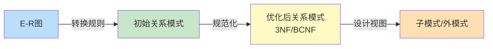

# 7.4 逻辑结构设计

逻辑结构设计把概念结构设计得到的 **E-R 图**转换为 DBMS 支持的**逻辑数据模型**（本章为关系模型），并对转换后的关系模式进行**规范化**与**优化**，最后为不同用户设计**子模式（视图）**。本节是设计阶段的"承上启下"：上承 [[7.3 概念结构设计（E-R模型）]] 的 E-R 图，下接 [[7.5 物理结构设计]] 的存储与存取方法。其核心能力是掌握**三种联系（1:1、1:n、m:n）的转换规则**，并能结合 [[6.3 范式（1NF、2NF、3NF、BCNF）]] 将模式规范化到 3NF。

## 逻辑结构设计的任务

> [!definition] 逻辑结构设计的任务
> 逻辑结构设计的任务是把概念结构设计阶段得到的全局 E-R 图，转换为与所选 DBMS 支持的数据模型相符合的逻辑结构（关系模式），并对其进行优化。主要工作包括：
> 1. 将 E-R 图转换为关系模式（实体、联系 → 关系）；
> 2. 对关系模式进行规范化（消除冗余与异常，达到 3NF 或 BCNF）；
> 3. 对关系模式进行评价与调整；
> 4. 为不同用户设计子模式（外模式/视图）。



> [!note] 转换的基本原则
> - **实体** → 关系模式：每个实体型转换为一个关系，实体的属性即为关系的属性，实体的码即为关系的码。
> - **联系** → 关系的连接方式：根据联系的基数（1:1、1:n、m:n）采取不同策略——独立成关系或并入实体对应的关系。

## E-R 图向关系模式的转换规则

### 实体的转换

> [!tip] 实体 → 关系模式
> 每个实体型转换为一个关系模式。实体名 → 关系模式名；实体属性 → 关系属性；实体码 → 关系主码。
>
> 例：实体 `学生(学号, 姓名, 性别, 年龄)` → 关系模式 `Student(Sno, Sname, Ssex, Sage)`，主码 `Sno`。

### 1:1 联系的转换

> [!definition] 1:1 联系转换规则
> 实体集 A 与 B 之间是 1:1 联系 R，转换有两种方式：
> 1. **独立成关系**：将联系 R 转换为一个独立关系模式，属性包括 A 的码与 B 的码（任选一个作为主码，另一个作为外码），并加入联系自身的属性。
> 2. **并入任一端**：将联系 R 的属性（含另一端的码作为外码）并入 A 或 B 对应的关系模式中。
>
> 工程上常选**并入**端，避免关系数量过多。

> [!example] 1:1 联系转换示例
> 设"班级—1:1—班长（学生）"：
> - 方式1（独立关系）：`Monitor(班号, 学号)`，主码任选其一；
> - 方式2（并入班级）：`Class(班号, 班名, 学号_FK)`，`学号` 为外码引用 `Student(学号)`；
> - 方式3（并入学生）：在 `Student` 中加 `班号_FK`。
>
> 一般选**参与度较低**或**关系属性较多**的一端并入，或选实体规模较小的一端。

### 1:n 联系的转换

> [!definition] 1:n 联系转换规则
> 实体集 A（1 端）与 B（n 端）之间是 1:n 联系 R，转换有两种方式：
> 1. **并入 n 端**（推荐）：将 A 的码作为外码加入 B 对应的关系模式，并加入联系自身的属性。
> 2. **独立成关系**：将联系 R 转换为独立关系模式，属性为 A 的码与 B 的码，主码为 **n 端的码**。
>
> 工程上**优先并入 n 端**，因为 n 端实体数量多，按 1 端分组查询时可避免连接独立关系表。

> [!example] 1:n 联系转换示例
> 设"系—1:n—学生"（一个系有多名学生，一名学生属一个系）：
> - 方式1（并入 n 端学生）：`Student(Sno, Sname, Ssex, Sage, Dno_FK)`，`Dno` 为外码引用 `Dept(Dno)`；
> - 方式2（独立关系）：`Belong(Dno, Sno)`，主码为 `Sno`。
>
> 推荐使用方式1：在 `Student` 中加 `Dno` 外码，查询学生所在系时无需连接额外表。

> [!warning] 1:n 联系的主码选择
> 若采用独立关系模式，主码必须取 **n 端的码**，而非 1 端。因为 1 端一个实体对应 n 端多个实体，1 端码在关系中会重复出现，不能作为主码。

### m:n 联系的转换

> [!definition] m:n 联系转换规则
> 实体集 A 与 B 之间是 m:n 联系 R，**必须**将联系 R 转换为一个**独立关系模式**。其属性包括 A 的码、B 的码（两者组合为主码），以及联系自身的属性。A 的码与 B 的码分别作为外码引用 A、B 对应的关系。
>
> m:n 联系**不能**直接并入任一端，因为这样会违反 [[6.3 范式（1NF、2NF、3NF、BCNF）|1NF]] 或导致大量冗余。

> [!example] m:n 联系转换示例
> 设"学生—m:n—课程"，联系"选修"带属性"成绩"：
> - 实体转换：`Student(Sno, Sname, Ssex, Sage)`，`Course(Cno, Cname, Ccredit)`；
> - 联系转换：`SC(Sno_FK, Cno_FK, Grade)`，主码为 `(Sno, Cno)`，`Sno` 外码引用 `Student`，`Cno` 外码引用 `Course`。
>
> `SC` 是关联关系模式，记录每条选课记录及其成绩。

### 三种联系转换规则汇总

| 联系类型 | 转换方式 | 主码 | 外码 |
| ---- | ---- | ---- | ---- |
| **1:1** | 独立成关系，或并入任一端 | 独立时任选一端码；并入时另一端码为外码 | 另一端的码 |
| **1:n** | 并入 n 端（推荐），或独立成关系 | 并入时不变；独立时取 n 端码 | 1 端的码 |
| **m:n** | 必须独立成关系 | 两端码的组合 | 两端的码 |

## 关系模式的优化

转换得到的初始关系模式可能存在冗余或异常，需用 [[6.3 范式（1NF、2NF、3NF、BCNF）]] 的理论进行规范化。

> [!note] 规范化的目标
> 通常以达到 **3NF** 为目标，必要时可进一步到 BCNF。但 BCNF 分解可能丢失函数依赖（见 [[6.5 模式分解]]），故工程上常以 3NF 为目标，对关键模式才升到 BCNF。

规范化的步骤：

1. **确定每个关系模式的函数依赖集**：根据业务规则列出函数依赖；
2. **求候选码**：用属性闭包法（见 [[6.2 函数依赖]]）；
3. **判断范式等级**：按 1NF → 2NF → 3NF → BCNF 判定流程；
4. **分解升级**：用投影分解法逐步消除部分依赖（→2NF）、传递依赖（→3NF）、决定因素不含码（→BCNF）；
5. **验证分解**：检查无损连接性与保持函数依赖性。

> [!example] 规范化示例
> 设转换得到的关系模式 `S-L-C(Sno, Sdept, Sloc, Cno, Grade)`，其中 `Sloc` 为学生宿舍楼（取决于所在系 `Sdept`）。
> 函数依赖：`(Sno, Cno) → Grade`、`Sno → Sdept`、`Sdept → Sloc`。
> - 码为 `(Sno, Cno)`，`Sdept` 与 `Sloc` 部分依赖码 → 不属于 2NF；
> - 分解到 2NF：`SC(Sno, Cno, Grade)`、`S-L(Sno, Sdept, Sloc)`；
> - `S-L` 中 `Sno → Sdept → Sloc` 是传递依赖 → 不属于 3NF；
> - 分解到 3NF：`S-D(Sno, Sdept)`、`D-L(Sdept, Sloc)`。
>
> 最终：`SC(Sno, Cno, Grade)`、`S-D(Sno, Sdept)`、`D-L(Sdept, Sloc)` 三个模式均达到 3NF。详见 [[6.3 范式（1NF、2NF、3NF、BCNF）]]。

> [!tip] 工程取舍
> 实际数据库设计中，对查询性能敏感的场景可**故意反规范化**（denormalization），用冗余换查询速度——但这是设计权衡，不是违反理论。常见的反规范化场景：报表系统、数据仓库。

## 子模式（视图）设计

> [!definition] 子模式设计
> 子模式设计是为不同用户或应用设计**外模式**，即**视图（View）**。视图是逻辑结构的局部表现，对用户隐藏了底层关系模式的复杂性，并提供安全与便利。

视图设计的目的：

| 目的 | 说明 | 示例 |
| ---- | ---- | ---- |
| **简化查询** | 把常用连接查询固化为视图 | `V_StudentGrade` 视图连接学生与选课，直接查询学生成绩 |
| **数据安全** | 隐藏敏感字段，只暴露必要数据 | 学生视图只暴露学号姓名，不暴露身份证号 |
| **逻辑独立性** | 逻辑结构变化时，视图可屏蔽底层改动 | 重命名表后视图保持不变 |

> [!example] 视图设计示例
> 为学生用户设计视图，只允许查看自己的成绩：
> ```sql
> CREATE VIEW V_MyGrade AS
> SELECT Cname, Grade
> FROM SC JOIN Course ON SC.Cno = Course.Cno
> WHERE Sno = CURRENT_USER_SNO();
> ```
> 详见 [[3.5 视图]]。

## 逻辑结构设计完整示例

承接 [[7.3 概念结构设计（E-R模型）]] 的完整 E-R 图（学生-课程-教师-系），给出转换过程。

### E-R 图回顾

实体：学生、课程、教师、系；联系：所属（学生:系=n:1）、讲授（教师:课程=1:n）、隶属（教师:系=n:1）、选修（学生:课程=m:n，带成绩）。

### 第一步：实体转换为关系模式

| 关系模式 | 主码 | 外码 | 来源 |
| ---- | ---- | ---- | ---- |
| `Student(Sno, Sname, Ssex, Sage)` | `Sno` | — | 学生实体 |
| `Course(Cno, Cname, Ccredit)` | `Cno` | — | 课程实体 |
| `Teacher(Tno, Tname, Tsex, Ttitle)` | `Tno` | — | 教师实体 |
| `Dept(Dno, Dname, Tel)` | `Dno` | — | 系实体 |

### 第二步：联系转换为关系模式

| 联系 | 类型 | 转换方式 | 结果 |
| ---- | ---- | ---- | ---- |
| 所属（学生:系） | n:1 | 并入 n 端（学生） | `Student` 增加 `Dno` 外码 |
| 讲授（教师:课程） | 1:n | 并入 n 端（课程） | `Course` 增加 `Tno` 外码 |
| 隶属（教师:系） | n:1 | 并入 n 端（教师） | `Teacher` 增加 `Dno` 外码 |
| 选修（学生:课程） | m:n | 独立成关系 | `SC(Sno, Cno, Grade)` |

### 第三步：合并后的关系模式

```text
Student(Sno, Sname, Ssex, Sage, Dno)
        主码: Sno
        外码: Dno REFERENCES Dept(Dno)

Course(Cno, Cname, Ccredit, Tno)
       主码: Cno
       外码: Tno REFERENCES Teacher(Tno)

Teacher(Tno, Tname, Tsex, Ttitle, Dno)
        主码: Tno
        外码: Dno REFERENCES Dept(Dno)

Dept(Dno, Dname, Tel)
      主码: Dno

SC(Sno, Cno, Grade)
    主码: (Sno, Cno)
    外码: Sno REFERENCES Student(Sno),
          Cno REFERENCES Course(Cno)
```

### 第四步：规范化检查

逐个检查各关系模式：

| 关系模式 | 函数依赖 | 范式 | 是否需进一步分解 |
| ---- | ---- | ---- | ---- |
| `Student` | `Sno → Sname, Ssex, Sage, Dno` | BCNF（决定因素含码） | 否 |
| `Course` | `Cno → Cname, Ccredit, Tno` | BCNF | 否 |
| `Teacher` | `Tno → Tname, Tsex, Ttitle, Dno` | BCNF | 否 |
| `Dept` | `Dno → Dname, Tel` | BCNF | 否 |
| `SC` | `(Sno, Cno) → Grade` | BCNF | 否 |

> [!tip] 转换后已是 BCNF 的原因
> 本例设计良好：每个关系模式只有一个非平凡函数依赖，且决定因素都是码。若 `Student` 中加入 `Sloc`（宿舍楼，由 `Dno` 决定），则出现 `Sno → Dno → Sloc` 的传递依赖，`Student` 退化为 2NF，需按 [[6.3 范式（1NF、2NF、3NF、BCNF）|3NF 分解]]拆为 `S-D(Sno, Dno)` 与 `D-L(Dno, Sloc)`。

### 第五步：子模式（视图）设计

```sql
-- 学生成绩视图：方便学生查询自己的所有成绩
CREATE VIEW V_StudentGrade AS
SELECT Student.Sno, Sname, Course.Cno, Cname, Grade
FROM Student
JOIN SC ON Student.Sno = SC.Sno
JOIN Course ON SC.Cno = Course.Cno;

-- 教师授课视图：方便教师查看自己讲授的课程与学生
CREATE VIEW V_TeacherCourse AS
SELECT Teacher.Tno, Tname, Course.Cno, Cname, Ccredit
FROM Teacher
JOIN Course ON Teacher.Tno = Course.Tno;

-- 系学生统计视图：方便系主任查看本系学生人数
CREATE VIEW V_DeptStudentCount AS
SELECT Dept.Dno, Dname, COUNT(Student.Sno) AS StudentCount
FROM Dept
LEFT JOIN Student ON Dept.Dno = Student.Dno
GROUP BY Dept.Dno, Dname;
```

> [!note] 完整建库脚本
> 上述关系模式与视图的完整 SQL 实现见 [[7.6 数据库实施]]。

## 小结

> [!summary] 本节核心
> 1. 逻辑结构设计把 E-R 图转换为关系模式，并对模式规范化与设计视图。
> 2. 实体直接转换为关系模式；联系按基数转换：
>    - 1:1：独立成关系或并入任一端；
>    - 1:n：并入 n 端（推荐），或独立成关系（主码取 n 端码）；
>    - m:n：必须独立成关系，主码为两端码的组合。
> 3. 转换后的关系模式需按 [[6.3 范式（1NF、2NF、3NF、BCNF）]] 规范化到 3NF（必要时 BCNF），消除部分依赖与传递依赖。
> 4. 子模式（视图）为不同用户提供局部视图，简化查询、保障安全、提供逻辑独立性。
> 5. 完整设计示例：学生-课程-教师-系 E-R 图转换为 5 个关系模式，均达 BCNF。

## 关联

- 本章 MOC：[[MOC - 第7章]]
- 上一节：[[7.3 概念结构设计（E-R模型）]]（提供 E-R 图作为输入）
- 下一节：[[7.5 物理结构设计]]（为关系模式选择物理存储与索引）
- 规范化理论：[[6.3 范式（1NF、2NF、3NF、BCNF）]]、[[6.5 模式分解]]、[[6.2 函数依赖]]
- 关系模型基础：[[2.1 关系数据结构及形式化定义]]、[[2.3 关系的完整性]]（主码、外码、参照完整性）
- SQL 实现：[[3.2 数据定义]]（`CREATE TABLE`）、[[3.5 视图]]（`CREATE VIEW`）
