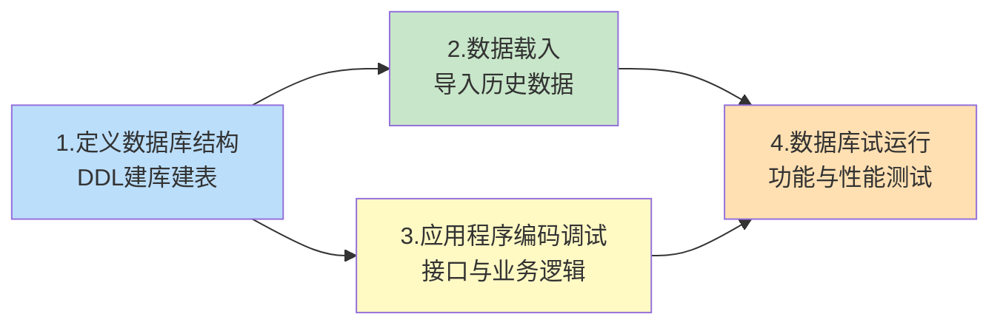

# 7.6 数据库实施

数据库实施是把设计阶段的产物（关系模式、索引方案、视图）通过 SQL 在 DBMS 中**实际建立**的过程，并完成**数据载入**与**试运行**。本节是设计阶段进入运行阶段的过渡：物理设计的"图纸"在此被"施工"为可运行的数据库，并经过试运行验证功能与性能。本节提供完整可执行的建库 SQL 脚本（MySQL 8.0）。

## 数据库实施阶段的任务

> [!definition] 数据库实施的任务
> 数据库实施阶段的主要任务包括：
> 1. **定义数据库结构**：用 DDL（数据定义语言）创建数据库、表、索引、视图、约束等；
> 2. **数据载入**：将原始数据或历史数据按结构导入数据库；
> 3. **应用程序编码与调试**：开发与数据库交互的应用程序；
> 4. **数据库试运行**：联合测试功能与性能，验证设计是否满足需求。



## 数据载入方法与工具

> [!note] 数据载入的难点
> 数据载入并非简单"导入"，因为：
> - 原始数据可能分散在不同来源（Excel、旧数据库、纸质记录）；
> - 数据格式与新结构不完全一致，需**清洗与转换**；
> - 数据间存在外码约束，载入顺序需先父后子；
> - 大量数据载入可能引发性能问题。

常用载入方法：

| 方法 | 适用场景 | MySQL 8.0 工具 |
| ---- | ---- | ---- |
| **批量导入** | 大规模结构化数据 | `LOAD DATA INFILE`、`mysqlimport` |
| **SQL 脚本插入** | 小规模数据或初始化数据 | `INSERT INTO ... VALUES` |
| **ETL 工具** | 多源异构数据 | Kettle、Talend、DataX |
| **编程接口** | 复杂转换逻辑 | JDBC、Python `pymysql` |
| **数据库迁移工具** | 跨 DBMS 迁移 | MySQL Workbench Migration、AWS DMS |

> [!example] 载入顺序与外码约束
> 承接 [[7.5 物理结构设计]] 的模式，载入顺序必须遵循外码依赖：
> 1. 先载入 `Dept`（无外码依赖）；
> 2. 再载入 `Teacher`（外码依赖 `Dept`）；
> 3. 再载入 `Course`（外码依赖 `Teacher`）；
> 4. 再载入 `Student`（外码依赖 `Dept`）；
> 5. 最后载入 `SC`（外码依赖 `Student` 和 `Course`）。
>
> 若顺序颠倒，外码约束会阻止插入。可临时 `SET FOREIGN_KEY_CHECKS = 0;` 关闭检查后再载入，载入完再开启。

```sql
-- 临时关闭外码检查以便任意顺序载入
SET FOREIGN_KEY_CHECKS = 0;
-- 此处执行数据载入
SET FOREIGN_KEY_CHECKS = 1;
```

## 数据库试运行

> [!definition] 数据库试运行
> 数据库试运行（也称联合调试）是在数据载入与应用程序开发完成后，将二者联合运行，验证是否满足设计要求的过程。

试运行包括两类测试：

| 测试类型 | 目标 | 内容 | 通过标准 |
| ---- | ---- | ---- | ---- |
| **功能测试** | 验证系统功能是否完整 | 各项业务操作能否正确执行，约束是否生效 | 所有需求功能正常运行 |
| **性能测试** | 验证系统性能是否达标 | 查询响应时间、并发吞吐量、资源占用 | 满足需求规格说明中的性能指标 |

> [!tip] 试运行的策略
> 1. **先功能后性能**：先确认功能正确，再测试性能；
> 2. **分批载入数据**：先用少量数据测试功能，再逐步增加数据量测试性能；
> 3. **试运行期间定期备份**：试运行中可能频繁修改数据，需保留可恢复点；
> 4. **记录问题清单**：试运行发现的所有问题应记录、分类、修复并复测。

> [!warning] 试运行失败的处理
> 若试运行不通过，需分析根因：
> - **功能错误**：可能是逻辑设计错误（如关系模式分解不当）或应用程序 bug；
> - **性能不达标**：可能是物理设计问题（索引不足或失效）、SQL 优化不够、硬件资源不足；
> - 严重时需回退到逻辑设计或物理设计阶段修改，体现数据库设计的**反复性**（见 [[7.1 数据库设计概述]]）。

## 完整建库 SQL 脚本示例

下面给出学生-课程-教师-系系统的完整建库脚本（DBMS：MySQL 8.0，存储引擎：InnoDB），整合 [[7.4 逻辑结构设计]] 的关系模式与 [[7.5 物理结构设计]] 的索引方案：

```sql
-- ============================================================
-- 学生选课管理系统建库脚本
-- DBMS: MySQL 8.0
-- 存储引擎: InnoDB
-- 字符集: utf8mb4
-- ============================================================

-- 1. 创建数据库
CREATE DATABASE IF NOT EXISTS CourseSelection
    DEFAULT CHARACTER SET utf8mb4
    DEFAULT COLLATE utf8mb4_unicode_ci;

USE CourseSelection;

-- 2. 删除已有对象（试运行时便于重建）
DROP VIEW IF EXISTS V_StudentGrade;
DROP VIEW IF EXISTS V_TeacherCourse;
DROP VIEW IF EXISTS V_DeptStudentCount;
DROP TABLE IF EXISTS SC;
DROP TABLE IF EXISTS Student;
DROP TABLE IF EXISTS Course;
DROP TABLE IF EXISTS Teacher;
DROP TABLE IF EXISTS Dept;

-- 3. 创建表（按外码依赖顺序：被引用表先建）

-- 3.1 系表（无外码依赖）
CREATE TABLE Dept (
    Dno   CHAR(4)     NOT NULL COMMENT '系号',
    Dname VARCHAR(40) NOT NULL COMMENT '系名',
    Tel   VARCHAR(15)          COMMENT '电话',
    PRIMARY KEY (Dno),
    UNIQUE KEY uk_dept_dname (Dname)
) ENGINE=InnoDB COMMENT='系表';

-- 3.2 教师表（外码依赖 Dept）
CREATE TABLE Teacher (
    Tno    CHAR(6)     NOT NULL COMMENT '教师号',
    Tname  VARCHAR(20) NOT NULL COMMENT '姓名',
    Tsex   CHAR(2)     DEFAULT '男' COMMENT '性别',
    Ttitle VARCHAR(20)          COMMENT '职称',
    Dno    CHAR(4)              COMMENT '所在系号',
    PRIMARY KEY (Tno),
    KEY idx_teacher_dno (Dno),
    CONSTRAINT fk_teacher_dept FOREIGN KEY (Dno)
        REFERENCES Dept(Dno)
        ON DELETE SET NULL
        ON UPDATE CASCADE
) ENGINE=InnoDB COMMENT='教师表';

-- 3.3 课程表（外码依赖 Teacher）
CREATE TABLE Course (
    Cno     CHAR(6)     NOT NULL COMMENT '课程号',
    Cname   VARCHAR(40) NOT NULL COMMENT '课程名',
    Ccredit INT         DEFAULT 2 COMMENT '学分',
    Tno     CHAR(6)              COMMENT '任课教师号',
    PRIMARY KEY (Cno),
    KEY idx_course_tno (Tno),
    CONSTRAINT fk_course_teacher FOREIGN KEY (Tno)
        REFERENCES Teacher(Tno)
        ON DELETE SET NULL
        ON UPDATE CASCADE,
    FULLTEXT KEY ft_course_cname (Cname)
) ENGINE=InnoDB COMMENT='课程表';

-- 3.4 学生表（外码依赖 Dept）
CREATE TABLE Student (
    Sno   CHAR(8)     NOT NULL COMMENT '学号',
    Sname VARCHAR(20) NOT NULL COMMENT '姓名',
    Ssex  CHAR(2)     DEFAULT '男' COMMENT '性别',
    Sage  INT         DEFAULT 18 COMMENT '年龄',
    Dno   CHAR(4)              COMMENT '所在系号',
    PRIMARY KEY (Sno),
    KEY idx_student_dno (Dno),
    KEY idx_student_dno_sname (Dno, Sname)
) ENGINE=InnoDB COMMENT='学生表';

-- 3.5 选课表（外码依赖 Student 和 Course）
CREATE TABLE SC (
    Sno   CHAR(8)     NOT NULL COMMENT '学号',
    Cno   CHAR(6)     NOT NULL COMMENT '课程号',
    Grade DECIMAL(5,2)         COMMENT '成绩',
    PRIMARY KEY (Sno, Cno),
    KEY idx_sc_cno (Cno),
    KEY idx_sc_grade (Grade),
    CONSTRAINT fk_sc_student FOREIGN KEY (Sno)
        REFERENCES Student(Sno)
        ON DELETE CASCADE
        ON UPDATE CASCADE,
    CONSTRAINT fk_sc_course FOREIGN KEY (Cno)
        REFERENCES Course(Cno)
        ON DELETE CASCADE
        ON UPDATE CASCADE,
    CONSTRAINT chk_grade CHECK (Grade IS NULL OR (Grade >= 0 AND Grade <= 100))
) ENGINE=InnoDB COMMENT='选课表';

-- 4. 创建视图（子模式）

-- 4.1 学生成绩视图
CREATE VIEW V_StudentGrade AS
SELECT s.Sno, s.Sname, c.Cno, c.Cname, sc.Grade
FROM Student s
JOIN SC ON s.Sno = sc.Sno
JOIN Course c ON sc.Cno = c.Cno
WITH CHECK OPTION;

-- 4.2 教师授课视图
CREATE VIEW V_TeacherCourse AS
SELECT t.Tno, t.Tname, c.Cno, c.Cname, c.Ccredit
FROM Teacher t
JOIN Course c ON t.Tno = c.Tno;

-- 4.3 系学生统计视图
CREATE VIEW V_DeptStudentCount AS
SELECT d.Dno, d.Dname, COUNT(s.Sno) AS StudentCount
FROM Dept d
LEFT JOIN Student s ON d.Dno = s.Dno
GROUP BY d.Dno, d.Dname;

-- 5. 初始化数据（示例数据）

-- 系数据
INSERT INTO Dept VALUES
    ('D01', '计算机科学与技术系', '010-62770001'),
    ('D02', '电子工程系', '010-62770002'),
    ('D03', '数学系', '010-62770003');

-- 教师数据
INSERT INTO Teacher VALUES
    ('T00001', '张教授', '男', '教授',   'D01'),
    ('T00002', '李副教授', '女', '副教授', 'D01'),
    ('T00003', '王讲师', '男', '讲师',   'D02');

-- 课程数据
INSERT INTO Course VALUES
    ('C0001', '数据库原理', 4, 'T00001'),
    ('C0002', '数据结构',   4, 'T00001'),
    ('C0003', '操作系统',   3, 'T00002'),
    ('C0004', '信号与系统', 3, 'T00003');

-- 学生数据
INSERT INTO Student VALUES
    ('20240001', '张三', '男', 20, 'D01'),
    ('20240002', '李四', '女', 19, 'D01'),
    ('20240003', '王五', '男', 21, 'D02');

-- 选课数据
INSERT INTO SC VALUES
    ('20240001', 'C0001', 88.50),
    ('20240001', 'C0002', 92.00),
    ('20240002', 'C0001', 76.50),
    ('20240003', 'C0003', 81.00);
```

> [!example] 脚本要点说明
> - **创建顺序**：先建被引用表（`Dept` → `Teacher`/`Course` 依赖链、`Student` 依赖 `Dept`），最后建 `SC`；
> - **约束声明**：主键、外键、唯一约束、CHECK 约束、NOT NULL 在建表时一并声明，保证完整性（见 [[5.1 完整性约束概念]]、[[5.2 实体完整性]]、[[5.3 参照完整性]]、[[5.4 用户定义完整性]]）；
> - **索引声明**：主键自动建聚簇索引，外键与查询字段单独 `CREATE INDEX` 或用 `KEY` 子句声明；
> - **视图**：用 `CREATE VIEW` 建立，简化查询；
> - **外码动作**：`ON DELETE CASCADE`/`SET NULL`/`ON UPDATE CASCADE` 定义参照完整性违反时的处理；
> - **字符集**：使用 `utf8mb4` 支持 Unicode（含 emoji）。

## 小结

> [!summary] 本节核心
> 1. 数据库实施阶段任务：定义数据库结构（DDL）、数据载入、应用程序编码调试、数据库试运行。
> 2. 数据载入需遵循外码依赖顺序（被引用表先载入），可用 `LOAD DATA INFILE` 或 ETL 工具批量导入。
> 3. 试运行包括功能测试（验证业务正确）与性能测试（验证响应时间与吞吐量），先功能后性能。
> 4. 完整建库脚本包括：创建数据库、按依赖顺序建表、声明约束与索引、创建视图、载入初始数据。
> 5. 试运行失败需回退到逻辑或物理设计阶段修改，体现数据库设计的反复性。

## 关联

- 本章 MOC：[[MOC - 第7章]]
- 上一节：[[7.5 物理结构设计]]（提供索引方案与物理结构作为输入）
- 下一节：[[7.7 数据库运行与维护]]（试运行通过后进入长期运行维护）
- SQL 实现：[[3.2 数据定义]]（DDL 语法）、[[3.5 视图]]（`CREATE VIEW`）、[[3.4 数据更新]]（`INSERT`）
- 完整性约束：[[5.1 完整性约束概念]]、[[5.2 实体完整性]]、[[5.3 参照完整性]]、[[5.4 用户定义完整性]]
- 试运行与运行后保护：[[MOC - 第8章]]（恢复技术）、[[MOC - 第9章]]（并发控制）
