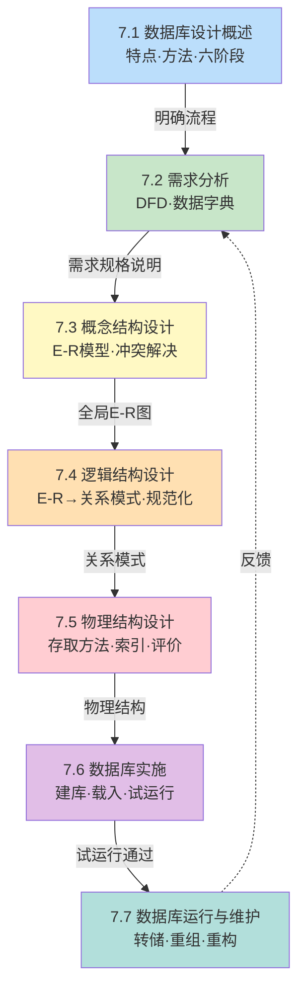

# MOC - 第7章 数据库设计

> [!info] 本章定位
> 数据库设计是数据库原理课程的**核心实践章**，是将前序理论（关系模型、SQL、规范化理论）转化为可运行工程系统的桥梁。它解决的根本问题是：在给定的 DBMS 环境下，如何从现实世界的用户需求出发，构造一个**结构合理、性能良好、易于维护**的数据库模式与应用程序。本章以"**需求分析 → 概念结构设计 → 逻辑结构设计 → 物理结构设计 → 数据库实施 → 数据库运行与维护**"六阶段为主线，其中 E-R 模型设计（7.3）与逻辑结构转换（7.4）是核心能力点，规范化理论（[[6.3 范式（1NF、2NF、3NF、BCNF）]]）是其理论依据。本章承上启下：上承第 6 章关系数据理论的规范化准则，下启第 8 章数据库恢复技术与第 9 章并发控制（设计产物进入运行阶段后的保护机制）。

## 学习路线图

> [!note] 学习顺序说明
> 7.1 给出数据库设计的整体框架与六阶段流程；7.2–7.7 依次展开六个阶段。建议按顺序学习，并在 **7.3 概念结构设计**与 **7.4 逻辑结构设计**上投入主要精力——前者是 E-R 图设计能力，后者是 E-R 图向关系模式转换与规范化能力，二者是本章最高频考点。7.5–7.7 偏工程实践，需结合 MySQL 8.0 等实际 DBMS 理解。

## 知识点导航

| 节 | 主题 | 入口 | 关键概念 |
| ---- | ---- | ---- | ---- |
| 7.1 | 数据库设计概述 | [[7.1 数据库设计概述]] | 数据库设计定义、特点（三分技术七分管理）、新奥尔良法、六阶段流程 |
| 7.2 | 需求分析 | [[7.2 需求分析]] | 需求调查、数据流图 DFD、数据字典、需求规格说明 |
| 7.3 | 概念结构设计（E-R 模型） | [[7.3 概念结构设计（E-R模型）]] | E-R 模型、实体/属性/联系、属性分类、自底向上法、局部 E-R 图合并、冲突解决 |
| 7.4 | 逻辑结构设计 | [[7.4 逻辑结构设计]] | E-R 图向关系模式转换、1:1/1:n/m:n 转换规则、规范化、子模式（视图）设计 |
| 7.5 | 物理结构设计 | [[7.5 物理结构设计]] | 存储结构、存取方法、B+ 树索引、聚簇索引、Hash 索引、物理评价 |
| 7.6 | 数据库实施 | [[7.6 数据库实施]] | 建库脚本、数据载入、应用程序调试、试运行（功能/性能测试） |
| 7.7 | 数据库运行与维护 | [[7.7 数据库运行与维护]] | DBA 维护、转储与恢复、安全完整性控制、性能监督、重组与重构 |

## 核心考点

> [!warning] 高频考点（必须掌握）
> 1. **数据库设计六阶段**：准确说出六个阶段的名称、顺序、各阶段输入输出与主要产物，能区分逻辑设计与物理设计的边界。
> 2. **数据流图（DFD）**：掌握 DFD 四要素（数据流、处理、数据存储、外部实体），能画出简单业务的 DFD。
> 3. **数据字典**：掌握数据字典五部分（数据项、数据结构、数据流、数据存储、处理过程）的内容与作用。
> 4. **E-R 模型基本概念**：实体、属性、码、域、实体型、实体集、联系（1:1、1:n、m:n）的定义与区分。
> 5. **E-R 图绘制**：能根据需求描述抽象出实体、属性与联系，并用 Mermaid `erDiagram` 或标准图形（矩形/椭圆/菱形）绘制 E-R 图。
> 6. **属性分类**：区分简单/复合、单值/多值、派生属性，并理解它们对 E-R 图设计的影响。
> 7. **E-R 图冲突解决**：识别属性冲突、命名冲突、结构冲突，给出解决方法（重点）。
> 8. **E-R 图向关系模式转换**：掌握 1:1、1:n、m:n 联系的转换规则，能标注主码与外码，并结合规范化理论（[[6.3 范式（1NF、2NF、3NF、BCNF）]]）优化到 3NF。

## 自测题

1. 简述数据库设计的六个阶段，并说明各阶段的主要输入与产物。
2. 设某学校教务管理需求如下：
   - 一个学生属于一个系，一个系有多名学生；
   - 一个学生可选修多门课程，一门课程可被多名学生选修，需记录成绩；
   - 一门课程由一名教师讲授，一名教师可讲授多门课程；
   - 教师属于一个系，一个系有多名教师。
   
   要求：
   - (1) 画出 E-R 图（用 Mermaid `erDiagram`）；
   - (2) 将 E-R 图转换为关系模式，标注主码（下划线）与外码；
   - (3) 检查各关系模式是否达到 3NF，若未达到则分解。
3. 解释 E-R 图合并时的三类冲突，并各举一例说明解决方法。
4. 比较聚簇索引与 B+ 树索引的适用场景，并说明 MySQL 8.0 中 InnoDB 主键索引与二级索引的关系。

> [!tip] 自测题答案要点
> - 题1：六阶段为需求分析（输入：用户调查；产物：需求规格说明、DFD、数据字典）、概念结构设计（输入：需求规格说明；产物：全局 E-R 图）、逻辑结构设计（输入：E-R 图；产物：关系模式、视图）、物理结构设计（输入：关系模式；产物：物理结构、索引方案）、数据库实施（输入：物理结构；产物：建库脚本、载入数据、应用程序）、数据库运行与维护（输入：运行数据库；产物：转储日志、性能报告）。详见 [[7.1 数据库设计概述]]。
> - 题2：实体为学生、系、课程、教师；联系为"所属"（学生-系 1:n）、"选修"（学生-课程 m:n，带成绩属性）、"讲授"（教师-课程 1:n）、"隶属"（教师-系 1:n）。转换后的关系模式与规范化详见 [[7.4 逻辑结构设计]] 完整示例。
> - 题3：属性冲突（属性类型/取值范围/取值集合不一致，统一约定）、命名冲突（同名异义/异名同义，重新命名）、结构冲突（同一实体在不同 E-R 图中属性个数/次序不同，或同一对象在不同图里是实体还是属性不同，合并属性并统一抽象层次）。详见 [[7.3 概念结构设计（E-R模型）]]。
> - 题4：聚簇索引按物理顺序连续存储数据，一张表只能有一个，适合范围查询与主键查询；B+ 树索引是非聚簇的有序结构，适合等值与范围查询。InnoDB 中主键索引即聚簇索引，二级索引叶节点存储主键值而非行指针（需回表）。详见 [[7.5 物理结构设计]]。

## 章节导航

- 上级 MOC：[[MOC - 数据库原理]]
- 上一章：[[MOC - 第6章]]
- 下一章：[[MOC - 第8章]]
- 本章习题：[[MOC - 第7章习题]]
