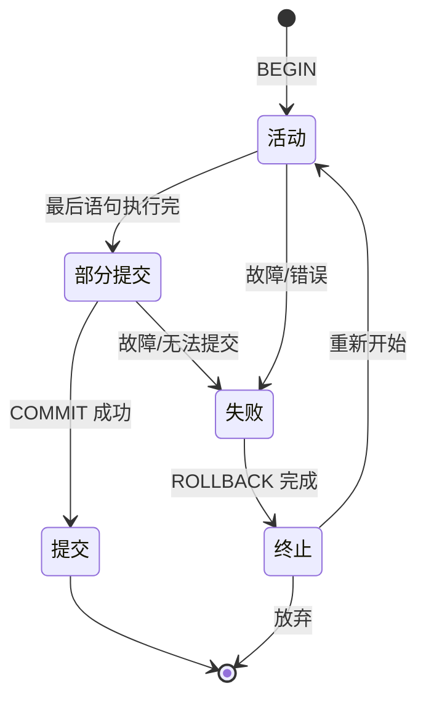

# 8.1 事务基本概念与 ACID

事务（Transaction）是数据库进行**并发控制与恢复处理**的基本工作单位。本节建立事务的定义、控制语句与 ACID 四特性，为后续 [[8.2 故障种类]] 的故障分析与 [[8.3 恢复实现技术（日志、副本）]] 的恢复机制提供概念基础，也是 [[MOC - 第9章]] 并发控制的研究对象。

## 事务的定义

> [!definition] 事务
> 事务是用户定义的**一个数据库操作序列**，这些操作要么**全部执行**，要么**全部不执行**，是一个**不可分割的工作单位**。

> [!note] 定义要点
> - 事务由**用户定义**：程序通过显式语句（BEGIN TRANSACTION / COMMIT / ROLLBACK）或隐式方式界定事务边界。
> - 事务是**不可分割**的工作单位：序列中的操作要么都做要么都不做，不允许部分完成。
> - 事务是**恢复与并发控制**的基本单位：故障恢复以事务为粒度进行 UNDO/REDO，并发调度以事务为粒度保证可串行化。

> [!example] 银行转账示例
> 设账户 A 向账户 B 转账 1000 元，包含两步：
> 1. `UPDATE account SET balance = balance - 1000 WHERE id = 'A';`
> 2. `UPDATE account SET balance = balance + 1000 WHERE id = 'B';`
>
> 这两步必须作为一个事务执行。若第一步完成后系统故障，账户 A 减了款而 B 未收到款，将造成资金丢失——这正是事务原子性要避免的情况。

## 事务的开始与结束语句

```sql
-- 显式事务控制语句（SQL 标准）
BEGIN TRANSACTION;       -- 事务开始
-- 此处放置 DML 操作：INSERT / UPDATE / DELETE
COMMIT;                   -- 提交事务，所有更改持久化
-- 或
ROLLBACK;                 -- 回滚事务，撤销所有更改
```

> [!note] 语句语义
> - `BEGIN TRANSACTION`：标记事务开始，后续 SQL 操作属于同一事务。
> - `COMMIT`：事务成功结束，所有更改**永久生效**（持久化到磁盘），事务进入"提交"状态。
> - `ROLLBACK`：事务失败结束，所有更改**全部撤销**，数据库回滚到事务开始前状态，事务进入"终止"状态。

> [!example] MySQL 事务 SQL 示例
> ```sql
> -- MySQL 默认自动提交（autocommit=1），需先关闭
> SET autocommit = 0;
>
> BEGIN;
> UPDATE account SET balance = balance - 1000 WHERE id = 'A';
> UPDATE account SET balance = balance + 1000 WHERE id = 'B';
> -- 检查两步是否都成功
> -- 若成功则提交，否则回滚
> COMMIT;
> -- 或 ROLLBACK;
> ```
>
> MySQL 也支持 `START TRANSACTION`（等价于 `BEGIN`），并可用 `START TRANSACTION READ ONLY` 指定只读事务。

## ACID 四特性

> [!definition] ACID
> 事务具有四个基本特性，合称 **ACID**：
> - **原子性（Atomicity）**：事务是一个不可分割的工作单位，事务中的操作要么全做要么全不做。
> - **一致性（Consistency）**：事务执行的结果必须是使数据库从一个一致性状态转变到另一个一致性状态。
> - **隔离性（Isolation）**：一个事务的执行不能被其他事务干扰，并发执行的各事务之间相互隔离。
> - **持久性（Durability）**：事务一旦提交，对数据库中数据的改变就是永久性的，后续故障不应使其丢失。

### 原子性（Atomicity）

> [!definition] 原子性
> 事务是数据库的**不可分割工作单位**。事务中的全部操作要么**全部执行**，要么**全部不执行**。不允许事务部分完成。

> [!example] 原子性示例
> 转账事务包含"扣款"与"加款"两步。原子性要求：要么两步都成功（提交），要么两步都失败（回滚）。不允许出现"扣了款但未加款"或"加了款但未扣款"的中间状态。

> [!info] DBMS 实现机制
> 原子性由 DBMS 的**恢复子系统**实现。事务执行中发生的更新先写入日志（记录旧值前像），若事务失败则按日志**反向扫描**进行 **UNDO**（撤销已做的更新），恢复到事务开始前状态。

### 一致性（Consistency）

> [!definition] 一致性
> 事务执行的结果必须是使数据库从一个**一致性状态**转变到另一个**一致性状态**。
>
> - **一致性状态**：数据库满足全部完整性约束（实体完整性、参照完整性、用户定义完整性）和业务规则的状态。

> [!example] 一致性示例
> 转账事务执行前后，"账户 A 与账户 B 的余额之和保持不变"是一致性约束。若转账前 A+B=10000，则转账后 A+B 必须仍=10000。事务执行不能破坏这一约束。

> [!info] DBMS 实现机制
> 一致性是**原子性、隔离性、持久性**综合作用的结果，加上完整性约束子系统（[[5.1 完整性约束概念]]、[[5.5 触发器实现完整性]]）的检查。事务提交时若违反约束将被回滚。

### 隔离性（Isolation）

> [!definition] 隔离性
> 一个事务的执行**不能被其他事务干扰**，即并发执行的各事务之间**相互隔离**，一个事务内部的操作及操作的数据对其他并发事务是隔离的。

> [!example] 隔离性示例
> 事务 $T_1$ 在读取账户余额进行计算时，若事务 $T_2$ 同时修改余额，$T_1$ 读到的数据可能不一致。隔离性要求并发执行的结果等价于某种串行执行顺序（[[9.1 并发引发的数据不一致问题]]、[[9.3 封锁协议]]）。

> [!info] DBMS 实现机制
> 隔离性由**并发控制子系统**实现，主要手段是**封锁**（[[9.2 封锁技术]]）与**多版本并发控制**（MVCC，见 [[9.6 事务隔离级别]]）。不同隔离级别提供不同程度的隔离。

### 持久性（Durability）

> [!definition] 持久性
> 事务一旦**提交**，对数据库中数据的改变就是**永久性**的。接下来的其他操作或故障不应对其执行结果有任何影响。

> [!example] 持久性示例
> 用户在 ATM 存入现金后，账户余额更新事务一旦提交，即使银行系统立刻断电，余额数据也不能丢失——再次开机后必须能看到更新后的余额。

> [!info] DBMS 实现机制
> 持久性由**恢复子系统**实现。事务提交时将更新先写入日志并强制刷盘（fsync），即使数据库缓冲区数据未落盘，故障后也可根据日志**正向扫描**进行 **REDO**（重做），把提交事务的更新重新应用到数据库。

> [!summary] ACID 与 DBMS 子系统对应关系
> | 特性 | 实现子系统 | 主要机制 |
> | ---- | ---- | ---- |
> | 原子性 A | 恢复子系统 | 日志 + UNDO |
> | 一致性 C | 综合作用 | A + I + D + 完整性约束 |
> | 隔离性 I | 并发控制子系统 | 封锁 / MVCC |
> | 持久性 D | 恢复子系统 | 日志 + REDO |
>
> 注意：**C 是 A、I、D 综合保证的目标**，单独的实现机制是完整性约束子系统。

## 事务的状态转换

事务在其生命周期中经历若干状态。DBMS 通过状态机管理事务的执行与终止。

> [!definition] 事务的五种状态
> - **活动（Active）**：事务开始后进入此状态，正在执行其操作。
> - **部分提交（Partially Committed）**：事务的最后一条语句执行完毕，但尚未提交，更新仍在缓冲区中。
> - **提交（Committed）**：事务成功提交，更新已持久化，事务正常结束。
> - **失败（Failed）**：事务在活动或部分提交状态中因故障无法继续正常执行。
> - **终止（Aborted）**：事务回滚结束，数据库已恢复到事务开始前状态。事务可重新开始或放弃。



> [!note] 状态转换要点
> - 事务从**活动**到**部分提交**是正常推进，到达部分提交表示逻辑操作已全部完成，但数据尚未持久化。
> - 从**部分提交**到**提交**需要 DBMS 完成日志刷盘等持久化操作；若此过程中故障，事务进入**失败**状态，需 UNDO 已做的更新。
> - **失败**状态经 ROLLBACK 操作后进入**终止**状态。终止后事务可以选择重新开始（进入活动）或放弃（结束）。
> - 只有**提交**状态才意味着事务对数据库的更改永久生效。

## 小结

> [!summary] 本节核心
> - 事务是用户定义的不可分割的数据库操作序列，是恢复与并发控制的基本单位。
> - 用 `BEGIN TRANSACTION` 开始事务，`COMMIT` 提交、`ROLLBACK` 回滚结束事务。
> - ACID 四特性：原子性（不可分割，UNDO 实现）、一致性（A+I+D 综合）、隔离性（并发控制实现）、持久性（提交永久，REDO 实现）。
> - 事务经历活动→部分提交→提交/失败→终止五种状态，状态转换由 DBMS 的事务管理器控制。

## 关联

- 本章入口：[[MOC - 第8章]]
- 先修：[[3.4 数据更新]]（事务是 SQL 更新操作的逻辑包装）
- 后续：[[8.2 故障种类]]（故障是事务未能正常提交的根因）
- 关联：[[5.1 完整性约束概念]]（一致性 C 与完整性约束的关系）、[[MOC - 第9章]]（隔离性 I 的并发控制实现）
