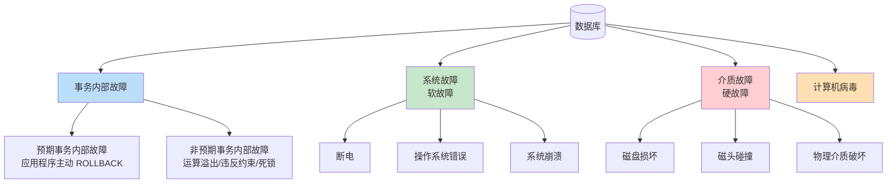

# 8.2 故障种类

数据库运行中可能发生多种故障，**不同故障破坏的对象不同、需要的恢复策略也不同**。本节按故障来源将故障分为四类：事务内部故障、系统故障、介质故障、计算机病毒，并对照说明各类故障的破坏与恢复策略，为 [[8.4 恢复策略与检查点技术]] 的具体恢复算法奠定分类基础。

## 故障分类总览

## 事务内部故障

> [!definition] 事务内部故障
> 事务内部故障是指**单个事务**在执行过程中发生的故障，使得事务无法继续运行到预期终点（COMMIT 或正常 ROLLBACK）。

事务内部故障分为**预期**与**非预期**两种：

> [!example] 预期的事务内部故障
> 预期的事务内部故障是**应用程序能预见并通过显式 ROLLBACK 处理**的情况，例如：
> - 转账时发现余额不足，应用程序主动执行 `ROLLBACK`。
> - 业务逻辑检测到非法状态，主动回滚事务。

> [!example] 非预期的事务内部故障
> 非预期的事务内部故障是**应用程序未预见、由系统异常触发**的故障，例如：
> - 运算溢出（除零、整数溢出）。
> - 违反完整性约束（[[5.1 完整性约束概念]]）。
> - 并发控制死锁被选为牺牲品强制回滚（[[9.4 活锁、死锁处理]]）。
> - 应用程序逻辑错误。

> [!info] 恢复策略
> 事务内部故障的恢复由 DBMS 自动完成，**不影响其他事务**。具体做法：反向扫描日志，对故障事务已做的更新执行 **UNDO**（撤销），恢复到事务开始前状态。详见 [[8.4 恢复策略与检查点技术]]。

## 系统故障

> [!definition] 系统故障
> 系统故障（System Failure）又称**软故障（Soft Failure）**，是指造成系统停止运转、需重启才能恢复正常运行的故障。**系统故障不会破坏磁盘上的数据**，但会使内存（数据库缓冲区）中的内容丢失。

> [!example] 系统故障的常见原因
> - **停电**：突然断电使内存数据丢失。
> - **操作系统错误**：操作系统崩溃或致命错误。
> - **DBMS 错误**：DBMS 进程异常终止。
> - **硬件故障**：CPU、内存等非存储类硬件故障。

> [!warning] 系统故障的两种数据破坏
> 系统故障造成内存缓冲区数据丢失，导致两类不一致：
> 1. **已提交未落盘的数据丢失**：事务已 COMMIT，但更新还在缓冲区中尚未写入磁盘。重启后这些更新消失，违反**持久性 D**。需 **REDO** 重做。
> 2. **未提交已落盘的数据残留**：事务未 COMMIT，但部分更新已被写盘（如缓冲区满触发刷盘）。重启后这些未完成事务的更新残留，违反**原子性 A**。需 **UNDO** 撤销。

> [!info] 恢复策略
> 系统故障的恢复在重启时进行：
> - **正向扫描日志**，找出已提交但未落盘的事务，放入 **REDO 队列**。
> - **反向扫描日志**，找出未提交的事务，放入 **UNDO 队列**。
> - 先 UNDO 再 REDO（或按系统实现执行），详见 [[8.4 恢复策略与检查点技术]]。

## 介质故障

> [!definition] 介质故障
> 介质故障（Media Failure）又称**硬故障（Hard Failure）**，是指**外存（磁盘）上的物理数据遭到破坏**的故障。这是最严重的故障类型。

> [!example] 介质故障的常见原因
> - **磁盘损坏**：磁盘机械或电子元件失效。
> - **磁头碰撞**：磁头与盘片接触造成物理划伤。
> - **瞬时强磁场干扰**：磁化破坏存储数据。
> - **自然灾害**：火灾、水灾、地震破坏存储设备。

> [!warning] 介质故障的破坏
> 介质故障破坏磁盘上**全部或部分数据文件、日志文件**，使数据库处于不可用状态。由于数据本身已被破坏，仅靠日志无法恢复——必须有数据副本（备份）才能恢复。

> [!info] 恢复策略
> 介质故障的恢复步骤：
> 1. **重装数据库副本**：从最近的备份恢复数据库到一致性状态。
> 2. **重做日志**：从副本之后到故障时刻的所有已提交事务执行 REDO，把数据库推进到故障前的最新状态。
> 详见 [[8.4 恢复策略与检查点技术]]。

## 计算机病毒

> [!definition] 计算机病毒
> 计算机病毒是一种人为编制的**恶意程序**，能自我复制并破坏计算机系统中的数据、文件或程序。病毒可能破坏数据库文件、日志文件或 DBMS 本身。

> [!info] 恢复策略
> 病毒破坏的恢复视破坏程度而定：
> - 若仅破坏数据文件，按**介质故障恢复**（重装副本 + 重做日志）。
> - 若破坏 DBMS，需重装 DBMS 软件后恢复数据库。
> - 预防手段：定期备份、安装防病毒软件、访问控制（[[4.3 存取控制]]）。

## 各类故障对比

| 故障类型 | 别名 | 破坏对象 | 影响范围 | 恢复策略 | 严重程度 |
| ---- | ---- | ---- | ---- | ---- | ---- |
| 事务内部故障 | — | 单个事务的更新 | 单事务 | 反向 UNDO 该事务 | 较低 |
| 系统故障 | 软故障 | 内存缓冲区数据丢失，磁盘数据未破坏 | 全部未完成与已提交未落盘事务 | REDO 已提交 + UNDO 未提交 | 中等 |
| 介质故障 | 硬故障 | 磁盘数据文件被破坏 | 数据库全部或部分数据 | 重装副本 + REDO 日志 | 严重 |
| 计算机病毒 | — | 数据库文件、DBMS | 视破坏程度 | 类比介质故障 + 软件重装 | 视情况 |

> [!warning] 故障恢复的核心思想
> 所有故障恢复都基于**冗余**：要么有数据副本（用于介质故障），要么有日志（用于系统故障、事务故障），或两者结合。没有冗余数据则无法恢复。详见 [[8.3 恢复实现技术（日志、副本）]]。

## 小结

> [!summary] 本节核心
> - 故障分四类：事务内部故障（单事务）、系统故障（软故障，内存丢失）、介质故障（硬故障，磁盘破坏）、计算机病毒。
> - 事务内部故障：UNDO 该事务。
> - 系统故障：REDO 已提交 + UNDO 未提交。
> - 介质故障：重装副本 + REDO 日志。
> - 计算机病毒：视破坏程度类比介质故障恢复。
> - 所有恢复都依赖冗余数据（副本 + 日志）。

## 关联

- 本章入口：[[MOC - 第8章]]
- 先修：[[8.1 事务基本概念与ACID]]（故障是事务未能正常提交的根因）
- 后续：[[8.3 恢复实现技术（日志、副本）]]（提供恢复所需的冗余数据）、[[8.4 恢复策略与检查点技术]]（具体恢复算法）
- 关联：[[4.3 存取控制]]（防病毒的安全基础）、[[5.1 完整性约束概念]]（违反约束是非预期事务故障之一）、[[9.4 活锁、死锁处理]]（死锁选牺牲品是非预期事务故障之一）
