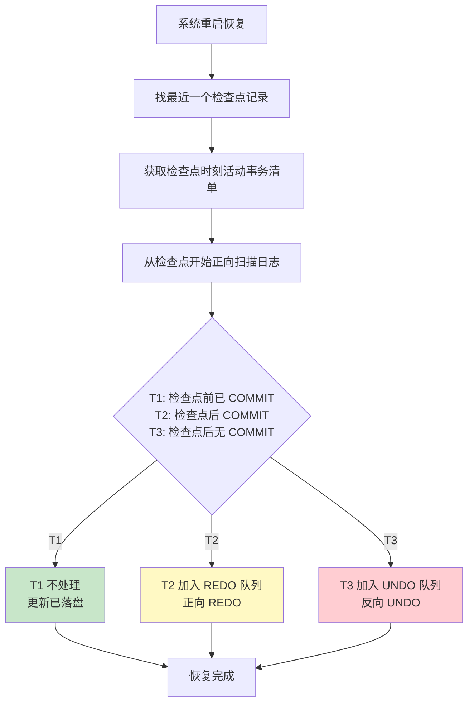
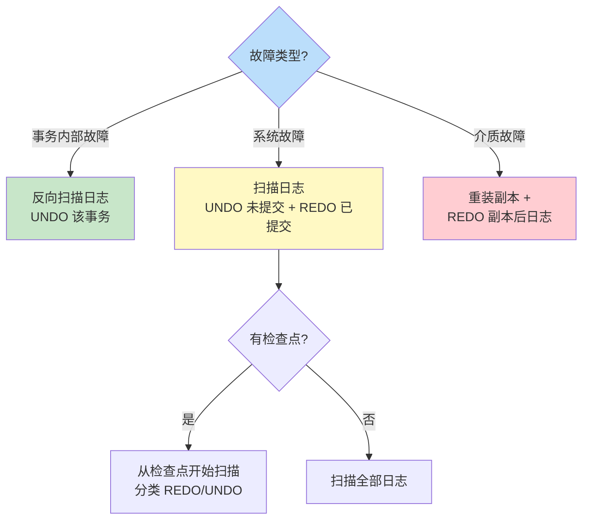

# 8.4 恢复策略与检查点技术

不同故障的破坏对象不同，恢复策略也不同。本节综合运用 [[8.3 恢复实现技术（日志、副本）]] 的日志与副本，给出**事务内部故障、系统故障、介质故障**三类故障的具体恢复算法，并重点介绍**检查点（Checkpoint）技术**——通过在日志中定期设置检查点，把恢复扫描范围限制在最近的检查点之后，大幅降低恢复成本。

## 事务内部故障的恢复

> [!info] 恢复策略
> 事务内部故障只影响该事务本身，恢复由系统自动完成，**不需其他事务参与**。核心是 **UNDO** 撤销该事务已做的全部更新。

> [!example] 事务内部故障恢复算法
> 1. **反向扫描日志**，查找该事务的更新记录。
> 2. 对每条更新记录，按日志中的**前像**（旧值）执行 **UNDO**：把数据库中对应数据项恢复为前像值。
> 3. 一直扫描到事务的 BEGIN 记录为止，撤销该事务全部更新。
> 4. 在日志中写入该事务的 ABORT 记录，恢复结束。

> [!note] UNDO 的方向
> UNDO 必须**反向**扫描日志——按更新的相反顺序撤销。因为后做的更新可能依赖于先做的更新，反向撤销可保证每步撤销前数据处于正确状态。

## 系统故障的恢复

> [!info] 恢复策略
> 系统故障造成内存缓冲区数据丢失，导致两类问题：已提交事务的更新未落盘（需 REDO）、未提交事务的更新已落盘（需 UNDO）。恢复在系统重启时自动进行。

> [!example] 系统故障恢复算法
> 1. **正向扫描日志**，建立两个事务队列：
>    - **UNDO 队列**：故障时尚未提交（无 COMMIT）的事务。
>    - **REDO 队列**：已提交（有 COMMIT）的事务。
> 2. **反向扫描日志**，对 UNDO 队列中的事务逐条执行 UNDO（按前像恢复）。
> 3. **正向扫描日志**，对 REDO 队列中的事务逐条执行 REDO（按后像重做）。
>
> 一般顺序是 **先 UNDO 后 REDO**：先把未完成事务的"脏"更新撤销，再把已提交事务的更新重做。

> [!warning] REDO 的幂等性
> REDO 操作必须**幂等**（idempotent）——多次执行结果相同。因为有些已提交事务的更新可能已经落盘，REDO 时会再次写入相同的值。REDO 的实现是"按后像覆盖"，多次覆盖同一值结果不变。

## 介质故障的恢复

> [!info] 恢复策略
> 介质故障破坏了磁盘上的数据库，必须用**数据副本** + **日志文件**联合恢复。

> [!example] 介质故障恢复算法
> 1. **重装最近的数据库后备副本**，使数据库恢复到副本时刻的状态。
>    - 若副本是静态转储得到的一致性副本，直接装入即可。
>    - 若副本是动态转储得到，还需装入转储开始到结束期间的日志，把副本恢复到一致性状态。
> 2. **装入副本之后到故障时刻的日志文件**，**正向扫描**对已提交事务执行 REDO，把数据库推进到故障前的最新状态。
>
> 介质故障恢复耗时较长，需要 DBA 介入。

## 检查点技术

### 检查点问题与动机

> [!warning] 不用检查点的问题
> 若没有检查点，系统故障恢复时需扫描**自系统启动以来的全部日志**。对于长时间运行的系统，日志可能非常大，扫描整个日志：
> - 耗时长，恢复延迟大；
> - 其中很多已提交事务的更新早已落盘，REDO 它们是无谓的重复。

### 检查点的定义

> [!definition] 检查点
> 检查点是 DBMS 在日志中定期设置的一种**特殊记录**，记录检查点时刻系统的状态。检查点技术可把恢复扫描范围限制在最近的检查点之后，避免扫描整个日志。

### 检查点记录内容

> [!info] 检查点记录的内容
> 检查点记录包含：
> 1. **建立检查点时刻所有正在执行的事务清单**（活动事务列表）。
> 2. 这些事务**最近一条日志记录的地址**。
>
> 此外，建立检查点时 DBMS 会：
> 1. 把日志缓冲区中的内容写入磁盘的日志文件。
> 2. 把数据库缓冲区中的更新写入磁盘的数据库文件（让"已提交未落盘"的数据落盘）。
> 3. 在日志文件中写入一条检查点记录。

### 检查点恢复算法

> [!theorem] 检查点恢复算法
> 系统故障后，从最近的检查点开始扫描日志，按事务在检查点时刻的状态分类处理：

> [!example] 检查点恢复的事务分类
> 设检查点时刻为 $t_c$，故障时刻为 $t_f$。日志中事务按在 $t_c$ 与 $t_f$ 之间的状态分四类：
>
> | 事务 | 在 $t_c$ 时刻 | 在 $t_c$~$t_f$ 期间 | 处理方式 | 理由 |
> | ---- | ---- | ---- | ---- | ---- |
> | $T_1$ | 已 COMMIT | — | 不处理 | 检查点建立时其更新已落盘 |
> | $T_2$ | 活动 | COMMIT | REDO | 提交后更新可能未落盘 |
> | $T_3$ | 活动 | 未 COMMIT | UNDO | 未完成事务的更新已落盘需撤销 |
> | $T_4$ | 未开始 | 未 COMMIT | UNDO | 未完成事务的更新已落盘需撤销 |
>
> 关键观察：**只需从检查点开始扫描日志**——$T_1$ 类事务在检查点前的更新已落盘，无需 REDO。

> [!note] 检查点恢复的扫描范围
> 检查点技术把恢复扫描范围从"整个日志"缩小到"最近的检查点之后"，大大加快了恢复速度。检查点间隔越短，恢复越快，但建立检查点本身的开销也越大。

### 检查点的建立频率

> [!info] 检查点间隔的选择
> 检查点建立频率需权衡：
> - **频率高**：恢复快（扫描范围小），但建立检查点开销大（频繁刷盘）。
> - **频率低**：恢复慢（扫描范围大），但运行开销小。
>
> 工程上常用两种策略：
> - **周期性检查点**：每隔固定时间（如几分钟）建立一次。
> - **日志文件大小阈值**：当日志增长到一定大小时触发检查点。

> [!example] MySQL InnoDB 的检查点
> InnoDB 的 `innodb_flush_log_at_trx_commit` 与 `innodb_checkpoint` 相关参数控制检查点行为：
> - Fuzzy Checkpointing：模糊检查点，不阻塞事务，分批刷盘。
> - Master Thread 定期触发检查点。
> - 检查点信息记录在 redo log 中（无需单独文件）。

## 恢复策略总览

## 小结

> [!summary] 本节核心
> - **事务内部故障**：反向扫描日志，UNDO 该事务。
> - **系统故障**：正向扫描建立 UNDO/REDO 队列，反向 UNDO + 正向 REDO；用检查点缩小扫描范围。
> - **介质故障**：重装副本 + 正向 REDO 副本后日志。
> - **检查点恢复算法**：把事务按在检查点时刻的状态分 $T_1$/$T_2$/$T_3$/$T_4$ 四类，$T_1$ 不处理，$T_2$ REDO，$T_3$/$T_4$ UNDO。
> - REDO 必须幂等，UNDO 必须反向。

## 关联

- 本章入口：[[MOC - 第8章]]
- 先修：[[8.1 事务基本概念与ACID]]、[[8.2 故障种类]]、[[8.3 恢复实现技术（日志、副本）]]
- 关联：[[MOC - 第9章]]（并发控制也以事务为单位）、[[3.4 数据更新]]（事务更新的 SQL 表达）
- 下一章：[[9.1 并发引发的数据不一致问题]]（事务并发时的另一类正确性问题）
