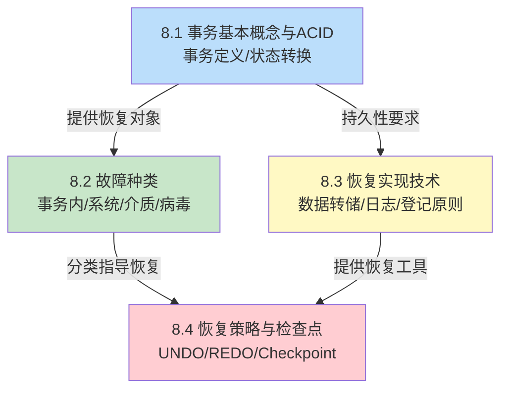

# MOC - 第8章 数据库恢复技术

> [!info] 本章定位
> 数据库恢复技术是数据库系统应对**故障**的核心保护机制，回答"事务执行中或完成后系统发生故障时，如何保证已提交数据不丢失、未完成数据不留痕"的根本问题。它从**事务**这一基本工作单位出发，建立 ACID 四特性（重点保证原子性 A 与持久性 D），分析**事务内部故障、系统故障、介质故障、计算机病毒**四类故障的破坏特征，进而基于**冗余数据**思想构造"数据转储 + 日志登记"两套恢复实现技术，并以**检查点技术**优化恢复扫描范围。本章既是 [[MOC - 第9章]] 并发控制的前提（并发正确性建立在事务概念之上），也是工程上保证数据库可靠性的基础。

## 学习路线图

> [!note] 学习顺序说明
> 8.1 先建立"事务"这一恢复的基本单位，明确 ACID 中 A（原子性）与 D（持久性）是恢复的直接目标；8.2 按故障来源分类，揭示不同故障破坏的对象与需要的恢复策略；8.3 给出恢复的"原料"——冗余数据（数据副本与日志）；8.4 综合运用日志与副本，给出各类故障的具体恢复算法，并通过检查点技术优化扫描效率。建议按顺序学习，重点掌握 REDO/UNDO 流程与检查点恢复算法。

## 知识点导航

| 节 | 主题 | 入口 | 关键概念 |
| ---- | ---- | ---- | ---- |
| 8.1 | 事务基本概念与 ACID | [[8.1 事务基本概念与ACID]] | 事务定义、BEGIN/COMMIT/ROLLBACK、ACID、事务状态转换 |
| 8.2 | 故障种类 | [[8.2 故障种类]] | 事务内部故障、系统故障、介质故障、计算机病毒 |
| 8.3 | 恢复实现技术（日志、副本） | [[8.3 恢复实现技术（日志、副本）]] | 数据转储、日志文件格式、WAL 原则、binlog/redo log |
| 8.4 | 恢复策略与检查点技术 | [[8.4 恢复策略与检查点技术]] | UNDO/REDO、检查点记录、检查点恢复算法 |

## 核心考点

> [!warning] 高频考点（必须掌握）
> 1. **事务定义与 ACID**：准确陈述事务定义，逐一解释 ACID 四特性的含义、举例及 DBMS 实现机制（A 由 UNDO 实现、D 由 REDO 实现、I 由并发控制实现、C 是前两者的综合）。
> 2. **事务状态转换**：画出活动→部分提交→提交/失败→终止的状态图，说明 COMMIT 与 ROLLBACK 在状态转换中的作用。
> 3. **故障分类与破坏**：区分事务内部故障、系统故障、介质故障的破坏对象（已提交未落盘 vs 未提交已落盘）与恢复策略（UNDO / REDO / 重装副本）。
> 4. **数据转储分类**：静态/动态、海量/增量四种转储方式的组合与权衡；动态转储必须配合日志才能恢复到一致性状态。
> 5. **日志记录内容**：事务标识、操作类型、操作对象、旧值（前像）、新值（后像）五要素，理解前像用于 UNDO、后像用于 REDO。
> 6. **WAL 原则**：先写日志后写数据库（Write-Ahead Logging），说明若违反将导致已提交事务无法恢复的后果。
> 7. **检查点恢复算法**：在检查点恢复算法中区分需 REDO 与需 UNDO 的事务集合（$T_1$ 检查点前完成、$T_2$ 检查点前开始检查点后完成、$T_3$ 检查点时刻活动、$T_4$ 检查点后开始）。

## 自测题

1. 简述事务的 ACID 四特性，并分别说明 DBMS 如何实现每一特性。
2. 某数据库系统在运行中突然断电，重启后需要进行恢复。已知断电时刻存在以下事务：
   - $T_1$：检查点前已提交
   - $T_2$：检查点前开始，检查点后提交，断电前已提交
   - $T_3$：检查点时刻正在执行，断电时未提交
   - $T_4$：检查点后开始，断电时未提交

   请指出各事务应执行 REDO 还是 UNDO，并说明理由。
3. 说明"先写日志后写数据库"（WAL）原则的必要性。若先写数据库后写日志，可能产生什么后果？
4. 比较静态转储与动态转储、海量转储与增量转储的差异，并说明动态转储为何必须配合日志。

> [!tip] 自测题答案要点
> - 题1：A 原子性（UNDO）、C 一致性（A+I+D 综合）、I 隔离性（并发控制/封锁）、D 持久性（REDO）。
> - 题2：$T_1$ 已在检查点前完成，其更新已落盘，无需处理；$T_2$ 检查点后提交，需 REDO；$T_3$ 检查点时刻活动且断电未提交，需 UNDO；$T_4$ 检查点后开始未提交，需 UNDO。
> - 题3：WAL 保证故障时日志已落盘，可据此恢复数据库状态。若先写数据库后写日志，故障发生时数据库已改而日志未记，无法 UNDO 已未完成事务的更新，违反原子性。
> - 题4：静态转储期间不允许事务执行，副本一致但可用性差；动态转储允许并发执行，副本可能不一致，必须用日志把副本恢复到一致性状态。海量转储备份全部数据，恢复简单但耗时长；增量转储只备份自上次转储以来变化的块，恢复时需依次应用多次增量。

## 章节导航

- 上级 MOC：[[MOC - 数据库原理]]
- 上一章：[[MOC - 第7章]]
- 下一章：[[MOC - 第9章]]
- 本章习题：[[MOC - 第8章习题]]
