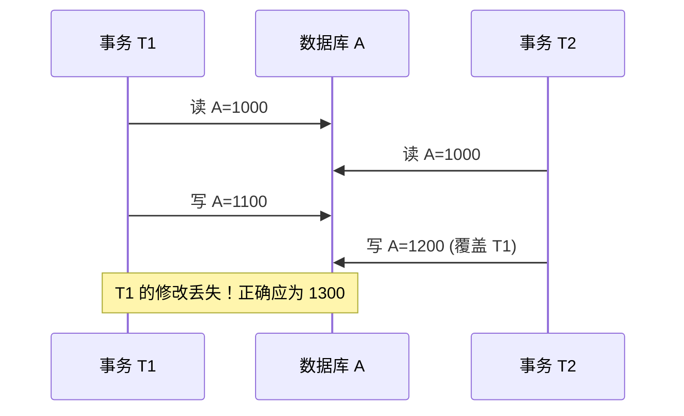

# 9.1 并发引发的数据不一致问题

事务的**隔离性**要求并发执行的事务相互不干扰。但当多个事务**交错执行**访问同一数据时，若不加控制就会产生**数据不一致**问题。本节用具体事务时间序列表揭示三类典型不一致——**丢失修改、不可重复读、读脏数据**，并给出并发正确性的判定标准——**可串行化**，为 [[9.2 封锁技术]] 引入封锁提供动机。

## 并发控制的必要性

> [!info] 为何需要并发控制
> - **多用户环境**：数据库系统通常同时服务多个用户/事务。
> - **资源共享**：多事务可能同时访问同一数据项。
> - **交错执行**：DBMS 调度器把多个事务的操作交错执行，提高资源利用率。
> - **一致性风险**：若无控制，交错执行可能破坏 ACID 的隔离性，导致数据不一致。

> [!note] 并发控制的目标
> 保证并发执行的事务**等价于某种串行执行**——即并发调度结果与把事务按某种顺序串行执行的结果相同。这种性质称为**可串行化（Serializable）**。

## 三类数据不一致问题

### 丢失修改（Lost Update）

> [!definition] 丢失修改
> 两个事务 $T_1$、$T_2$ 同时读取同一数据并各自修改，后写入的事务会**覆盖**先写入事务的修改，使先写入事务的修改**丢失**。

> [!example] 丢失修改示例
> 设账户 A 余额为 1000 元。$T_1$、$T_2$ 同时读取余额并各自加 100 / 加 200：

| 时刻 | 事务 $T_1$ | 事务 $T_2$ | 数据库中 A |
| ---- | ---- | ---- | ---- |
| $t_1$ | 读 A=1000 | — | 1000 |
| $t_2$ | — | 读 A=1000 | 1000 |
| $t_3$ | A=A+100 写回 | — | 1100 |
| $t_4$ | — | A=A+200 写回 | 1200 |

> $T_2$ 的写回覆盖了 $T_1$ 的修改。正确结果应为 1000+100+200=1300，但实际为 1200——$T_1$ 的 100 元修改"丢失"了。

### 不可重复读（Non-repeatable Read）

> [!definition] 不可重复读
> 事务 $T_1$ 读取数据后，事务 $T_2$ 对其进行了**修改或删除**。$T_1$ 再次读取同一数据时，得到与第一次不同的值或读不到数据，称为不可重复读。

> [!example] 不可重复读示例
> 设账户 A 余额为 1000 元。

| 时刻 | 事务 $T_1$ | 事务 $T_2$ | 数据库中 A |
| ---- | ---- | ---- | ---- |
| $t_1$ | 读 A=1000 | — | 1000 |
| $t_2$ | — | 读 A=1000 | 1000 |
| $t_3$ | — | 写 A=800 | 800 |
| $t_4$ | — | COMMIT | 800 |
| $t_5$ | 读 A=800 | — | 800 |

> $T_1$ 在同一事务内两次读取 A，得到不同值（1000、800）——"不可重复读"。

### 读脏数据（Dirty Read）

> [!definition] 读脏数据
> 事务 $T_1$ 修改数据后，事务 $T_2$ 读取了该修改值。随后 $T_1$ 因故障或主动 **ROLLBACK**，使修改失效。$T_2$ 读到的是一个**从未真正提交过**的"脏"数据。

> [!example] 读脏数据示例
> 设账户 A 余额为 1000 元。

| 时刻 | 事务 $T_1$ | 事务 $T_2$ | 数据库中 A |
| ---- | ---- | ---- | ---- |
| $t_1$ | 读 A=1000 | — | 1000 |
| $t_2$ | 写 A=1500 | — | 1500 |
| $t_3$ | — | 读 A=1500 | 1500 |
| $t_4$ | ROLLBACK | — | 1000 |
| $t_5$ | — | 用 A=1500 计算 | — |

> $T_1$ 回滚后 A 恢复为 1000，但 $T_2$ 已经按 1500 进行了计算——它读到了"脏数据"。

> [!warning] 三类问题的严重程度
> | 问题 | 严重程度 | 后果 |
> | ---- | ---- | ---- |
> | 丢失修改 | 严重 | 数据永久丢失，无法恢复 |
> | 读脏数据 | 严重 | 业务基于错误数据决策，可能造成连锁错误 |
> | 不可重复读 | 中等 | 事务内逻辑判断不一致，但数据最终一致 |
>
> 三者都需要并发控制机制解决，[[9.3 封锁协议]] 的三级封锁协议分别针对这三类问题。

## 并发正确性标准：可串行化

> [!definition] 可串行化
> 若多个事务的**并发执行结果**等价于这些事务按**某种串行顺序**执行的结果，则称该并发调度是**可串行化的（Serializable）**。可串行化是并发控制的**正确性准则**。

> [!note] 可串行化与隔离性
> 可串行化是隔离性 I 的实质要求——隔离性并不是要求事务"完全串行执行"，而是要求并发执行的结果"等价于某种串行执行"。只要调度可串行化，就认为隔离性得到保证。

> [!example] 可串行化判别
> 设 $T_1$ 读 A 后写 B，$T_2$ 读 B 后写 A。
> - 调度 1：$T_1$ 全部操作 → $T_2$ 全部操作（串行，等价于 $T_1 < T_2$）
> - 调度 2：$T_2$ 全部操作 → $T_1$ 全部操作（串行，等价于 $T_2 < T_1$）
> - 调度 3：$T_1.\text{读 A}$ → $T_2.\text{读 B}$ → $T_1.\text{写 B}$ → $T_2.\text{写 A}$
>
> 若调度 3 的执行结果与调度 1 或调度 2 相同，则可串行化；否则不可串行化。
>
> [[9.3 封锁协议]] 的两阶段封锁协议 2PL 是保证可串行化的充分条件。

## 小结

> [!summary] 本节核心
> - 并发执行可能产生三类不一致：丢失修改、不可重复读、读脏数据。
> - 丢失修改：两事务同读同写，后写覆盖先写。
> - 不可重复读：事务两次读同一数据得到不同值。
> - 读脏数据：事务读到另一事务未提交的修改，后者回滚使前者读到无效数据。
> - 并发正确性标准是**可串行化**——并发结果等价于某种串行执行。

## 关联

- 本章入口：[[MOC - 第9章]]
- 先修：[[8.1 事务基本概念与ACID]]（事务隔离性 I 是并发控制的目标）
- 后续：[[9.2 封锁技术]]（封锁是解决并发问题的基本手段）、[[9.3 封锁协议]]（三级协议分别解决三类问题）、[[9.6 事务隔离级别]]（SQL 标准的隔离级别对照）
- 关联：[[3.4 数据更新]]（UPDATE 触发并发冲突的典型操作）
