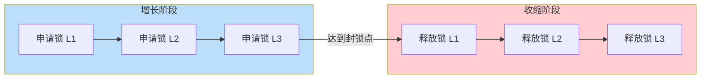

# 9.3 封锁协议

封锁能解决 [[9.1 并发引发的数据不一致问题]] 的三类不一致问题，但**何时加锁、加什么锁、何时释放锁**需要约定。这些约定就是**封锁协议**。本节介绍两类典型协议：**三级封锁协议**（针对三类不一致分别给出加锁规则）与**两阶段封锁协议 2PL**（保证可串行化的充分条件）。后者是 [[9.6 事务隔离级别]] 中 Serializable 的理论基础。

## 三级封锁协议

### 一级封锁协议

> [!definition] 一级封锁协议
> 事务 $T$ 在**修改**数据 $R$ 之前必须先对 $R$ 加 **X 锁**，并保持到**事务结束**（COMMIT 或 ROLLBACK）才释放。

> [!info] 一级封锁协议可解决的问题
> - **防止丢失修改**：因为若 $T_1$ 已对 $R$ 加 X 锁并保持到事务结束，$T_2$ 想"读后修改 $R$"必须先加 X 锁，只能等待 $T_1$ 释放，从而无法与 $T_1$ 并发修改。

> [!warning] 一级封锁协议不能解决的问题
> - **不能防止读脏数据**：一级封锁协议**对读操作不加锁**。$T_1$ 加 X 锁修改 $R$ 期间，$T_2$ 可以直接读 $R$（不加锁），若 $T_1$ 随后 ROLLBACK，$T_2$ 读到的是脏数据。
> - **不能防止不可重复读**：同理 $T_2$ 读 $R$ 后 $T_1$ 可改 $R$，$T_2$ 再读结果不同。

### 二级封锁协议

> [!definition] 二级封锁协议
> 在一级封锁协议基础上，事务 $T$ 在**读取**数据 $R$ 之前必须先对 $R$ 加 **S 锁**，**读完即可释放** S 锁（不保持到事务结束）。

> [!info] 二级封锁协议可解决的问题
> - **防止读脏数据**：$T_1$ 修改 $R$ 时已加 X 锁（保持到事务结束）；$T_2$ 想读 $R$ 必须先加 S 锁。X 与 S 不相容，$T_2$ 必须等待 $T_1$ 释放 X 锁（即 $T_1$ 结束）。若 $T_1$ COMMIT，$T_2$ 读到的是已提交数据；若 $T_1$ ROLLBACK，$T_2$ 读到的是回滚后的数据——都不是"脏数据"。

> [!warning] 二级封锁协议不能解决的问题
> - **不能防止不可重复读**：$T_2$ 读 $R$ 后立即释放 S 锁，$T_1$ 可修改 $R$ 并提交，$T_2$ 再读 $R$ 得到不同值。

### 三级封锁协议

> [!definition] 三级封锁协议
> 在一级封锁协议基础上，事务 $T$ 在**读取**数据 $R$ 之前必须先对 $R$ 加 **S 锁**，并**保持到事务结束**才释放。

> [!info] 三级封锁协议可解决的问题
> - **防止读脏数据**（同二级）。
> - **防止不可重复读**：$T_2$ 加 S 锁保持到事务结束，$T_1$ 想修改 $R$ 必须加 X 锁，但 X 与 $T_2$ 的 S 锁不相容，$T_1$ 必须等待 $T_2$ 结束。所以 $T_2$ 在事务内两次读 $R$ 结果相同。

> [!warning] 三级封锁协议不能保证可串行化
> 三级封锁协议**只针对单条数据项的读写**，并未约束多数据项交错调度的整体顺序，因此**不能保证调度可串行化**。要保证可串行化需使用两阶段封锁协议 2PL。

### 三级封锁协议对比

| 协议 | 修改时 | 读取时 | X 锁释放 | S 锁释放 | 解决问题 |
| ---- | ---- | ---- | ---- | ---- | ---- |
| 一级 | 加 X 锁 | 不加锁 | 事务结束 | — | 丢失修改 |
| 二级 | 加 X 锁 | 加 S 锁 | 事务结束 | 读完即释放 | 丢失修改 + 读脏 |
| 三级 | 加 X 锁 | 加 S 锁 | 事务结束 | 事务结束 | 丢失修改 + 读脏 + 不可重复读 |

> [!note] 三级封锁协议的记忆口诀
> - **一级**：写要锁到尾，读不锁。
> - **二级**：写要锁到尾，读完释放。
> - **三级**：读写都锁到尾。
>
> 一级防丢失修改，二级加防读脏，三级再加防不可重复读。

## 两阶段封锁协议 2PL

> [!definition] 两阶段封锁协议
> 两阶段封锁协议（Two-Phase Locking，2PL）要求每个事务分两个阶段提出加锁与释放锁请求：
> - **增长阶段（扩展阶段）**：事务可以申请获得任何数据项上的任何类型的锁，但**不能释放任何锁**。
> - **收缩阶段（收缩阶段）**：事务可以释放任何数据项上的任何类型的锁，但**不能再申请任何新的锁**。

> [!note] 封锁点
> 事务的**封锁点（Lock Point）**是它获得最后一个锁的时刻。在封锁点之前是增长阶段，之后是收缩阶段。一旦事务开始释放锁，就进入收缩阶段，不能再申请新锁。

> [!theorem] 2PL 保证可串行化
> **定理**：若所有事务都遵循两阶段封锁协议，则这些事务的任何并发调度都是**可串行化**的。
>
> 该定理保证 2PL 是可串行化的**充分条件**——只要遵循 2PL，并发调度必然可串行化。

> [!warning] 2PL 不能防止死锁
> 2PL 在增长阶段不断申请新锁而不释放锁，多个事务增长阶段交错时可能形成**循环等待**——例如 $T_1$ 持有 $A$ 的锁申请 $B$ 的锁，$T_2$ 持有 $B$ 的锁申请 $A$ 的锁，两者都不释放自己的锁，造成**死锁**。
>
> 2PL **不保证无死锁**，需要 [[9.4 活锁、死锁处理]] 的死锁检测与解除机制。

### 严格两阶段封锁协议

> [!definition] 严格两阶段封锁协议
> **严格两阶段封锁协议（Strict 2PL, S2PL）**是 2PL 的加强版：要求事务**持有的所有 X 锁必须保持到事务结束**（COMMIT 或 ROLLBACK）才释放。S 锁可以在收缩阶段释放。
>
> 这保证了：已提交事务的更新一定持久，未提交事务的更新一定不外泄。

> [!info] 工程实践
> 多数商用 DBMS（包括 InnoDB）采用**严格两阶段封锁协议 + 死锁检测**的组合：
> - S2PL 保证可串行化且避免级联回滚。
> - 死锁检测机制周期性检查等待图，发现死锁时撤销代价最小的事务。

## 三级封锁协议 vs 两阶段封锁协议

> [!note] 二者关系
> - **三级封锁协议**：针对**单条数据项**的读写操作约定加锁时机，目的是分别解决三类不一致问题（丢失修改/读脏/不可重复读）。**不保证可串行化**。
> - **2PL**：针对**整个事务**的加锁/释放顺序约定（先全部加锁再全部释放），目的是**保证可串行化**。**不针对具体不一致问题**。
> - **严格 2PL**：在 2PL 基础上要求 X 锁到事务结束，结合了两者的优势。

| 协议 | 目标 | 加锁时机 | 释放时机 | 保证可串行化 | 防死锁 |
| ---- | ---- | ---- | ---- | ---- | ---- |
| 一级 | 防丢失修改 | 修改前加 X | 事务结束 | 否 | 否 |
| 二级 | 加防读脏 | 修改前加 X、读前加 S | X 到结束、S 读完即释放 | 否 | 否 |
| 三级 | 加防不可重复读 | 修改前加 X、读前加 S | X、S 都到事务结束 | 否 | 否 |
| 2PL | 可串行化 | 增长阶段 | 收缩阶段 | 是 | 否 |
| S2PL | 可串行化 + 防级联回滚 | 增长阶段 | X 到事务结束 | 是 | 否 |

## 小结

> [!summary] 本节核心
> - **一级封锁协议**：修改前加 X 锁至事务结束，防丢失修改。
> - **二级封锁协议**：一级 + 读前加 S 锁读完即释放，加防读脏。
> - **三级封锁协议**：二级 + 读前加 S 锁至事务结束，加防不可重复读。
> - **2PL**：增长阶段只加锁、收缩阶段只释放锁，**保证可串行化但不防死锁**。
> - **S2PL**：2PL + X 锁到事务结束，保证可串行化且防级联回滚，是商用 DBMS 的常用协议。

## 关联

- 本章入口：[[MOC - 第9章]]
- 先修：[[9.1 并发引发的数据不一致问题]]、[[9.2 封锁技术]]
- 后续：[[9.4 活锁、死锁处理]]（2PL 的死锁副作用）、[[9.6 事务隔离级别]]（隔离级别与封锁协议的对应）
- 关联：[[8.1 事务基本概念与ACID]]（事务隔离性 I 的具体实现）
