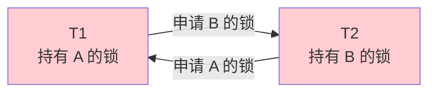
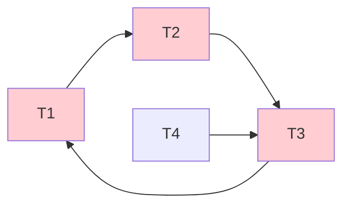

# 9.4 活锁、死锁处理

封锁协议解决了数据不一致问题，但带来了**活锁**与**死锁**两类副作用。本节介绍活锁与死锁的产生原因、预防手段、检测与解除算法，重点掌握**等待图**的死锁检测方法。这是 [[9.3 封锁协议]] 2PL 的"善后处理"，也是商用 DBMS 必备机制。

## 活锁

### 活锁的定义与产生原因

> [!definition] 活锁
> 活锁是指事务 $T$ 在等待锁时，由于其他事务**不断抢先**获得锁，使 $T$ **一直处于等待状态**而无法继续执行。与死锁不同，活锁中的事务并未"卡死"，只是"总轮不到"。

> [!example] 活锁的产生
> 设 $T_1$ 等待 $T_2$ 持有的锁 $L$。$T_2$ 释放 $L$ 时，新事务 $T_3$ 又抢先获得了 $L$。$T_3$ 释放后又有 $T_4$ 抢先……$T_1$ 可能"无限期"等待下去。

> [!note] 活锁与死锁的区别
> | 维度 | 活锁 | 死锁 |
> | ---- | ---- | ---- |
> | 事务状态 | 持续等待，但锁资源可获取 | 全部阻塞，循环等待 |
> | 是否能解除 | 优先级足够时能自动获得锁 | 不能自动解除，需外部干预 |
> | 后果 | 性能下降，事务延迟 | 事务永久阻塞 |

### 活锁的预防

> [!info] 活锁预防：FCFS 先来先服务
> 采用**先来先服务（First-Come First-Served, FCFS）**策略：当多个事务等待同一数据项的锁时，按申请顺序排队，先到先得。后续事务不能抢先，必须等队列前面的事务获得锁并释放后才能获得。

> [!note] FCFS 的实现
> DBMS 维护每个数据项的**锁等待队列**。锁释放时唤醒队首事务授予锁，新申请的事务排到队尾。这样可避免活锁——任何事务最多等待队列前面的事务，迟早能获得锁。

## 死锁

### 死锁的定义与产生原因

> [!definition] 死锁
> 死锁是指两个或多个事务**互相等待**对方持有的锁，形成**循环等待链**，导致所有事务都无法继续执行的状态。

> [!example] 死锁的产生
> 设 $T_1$ 持有数据 $A$ 的 X 锁，$T_2$ 持有数据 $B$ 的 X 锁。
> - $T_1$ 申请 $B$ 的锁 → 等待 $T_2$ 释放。
> - $T_2$ 申请 $A$ 的锁 → 等待 $T_1$ 释放。
>
> 两者互相等待，形成循环——$T_1 \to T_2 \to T_1$，死锁。



### 死锁的预防

死锁预防有两种思路：**破坏循环等待条件**。

#### 一次封锁法

> [!definition] 一次封锁法
> 事务在开始时**一次性申请**全部所需的锁，若不能全部获得则等待。这样事务不会在持有部分锁后申请新锁，从而不会形成循环等待。

> [!warning] 一次封锁法的局限
> - 事务开始时**难以预知**全部所需锁——特别是动态 SQL 与基于查询结果决定后续操作的事务。
> - 一次申请全部锁会**显著降低并发度**，因为锁持有时间变长。
> - 实际系统中很难严格实现。

#### 顺序封锁法

> [!definition] 顺序封锁法
> 对数据库中所有数据项**预先规定一个封锁顺序**，所有事务都按此顺序加锁。这样不会形成"前向加锁"与"反向加锁"交错，破坏循环等待条件。

> [!warning] 顺序封锁法的局限
> - 数据库中数据项**数量巨大**，难以维护全局封锁顺序。
> - 数据项是动态创建与删除的（如新插入的记录），顺序需动态更新。
> - 实际系统难以实现，仅用于理论分析。

> [!note] 预防策略的取舍
> 两种死锁预防方法都有显著局限性。因此**商用 DBMS 多采用"允许死锁发生 + 检测解除"**的策略（见下文）。

### 死锁的检测与解除

#### 死锁检测：等待图

> [!definition] 等待图
> **等待图（Wait-for Graph, WFG）**用于检测死锁：
> - **节点**：当前活动的事务。
> - **有向边**：若事务 $T_i$ 等待 $T_j$ 持有的锁，则画一条从 $T_i$ 指向 $T_j$ 的有向边 $T_i \to T_j$。
>
> **判定**：当且仅当等待图中**存在环**时，系统发生死锁。

> [!example] 等待图死锁检测
> 设系统中有四个事务：
> - $T_1$ 等待 $T_2$ 持有的锁
> - $T_2$ 等待 $T_3$ 持有的锁
> - $T_3$ 等待 $T_1$ 持有的锁
> - $T_4$ 等待 $T_3$ 持有的锁



> 图中存在环 $T_1 \to T_2 \to T_3 \to T_1$，判定为死锁。注意 $T_4$ 虽也在等待 $T_3$，但不在环上，不直接死锁（但会因 $T_3$ 死锁而间接阻塞）。

> [!info] 等待图检测算法
> 1. DBMS 周期性（或锁等待超时触发）构建当前等待图。
> 2. 在图中执行**环检测算法**（如深度优先搜索 DFS）。
> 3. 若发现环，则存在死锁，进入死锁解除阶段。

#### 死锁解除

> [!info] 死锁解除的策略
> 发现死锁后，DBMS 选择一个或多个事务**撤销（ROLLBACK）**以打破循环等待：
> 1. **选择牺牲事务**：选择撤销代价最小的事务。代价衡量标准包括：
>    - 事务已执行时间（短的优先选作牺牲，重做代价小）。
>    - 事务已做更新量（少的优先）。
>    - 事务剩余执行时间（少的避免撤销）。
>    - 事务使用的锁数量（少的优先释放）。
> 2. **撤销牺牲事务**：对该事务执行 ROLLBACK，释放其持有的所有锁。
> 3. **重新启动**：被撤销的事务可由系统自动重启或交由应用层处理。

> [!note] 超时法
> 工程上简单实用的死锁处理是**超时法**：事务等待锁超过设定阈值（如 InnoDB 的 `innodb_lock_wait_timeout` 默认 50 秒），认为发生死锁（或长时间锁等待），主动回滚该事务。超时法不精确但实现简单。

> [!example] MySQL InnoDB 的死锁处理
> InnoDB 默认启用**死锁检测**（`innodb_deadlock_detect=ON`），在事务等待锁时立即检测是否形成环。一旦检测到死锁，自动选择一个事务（通常是 undo 量较小的事务）回滚并返回 `ERROR 1213 (40001): Deadlock found`。
>
> 也可关闭死锁检测，改用超时法：
> ```sql
> SET GLOBAL innodb_deadlock_detect = OFF;
> SET GLOBAL innodb_lock_wait_timeout = 30;
> ```

## 小结

> [!summary] 本节核心
> - **活锁**：事务一直等待但未卡死，用 FCFS 排队预防。
> - **死锁**：事务循环等待，需检测与解除。
> - **死锁预防**：一次封锁法、顺序封锁法（理论可行，工程难实现）。
> - **死锁检测**：等待图存在环即死锁。
> - **死锁解除**：撤销代价最小的事务，释放其锁打破循环。
> - 商用 DBMS 多采用"允许死锁发生 + 等待图检测 + 代价最小撤销"的组合。

## 关联

- 本章入口：[[MOC - 第9章]]
- 先修：[[9.2 封锁技术]]、[[9.3 封锁协议]]（封锁协议的副作用）
- 后续：[[9.6 事务隔离级别]]（不同隔离级别下的死锁风险）
- 关联：[[8.2 故障种类]]（死锁被选为牺牲品是非预期事务故障之一）、[[8.4 恢复策略与检查点技术]]（事务回滚机制）
