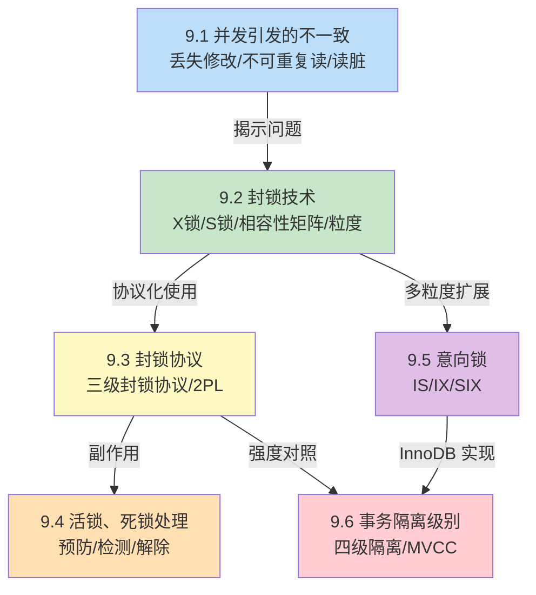

# MOC - 第9章 并发控制

> [!info] 本章定位
> 并发控制是数据库系统在**多用户并发环境**下保证数据一致性的核心机制。当多个事务同时访问同一数据时，可能产生**丢失修改、不可重复读、读脏数据**三类不一致问题。本章从问题出发，建立**封锁**这一基本手段，定义**共享锁 S / 排他锁 X**及相容性矩阵；进而给出**三级封锁协议**与**两阶段封锁协议 2PL**保证正确性的不同强度；针对封锁带来的**活锁、死锁**问题给出预防与检测解除方法；为提高多粒度加锁效率引入**意向锁**体系；最后用**事务隔离级别**把并发正确性与具体实现（封锁/MVCC）对应起来。本章建立在 [[8.1 事务基本概念与ACID]] 之上，是实现 ACID 中**隔离性 I** 的核心内容。

## 学习路线图

> [!note] 学习顺序说明
> 9.1 先用事务交错执行的具体例子让读者"看到"三类不一致问题；9.2 给出解决手段——封锁（X 锁、S 锁、相容性矩阵、封锁粒度）；9.3 把封锁组织成协议（三级封锁协议、2PL）以解决不同强度的不一致；9.4 处理封锁协议带来的活锁与死锁副作用；9.5 引入意向锁提高多粒度加锁效率；9.6 把上述概念汇总到 SQL 标准的四种隔离级别。建议按顺序学习，重点掌握三类不一致分析、X/S 锁相容性、三级封锁协议、死锁检测、隔离级别对照表。

## 知识点导航

| 节 | 主题 | 入口 | 关键概念 |
| ---- | ---- | ---- | ---- |
| 9.1 | 并发引发的数据不一致问题 | [[9.1 并发引发的数据不一致问题]] | 丢失修改、不可重复读、读脏数据、可串行化 |
| 9.2 | 封锁技术 | [[9.2 封锁技术]] | X 锁、S 锁、相容性矩阵、封锁粒度 |
| 9.3 | 封锁协议 | [[9.3 封锁协议]] | 三级封锁协议、两阶段封锁协议 2PL |
| 9.4 | 活锁、死锁处理 | [[9.4 活锁、死锁处理]] | 活锁、死锁、等待图、一次封锁法、顺序封锁法 |
| 9.5 | 意向锁 | [[9.5 意向锁]] | IS、IX、SIX、意向锁相容性矩阵 |
| 9.6 | 事务隔离级别 | [[9.6 事务隔离级别]] | 读未提交、读已提交、可重复读、串行化、MVCC |

## 核心考点

> [!warning] 高频考点（必须掌握）
> 1. **三类不一致问题**：用事务时间序列表分析丢失修改、不可重复读、读脏数据，给出具体交错执行示例。
> 2. **X 锁与 S 锁的相容性矩阵**：准确填写 S/S、S/X、X/S、X/X 四种情形的相容性，并解释为何 X 锁与其他任何锁都不相容。
> 3. **三级封锁协议**：一级（修改前加 X 锁至事务结束→防丢失修改）、二级（一级+读前加 S 锁读完释放→防读脏）、三级（二级+读前加 S 锁至事务结束→防不可重复读）的加锁要求与可解决问题。
> 4. **两阶段封锁协议 2PL**：增长阶段只加锁不放锁、收缩阶段只放锁不加锁；2PL 保证可串行化但不防死锁。
> 5. **活锁与死锁**：活锁（事务一直等待）的 FCFS 预防；死锁（循环等待）的一次封锁法/顺序封锁法预防、等待图检测、撤销代价最小事务解除。
> 6. **意向锁**：IS/IX/SIX 三种意向锁的含义与相容性矩阵；意向锁加锁规则（先加意向锁再加实际锁，意向锁自顶向下、实际锁自底向上）。
> 7. **四种隔离级别**：读未提交/读已提交/可重复读/串行化对应的封锁协议与可解决的并发问题对照表。
> 8. **MVCC**：多版本并发控制基本思想——读不阻塞写、写不阻塞读，InnoDB 默认 Repeatable Read 用 MVCC 实现。

## 自测题

1. 用事务时间序列表说明"丢失修改"问题的发生过程，并指出用何种封锁协议可解决。
2. 给出 X 锁与 S 锁的相容性矩阵，并解释 X 锁为何称为"排他锁"。
3. 比较三级封锁协议与两阶段封锁协议 2PL 的异同：
   - 各自保证的正确性强度？
   - 三级封锁协议能保证可串行化吗？为什么？
   - 2PL 能防止死锁吗？为什么？
4. 设有事务 $T_1$、$T_2$、$T_3$ 等待以下资源：
   - $T_1$ 等待 $T_2$ 持有的锁
   - $T_2$ 等待 $T_3$ 持有的锁
   - $T_3$ 等待 $T_1$ 持有的锁

   请画出等待图，判断是否发生死锁，并说明如何解除。

> [!tip] 自测题答案要点
> - 题1：$T_1$、$T_2$ 同时读 $A=100$，各自加 100 写回——$T_1$ 的修改被 $T_2$ 覆盖。一级封锁协议（修改前加 X 锁至事务结束）可解决。
> - 题2：S/S 相容，S/X 不相容，X/S 不相容，X/X 不相容。X 锁排斥其他任何锁，故称排他锁。
> - 题3：三级封锁协议解决三类不一致但**不保证可串行化**（仅约束加锁时机，未约束事务整体交错）；2PL 保证可串行化但**不防死锁**（增长阶段可能形成循环等待）。
> - 题4：等待图 $T_1\to T_2\to T_3\to T_1$ 形成环，存在死锁。选择撤销代价最小的事务（如已做更新最少的事务）解除死锁。

## 章节导航

- 上级 MOC：[[MOC - 数据库原理]]
- 上一章：[[MOC - 第8章]]
- 下一章：[[MOC - 第10章]]
- 本章习题：[[MOC - 第9章习题]]
