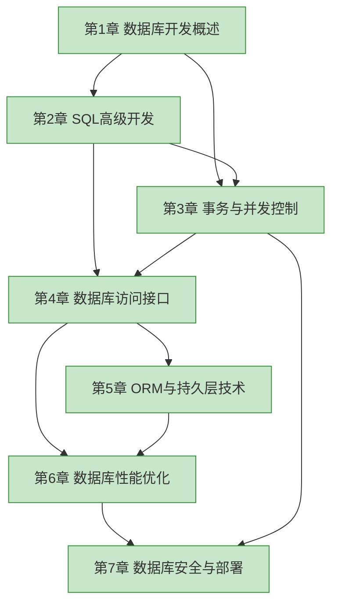

> [!info] 课程定位
> 数据库开发技术是数据库技术专业的核心课程，研究数据库应用开发中的 **SQL 高级编程、事务控制、访问接口、ORM、性能优化与安全部署**。课程在《数据库原理》的范式理论与《Oracle 数据库管理》的运维实践之间架起桥梁，聚焦“如何把数据库作为应用后端进行工程化开发”这一核心问题。

## 知识结构

> [!note] 图例
> 绿色为已整理章节。全部七章内容均已建立知识节点。

## 章节导航

| 章节 | 主题 | 入口 | 关键概念 |
| ---- | ---- | ---- | -------- |
| 第1章 | 数据库开发概述 | [[MOC - 第1章]] | 开发模式、生命周期、主流数据库与驱动 |
| 第2章 | SQL 高级开发 | [[MOC - 第2章]] | 视图、存储过程、触发器、函数、游标 |
| 第3章 | 事务与并发控制 | [[MOC - 第3章]] | ACID、隔离级别、锁机制、死锁 |
| 第4章 | 数据库访问接口 | [[MOC - 第4章]] | ODBC、JDBC、连接池、参数化查询 |
| 第5章 | ORM 与持久层技术 | [[MOC - 第5章]] | ORM 思想、对象关系映射、MyBatis、Hibernate/JPA、Spring Data JPA |
| 第6章 | 数据库性能优化 | [[MOC - 第6章]] | 索引设计、SQL 调优、执行计划、慢查询分析 |
| 第7章 | 数据库安全与部署 | [[MOC - 第7章]] | SQL 注入防范、权限管理、备份恢复、主从复制 |

## 学习目标（分阶段）

1. **基础概念**（第1章）：理解数据库应用的开发模式、分层架构与生命周期，掌握主流数据库与驱动的选型依据。
2. **SQL 高级**（第2章）：能用视图、存储过程、触发器、函数与游标实现业务逻辑层的数据操作。
3. **事务并发**（第3章）：理解 ACID 与并发问题，能依据隔离级别与锁机制编写正确的并发代码。
4. **访问接口**（第4章）：掌握 ODBC/JDBC 工作原理，能使用连接池与参数化查询编写安全高效的访问层。
5. **ORM**（第5章）：理解对象关系阻抗失配，能使用主流 ORM 框架完成持久化映射。
6. **性能优化**（第6章）：能阅读执行计划、设计合理索引并重构低效 SQL。
7. **安全部署**（第7章）：掌握权限模型、备份策略与安全加固的工程方法。

## 先修与关联课程

- **先修**：[[数据库原理]]（关系模型、范式、SQL 基础）、数据结构与算法、Java/Python 程序设计
- **并行**：[[Oracle 数据库管理]]（提供运维视角，本课程提供开发视角）
- **后续**：分布式数据库、Web 应用开发、微服务架构

## 数据库开发工具推荐

| 工具 | 适用场景 | 说明 |
| ---- | ---- | ---- |
| MySQL Workbench | MySQL 数据建模与开发 | 官方工具，支持 ER 建模、SQL 编辑、服务器管理 |
| Navicat | 多数据库通用 | 商业工具，支持 MySQL/PG/Oracle/SQL Server 等，连接管理与数据同步 |
| DBeaver | 多数据库通用（开源） | 基于 JDBC，支持几乎全部主流数据库，适合跨 DBMS 开发 |
| DataGrip | 多数据库通用（JetBrains） | 智能 SQL 补全、重构、版本控制集成，适合团队开发 |
| Postman | API 接口测试 | 后端暴露 REST/GraphQL 接口时用于联调，验证数据访问层 |

> [!tip] 选型建议
> 学习阶段建议 DBeaver（开源、跨平台、多 DBMS）；团队 Java 项目可选用 DataGrip；纯 MySQL 环境用 MySQL Workbench 即可。生产环境避免在客户端直连生产库执行写操作。

## 相关标签

#数据库开发 #SQL #事务 #索引 #JDBC #ORM
