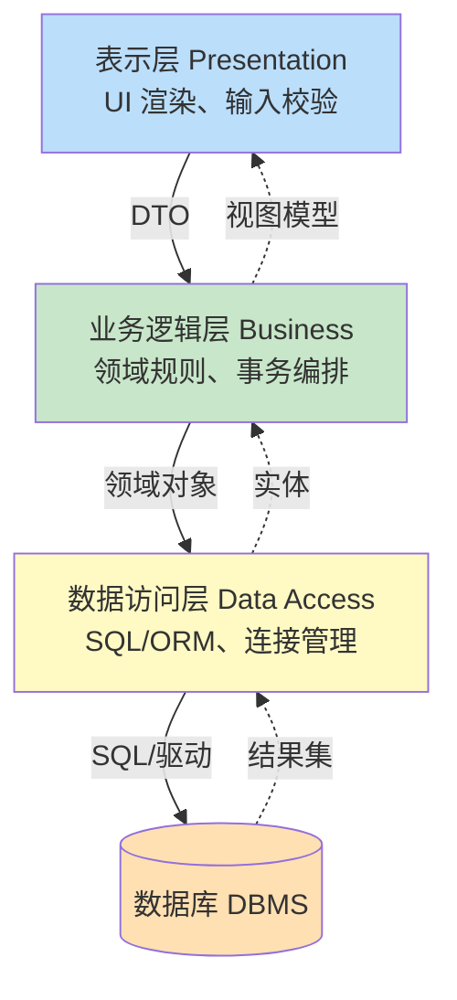

数据库应用开发模式解决“应用程序如何与数据库交互”这一根本问题。模式选择直接影响性能、安全性、可维护性和部署形态。本节梳理四类典型 SQL 调用方式与两类经典架构，并给出分层设计方法。

## SQL 调用方式

| 方式 | 说明 | 优点 | 缺点 |
| ---- | ---- | ---- | ---- |
| 嵌入式 SQL | SQL 语句嵌入宿主语言，由预编译器翻译为函数调用 | 与语言集成紧密 | DBMS 强相关，可移植性差 |
| 预编译 SQL | 使用占位符 `?` 或命名参数，先编译后绑定 | 防注入、执行计划可复用 | 语法受限 |
| 动态 SQL | 运行时拼接并执行 SQL 字符串 | 灵活，可构造任意查询 | 注入风险高、调试难 |
| 存储过程调用 | 调用 DBMS 端预编译的过程 | 减少网络流量、封装业务 | 逻辑下沉数据库，迁移困难 |

详见 [[2.1 视图、存储过程]] 与 [[4.3 参数化查询]]。

## 胖客户端 vs 瘦客户端

- **胖客户端（Fat Client / Rich Client）**：业务逻辑与数据访问大部分在客户端进程完成，服务器主要承担数据存储。两层 C/S 的典型形态。
- **瘦客户端（Thin Client）**：客户端只负责展示，业务逻辑与数据访问集中在服务端。B/S 架构的浏览器即为瘦客户端。

## 两层 C/S vs 三层 B/S

| 维度 | 两层 C/S | 三层 B/S |
| ---- | ---- | ---- |
| 组件 | 客户端 ↔ 数据库服务器 | 浏览器 ↔ 应用服务器 ↔ 数据库服务器 |
| 业务逻辑位置 | 客户端 | 应用服务器 |
| 部署维护 | 客户端需安装升级，成本高 | 浏览器零部署，升级集中 |
| 性能 | 直连数据库，延迟低 | 多一跳，但连接池可复用 |
| 安全 | 客户端直连 DB，暴露面大 | DB 仅对应用服务器开放，安全边界清晰 |
| 典型场景 | 桌面 ERP、工控系统 | Web 应用、SaaS |

## 数据库应用的分层设计

现代数据库应用普遍采用三层架构，每层职责独立：



> [!note] 各层职责
> - **表示层**：仅处理界面展示与用户输入校验，不直接访问数据库。
> - **业务逻辑层**：封装领域规则与事务边界，编排多个数据访问操作。
> - **数据访问层**：封装 SQL 与连接管理，对上层暴露面向对象的接口。

> [!warning] 常见反模式
> - 在表示层直接拼接 SQL（绕过业务层与数据访问层）→ SQL 注入、难以测试。
> - 在数据访问层写业务规则 → 层职责混乱，迁移困难。
> - 业务层跨多个数据访问操作但未包事务 → 数据不一致。

## 示例：分层后的数据访问

```sql
-- MySQL 8.0 / 数据访问层暴露的查询接口语义
-- 依赖表：account(id BIGINT PRIMARY KEY, balance NUMERIC(15,2) NOT NULL, version INT NOT NULL)
SELECT id, balance, version
FROM account
WHERE id = ?;
```

业务逻辑层组合两个上述查询并包入事务（见 [[3.1 事务ACID特性]]），数据访问层负责执行并返回实体对象，表示层仅渲染结果——这是分层设计的目标形态。

## 限制与易错点

- 动态 SQL 灵活但极易注入，必须配合参数化查询（[[4.3 参数化查询]]）。
- 存储过程将业务逻辑下沉到 DBMS，迁移到异构数据库时成本高。
- 分层引入了层间调用开销，对极端性能敏感场景需评估是否合并层。

## 关联

- 上位：[[MOC - 第1章]]
- 下位：[[1.2 数据库开发生命周期]]、[[1.3 主流数据库与开发驱动简介]]
- 相关：[[2.1 视图、存储过程]]、[[3.1 事务ACID特性]]、[[4.1 ODBC、JDBC原理]]
