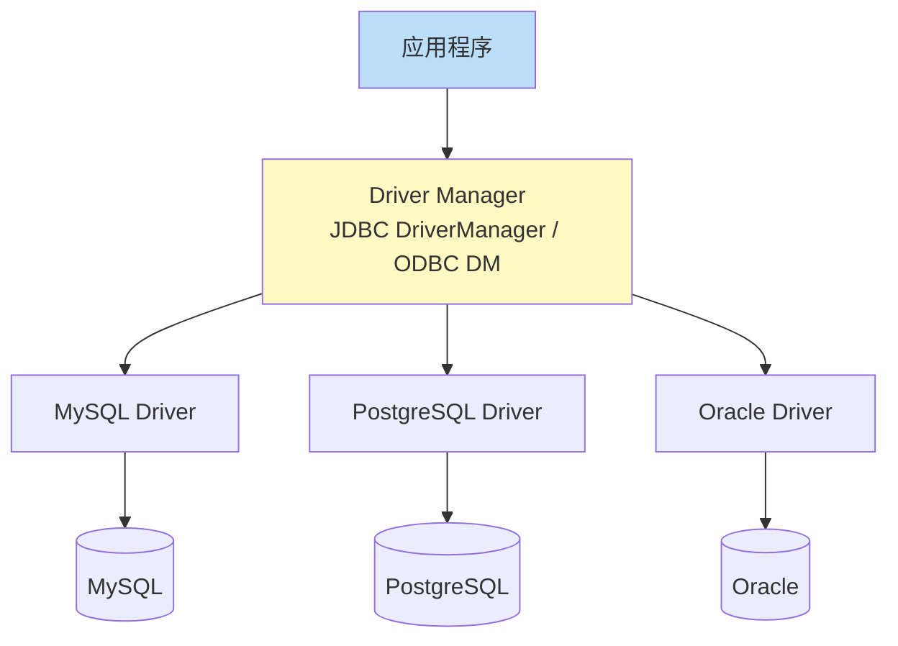

数据库选型与驱动选型是开发启动前的关键决策。本节对比主流关系型数据库与 NoSQL 数据库的定位，梳理四类开发驱动的架构与适用语言。驱动是访问接口章节（[[MOC - 第4章]]）的认知前提。

## 主流关系型数据库

| DBMS | 许可 | 定位 | 开发特点 |
| ---- | ---- | ---- | ---- |
| MySQL | GPL/商业 | Web 应用首选，OLTP | 简单可靠，InnoDB 支持事务与行锁 |
| PostgreSQL | BSD | 功能丰富，支持复杂类型、JSONB、GIS | 严格 SQL 标准、扩展性强 |
| Oracle | 商业 | 大型企业、金融 | 功能最强，PL/SQL 生态成熟，许可昂贵 |
| SQL Server | 商业 | Windows 生态、.NET 项目 | 与微软工具链集成深 |
| SQLite | 公共域 | 嵌入式、移动端、单机 | 无服务进程，文件即数据库 |

> [!note] 选型原则
> - 默认 Web 项目用 MySQL 或 PostgreSQL；复杂查询、GIS、JSON 重度使用选 PostgreSQL。
> - 不能擅自把 Oracle 特性当作通用 SQL，例如 `ROWNUM`、`SEQUENCE.NEXTVAL`、`DUAL` 等（见 [[数据库技术]] 局部规则）。
> - SQLite 不适合高并发写，但适合配置存储与测试夹具。

## NoSQL 数据库

| 类型 | 代表 | 数据模型 | 适用场景 |
| ---- | ---- | ---- | ---- |
| 文档型 | MongoDB | BSON 文档 | 灵活 schema、内容管理 |
| 键值型 | Redis | K/V | 缓存、计数器、排行榜 |
| 列族 | Cassandra | 宽行 | 海量写入、时序数据 |
| 图 | Neo4j | 节点与关系 | 社交网络、推荐 |

> [!warning] NoSQL 不替代关系库
> NoSQL 牺牲部分一致性换取扩展性。涉及财务、库存等强一致事务的场景仍应使用关系数据库，详见 [[3.1 事务ACID特性]]。

## 数据库开发驱动

| 驱动 | 适用语言 | 说明 |
| ---- | ---- | ---- |
| JDBC | Java | 标准接口 `java.sql.*`，由各 DBMS 厂商提供实现 |
| ODBC | C/C++、跨语言 | 微软发起的开放标准，Driver Manager 统一调度 |
| ADO.NET | C#/.NET | `System.Data` 命名空间，托管数据提供者 |
| Python 驱动 | Python | `mysql-connector-python`、`psycopg2` 等 |
| Node.js 驱动 | Node.js | `mysql2`、`pg` 等，多异步 |

## 驱动架构

驱动普遍采用 **Driver Manager + 厂商驱动** 的分层结构，使应用代码与具体 DBMS 解耦：



> [!note] Driver Manager 的职责
> - 加载并注册驱动实现（JDBC 通过 `Class.forName`，ODBC 通过 DSN 配置）。
> - 根据 URL 选择正确的驱动建立连接。
> - 统一 API，使切换 DBMS 只需更换驱动与连接字符串，应用代码不变。

## 示例：JDBC 连接 MySQL（最小可运行）

```java
// JDK 17 + MySQL Connector/J 8.x
// 前置：pom.xml 引入 mysql-connector-j，MySQL 8.x 已启动
import java.sql.*;

public class MinimalJdbc {
    public static void main(String[] args) throws Exception {
        String url = "jdbc:mysql://127.0.0.1:3306/demo?useSSL=false&serverTimezone=UTC";
        try (Connection conn = DriverManager.getConnection(url, "demo_user", "demo_pwd");
             Statement stmt = conn.createStatement();
             ResultSet rs = stmt.executeQuery("SELECT id, name FROM product LIMIT 5")) {
            while (rs.next()) {
                System.out.printf("id=%d name=%s%n", rs.getLong("id"), rs.getString("name"));
            }
        }
    }
}
```

> [!warning] 生产代码不要直接拼接凭据
> 上例为教学最小写法。生产环境应使用连接池（[[4.2 数据库连接池]]）与配置中心管理凭据，并使用 `PreparedStatement`（[[4.3 参数化查询]]）执行带参查询。示例中的 `demo_user/demo_pwd` 为虚构值。

## 限制与易错点

- JDBC 4.0+ 已支持 SPI 自动注册驱动，`Class.forName` 在新驱动上非必需；但旧驱动仍需要。
- 不同 DBMS 的 SQL 方言差异（如分页 `LIMIT` vs `OFFSET ... FETCH`）由驱动透传，应用层需自行适配。
- ODBC 在 Linux 上的配置（unixODBC）与 Windows 不同，部署时需注明平台。

## 关联

- 上位：[[MOC - 第1章]]
- 同章：[[1.1 数据库应用开发模式]]、[[1.2 数据库开发生命周期]]
- 下位：[[4.1 ODBC、JDBC原理]]、[[4.2 数据库连接池]]、[[4.3 参数化查询]]
- 关联：[[数据库原理]]、[[Oracle 数据库管理]]
