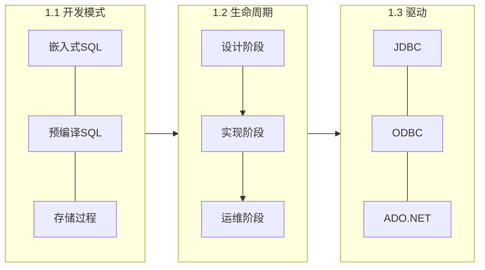

第1章总览数据库应用开发的工程视角，回答三个基础问题：应用以何种模式访问数据库、开发过程遵循何种生命周期、不同 DBMS 提供哪些驱动接口。本章是后续 SQL 高级开发、事务控制与访问接口学习的认知基础。

## 章节内容

| 节 | 主题 | 入口 |
| ---- | ---- | ---- |
| 1.1 | 数据库应用开发模式 | [[1.1 数据库应用开发模式]] |
| 1.2 | 数据库开发生命周期 | [[1.2 数据库开发生命周期]] |
| 1.3 | 主流数据库与开发驱动简介 | [[1.3 主流数据库与开发驱动简介]] |

## 核心概念关系

## 学习目标

- 区分两层 C/S 与三层 B/S 架构的数据库访问特点
- 说出数据库开发生命周期各阶段产出物
- 对比主流关系型与 NoSQL 数据库的开发驱动选型

## 关联章节

- 后续：[[MOC - 第2章]]、[[MOC - 第4章]]
- 关联课程：[[数据库原理]]、[[Oracle 数据库管理]]
