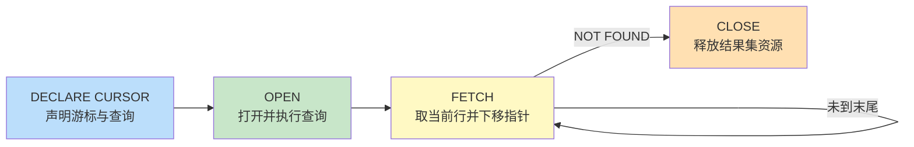

游标（CURSOR）是 DBMS 提供的逐行处理查询结果集的机制，解决“集合操作难以表达按行依赖逻辑”的场景。本节基于 MySQL 8.0 的存储过程内游标，Oracle/SQL Server 差异处单独标注。游标是性能敏感对象，需谨慎使用。

## 游标定义

游标是把查询结果集映射为一个可定位的“指针”，应用可通过 `FETCH` 语句逐行取出当前行进行业务处理。它把集合式的 SQL 与过程式的逐行逻辑衔接起来。

## 游标操作四步



### 存储过程中使用游标（完整示例）

```sql
-- MySQL 8.0
-- 业务：为每个部门生成一条薪资汇总记录
-- 依赖表：department(id, dept_name)、employee(id, name, dept_id, salary)、dept_salary_summary(dept_id, total, cnt, avg_sal, snapshot_at)
DELIMITER $$
CREATE PROCEDURE sp_build_dept_summary()
BEGIN
    DECLARE v_done      INT DEFAULT 0;
    DECLARE v_dept_id   BIGINT;
    DECLARE v_dept_name VARCHAR(64);

    -- 声明游标
    DECLARE cur_dept CURSOR FOR
        SELECT id, dept_name FROM department ORDER BY id;

    -- 声明 NOT FOUND 处理器（FETCH 到末尾时触发）
    DECLARE CONTINUE HANDLER FOR NOT FOUND SET v_done = 1;

    OPEN cur_dept;

    read_loop: LOOP
        FETCH cur_dept INTO v_dept_id, v_dept_name;
        IF v_done = 1 THEN
            LEAVE read_loop;
        END IF;

        -- 对当前部门做聚合写入（集合操作，避免在游标里逐员工循环）
        INSERT INTO dept_salary_summary(dept_id, total, cnt, avg_sal, snapshot_at)
        SELECT v_dept_id, SUM(salary), COUNT(*), AVG(salary), NOW()
        FROM employee
        WHERE dept_id = v_dept_id;
    END LOOP;

    CLOSE cur_dept;
END$$
DELIMITER ;

-- 调用
CALL sp_build_dept_summary();
SELECT * FROM dept_salary_summary;
```

> [!tip] 游标 + 集合操作的混合模式
> 上例按部门游标，但每个部门内部用聚合 SQL 一次性处理。这是推荐模式：游标只承担“按维度迭代”，行级处理仍交给集合 SQL。

## 游标类型

| 类型 | 说明 | MySQL 支持 |
| ---- | ---- | ---- |
| 只进游标（FORWARD_ONLY） | 只能从头到尾顺序 FETCH | 默认即此类型 |
| 滚动游标（SCROLL） | 可 `FETCH PRIOR/FIRST/LAST/RELATIVE` 任意定位 | 不支持（Oracle/SQL Server 支持） |
| 敏感游标（SENSITIVE） | 反映底层提交后的数据变化 | InnoDB 默认半敏感 |
| 不敏感游标（INSENSITIVE） | 使用结果集快照，不受并发修改影响 | 不显式支持 |
| 只读游标（READ ONLY） | 不可通过游标更新基表 | MySQL 游标只读 |
| 可更新游标（UPDATABLE） | `UPDATE ... WHERE CURRENT OF cursor` | 不支持 |

> [!note] MySQL 游标只能在存储过程/函数内使用
> MySQL 不支持顶层 SQL 中的 `DECLARE CURSOR`，且游标总是只读、只进。需要滚动或可更新游标应使用 Oracle 或 SQL Server。

## 游标性能注意事项

1. **行级游标是反模式**：对每一行单独执行 SQL 会导致 N 次往返，应优先重写为单条集合 SQL。
2. **结果集占用**：`OPEN` 后结果集在服务端占用资源，必须显式 `CLOSE`，否则连接结束时才释放。
3. **并发影响**：默认隔离级别下，长时间未关闭的游标会持有锁或导致 MVCC 版本无法回收（见 [[3.2 并发问题与隔离级别]]）。
4. **测量再优化**：用 `EXPLAIN` 分析游标内查询的执行计划（详见第6章性能优化，待扩展）。

### 反模式对比

```sql
-- 反模式：逐员工游标 + 单行 UPDATE，N 次往返
-- 性能远差于下面的集合 UPDATE

-- 推荐：单条集合 UPDATE
UPDATE employee e
JOIN (
    SELECT dept_id, AVG(salary) AS avg_sal
    FROM employee
    GROUP BY dept_id
) t ON e.dept_id = t.dept_id
SET e.salary = e.salary * 1.05
WHERE e.salary < t.avg_sal;
```

## 限制与易错点

- 必须为游标声明 `NOT FOUND` 处理器，否则 `FETCH` 到末尾会抛出错误。
- MySQL 中游标声明必须在 `BEGIN` 块的变量声明之后、处理器声明之前，顺序固定。
- 嵌套游标需用嵌套 `BEGIN ... END` 块隔离作用域，否则 `NOT FOUND` 会互相干扰。
- Oracle 游标语法（`CURSOR ... IS ...`、`FOR rec IN cur LOOP`）更简洁，但不能直接迁移到 MySQL。

## 关联

- 上位：[[MOC - 第2章]]
- 同章：[[2.1 视图、存储过程]]（游标常用于存储过程内）、[[2.2 触发器、函数]]
- 相关：[[3.2 并发问题与隔离级别]]（游标持有时间影响并发）、第6章性能优化（待扩展）
