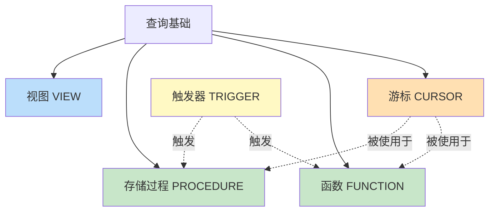

第2章在 [[数据库原理]] 的 SQL 基础之上，进入数据库端的编程：把 SQL 从一次性查询升级为可复用、可封装、可触发的过程对象。本章解决“业务逻辑放在应用层还是数据库端”这一设计抉择。

## 章节内容

| 节 | 主题 | 入口 |
| ---- | ---- | ---- |
| 2.1 | 视图、存储过程 | [[2.1 视图、存储过程]] |
| 2.2 | 触发器、函数 | [[2.2 触发器、函数]] |
| 2.3 | 游标使用基础 | [[2.3 游标使用基础]] |

## 对象关系

## 选型决策

| 需求 | 推荐对象 | 入口 |
| ---- | ---- | ---- |
| 简化复杂查询、控制列可见性 | 视图 | [[2.1 视图、存储过程]] |
| 封装多步业务、减少往返 | 存储过程 | [[2.1 视图、存储过程]] |
| 审计、级联、自动校验 | 触发器 | [[2.2 触发器、函数]] |
| 在 SQL 中可调用的计算 | 函数 | [[2.2 触发器、函数]] |
| 逐行处理结果集 | 游标 | [[2.3 游标使用基础]] |

## 学习目标

- 能编写视图并理解更新限制与 `WITH CHECK OPTION`
- 能用存储过程封装业务、用触发器实现审计与级联
- 能区分函数与存储过程的调用语义
- 能在存储过程中正确使用游标并评估性能

## 关联章节

- 先修：[[MOC - 第1章]]、[[数据库原理]] SQL 基础
- 后续：[[MOC - 第3章]]（存储过程常需事务）、[[MOC - 第4章]]（应用端调用过程）
