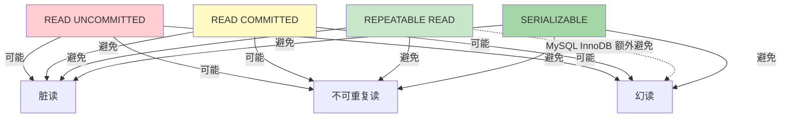

并发事务如果不加隔离，会产生三类典型异常现象。隔离级别是 DBMS 提供的“异常屏蔽开关”，级别越高屏蔽越彻底，但并发度越低。本节从具体并发场景出发，建立现象—级别—实现的因果链。本节以 MySQL 8.0 InnoDB 为例，差异处单独标注。

## 并发问题

### 脏读（Dirty Read）

> [!def] 定义
> 事务 T2 读到了事务 T1 **未提交**的修改，若 T1 随后回滚，T2 读到的数据就是“从未存在过”的。

```sql
-- 场景（READ UNCOMMITTED 下复现）
-- 事务 T1
START TRANSACTION;
UPDATE account SET balance = balance - 100 WHERE id = 1;  -- 未提交
-- 事务 T2 在此期间
SELECT balance FROM account WHERE id = 1;  -- 读到 balance-100 的中间值
-- T1 回滚
ROLLBACK;
-- T2 基于错误余额做了业务决策
```

### 不可重复读（Non-Repeatable Read）

> [!def] 定义
> 事务 T2 内**同一行**两次读取结果不同，因为期间事务 T1 提交了对该行的修改。

```sql
-- 事务 T2
START TRANSACTION;
SELECT balance FROM account WHERE id = 1;  -- 第一次读到 1000
-- 事务 T1 提交了 UPDATE account SET balance = 900 WHERE id = 1
SELECT balance FROM account WHERE id = 1;  -- 第二次读到 900
COMMIT;
```

### 幻读（Phantom Read）

> [!def] 定义
> 事务 T2 内**同一查询**两次执行结果集的行数不同，因为期间事务 T1 提交了 `INSERT`/`DELETE`，使符合查询条件的行集合发生变化。

```sql
-- 事务 T2
START TRANSACTION;
SELECT COUNT(*) FROM orders WHERE customer_id = 1;  -- 5 行
-- 事务 T1 提交了 INSERT INTO orders(...) VALUES (..., 1, ...)
SELECT COUNT(*) FROM orders WHERE customer_id = 1;  -- 6 行（幻影行出现）
COMMIT;
```

> [!note] 不可重复读 vs 幻读
> - 不可重复读关注**已存在行被修改**（UPDATE）。
> - 幻读关注**结果集行数变化**（INSERT/DELETE）。
> 部分文献把幻读视为不可重复读的特例，但 SQL 标准与隔离级别表区分对待。

## SQL 隔离级别

SQL-92 标准定义四个隔离级别，由低到高依次屏蔽更多异常：

| 隔离级别 | 脏读 | 不可重复读 | 幻读 |
| ---- | ---- | ---- | ---- |
| READ UNCOMMITTED（读未提交） | 可能 | 可能 | 可能 |
| READ COMMITTED（读已提交） | 避免 | 可能 | 可能 |
| REPEATABLE READ（可重复读） | 避免 | 避免 | 可能 |
| SERIALIZABLE（串行化） | 避免 | 避免 | 避免 |

### 级别与异常对应关系图



## MySQL 默认隔离级别

> [!important] MySQL InnoDB 默认 REPEATABLE READ
> MySQL InnoDB 默认隔离级别是 **REPEATABLE READ**，并通过 **Next-Key Lock**（行锁 + 间隙锁）在 RR 级别下额外避免了幻读。这与 SQL 标准的 RR（允许幻读）不同。

> [!warning] Oracle/PostgreSQL 默认 READ COMMITTED
> - Oracle 默认 READ COMMITTED。
> - PostgreSQL 默认 READ COMMITTED，但其 RR 通过可串行化快照（SSI）实现。
> - 迁移时不能假设其他 DBMS 与 MySQL 默认级别一致。

## 设置隔离级别

```sql
-- MySQL 8.0
-- 全局（影响新连接）
SET GLOBAL transaction_isolation = 'READ-COMMITTED';
-- 会话级（影响当前连接）
SET SESSION transaction_isolation = 'REPEATABLE-READ';
-- 查看当前级别
SELECT @@transaction_isolation;
```

## 隔离级别的实现机制

| 级别 | InnoDB 实现 | 并发影响 |
| ---- | ---- | ---- |
| READ UNCOMMITTED | 允许读未提交版本 | 最高并发，几乎不用 |
| READ COMMITTED | 每条 SQL 读取最新已提交快照（语句级 MVCC） | 中高并发 |
| REPEATABLE READ | 事务首个读建立快照，事务内一致（事务级 MVCC） + Next-Key Lock | 中等并发 |
| SERIALIZABLE | 所有读加共享锁，退化为串行 | 最低并发 |

详见 [[3.3 锁机制基础]]。

## 限制与易错点

- 隔离级别不能解决业务逻辑错误，只解决并发可见性。
- 提高 SERIALIZABLE 会显著降低并发吞吐，仅在强一致要求（如金融对账）下使用。
- MySQL 的 RC 级别下 `UPDATE ... WHERE` 仍使用行锁，但范围更新在 RC 下不间隙锁，可能导致范围更新的语义差异。
- 在 JDBC 中通过 `conn.setTransactionIsolation(level)` 设置级别（见 [[4.1 ODBC、JDBC原理]]）。

## 关联

- 上位：[[MOC - 第3章]]
- 同章：[[3.1 事务ACID特性]]、[[3.3 锁机制基础]]
- 相关：[[4.1 ODBC、JDBC原理]]（隔离级别 API）、[[数据库原理]] 并发控制理论
