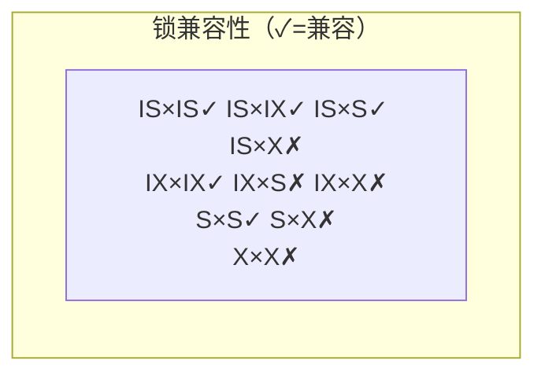
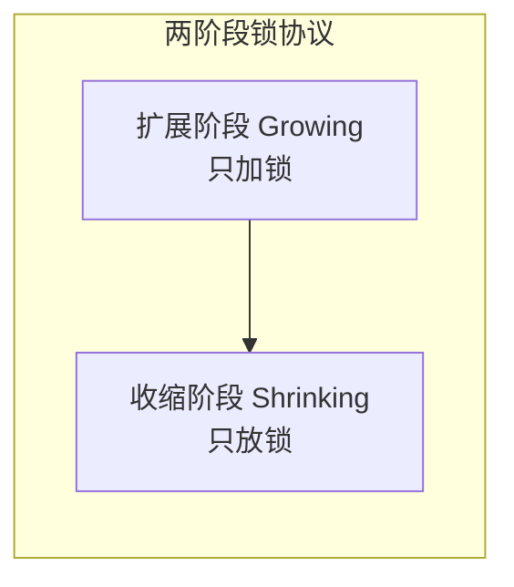

锁是 DBMS 实现事务隔离的具体机制。隔离级别规定了“应屏蔽哪些异常”，锁则规定了“如何屏蔽”。本节梳理锁类型、粒度、意向锁、封锁协议与死锁，并解释两阶段锁协议。本节以 MySQL 8.0 InnoDB 为例。

## 锁类型

### 共享锁与排他锁

| 锁 | 符号 | 加锁方式 | 兼容性 |
| ---- | ---- | ---- | ---- |
| 共享锁（S 锁 / 读锁） | S | `SELECT ... LOCK IN SHARE MODE`（MySQL 5.7）/ `FOR SHARE`（8.0） | 与 S 兼容，与 X 互斥 |
| 排他锁（X 锁 / 写锁） | X | `SELECT ... FOR UPDATE`，或 DML 自动加 | 与任何锁互斥 |

```sql
-- MySQL 8.0 InnoDB
-- 共享锁：其他事务可读不可写
START TRANSACTION;
SELECT * FROM account WHERE id = 1 FOR SHARE;
-- 其他事务的 SELECT ... FOR UPDATE 会被阻塞
COMMIT;

-- 排他锁：其他事务读写均阻塞
START TRANSACTION;
SELECT * FROM account WHERE id = 1 FOR UPDATE;
COMMIT;
```

## 锁粒度

| 粒度 | 影响范围 | MySQL 支持 | 并发度 |
| ---- | ---- | ---- | ---- |
| 表级锁 | 整张表 | MyISAM 默认；InnoDB 显式 `LOCK TABLES` | 低 |
| 行级锁 | 单行或索引项 | InnoDB 默认 | 高 |
| 页级锁 | 数据页（多行） | BDB 引擎（已废弃） | 中 |

> [!note] InnoDB 行锁基于索引
> InnoDB 的“行锁”实际上是索引项锁。若 `UPDATE/DELETE` 的 `WHERE` 未命中索引，InnoDB 会退化为对全部扫描行加锁，相当于表锁。**高性能写必须确保 WHERE 走索引**。

## 意向锁

意向锁是表级锁，用于快速判断“表中是否有行级锁”，避免逐行检查。

| 锁 | 含义 |
| ---- | ---- |
| IS（意向共享） | 事务打算对表中某些行加 S 锁 |
| IX（意向排他） | 事务打算对表中某些行加 X 锁 |

加行级 S 锁前必须先加表级 IS；加行级 X 锁前必须先加表级 IX。

### 锁兼容性矩阵

| 请求\持有 | IS | IX | S | X |
| ---- | ---- | ---- | ---- | ---- |
| IS | ✓ | ✓ | ✓ | ✗ |
| IX | ✓ | ✓ | ✗ | ✗ |
| S | ✓ | ✗ | ✓ | ✗ |
| X | ✗ | ✗ | ✗ | ✗ |



## 封锁协议

| 协议 | 规则 | 能解决 |
| ---- | ---- | ---- |
| 一级封锁协议 | 写前加 X 锁，事务结束释放 | 防止丢失修改 |
| 二级封锁协议 | 一级 + 读前加 S 锁，读后立即释放 | 防止脏读 |
| 三级封锁协议 | 一级 + 读前加 S 锁，事务结束释放 | 防止不可重复读 |

> [!note] 协议与隔离级别的对应
> - 一级 ≈ READ UNCOMMITTED 的写策略
> - 二级 ≈ READ COMMITTED
> - 三级 ≈ REPEATABLE READ
> InnoDB 在 RR 下通过 Next-Key Lock（行锁 + 间隙锁）额外解决幻读，超出三级协议。

## 死锁

### 产生条件（四个必须同时满足）

1. **互斥**：资源同一时刻只能被一个事务占有。
2. **占有并等待**：事务持有资源的同时等待其他资源。
3. **不剥夺**：资源不能被强制抢占，只能由持有者主动释放。
4. **循环等待**：存在事务的循环等待链 $T_1 \to T_2 \to \dots \to T_1$。

### 死链示意


```sql
-- 复现死锁的最小场景（两个并发连接）
-- 连接 T1
START TRANSACTION;
UPDATE account SET balance = balance - 10 WHERE id = 1;  -- 持 id=1 的 X 锁
-- 连接 T2 同时执行
START TRANSACTION;
UPDATE account SET balance = balance + 10 WHERE id = 2;  -- 持 id=2 的 X 锁
-- 连接 T1 继续
UPDATE account SET balance = balance + 10 WHERE id = 2;  -- 等待 T2 释放 id=2
-- 连接 T2 继续
UPDATE account SET balance = balance - 10 WHERE id = 1;  -- 等待 T1 释放 id=1 → 死锁
```

### 死锁检测与预防

| 策略 | 机制 | DBMS 行为 |
| ---- | ---- | ---- |
| 死锁检测 | 等待图（Wait-For Graph）找环 | InnoDB 默认开启，发现环后回滚代价较小的事务 |
| 超时 | `innodb_lock_wait_timeout` | 等待超过阈值放弃，默认 50 秒 |
| 一次性加锁 | 事务开始时申请全部锁 | 应用层约定，避免循环等待 |
| 固定加锁顺序 | 所有事务按相同顺序加锁 | 上例中 T1/T2 都先锁 id 小的行即可避免 |

> [!tip] 工程实践
> - 调整 `innodb_deadlock_detect` 在高并发热点场景需评估开销。
> - 应用捕获 `1213`（死锁）/`1205`（锁等待超时）错误码后**重试**事务，而非直接报错。

## 两阶段锁协议（2PL）

> [!def] 定义
> 两阶段锁协议（Two-Phase Locking）要求每个事务分为两个阶段：
> - **扩展阶段**：只加锁，不放锁。
> - **收缩阶段**：只放锁，不加锁。



> [!important] 2PL 保证可串行化
> 严格 2PL（Strict 2PL，X 锁持有到事务结束）保证可串行化且避免级联回滚。InnoDB 的实现接近严格 2PL + MVCC。

## 限制与易错点

- 行锁基于索引，无索引的更新会退化为表锁。
- 间隙锁（Gap Lock）在 RR 下用于防幻读，但会阻塞范围内的 `INSERT`，高并发写入热点需评估。
- 不同 DBMS 锁粒度与命名不同，Oracle 用 ITL 槽 + 行锁字节，不能照搬 MySQL 概念。
- `SELECT ... FOR UPDATE` 在 RC 下不加间隙锁，在 RR 下加 Next-Key Lock。

## 关联

- 上位：[[MOC - 第3章]]
- 同章：[[3.1 事务ACID特性]]、[[3.2 并发问题与隔离级别]]
- 相关：[[2.1 视图、存储过程]]（存储过程中 FOR UPDATE）、[[数据库原理]] 并发控制、[[Oracle 数据库管理]] 锁视图
