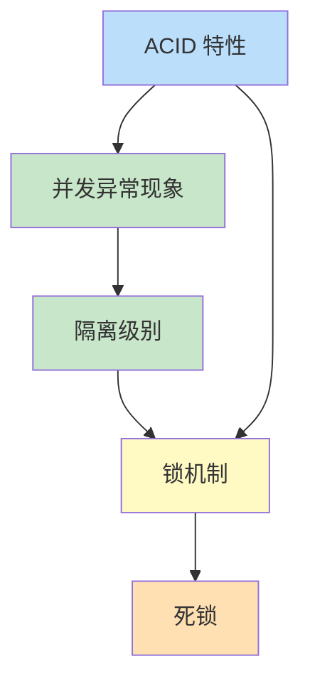

第3章解决多用户并发访问数据库时的正确性问题。事务是数据库保证一致性的基本单元，ACID 是其性质目标，隔离级别与锁机制是工程实现手段。本章不只罗列定义，而是从并发异常现象出发，建立“现象—隔离级别—锁”的因果链。

## 章节内容

| 节 | 主题 | 入口 |
| ---- | ---- | ---- |
| 3.1 | 事务 ACID 特性 | [[3.1 事务ACID特性]] |
| 3.2 | 并发问题与隔离级别 | [[3.2 并发问题与隔离级别]] |
| 3.3 | 锁机制基础 | [[3.3 锁机制基础]] |

## 概念依赖

## 学习目标

- 用具体并发场景解释 ACID 的工程含义，而非背诵定义
- 区分脏读、不可重复读、幻读三类异常并匹配隔离级别
- 理解锁类型、粒度与意向锁，能分析死锁成因与预防

## 关联章节

- 先修：[[MOC - 第2章]]（存储过程中的事务边界）
- 后续：[[MOC - 第4章]]（JDBC 事务 API）
- 关联：[[数据库原理]] 事务理论、[[Oracle 数据库管理]] 锁与 undo
