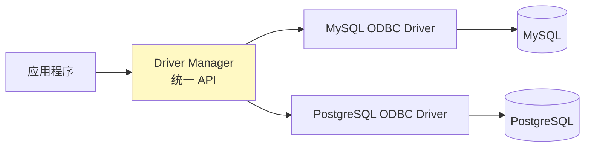
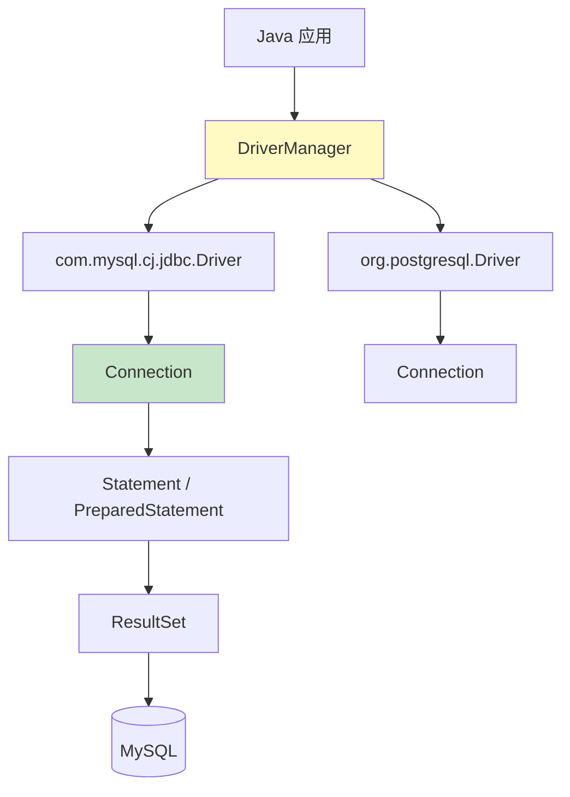

ODBC 与 JDBC 是应用访问数据库的两类标准接口：ODBC 面向 C/C++ 与跨语言，JDBC 面向 Java。二者都采用“Driver Manager + 厂商驱动”的分层架构，使应用代码与具体 DBMS 解耦。本节以 JDBC 为重点，ODBC 给出对应关系。本节基于 JDK 17 + MySQL Connector/J 8.x。

## ODBC 架构



### ODBC 核心 API

| API | 作用 |
| ---- | ---- |
| `SQLAllocHandle` | 分配环境/连接/语句句柄 |
| `SQLConnect` | 通过 DSN 建立连接 |
| `SQLExecDirect` | 直接执行 SQL 字符串 |
| `SQLPrepare` / `SQLBindParameter` | 预编译并绑定参数 |
| `SQLFetch` | 取结果集下一行 |
| `SQLDisconnect` | 断开连接 |

> [!note] DSN（Data Source Name）
> ODBC 通过 DSN 把“驱动 + 连接参数”配置在系统层，应用只引用 DSN 名称。Windows 在“ODBC 数据源管理器”配置，Linux 通过 `~/.odbc.ini` 与 unixODBC 配置。

## JDBC 架构



### JDBC 核心 API

| API | 作用 |
| ---- | ---- |
| `Class.forName("com.mysql.cj.jdbc.Driver")` | 加载驱动类（JDBC 4.0+ SPI 可省略） |
| `DriverManager.getConnection(url, user, pwd)` | 建立 Connection |
| `conn.createStatement()` | 创建 Statement（拼接 SQL） |
| `conn.prepareStatement(sql)` | 创建 PreparedStatement（参数化，见 [[4.3 参数化查询]]） |
| `stmt.executeQuery(sql)` / `executeUpdate(sql)` | 执行查询/更新 |
| `rs.next()` / `rs.getXxx(col)` | 遍历结果集 |
| `conn.setAutoCommit(false)` / `commit()` / `rollback()` | 事务控制（见 [[3.1 事务ACID特性]]） |

## JDBC 操作六步骤

1. **加载驱动**：`Class.forName`（新版本可省）。
2. **建立连接**：`DriverManager.getConnection`。
3. **创建语句对象**：`Statement` 或 `PreparedStatement`。
4. **执行 SQL**：`executeQuery` / `executeUpdate` / `execute`。
5. **处理结果**：遍历 `ResultSet` 或读取影响行数。
6. **释放资源**：按 `ResultSet → Statement → Connection` 顺序关闭（推荐 try-with-resources）。

## 完整 JDBC 查询示例

```java
// JDK 17 + MySQL Connector/J 8.x
// pom.xml: mysql-connector-j 8.x
// 前置：MySQL 8.0 已启动，库 demo 下存在表 product(id BIGINT, name VARCHAR(128), price NUMERIC)
import java.sql.*;

public class JdbcQueryDemo {
    public static void main(String[] args) {
        String url = "jdbc:mysql://127.0.0.1:3306/demo?useSSL=false&serverTimezone=UTC&useServerPrepStmts=true";

        // 步骤 6：try-with-resources 自动关闭
        try (Connection conn = DriverManager.getConnection(url, "demo_user", "demo_pwd");
             // 步骤 3：使用 PreparedStatement（见 4.3）
             PreparedStatement ps = conn.prepareStatement(
                 "SELECT id, name, price FROM product WHERE price <= ? ORDER BY price LIMIT 10")) {

            // 绑定参数
            ps.setBigDecimal(1, new java.math.BigDecimal("100.00"));

            // 步骤 4：执行查询；步骤 5：处理结果
            try (ResultSet rs = ps.executeQuery()) {
                while (rs.next()) {
                    System.out.printf("id=%d name=%s price=%s%n",
                        rs.getLong("id"),
                        rs.getString("name"),
                        rs.getBigDecimal("price"));
                }
            }
        } catch (SQLException e) {
            // 生产环境应使用日志框架记录 SQLState 与错误码
            System.err.printf("SQLState=%s ErrorCode=%d Msg=%s%n",
                e.getSQLState(), e.getErrorCode(), e.getMessage());
        }
    }
}
```

> [!warning] 真实生产代码的补充
> - 上例用 `DriverManager.getConnection` 直连，仅用于教学。生产必须使用连接池（[[4.2 数据库连接池]]）。
> - `demo_user/demo_pwd` 为虚构凭据，真实环境从配置中心或密钥管理获取。
> - `useServerPrepStmts=true` 启用服务端预编译，配合 [[4.3 参数化查询]] 的执行计划复用。

## Statement vs PreparedStatement

| 维度 | Statement | PreparedStatement |
| ---- | ---- | ---- |
| SQL 构造 | 字符串拼接 | 占位符 `?` + 参数绑定 |
| SQL 注入 | 易受攻击 | 防注入 |
| 执行计划 | 每次重新编译 | 可复用 |
| 适用 | DDL、一次性语句 | 带用户输入的查询 |

详见 [[4.3 参数化查询]]。

## 调用存储过程

```java
// 调用 2.1 中定义的 transfer 存储过程
try (CallableStatement cs = conn.prepareCall("{call transfer(?,?,?,?)}")) {
    cs.setLong(1, 1L);                 // IN p_from
    cs.setLong(2, 2L);                 // IN p_to
    cs.setBigDecimal(3, new java.math.BigDecimal("100.00"));  // IN p_amount
    cs.registerOutParameter(4, Types.VARCHAR);  // OUT p_result
    cs.execute();
    String result = cs.getString(4);   // 取得 OUT 参数
}
```

## 限制与易错点

- `ResultSet` 在默认 `TYPE_FORWARD_ONLY` 下只能向前遍历，且 `Statement` 关闭后 `ResultSet` 失效。
- 资源必须按顺序关闭，否则连接泄漏；推荐 try-with-resources。
- 不同 DBMS 的 JDBC URL 格式与参数不同，迁移需更新连接字符串。
- JDBC 的 `Date`/`Time`/`Timestamp` 与 Java 8 `java.time` 不一致，新驱动支持 `getObject(col, LocalDateTime.class)`。

## 关联

- 上位：[[MOC - 第4章]]
- 同章：[[4.2 数据库连接池]]、[[4.3 参数化查询]]
- 相关：[[1.3 主流数据库与开发驱动简介]]、[[2.1 视图、存储过程]]（CallableStatement）、[[3.1 事务ACID特性]]（JDBC 事务 API）
