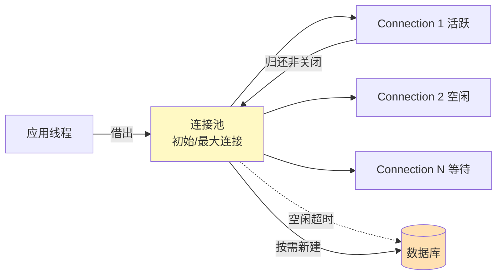

每次 `DriverManager.getConnection` 都会建立 TCP 连接、认证、分配会话资源，开销显著（典型 10–50ms）。连接池通过预先创建并复用连接消除这一开销，是生产环境数据访问层的标配。本节基于 Java 生态，原理同样适用于其他语言。

## 连接池定义

连接池（Connection Pool）是应用进程内维护的一组预先创建的数据库连接，由连接池管理器统一分配、回收与维护。应用“借出”连接使用后“归还”而非关闭，连接在池内长期存活并被多次复用。

## 工作原理



> [!note] 获取—使用—归还
> 1. 应用从池中 `borrow` 一个 `Connection`。
> 2. 执行 SQL 与事务。
> 3. 调用 `close()` 把连接**归还**给池（而非物理关闭），池将其标记为空闲。
> 4. 池按配置定期校验、保活或回收连接。

## 优点

1. **减少连接创建开销**：复用现有连接，避免反复 TCP 与认证。
2. **控制连接数量**：上限防止数据库被压垮。
3. **资源复用**：连接跨请求复用，提升吞吐。
4. **统一管理**：超时、保活、监控集中处理。

## 常见连接池

| 连接池 | 特点 | 适用 |
| ---- | ---- | ---- |
| HikariCP | 性能最高，代码精简 | Spring Boot 默认，新项目首选 |
| Druid | 阿里开源，监控完善，SQL 防火墙 | 国内 Java 项目 |
| DBCP | Apache Commons，老牌稳定 | 遗留项目 |
| C3P0 | 老牌，性能一般 | 遗留项目，不推荐新项目 |

> [!tip] 选型建议
> 新项目优先 HikariCP；需要监控与 SQL 审计选 Druid。三者接口都遵循 `javax.sql.DataSource`，切换成本低。

## 关键参数

| 参数 | 说明 | 调优要点 |
| ---- | ---- | ---- |
| `initialSize` / `minimumIdle` | 初始/最小空闲连接 | 避免冷启动慢，但不要过大占资源 |
| `maximumPoolSize` | 最大连接数 | 受 DB 端 `max_connections` 限制；典型经验值 `(核心数×2 + 磁盘数)` 起步，压测调优 |
| `maxLifetime` | 连接最长存活时间 | 必须小于 DB 端 `wait_timeout`（MySQL 默认 8h），避免被 DB 单方面关闭 |
| `connectionTimeout` | 借出等待超时 | 超时抛异常而非无限等待，防止线程阻塞 |
| `idleTimeout` | 空闲连接回收时间 | 介于 `maxLifetime` 与业务峰值间隔之间 |
| `validationQuery` / `keepalive` | 连接保活与校验 | MySQL 常用 `SELECT 1`，避免使用已失效连接 |

> [!warning] maximumPoolSize 不是越大越好
> 连接数超过数据库或 CPU 承受能力后，上下文切换与锁竞争反而降低吞吐。应通过压测确定拐点，常见最优值在 10–30 区间，而非数百。

## Java 代码示例（HikariCP）

```java
// JDK 17 + HikariCP 5.x
// pom.xml: com.zaxxer:HikariCP, mysql-connector-j
import com.zaxxer.hikari.HikariConfig;
import com.zaxxer.hikari.HikariDataSource;
import java.sql.*;

public class PoolDemo {
    public static void main(String[] args) {
        HikariConfig cfg = new HikariConfig();
        cfg.setJdbcUrl("jdbc:mysql://127.0.0.1:3306/demo?useSSL=false&serverTimezone=UTC");
        cfg.setUsername("demo_user");
        cfg.setPassword("demo_pwd");
        cfg.setMaximumPoolSize(20);
        cfg.setMinimumIdle(5);
        cfg.setMaxLifetime(1800000L);   // 30 分钟，小于 MySQL wait_timeout
        cfg.setConnectionTimeout(30000L); // 30 秒
        cfg.setConnectionTestQuery("SELECT 1");

        // 池在进程内单例，整个应用共享
        try (HikariDataSource ds = new HikariDataSource(cfg)) {
            // 借出—使用—归还（try-with-resources 自动归还）
            try (Connection conn = ds.getConnection();
                 PreparedStatement ps = conn.prepareStatement(
                     "SELECT id, name FROM product WHERE id = ?")) {
                ps.setLong(1, 1L);
                try (ResultSet rs = ps.executeQuery()) {
                    while (rs.next()) {
                        System.out.printf("id=%d name=%s%n", rs.getLong("id"), rs.getString("name"));
                    }
                }
            }
        }
    }
}
```

> [!note] `close()` 的语义变化
> 使用连接池后，`Connection.close()` 不再关闭物理连接，而是把连接归还给池。应用代码无需感知池的存在——这是连接池设计的核心价值。

## 限制与易错点

- 连接归还前必须确保事务已 `commit` 或 `rollback`，否则下个借用方会继承未提交事务（脏数据）。
- `Statement`/`ResultSet` 必须在 `Connection` 归还前关闭，否则资源泄漏。
- 池配置不当（如 `maxLifetime > DB wait_timeout`）会使用已断开连接，导致间歇性 `CommunicationsException`。
- 分布式部署下每个应用实例都有自己的池，总连接数 = 实例数 × 池大小，需与 DBA 协调。

## 关联

- 上位：[[MOC - 第4章]]
- 同章：[[4.1 ODBC、JDBC原理]]（池包装的 Connection）、[[4.3 参数化查询]]（池内连接执行预编译）
- 相关：[[3.1 事务ACID特性]]（事务边界与归还）、[[3.2 并发问题与隔离级别]]（连接级别设置隔离级别）
