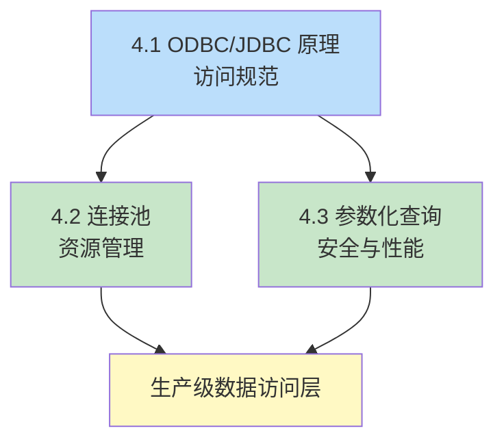

第4章从应用端视角解决“程序如何安全高效地访问数据库”。本章是数据库知识与后端工程实践的接合点：ODBC/JDBC 定义访问规范，连接池解决资源开销，参数化查询解决安全与性能。

## 章节内容

| 节 | 主题 | 入口 |
| ---- | ---- | ---- |
| 4.1 | ODBC、JDBC 原理 | [[4.1 ODBC、JDBC原理]] |
| 4.2 | 数据库连接池 | [[4.2 数据库连接池]] |
| 4.3 | 参数化查询 | [[4.3 参数化查询]] |

## 三节关系

## 学习目标

- 用六步描述 JDBC 操作流程，写出可运行的查询代码
- 解释连接池减少开销的机制，配置常见池的关键参数
- 对比 `Statement` 与 `PreparedStatement`，说明参数化查询防注入的原理

## 关联章节

- 先修：[[MOC - 第1章]]（驱动架构）、[[MOC - 第3章]]（事务 API）
- 后续：第5章 ORM（待扩展）
- 关联：[[2.1 视图、存储过程]]（CallableStatement）
