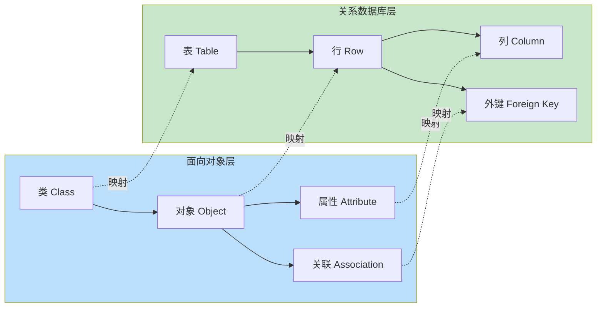

ORM（Object-Relational Mapping，对象关系映射）解决面向对象程序与关系数据库之间的“阻抗失配”：程序中的对象有继承、组合、多态，而关系数据库只有表、行、外键。ORM 在两者之间建立自动映射，让开发者用对象操作代替手写 SQL，从而专注业务逻辑。本节阐明 ORM 的核心思想、优劣与适用边界。

## ORM 定义

> [!def] 定义
> ORM 是一种在面向对象程序与关系数据库之间建立映射的技术：把数据库表映射为类，把记录映射为对象，把列映射为属性，把外键映射为对象关联。程序操作对象，ORM 负责生成并执行相应的 SQL。

## ORM 核心思想

ORM 的本质是“双层映射”：程序只与对象交互，DBMS 只与 SQL 交互，ORM 在中间完成双向翻译。



## ORM 优点

- **消除 SQL 硬编码**：SQL 不再散落在业务代码中，由框架根据映射生成，降低维护成本。
- **面向对象操作数据库**：`user.save()` 取代 `INSERT INTO user ...`，业务代码更贴近领域模型。
- **提高开发效率**：标准 CRUD 自动完成，开发者只关注非通用逻辑。
- **数据库可移植性**：更换 DBMS 时只需调整方言（Dialect），业务代码不变。

> [!example] 同一业务两种写法
> ```java
> // 原生 JDBC：手动拼接、手动映射结果集
> String sql = "INSERT INTO user(name, age) VALUES (?, ?)";
> try (PreparedStatement ps = conn.prepareStatement(sql, Statement.RETURN_GENERATED_KEYS)) {
>     ps.setString(1, user.getName());
>     ps.setInt(2, user.getAge());
>     ps.executeUpdate();
>     try (ResultSet rs = ps.getGeneratedKeys()) {
>         if (rs.next()) user.setId(rs.getLong(1));
>     }
> }
>
> // JPA ORM：一行即可
> entityManager.persist(user);
> ```

## ORM 缺点

- **性能开销**：对象-关系转换、会话缓存、脏检查等均有额外开销，批量操作尤其明显。
- **复杂查询困难**：多表统计、窗口函数、递归 CTE 用对象表达式表达冗长且不直观，常需退回原生 SQL。
- **学习曲线**：映射注解、级联策略、抓取策略、缓存、事务边界等概念较多，配置不当易产生性能或正确性问题。

> [!warning] ORM 的“抽象泄漏”
> ORM 把 SQL 封装在对象之后，但执行计划、索引、N+1 查询等底层细节仍会“泄漏”到上层。不理解 SQL 与数据库原理就使用 ORM，往往写出低效代码。详见 [[6.2 SQL语句调优]]、[[6.3 慢查询分析基础]]。

## ORM vs 原生 SQL 对比

| 维度 | 原生 SQL / JDBC | ORM |
| ---- | ---- | ---- |
| 开发效率 | 低（手写 SQL 与映射） | 高（CRUD 自动） |
| 性能可控性 | 高（直接优化 SQL） | 中（需理解框架行为） |
| 复杂查询 | 灵活、直观 | 表达冗长，常退回原生 SQL |
| 可移植性 | 差（绑定方言） | 好（切换 Dialect） |
| 学习成本 | SQL + JDBC API | ORM 框架本身 + SQL |
| 适用场景 | 报表、统计、高性能场景 | 业务 CRUD、领域模型清晰的应用 |

## 限制与易错点

- ORM 不是“银弹”：报表、ETL、超大规模批量写入等场景仍应使用原生 SQL 或专用工具。
- 全自动 ORM（如 Hibernate）生成的 SQL 不一定最优，必须配合执行计划检查（见 [[6.2 SQL语句调优]]）。
- 过度使用级联与延迟加载会导致 N+1 问题：循环访问关联对象时，每条记录触发一次额外查询。

## 关联

- 上位：[[MOC - 第5章]]
- 同章：[[5.2 对象与关系映射]]（映射的具体规则）、[[5.3 常见持久层框架简介]]（具体框架实现）
- 先修：[[4.1 ODBC、JDBC原理]]（ORM 底层仍是 JDBC）、[[4.3 参数化查询]]（ORM 自动参数化）
