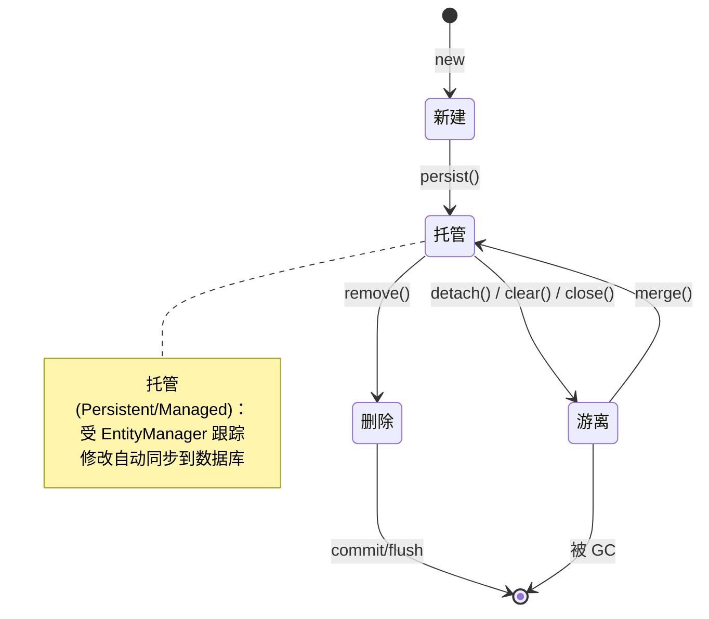

对象与关系映射（O/R Mapping）规定 ORM 如何把表结构翻译为对象模型。本节给出从表到类的基本映射规则、四种关联关系的注解写法、加载策略与级联策略，以及 JPA 实体生命周期的四种状态。掌握这些规则才能正确建模并避免 N+1、孤儿对象等典型问题。

## 基本映射规则

| 关系模型 | 对象模型 | JPA 注解 |
| ---- | ---- | ---- |
| 表 Table | 类 Class | `@Entity` + `@Table` |
| 列 Column | 属性 Attribute | `@Column` |
| 主键 Primary Key | 标识属性 ID | `@Id`（常配 `@GeneratedValue`） |
| 记录 Row | 对象 Instance | `new` 出来的实体 |
| 外键 Foreign Key | 对象引用 Association | `@ManyToOne` 等 |

## 关联关系映射

四种基数对应不同的关联注解，方向与外键所在表决定哪一方为“关系拥有方”（用 `mappedBy` 标注另一方）。

```mermaid
flowchart LR
    subgraph 关联基数
        O2O[一对一<br/>@OneToOne]
        O2M[一对多<br/>@OneToMany]
        M2O[多对一<br/>@ManyToOne]
        M2M[多对多<br/>@ManyToMany]
    end
    O2M -.双向.-> M2O
    O2M -->|外键在| M2O
    M2M -->|中间表| M2M

    style O2O fill:#bbdefb
    style O2M fill:#c8e6c9
    style M2O fill:#c8e6c9
    style M2M fill:#c8e6c9
```

> [!note] 关系拥有方与 mappedBy
> 双向关联中，外键所在的一方是“关系拥有方”，负责维护外键；另一方用 `mappedBy` 指向拥有方的属性名，只读不维护。在“一”对“多”中，外键总在“多”的一方，故 `@ManyToOne` 侧是拥有方，`@OneToMany` 侧用 `mappedBy`。

### JPA 实体示例

```java
// 订单（一）与订单项（多）：外键 order_id 在 OrderItem 表
@Entity
@Table(name = "orders")
public class Order {
    @Id
    @GeneratedValue(strategy = GenerationType.IDENTITY)
    private Long id;

    @OneToMany(mappedBy = "order", cascade = CascadeType.ALL, fetch = FetchType.LAZY)
    private List<OrderItem> items = new ArrayList<>();

    // 双向关联维护：同时设置两端
    public void addItem(OrderItem item) {
        items.add(item);
        item.setOrder(this);
    }
}

@Entity
@Table(name = "order_item")
public class OrderItem {
    @Id
    @GeneratedValue(strategy = GenerationType.IDENTITY)
    private Long id;

    @ManyToOne(fetch = FetchType.LAZY)
    @JoinColumn(name = "order_id")  // 外键列
    private Order order;

    @ManyToOne
    @JoinColumn(name = "product_id")
    private Product product;
}

// 多对多：用户与角色，中间表 user_role
@Entity
public class User {
    @ManyToMany
    @JoinTable(
        name = "user_role",
        joinColumns = @JoinColumn(name = "user_id"),
        inverseJoinColumns = @JoinColumn(name = "role_id")
    )
    private Set<Role> roles = new HashSet<>();
}
```

## 加载策略

| 策略 | 行为 | 适用 |
| ---- | ---- | ---- |
| 急切加载 Eager (`FetchType.EAGER`) | 查询主实体时立即查出关联 | 关联数据小且必定使用 |
| 延迟加载 Lazy (`FetchType.LAZY`) | 访问关联属性时才发 SQL | 关联数据大或可能不使用 |

> [!danger] N+1 查询问题
> 延迟加载下，遍历 N 条主实体并访问其关联属性，会触发 N 次额外查询（共 N+1 条 SQL）。解决方法：用 `JOIN FETCH` 一次查出，或在 MyBatis 中用 `<collection>` 嵌套结果映射。
> ```java
> // 反模式：N+1
> List<Order> orders = em.createQuery("SELECT o FROM Order o", Order.class).getResultList();
> for (Order o : orders) {
>     o.getItems().size();  // 每次都触发一条 SELECT * FROM order_item WHERE order_id=?
> }
>
> // 正确：JOIN FETCH 一次查完
> em.createQuery("SELECT DISTINCT o FROM Order o LEFT JOIN FETCH o.items", Order.class)
>   .getResultList();
> ```

## 级联操作

`CascadeType` 决定对主实体的操作是否传播到关联实体：

| 类型 | 传播的操作 |
| ---- | ---- |
| `PERSIST` | `persist` 级联保存 |
| `MERGE` | `merge` 级联合并游离对象 |
| `REMOVE` | `remove` 级联删除 |
| `REFRESH` | `refresh` 级联刷新 |
| `DETACH` | `detach` 级联脱离 |
| `ALL` | 以上全部 |

> [!warning] 级联删除的风险
> `CascadeType.REMOVE` 会递归删除关联记录，误用可能造成大面积数据丢失。删除关系本身（解除关联）应使用 `orphanRemoval` 或手动清空集合，而非级联删除实体。

## 实体生命周期

JPA 实体有四种状态，`EntityManager` 的方法驱动状态转换。



| 状态 | 说明 | 典型产生方式 |
| ---- | ---- | ---- |
| 新建 New/Transient | 内存对象，无主键，未与持久化上下文关联 | `new Order()` |
| 托管 Persistent/Managed | 在持久化上下文中，修改自动脏检查并同步 | `persist()`、`find()`、`merge()` 返回值 |
| 游离 Detached | 曾托管但已脱离上下文，有主键但不再被跟踪 | `detach()`、事务提交后、`clear()` |
| 删除 Removed | 标记删除，提交时执行 `DELETE` | `remove(托管对象)` |

> [!tip] persist vs merge
> - `persist(obj)`：把**新对象**置为托管，提交时发 `INSERT`。传入已有主键的对象会抛异常。
> - `merge(detached)`：把游离对象的状态**复制**到一个托管对象上并返回托管对象，提交时发 `UPDATE`。原游离对象仍游离。

## 限制与易错点

- 双向关联必须同时维护两端，否则在内存中数据不一致。
- `FetchType.EAGER` 会隐式 JOIN，列表查询时拉入大量数据，应优先用 `LAZY`。
- `equals`/`hashCode` 对实体应基于业务键或主键，否则 Set 中同一游离对象会被判为不同实例。
- 事务一旦提交，托管对象即变游离；在事务外修改游离对象不会写库。

## 关联

- 上位：[[MOC - 第5章]]
- 同章：[[5.1 ORM思想原理]]（ORM 的总原则）、[[5.3 常见持久层框架简介]]（具体框架如何实现映射）
- 先修：[[3.1 事务ACID特性]]（实体状态变化发生在事务内）、[[4.1 ODBC、JDBC原理]]（ORM 底层连接）
