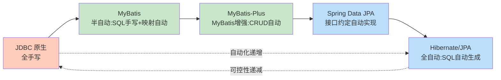

主流持久层框架在“自动化程度”光谱上分布不同：MyBatis 让开发者保留 SQL 控制权，只做对象-结果集映射；Hibernate/JPA 完全自动生成 SQL；Spring Data JPA 与 MyBatis-Plus 进一步通过约定减少样板代码。本节对比四者的设计哲学与典型用法，作为工程选型依据。

## 框架定位对比



## MyBatis

MyBatis 是半自动 ORM：开发者写 SQL，框架负责参数绑定与结果集到对象的映射。映射可通过 XML 或注解配置。

```xml
<!-- mapper.xml: 开发者写 SQL，框架做映射 -->
<mapper namespace="com.example.mapper.UserMapper">
    <select id="findById" resultType="User">
        SELECT id, name, age FROM user WHERE id = #{id}
    </select>

    <!-- 动态 SQL：MyBatis 的核心优势 -->
    <select id="search" resultType="User">
        SELECT id, name, age FROM user
        <where>
            <if test="name != null">AND name LIKE CONCAT('%', #{name}, '%')</if>
            <if test="minAge != null">AND age &gt;= #{minAge}</if>
        </where>
        ORDER BY id
    </select>
</mapper>
```

```java
public interface UserMapper {
    User findById(Long id);
    List<User> search(@Param("name") String name, @Param("minAge") Integer minAge);
}

// 使用：无需实现类，MyBatis 基于接口动态代理
UserMapper mapper = sqlSession.getMapper(UserMapper.class);
List<User> users = mapper.search("张", 18);
```

> [!note] MyBatis 的 #{} 与 ${}
> - `#{param}`：参数化占位符，生成 `?` 并绑定，**防 SQL 注入**，应优先使用。
> - `${param}`：字符串拼接，**有注入风险**，仅用于表名/列名等不能参数化的标识符，且必须白名单校验。

## Hibernate / JPA

Hibernate 是全自动 ORM 的代表，JPA（Jakarta Persistence API）是其标准化规范。开发者操作对象，框架自动生成 SQL。

```java
// JPA 实体
@Entity
@Table(name = "user")
public class User {
    @Id
    @GeneratedValue(strategy = GenerationType.IDENTITY)
    private Long id;
    @Column(name = "name")
    private String name;
    private Integer age;
    // getter/setter 省略
}

// 使用 JPQL（面向对象查询语言）
List<User> users = entityManager.createQuery(
        "SELECT u FROM User u WHERE u.age >= :minAge ORDER BY u.id", User.class)
    .setParameter("minAge", 18)
    .getResultList();

// 复杂统计可退回原生 SQL
Object[] stat = (Object[]) entityManager.createNativeQuery(
        "SELECT COUNT(*), AVG(age) FROM user WHERE name LIKE :kw")
    .setParameter("kw", "张%")
    .getSingleResult();
```

## MyBatis vs Hibernate 对比

| 维度 | MyBatis | Hibernate/JPA |
| ---- | ---- | ---- |
| SQL 编写 | 开发者手写 | 框架自动生成 |
| SQL 优化 | 直接可控 | 需理解框架行为 |
| 学习成本 | 低（会 SQL 即可） | 高（映射、级联、缓存、HQL） |
| 数据库可移植性 | 中（SQL 可带方言） | 高（Dialect 屏蔽差异） |
| 动态 SQL | 强（`<if>`/`<choose>`/`<foreach>`） | 弱（Criteria API 冗长） |
| 适合场景 | 复杂查询、报表、对 SQL 控制要求高 | 业务模型清晰、CRUD 为主、领域驱动 |

## Spring Data JPA

Spring Data JPA 在 JPA 之上提供 Repository 接口：开发者只声明接口，Spring 运行时根据方法名自动生成查询实现。

```java
// 只需声明接口，无需写实现类
public interface UserRepository extends JpaRepository<User, Long> {

    // 方法名即查询：SELECT * FROM user WHERE name = ?
    User findByName(String name);

    // 自动解析为 age >= ? AND name LIKE ?
    List<User> findByAgeGreaterThanEqualAndNameLike(Integer age, String pattern);

    // 自定义查询
    @Query("SELECT u FROM User u WHERE u.age BETWEEN :a AND :b")
    List<User> findByAgeRange(@Param("a") int a, @Param("b") int b);

    // 分页：传入 Pageable 自动追加 LIMIT/OFFSET
    Page<User> findByNameLike(String name, Pageable pageable);
}

// 使用
Page<User> page = userRepository.findByNameLike("张%",
    PageRequest.of(0, 20, Sort.by("id").descending()));
```

## MyBatis-Plus

MyBatis-Plus 是 MyBatis 的增强工具：在不破坏 MyBatis 的前提下，自动提供通用 CRUD，并支持条件构造器与代码生成。

```java
// 实体
@TableName("user")
public class User {
    @TableId(type = IdType.AUTO)
    private Long id;
    private String name;
    private Integer age;
}

// Mapper 继承 BaseMapper 即获得 CRUD，无需写 XML
public interface UserMapper extends BaseMapper<User> {}

// 条件构造器：类型安全的链式条件
List<User> users = userMapper.selectList(
    new LambdaQueryWrapper<User>()
        .ge(User::getAge, 18)
        .likeRight(User::getName, "张")
        .orderByDesc(User::getId)
);
// 生成 SQL: SELECT id,name,age FROM user WHERE age>=18 AND name LIKE '张%' ORDER BY id DESC
```

> [!tip] 选型建议
> - 业务模型清晰、CRUD 占比高、团队熟悉 JPA：选 Spring Data JPA。
> - SQL 复杂、报表多、对性能与 SQL 可控性要求高：选 MyBatis。
> - 已用 MyBatis 但厌倦重复 CRUD：叠加 MyBatis-Plus。
> - 大型项目常混合使用：核心业务用 JPA，报表与统计用 MyBatis。

## 限制与易错点

- Spring Data JPA 的方法名解析有长度与复杂度限制，复杂查询应改用 `@Query`。
- MyBatis-Plus 的条件构造器在复杂多表 JOIN 时仍需手写 XML。
- 全自动 ORM 的 `save` 在更新时会更新所有字段，可能覆盖并发修改，应按需用动态更新。
- 任何框架生成的 SQL 都应通过执行计划验证，见 [[6.2 SQL语句调优]]。

## 关联

- 上位：[[MOC - 第5章]]
- 同章：[[5.1 ORM思想原理]]（框架背后的统一思想）、[[5.2 对象与关系映射]]（框架实现的映射规则）
- 先修：[[4.1 ODBC、JDBC原理]]（框架底层均为 JDBC）、[[4.2 数据库连接池]]（框架使用连接池）
- 后续：[[6.2 SQL语句调优]]（框架生成的 SQL 需调优）、[[7.1 SQL注入防范]]（`#{}` 与 `${}` 的安全差异）
