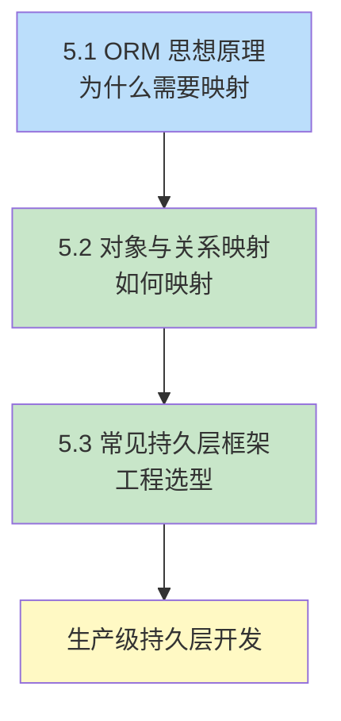

第5章从对象-关系阻抗失配问题出发，介绍 ORM（Object-Relational Mapping）如何把面向对象程序中的实体与关系数据库的表相互映射，并对比主流持久层框架的工程取舍。本章是第4章访问接口之上的抽象层：JDBC 解决“如何访问”，ORM 解决“如何用对象持久化”。

## 章节内容

| 节 | 主题 | 入口 |
| ---- | ---- | ---- |
| 5.1 | ORM 思想原理 | [[5.1 ORM思想原理]] |
| 5.2 | 对象与关系映射 | [[5.2 对象与关系映射]] |
| 5.3 | 常见持久层框架简介 | [[5.3 常见持久层框架简介]] |

## 学习路径

## 核心考点

- ORM 的核心思想：表→类、列→属性、记录→对象、外键→关联
- 四种关联关系（一对一、一对多、多对一、多对多）的映射注解与外键方向
- 延迟加载与急切加载的区别及 N+1 问题
- 实体生命周期的四种状态及其转换
- MyBatis（半自动）与 Hibernate/JPA（全自动）的本质差异
- Spring Data JPA 的 Repository 接口自动实现机制

## 自测题

1. 用自己的话说明 ORM 解决了“对象-关系阻抗失配”中的哪些具体问题，又引入了哪些新成本。
2. 一个订单（Order）对应多个订单项（OrderItem），订单项对应一个商品（Product）。写出 JPA 中三个实体的关联注解，并说明哪一方应使用 `mappedBy`。
3. 对比 MyBatis 与 Hibernate 在“复杂多表查询”场景下的优劣，给出选型建议。
4. 解释 JPA 实体的“游离状态”如何产生，以及 `merge()` 与 `persist()` 的区别。

## 关联章节

- 先修：[[MOC - 第4章]]（JDBC 是 ORM 的底层基础）
- 相关：[[MOC - 第3章]]（ORM 框架的 `@Transactional` 即事务边界）
- 后续：[[MOC - 第6章]]（ORM 生成的 SQL 需要性能优化）
