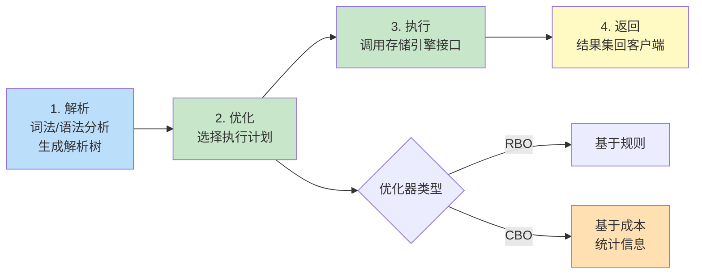

即使有正确的索引，错误的 SQL 写法仍会导致性能下降。本节从 SQL 执行流程出发，介绍查询优化器的工作原理、常见 SQL 重写技巧，以及如何用 `EXPLAIN` 判断优化效果。调优的核心是“减少扫描行数、避免额外排序与临时表、复用执行计划”。本章以 MySQL 8.0 为例。

## SQL 执行流程

一条 SQL 从客户端到返回结果，经历四个阶段：



## 查询优化器

| 类型 | 全称 | 决策依据 | 特点 |
| ---- | ---- | ---- | ---- |
| RBO | Rule-Based Optimizer | 预定义规则（如索引优先于全表） | 简单可预测，但不一定最优 |
| CBO | Cost-Based Optimizer | 统计信息（行数、唯一值、数据分布）估算成本 | 通常更优，但依赖统计准确性 |

> [!warning] 统计信息过期导致计划劣化
> CBO 依赖表与索引的统计信息（`ANALYZE TABLE` 采集）。大量数据增删后若未更新统计信息，优化器可能选错索引。可定期执行 `ANALYZE TABLE t;` 刷新。

## 常见 SQL 优化技巧

### 避免 SELECT *

```sql
-- 反例：读取所有列，无法利用覆盖索引，网络与内存开销大
SELECT * FROM employee WHERE dept_id = 1;

-- 正例：只查需要的列，可能命中覆盖索引
SELECT id, name FROM employee WHERE dept_id = 1;
```

### WHERE 子句优化

- 避免对索引列使用函数或计算（见 [[6.1 索引设计与优化#索引失效场景]]）。
- 避免隐式类型转换：字符串列传数字会让索引失效。

```sql
-- 反例
WHERE YEAR(created_at) = 2024 AND status + 0 = 1
-- 正例
WHERE created_at >= '2024-01-01' AND created_at < '2025-01-01' AND status = 1
```

### JOIN 优化

**小表驱动大表**：用数据量小的表作为驱动表（外层循环），减少内层表的扫描次数。

```sql
-- 假设 department 表小、employee 表大
-- straight_join 强制左表驱动右表（MySQL 专属）
EXPLAIN
SELECT e.id, e.name, d.name AS dept_name
FROM department d STRAIGHT_JOIN employee e ON e.dept_id = d.id
WHERE d.id IN (1, 2, 3);

-- ON 条件列必须有索引：被驱动表的关联列建索引
CREATE INDEX idx_dept ON employee(dept_id);
```

> [!note] 驱动表的选择
> MySQL 优化器通常自动选择小表为驱动表（基于成本）。但复杂查询中优化器可能误判，可用 `STRAIGHT_JOIN` 强制顺序。被驱动表的关联列必须有索引，否则每次关联都全表扫描。

### 子查询优化

某些子查询会被优化器改写为 JOIN，但 `IN` 子查询在旧版本中可能物化为临时表。建议直接写 JOIN。

```sql
-- 反例：IN 子查询
SELECT * FROM orders WHERE user_id IN (SELECT id FROM users WHERE status = 1);

-- 正例：改写为 JOIN
SELECT o.*
FROM orders o
INNER JOIN users u ON o.user_id = u.id
WHERE u.status = 1;
```

### LIMIT 深分页优化

`LIMIT 1000000, 20` 需先扫描 1000020 行再丢弃前 100 万行，开销集中在无用的扫描。

```sql
-- 反例：深分页
SELECT id, name FROM orders ORDER BY created_at DESC LIMIT 1000000, 20;

-- 方案一：延迟关联（先走覆盖索引取主键，再 JOIN 取整行）
SELECT o.*
FROM orders o
INNER JOIN (
    SELECT id FROM orders ORDER BY created_at DESC LIMIT 1000000, 20
) t ON o.id = t.id;

-- 方案二：游标分页（记上一页最大 id，前提是 created_at 与 id 同序且 id 自增）
SELECT id, name FROM orders
WHERE id < :last_id
ORDER BY id DESC LIMIT 20;
```

### UNION ALL vs UNION

`UNION` 会对结果去重（内部排序去重），`UNION ALL` 不去重。确认无重复或允许重复时用 `UNION ALL` 省去排序开销。

```sql
-- 反例：不需要去重却用 UNION
SELECT name FROM employee WHERE dept_id = 1
UNION
SELECT name FROM employee WHERE dept_id = 2;

-- 正例
SELECT name FROM employee WHERE dept_id IN (1, 2);
-- 或
SELECT name FROM employee WHERE dept_id = 1
UNION ALL
SELECT name FROM employee WHERE dept_id = 2;
```

## EXPLAIN 关键字段详解

| 字段 | 取值 | 含义 |
| ---- | ---- | ---- |
| `type` | `const` | 主键或唯一索引等值查询，最多 1 行 |
| | `eq_ref` | JOIN 中被驱动表用主键/唯一索引，最多 1 行 |
| | `ref` | 普通索引等值查询 |
| | `range` | 索引范围扫描（`>`, `<`, `BETWEEN`, `IN`） |
| | `index` | 扫描整个索引树 |
| | `ALL` | 全表扫描，需优化 |
| `key` | 索引名 | 实际选用的索引；NULL 表示未走索引 |
| `rows` | 数值 | 预估扫描行数，越小越好 |
| `Extra` | `Using index` | 覆盖索引，无需回表 |
| | `Using where` | 在存储引擎返回后还需 server 层过滤 |
| | `Using filesort` | 额外排序，需关注 ORDER BY 是否可走索引 |
| | `Using temporary` | 使用临时表（DISTINCT、GROUP BY 常见），需警惕 |

## 优化案例对比

**场景**：按部门统计平均薪资并按薪资降序取前 10。

```sql
-- 建表与数据
CREATE TABLE employee (
    id BIGINT PRIMARY KEY AUTO_INCREMENT,
    name VARCHAR(50),
    dept_id BIGINT,
    salary DECIMAL(10,2),
    INDEX idx_dept(dept_id),
    INDEX idx_dept_salary(dept_id, salary)
) ENGINE=InnoDB;

-- 反例：全表扫描 + 文件排序
EXPLAIN
SELECT dept_id, AVG(salary) AS avg_sal
FROM employee
GROUP BY dept_id
ORDER BY avg_sal DESC
LIMIT 10;
-- type=ALL, Extra: Using temporary; Using filesort

-- 正例：先过滤再分组，利用覆盖索引
EXPLAIN
SELECT dept_id, AVG(salary) AS avg_sal
FROM employee
WHERE dept_id IN (1,2,3,4,5)   -- 缩小范围，走 idx_dept
GROUP BY dept_id
ORDER BY avg_sal DESC
LIMIT 10;
-- type=range, key=idx_dept, rows 显著下降
```

> [!tip] 优化顺序
> 先看 `type` 是否为 `ALL`（缺索引或失效）→ 再看 `rows` 是否过大（需缩小范围）→ 最后看 `Extra` 是否有 `filesort`/`temporary`（需调整 ORDER BY/GROUP BY）。

## 限制与易错点

- 优化器并非万能：复杂查询中可能选错索引，必要时用 `FORCE INDEX(idx)` 强制指定。
- `IN` 列表过长（数千项）会被优化为多次范围扫描，性能可能不如 JOIN 临时表。
- `ORDER BY` 与索引方向不一致时仍会 filesort；MySQL 8.0 支持降序索引可缓解。
- 调优后必须用真实数据量验证，小数据集下看不出差异。

## 关联

- 上位：[[MOC - 第6章]]
- 同章：[[6.1 索引设计与优化]]（调优依赖正确的索引）、[[6.3 慢查询分析基础]]（定位待调优的 SQL）
- 相关：[[5.3 常见持久层框架简介]]（ORM 生成的 SQL 需审查）
