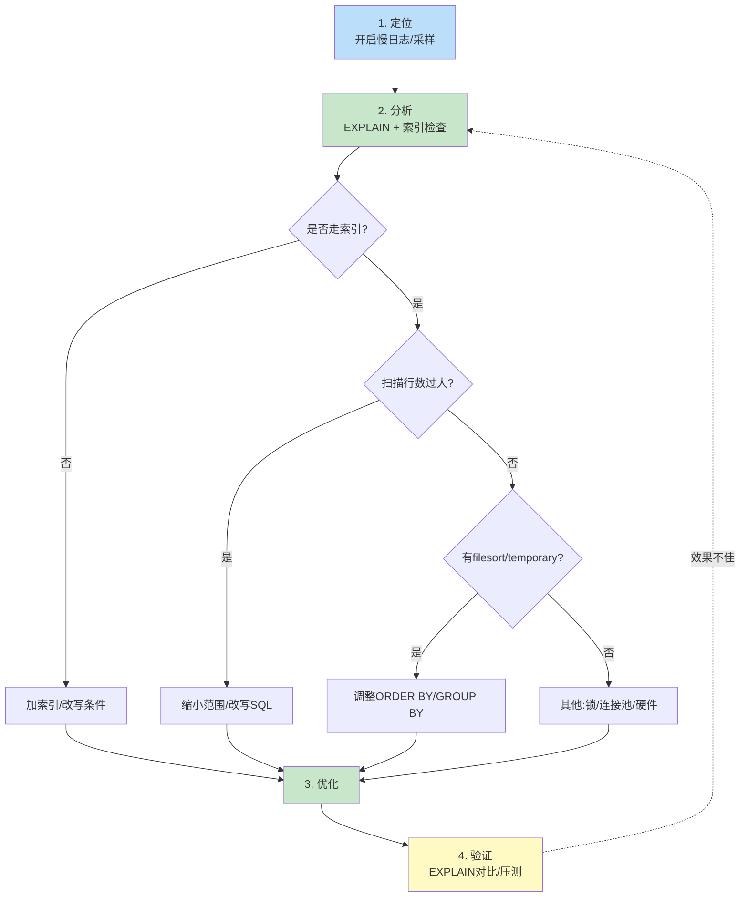

慢查询分析是性能优化的工程入口：先找到慢的 SQL，再分析为何慢，最后用索引或重写修复，并用同样的方法验证效果。本节介绍 MySQL 慢查询日志的开启与配置、`mysqldumpslow` 与 `pt-query-digest` 两类分析工具、优化闭环流程，以及关键性能监控指标。本章以 MySQL 8.0 为例。

## 慢查询日志

慢查询日志（Slow Query Log）记录执行时间超过阈值的 SQL，是定位性能问题的第一手数据。

```sql
-- 查看慢查询日志状态
SHOW VARIABLES LIKE 'slow_query_log%';
SHOW VARIABLES LIKE 'long_query_time';

-- 开启慢查询日志（运行时，重启失效）
SET GLOBAL slow_query_log = ON;
SET GLOBAL long_query_time = 1;          -- 超过 1 秒视为慢查询
SET GLOBAL slow_query_log_file = '/var/log/mysql/slow.log';
SET GLOBAL log_queries_not_using_indexes = ON;  -- 记录未走索引的查询

-- 持久化配置（my.cnf / my.ini）
-- [mysqld]
-- slow_query_log = 1
-- long_query_time = 1
-- slow_query_log_file = /var/log/mysql/slow.log
-- log_queries_not_using_indexes = 1
```

> [!warning] 生产环境开启注意
> - `long_query_time` 不宜过小（如 0），否则日志量爆炸影响 IO。
> - `log_queries_not_using_indexes` 在大表上会产生大量日志，建议仅在排查阶段临时开启。
> - 慢日志文件会持续增长，需配置日志轮转（logrotate）。

## 慢查询优化流程



## mysqldumpslow 工具

MySQL 自带的 `mysqldumpslow` 对慢日志按 SQL 指纹聚合统计，快速找出最慢的几类查询。

```bash
# Linux / macOS（MySQL 自带）
# 按总耗时排序，取前 10
mysqldumpslow -s t -t 10 /var/log/mysql/slow.log

# 按次数排序（找出高频慢查询）
mysqldumpslow -s c -t 10 /var/log/mysql/slow.log

# 按平均耗时排序
mysqldumpslow -s at -t 10 /var/log/mysql/slow.log

# 常用选项:
#   -s t  按总时间 (total time)
#   -s c  按次数 (count)
#   -s at 按平均时间 (average time)
#   -s ar 按平均返回行数
#   -t N  只显示前 N 条
#   -g PATTERN  只显示匹配正则的语句
```

输出示例（参数被替换为 `?`，相同结构的 SQL 聚合为一条指纹）：

```
Count: 1240  Time=2.31s (2864s)  Lock=0.00s (0s)  Rows=15.2 (18848)
  SELECT * FROM employee WHERE dept_id = ? AND name LIKE 'S%'

Count: 53    Time=5.12s (271s)   Lock=0.01s (0s)  Rows=1.0 (53)
  SELECT * FROM orders WHERE user_id = ? ORDER BY created_at DESC LIMIT ?
```

> [!tip] 优先优化高频且总耗时大的
> `Time × Count` 最大的一类往往是收益最高的优化目标。单次慢但次数少的语句可后置。

## pt-query-digest 工具

Percona Toolkit 的 `pt-query-digest` 提供比 `mysqldumpslow` 更丰富的统计（执行时间分布、95/99 分位、样例 SQL），是业界事实标准。

```bash
# 安装（Debian/Ubuntu）
# apt-get install percona-toolkit

# 基本用法：分析慢日志
pt-query-digest /var/log/mysql/slow.log

# 只分析某段时间
pt-query-digest --since '2024-01-01 00:00:00' --until '2024-01-02 00:00:00' /var/log/mysql/slow.log

# 过滤某类查询并保存报告
pt-query-digest --filter '$event->{arg} =~ /employee/' /var/log/mysql/slow.log > report.txt

# 输出包含: 每条指纹的执行次数、总/平均/95%/99%耗时、
#           返回行数、样例完整 SQL、EXPLAIN 建议等
```

输出关键字段：

| 字段 | 含义 |
| ---- | ---- |
| `Rank` | 按总耗时排名 |
| `Query ID` | SQL 指纹的哈希 ID |
| `Calls` | 执行次数 |
| `V/M` | 方差/均值比，越大说明耗时越不稳定 |
| `95%` | 95 分位耗时，反映长尾 |
| `Explain` | 自动标注建议审查的索引与执行计划 |

## 性能监控指标

| 指标 | 含义 | 查看 |
| ---- | ---- | ---- |
| QPS | 每秒查询数 | `SHOW GLOBAL STATUS LIKE 'Questions'`（除以时间差） |
| TPS | 每秒事务数 | `Com_commit + Com_rollback` 的差值 |
| Threads_connected | 当前连接数 | `SHOW STATUS LIKE 'Threads_connected'` |
| Threads_running | 活跃线程数 | `SHOW STATUS LIKE 'Threads_running'` |
| Buffer Pool 命中率 | InnoDB 缓冲池命中比例 | `SHOW ENGINE INNODB STATUS` 中 `hit rate` |

```sql
-- 计算 InnoDB 缓冲池命中率
SHOW STATUS LIKE 'Innodb_buffer_pool_read%';
-- 命中率 = 1 - (Innodb_buffer_pool_reads / Innodb_buffer_pool_read_requests)
-- 期望 > 99%；过低说明缓冲池过小或存在全表扫描
```

> [!note] 指标联动的诊断思路
> - QPS 高但响应慢 → 可能 CPU 或 IO 打满，查 `Threads_running` 是否排队。
> - Buffer Pool 命中率骤降 → 可能大表全表扫描把热数据挤出缓存，结合慢日志定位。
> - TPS 低且 `Com_rollback` 高 → 业务异常回滚多，需查应用逻辑。

## 优化案例

**问题**：`mysqldumpslow` 显示 `SELECT * FROM orders WHERE user_id=? ORDER BY created_at DESC LIMIT ?` 总耗时最高。

```sql
-- 1. EXPLAIN 分析
EXPLAIN SELECT * FROM orders WHERE user_id = 1001 ORDER BY created_at DESC LIMIT 20;
-- type=ref, key=idx_user, 但 Extra: Using filesort

-- 2. 诊断：user_id 有索引，但 ORDER BY created_at 未走索引 → filesort
-- 3. 优化：建立复合索引 (user_id, created_at)
CREATE INDEX idx_user_created ON orders(user_id, created_at);

-- 4. 验证
EXPLAIN SELECT * FROM orders WHERE user_id = 1001 ORDER BY created_at DESC LIMIT 20;
-- Extra 中 filesort 消失，rows 下降
```

## 限制与易错点

- 慢日志只记录已执行的语句，无法发现“潜在慢查询”，需结合压测。
- `long_query_time` 阈值会漏掉大量低耗时但高频的查询（累积耗时大），可临时调低或用 `performance_schema` 采样。
- 生产环境直接 `EXPLAIN` 大表也可能产生 IO 压力，可用 `EXPLAIN FOR CONNECTION` 分析正在执行的会话。
- 优化后必须复测，避免“优化一项拖累另一项”。

## 关联

- 上位：[[MOC - 第6章]]
- 同章：[[6.1 索引设计与优化]]（分析后的优化手段）、[[6.2 SQL语句调优]]（SQL 重写技巧）
- 相关：[[4.2 数据库连接池]]（连接数监控与慢查询的关联）
