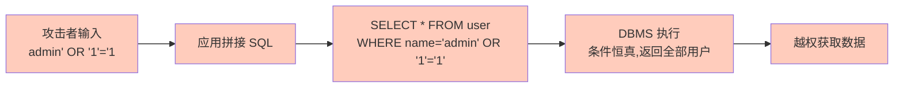

SQL 注入（SQL Injection）是应用层最常见、危害最大的安全漏洞之一。攻击者通过把 SQL 元字符拼进用户输入，让 DBMS 把“数据”当成“代码”执行，从而越权读取、篡改甚至删除数据。本节说明注入原理、四种主要类型、危害与多层防范措施。参数化查询是核心防线，详见 [[4.3 参数化查询]]，本节从攻击视角补充完整认知。

## SQL 注入原理

SQL 注入的本质是“数据与代码未分离”：应用把用户输入直接拼接进 SQL 文本，DBMS 无法区分哪部分是 SQL 语法、哪部分是字面量。



## 注入类型

### 联合查询注入（Union-based）

利用 `UNION` 把攻击者的查询结果拼到原查询的返回中，直接读取其他表。

```sql
-- 原始 SQL（拼接）：
-- SELECT name, info FROM product WHERE id = {用户输入}
-- 攻击输入: 1 UNION SELECT user, password FROM mysql.user
-- 最终执行:
SELECT name, info FROM product WHERE id = 1
UNION SELECT user, password FROM mysql.user;
```

### 布尔盲注（Boolean-based Blind）

页面不直接回显数据，但根据查询真假返回不同内容。攻击者用 `AND 1=1` / `AND 1=2` 判断条件，逐字符猜解。

```sql
-- 攻击输入构造布尔条件
-- 原 SQL: SELECT * FROM user WHERE id = {输入}
-- 输入: 1 AND SUBSTRING((SELECT password FROM user WHERE id=1),1,1)='a'
-- 若返回正常 → 第一位是 'a'，否则换字符继续猜
```

### 时间盲注（Time-based Blind）

页面无回显差异，用 `SLEEP()` 等延时函数，通过响应时间判断条件真假。

```sql
-- 输入: 1 AND IF(SUBSTRING(password,1,1)='a', SLEEP(3), 0)
-- 响应慢 3 秒 → 首字符是 'a'
```

### 堆叠注入（Stacked Queries）

一次请求执行多条 SQL（`;` 分隔），可直接执行 INSERT/UPDATE/DELETE。MySQL 的 `mysqli_query` 默认不支持，但 PDO 或 SQL Server 默认支持。

```sql
-- 输入: 1; DROP TABLE product; --
-- 最终执行:
SELECT * FROM product WHERE id = 1; DROP TABLE product; --';
```

## 危害

| 危害 | 说明 |
| ---- | ---- |
| 数据泄露 | 读取用户表、密码哈希、敏感业务数据 |
| 数据篡改 | 修改余额、权限、订单状态 |
| 权限提升 | 读取数据库账户、写入后门、获取 shell |
| 拖库 | 全量导出数据库，造成不可挽回的泄露 |

> [!danger] 密码必须加盐哈希存储
> 即使被注入拖库，密码字段用 bcrypt/scrypt/Argon2 等加盐慢哈希存储，攻击者也无法直接获得明文。明文或 MD5 存储会使泄露后果放大数倍。

## 防范措施

### 1. 参数化查询（核心防线）

```java
// 漏洞代码：拼接 SQL
String name = request.getParameter("name");
String sql = "SELECT * FROM user WHERE name = '" + name + "'";
Statement stmt = conn.createStatement();
ResultSet rs = stmt.executeQuery(sql);  // 注入！

// 安全代码：参数化查询
String sql = "SELECT id, name FROM user WHERE name = ?";
try (PreparedStatement ps = conn.prepareStatement(sql)) {
    ps.setString(1, request.getParameter("name"));  // 任意输入只作字面量
    try (ResultSet rs = ps.executeQuery()) { /* ... */ }
}
```

> [!note] 参数化为何防注入
> 参数化查询将 SQL 文本与参数分别发送给 DBMS。DBMS 先解析 SQL 模板（`?` 标记为参数占位），再把参数值作为**字面量**绑定。参数值中包含 `'`、`;`、`--` 也不会改变 SQL 结构。详见 [[4.3 参数化查询]]。

### 2. 输入验证与过滤

- **白名单优于黑名单**：对枚举字段（排序字段、表名）用白名单校验后再拼接。
- **类型校验**：数字型参数用 `Long.parseLong` 校验，非法值直接拒绝。

```java
// 白名单校验动态排序字段
Set<String> allowed = Set.of("id", "name", "created_at");
String orderBy = request.getParameter("orderBy");
if (!allowed.contains(orderBy)) {
    throw new IllegalArgumentException("非法排序字段");
}
String sql = "SELECT id, name FROM product ORDER BY " + orderBy + " LIMIT ?";
```

### 3. 最小权限原则

应用使用的数据库账户只授予业务所需的最小权限，不使用 root 或 DBA 账户连接。即使被注入，攻击者能做的操作也被限制。详见 [[7.2 用户权限管理]]。

### 4. WAF（Web 应用防火墙）

WAF 在 HTTP 层拦截常见注入特征（`UNION SELECT`、`OR 1=1` 等），作为补充防线。但 WAF 基于规则，可能被编码绕过，不能替代参数化查询。

### 5. ORM 框架自动防护

ORM 框架默认使用参数化绑定，能消除大部分拼接场景。但需注意：

```java
// MyBatis: #{} 安全，${} 不安全
// 安全
SELECT * FROM user WHERE name = #{name}
// 危险（拼接）
SELECT * FROM user WHERE name = '${name}'

// JPA: 用参数绑定而非字符串拼接
// 安全
em.createQuery("SELECT u FROM User u WHERE u.name = :name")
  .setParameter("name", name);
// 危险
em.createQuery("SELECT u FROM User u WHERE u.name = '" + name + "'");
```

> [!warning] ORM 不是绝对安全
> 使用 `${}`、`createNativeQuery` 拼接、动态表名等场景仍可能注入。ORM 默认安全的前提是不绕过参数化机制。

## 防护层级总结

```mermaid
flowchart TD
    U[用户输入] --> W1[1. 输入校验<br/>白名单/类型]
    W1 --> W2[2. 参数化查询<br/>核心防线]
    W2 --> W3[3. ORM 安全 API<br/>#{} / setParameter]
    W3 --> W4[4. 最小权限账户<br/>限制爆炸半径]
    W4 --> W5[5. WAF<br/>补充拦截]
    W5 --> DB[(数据库)]
    DB --> B[6. 备份恢复<br/>兜底]
    B -.即使被注入.-> DB

    style W2 fill:#c8e6c9
    style W4 fill:#c8e6c9
    style B fill:#fff9c4
```

## 限制与易错点

- 参数化查询不能用于表名/列名等标识符，必须用白名单。
- 二次注入：数据首次存入时未触发，读出后拼接进新 SQL 触发；存储时也应统一转义或使用参数化。
- 存储过程内部若拼接动态 SQL 仍可能注入，需在过程内使用参数化。
- 编码绕过（URL 编码、十六进制、Unicode）可绕过简单过滤，故黑名单不可靠。

## 关联

- 上位：[[MOC - 第7章]]
- 同章：[[7.2 用户权限管理]]（最小权限是注入的减损措施）、[[7.3 备份恢复策略]]（被注入后的恢复兜底）
- 先修：[[4.3 参数化查询]]（防注入的核心技术细节）、[[5.3 常见持久层框架简介]]（ORM 的 `#{}` 与 `${}`）
