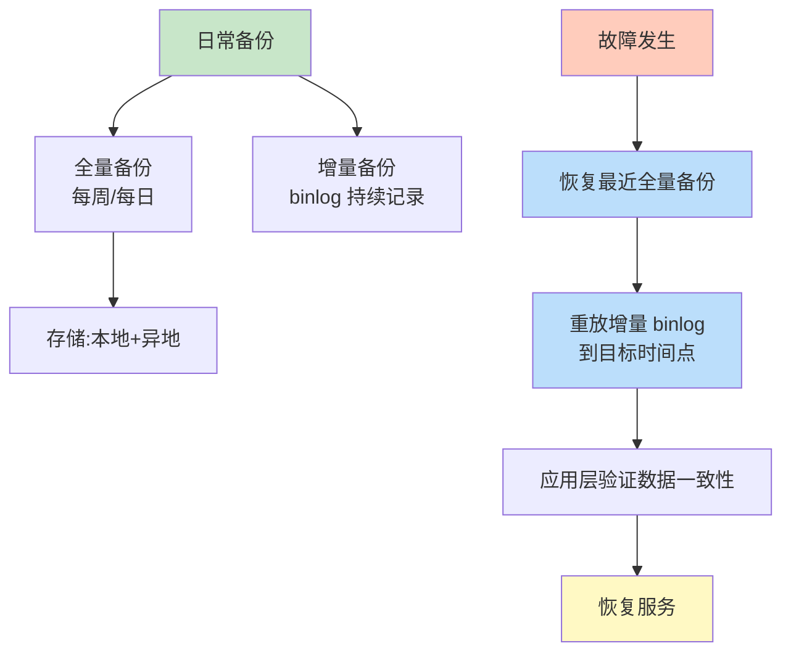
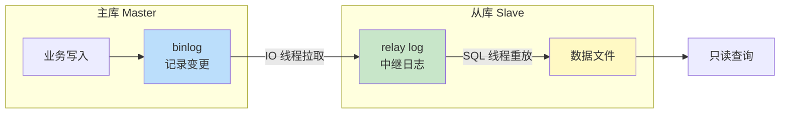

备份恢复是数据库安全的最后一道防线：无论攻击、误操作还是硬件故障，只要备份可用就能恢复数据。本节介绍备份的类型与方式、`mysqldump` 工具、基于二进制日志的时间点恢复（PITR）、备份策略设计与主从复制基础。核心原则是“备份不仅要存，更要定期演练恢复”。本章以 MySQL 8.0 为例。

## 备份类型

| 类型 | 含义 | 特点 |
| ---- | ---- | ---- |
| 全量备份 Full | 完整复制所有数据 | 恢复最简单，但耗时与空间大 |
| 增量备份 Incremental | 只备份自上次任意备份以来变化的数据 | 空间小、速度快，但恢复需链式回放 |
| 差异备份 Differential | 只备份自上次全量以来变化的数据 | 恢复只需全量+最近一次差异，介于两者之间 |

## 备份方式

| 方式 | 工具 | 特点 |
| ---- | ---- | ---- |
| 逻辑备份 | `mysqldump`、`mysqlpump` | 导出 SQL 文本，跨版本可移植，速度慢 |
| 物理备份 | 文件复制、`xtrabackup` | 复制数据文件，速度快，需停一致性 |

## 备份恢复流程



## mysqldump 工具

`mysqldump` 是 MySQL 自带的逻辑备份工具，导出可执行的 SQL 脚本。

```bash
# 全库备份（含建库语句）
mysqldump -uroot -p --all-databases --routines --triggers > all.sql

# 单库备份
mysqldump -uroot -p shopdb > shopdb.sql

# 仅备份结构（不含数据）
mysqldump -uroot -p --no-data shopdb > schema.sql

# 仅备份数据（不含结构）
mysqldump -uroot -p --no-create-info shopdb > data.sql

# 单库一致性快照（InnoDB 单事务，推荐）
mysqldump -uroot -p --single-transaction --master-data=2 shopdb > shopdb.sql
# --single-transaction: 用 START TRANSACTION WITH CONSISTENT SNAPSHOT 取一致性视图，不锁表
# --master-data=2: 注释中记录备份时刻的 binlog 位点，用于后续 PITR
```

```bash
# 恢复：直接执行 SQL 脚本
mysql -uroot -p shopdb < shopdb.sql
# 或在 MySQL 内执行
-- SOURCE /path/to/shopdb.sql;
```

> [!note] --single-transaction 的原理
> 该选项在备份开始时执行 `START TRANSACTION WITH CONSISTENT SNAPSHOT`，利用 InnoDB 的 MVCC 取一个一致性快照，备份期间不锁表、不影响业务写入。仅对 InnoDB 有效，MyISAM 仍会锁表。

## 二进制日志与时间点恢复（PITR）

二进制日志（binlog）记录所有更改数据的 SQL（DDL/DML），是增量恢复的核心。

```sql
-- 查看是否开启 binlog
SHOW VARIABLES LIKE 'log_bin%';
SHOW VARIABLES LIKE 'binlog_format';

-- 查看当前 binlog 文件与位点
SHOW MASTER STATUS;
-- 返回: File=mysql-bin.000003, Position=1234, ...
```

```ini
# my.cnf 开启 binlog
[mysqld]
log_bin = /var/log/mysql/mysql-bin
binlog_format = ROW          # ROW 记录行变更,最可靠
expire_logs_days = 7         # 保留 7 天
```

**PITR 恢复步骤**（误删表后恢复到删除前一刻）：

```bash
# 1. 恢复最近的全量备份
mysql -uroot -p shopdb < shopdb_full.sql
# 备份文件注释中有位点: CHANGE MASTER TO MASTER_LOG_FILE='mysql-bin.000010', MASTER_LOG_POS=154

# 2. 用 mysqlbinlog 重放从该位点到误操作前的 binlog
mysqlbinlog --start-position=154 --stop-datetime='2024-06-01 14:59:00' \
    /var/log/mysql/mysql-bin.000010 /var/log/mysql/mysql-bin.000011 \
    | mysql -uroot -p shopdb

# 3. 验证数据后恢复服务
```

> [!warning] PITR 的关键
> - `--stop-datetime` 必须精确到误操作之前；重放过头会再次执行误删。
> - binlog 必须妥善保存且未被 `expire_logs_days` 清理。
> - 恢复前建议先在测试库演练，确认位点与时间点正确。

## 备份策略设计

| 维度 | 建议 |
| ---- | ---- |
| 备份频率 | 全量每日（小库）/ 每周（大库）+ binlog 持续 |
| 保留周期 | 全量保留 4 周，binlog 保留 7~30 天，长期归档按合规要求 |
| 存储位置 | 本地 + 异地（云对象存储），防单点故障 |
| 恢复演练 | 每季度至少一次真实恢复演练，验证备份可用 |
| 备份校验 | 备份后校验文件大小与可恢复性（`mysqlcheck`） |

> [!danger] 未演练的备份等于没有备份
> 备份文件可能因格式、版本、权限、损坏等原因无法恢复。必须定期在隔离环境执行真实恢复演练，并验证数据完整性。

## 主从复制基础

主从复制（Replication）实现读扩展与高可用，其基础链路与 binlog 紧密相关。



```sql
-- 主库创建复制账户（最小权限: REPLICATION SLAVE）
CREATE USER 'repl'@'10.0.0.2' IDENTIFIED BY 'ReplPass!2024';
GRANT REPLICATION SLAVE ON *.* TO 'repl'@'10.0.0.2';

-- 从库配置复制源
CHANGE REPLICATION SOURCE TO
    SOURCE_HOST='10.0.0.1',
    SOURCE_USER='repl',
    SOURCE_PASSWORD='ReplPass!2024',
    SOURCE_LOG_FILE='mysql-bin.000010',
    SOURCE_LOG_POS=154;
START REPLICA;   -- MySQL 8.0.22+ 用 START REPLICA（原 START SLAVE）

-- 查看复制状态
SHOW REPLICA STATUS\G
-- 关注: Replica_IO_Running=Yes, Replica_SQL_Running=Yes, Seconds_Behind_Master
```

> [!note] 复制延迟的原因
> 主库并发写入，binlog 顺序传输；从库 SQL 线程单线程重放（MySQL 8.0 可开多线程复制）。大事务、长事务、网络抖动都会导致 `Seconds_Behind_Master` 增大。延迟期间从库读到的是旧数据，读敏感业务需考虑延迟容忍度。

## 限制与易错点

- `mysqldump` 备份大库很慢，TB 级应改用 `xtrabackup` 物理备份。
- binlog 默认不记录 `SELECT`，无法恢复“误查”；但能恢复“误删/误改”。
- 恢复会覆盖现有数据，恢复前务必备份当前状态以防回滚。
- 主从复制不能替代备份：误删表会通过 binlog 同步到从库，从库也会被删。

## 关联

- 上位：[[MOC - 第7章]]
- 同章：[[7.1 SQL注入防范]]（被注入后的恢复）、[[7.2 用户权限管理]]（备份/复制账户的最小权限）
- 相关：[[3.1 事务ACID特性]]（备份一致性与事务边界）、[[6.3 慢查询分析基础]]（备份期间的性能影响）
