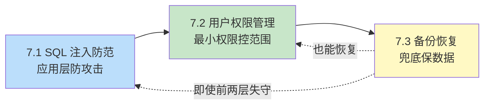

第7章聚焦数据库应用上线后的“安全与可恢复”两大工程命题：SQL 注入是应用层最高频的攻击面，权限管理控制“谁能做什么”，备份恢复保证“出事后能找回数据”。三节构成“防攻击—控权限—保恢复”的安全闭环。本章以 MySQL 8.0 为基准。

## 章节内容

| 节 | 主题 | 入口 |
| ---- | ---- | ---- |
| 7.1 | SQL 注入防范 | [[7.1 SQL注入防范]] |
| 7.2 | 用户权限管理 | [[7.2 用户权限管理]] |
| 7.3 | 备份恢复策略 | [[7.3 备份恢复策略]] |

## 安全闭环

## 核心考点

- SQL 注入的原理与四种主要类型（联合、布尔盲注、时间盲注、堆叠）
- 参数化查询为何能防注入（与拼接的本质区别）
- 数据库权限的四个层级与最小权限原则
- `GRANT` / `REVOKE` / 角色的使用
- 备份类型（全量、增量、差异）与方式（逻辑、物理）的区别
- binlog 与时间点恢复（PITR）的流程
- 主从复制的基础链路（binlog → relay log → 重放）

## 自测题

1. 说明参数化查询防 SQL 注入的底层原理，并指出它不能防御的两种“类注入”场景。
2. 应用需要读写 `order` 表但不能删表、不能访问 `user` 表。给出 MySQL 用户与授权语句，并说明权限层级。
3. 解释“全量 + 增量 + binlog”三层备份的区别与配合方式，并说明 PITR 的恢复步骤。
4. 主从复制中 `binlog`、`relay log`、`重放` 各自的作用是什么？为什么复制可能有延迟？

## 关联章节

- 先修：[[MOC - 第4章]]（参数化查询基础）、[[MOC - 第3章]]（事务在备份中的作用）
- 相关：[[MOC - 第5章]]（ORM 的自动参数化）、[[MOC - 第6章]]（安全配置不影响性能）
