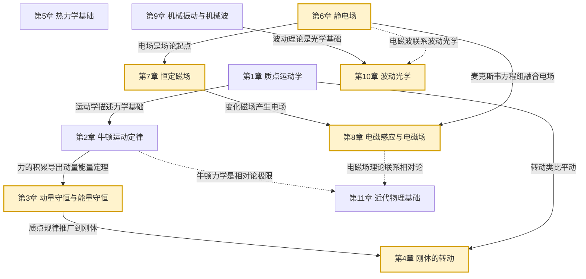

# MOC - 大学物理B

> [!info] 课程定位
> 大学物理B 是理工科本科生的核心自然科学基础课，研究**物质最基本运动形式及其规律**。课程在 [[MOC - 高等数学A(1)]]（微积分）和 [[MOC - 高等数学A(2)]]（多元微积分、矢量分析）的数学基础上，建立**力学、热学、电磁学、波动光学、近代物理**五大知识体系。它要解决的核心问题是：如何用统一的物理定律（守恒律、场方程、波动方程）描述宏观与微观世界的运动规律，为后续工程学科（电路、信号、机械、材料）提供物理图像与定量工具。

## 课程摘要

本课程围绕"**力学—热学—电磁学—振动波动—近代物理**"五条主线展开：

1. **力学**（第1-4章）：质点运动学、牛顿定律、动量与能量守恒、刚体转动；
2. **热学**（第5章）：理想气体状态方程、热力学第一/第二定律、卡诺循环、熵；
3. **电磁学**（第6-8章）：静电场（高斯定理、环路定理、电势）、恒定磁场（毕奥-萨伐尔定律、安培环路定理）、电磁感应（法拉第定律）、麦克斯韦方程组；
4. **振动波动与光学**（第9-10章）：简谐振动、平面简谐波、波的干涉与衍射、光的干涉（杨氏双缝、薄膜、牛顿环）、光的衍射（单缝、光栅）、光的偏振；
5. **近代物理**（第11章）：狭义相对论、光电效应、德布罗意波、不确定性关系、玻尔氢原子。

## 章节结构与依赖关系

## 章节导航

| 章节 | 主题 | 入口 | 小节数 | 核心考点 |
| ---- | ---- | ---- | ------ | -------- |
| 第1章 | 质点运动学 | [[MOC - 第1章]] | 4 | 位置矢量、速度加速度、相对运动 |
| 第2章 | 牛顿运动定律 | [[MOC - 第2章]] | 4 | 三大定律、受力分析、惯性力 |
| 第3章 | 动量守恒与能量守恒 | [[MOC - 第3章]] | 5 | 动量定理、动能定理、机械能守恒 |
| 第4章 | 刚体的转动 | [[MOC - 第4章]] | 4 | 转动惯量、转动定律、角动量守恒 |
| 第5章 | 热力学基础 | [[MOC - 第5章]] | 6 | 热力学第一定律、卡诺循环、热力学第二定律 |
| 第6章 | 静电场 | [[MOC - 第6章]] | 6 | 库仑定律、高斯定理、电势、导体与电介质 |
| 第7章 | 恒定磁场 | [[MOC - 第7章]] | 4 | 毕奥-萨伐尔定律、安培环路定理、磁介质 |
| 第8章 | 电磁感应与电磁场 | [[MOC - 第8章]] | 4 | 法拉第定律、动生/感生电动势、麦克斯韦方程组 |
| 第9章 | 机械振动与机械波 | [[MOC - 第9章]] | 5 | 简谐振动、波动方程、波的干涉、多普勒效应 |
| 第10章 | 波动光学 | [[MOC - 第10章]] | 4 | 杨氏双缝、薄膜干涉、光栅衍射、偏振 |
| 第11章 | 近代物理基础 | [[MOC - 第11章]] | 4 | 狭义相对论、光电效应、德布罗意波、玻尔模型 |

## 三大核心思想

> [!abstract] 物理学的核心思想
> 1. **守恒律与对称性**：动量守恒（空间平移对称）、能量守恒（时间平移对称）、角动量守恒（空间旋转对称）是物理学最深刻的原理，贯穿力学、电磁学与近代物理。
>
> 2. **场的观点**：从超距作用到场论是物理学的革命。静电场（E 场）、恒定磁场（B 场）、变化电磁场（涡旋电场、位移电流）逐步建立统一的电磁场图像，麦克斯韦方程组是其集大成。
>
> 3. **波粒二象性与相对性**：近代物理的核心突破。光具有波粒二象性（干涉衍射 + 光电效应）；物质粒子也具有波动性（德布罗意波）；同时性是相对的（狭义相对论）。这两大思想颠覆了经典物理的绝对时空观与确定性。

## 与上下游课程的衔接

- **先修**：[[MOC - 高等数学A(1)]]（微积分、矢量代数）、[[MOC - 高等数学A(2)]]（多元微积分、线面积分）、[[MOC - 线性代数A]]（矩阵）
- **后续**：[[MOC - 电路与模拟电子技术]]（电路元件的物理基础）、[[MOC - 数字逻辑电路]]、量子力学、固体物理、材料科学
- **关联**：[[MOC - 概率论与数理统计B]]（统计物理与熵的统计解释）

## 章节导航

- 上一级：[[MOC - 物理与电路]]
- 先修课程：[[MOC - 高等数学A(1)]]、[[MOC - 高等数学A(2)]]

## 相关标签

#大学物理 #力学 #热学 #电磁学 #波动光学 #近代物理 #相对论 #量子力学
