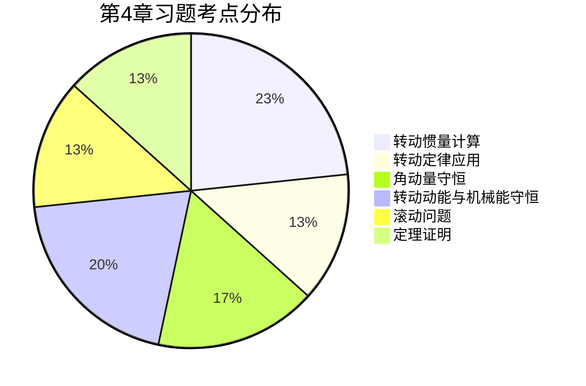

# MOC - 第4章习题

> [!info] 习题说明
> 本章习题覆盖 [[MOC - 第4章]] 四个小节：[[4.1 刚体运动、转动惯量|转动惯量]]、[[4.2 力矩、转动定律|转动定律]]、[[4.3 角动量、角动量守恒|角动量守恒]]、[[4.4 刚体转动动能|转动动能]]。重点训练转动惯量计算、转动定律应用、角动量守恒、转动动能与滚动问题。所有计算题给出完整步骤、单位检验与必要理想化假设。$g$ 一律取 $9.8\,\text{m/s}^{2}$。

## 一、填空题（6 题）

### 填空 1
均匀细杆长 $L$、质量 $m$，对过杆中点且与杆垂直的轴的转动惯量为 $\underline{\quad\quad}$；对过杆一端且与杆垂直的轴的转动惯量为 $\underline{\quad\quad}$。

答案

- 中点：$\dfrac{1}{12}mL^{2}$
- 端点：$\dfrac{1}{3}mL^{2}$（也可由平行轴定理 $J=J_{C}+m(L/2)^{2}=\dfrac{1}{12}mL^{2}+\dfrac14 mL^{2}=\dfrac13 mL^{2}$ 求得）

### 填空 2
刚体绕定轴转动，转动惯量 $J=0.50\,\text{kg·m}^{2}$，角速度 $\omega=4.0\,\text{rad/s}$，则其转动动能为 $\underline{\quad\quad}\,\text{J}$，对轴角动量大小为 $\underline{\quad\quad}\,\text{kg·m}^{2}\text{/s}$。

答案

- 转动动能：$E_{k}=\dfrac12 J\omega^{2}=\dfrac12\times0.50\times4.0^{2}=4.0\,\text{J}$
- 角动量：$L=J\omega=0.50\times4.0=2.0\,\text{kg·m}^{2}\text{/s}$

### 填空 3
质量为 $m$、半径为 $R$ 的均质圆盘，对过中心且垂直盘面的轴的转动惯量为 $\underline{\quad\quad}$；对沿直径的轴的转动惯量为 $\underline{\quad\quad}$。

答案

- 过中心 ⊥ 盘面：$\dfrac12 mR^{2}$
- 沿直径：$\dfrac14 mR^{2}$（由正交轴定理 $J_{z}=J_{x}+J_{y}$，且 $J_{x}=J_{y}$，故 $J_{x}=\dfrac12 J_{z}=\dfrac14 mR^{2}$）

### 填空 4
花样滑冰运动员收缩双臂时转动惯量由 $J_{1}$ 减小到 $J_{2}=\dfrac13 J_{1}$，则角速度变为原来的 $\underline{\quad\quad}$ 倍；转动动能变为原来的 $\underline{\quad\quad}$ 倍。

答案

- 角速度：$3$ 倍（$J_{1}\omega_{1}=J_{2}\omega_{2}\Rightarrow\omega_{2}/\omega_{1}=J_{1}/J_{2}=3$）
- 转动动能：$3$ 倍。$\dfrac{E_{k2}}{E_{k1}}=\dfrac{\tfrac12 J_{2}\omega_{2}^{2}}{\tfrac12 J_{1}\omega_{1}^{2}}=\dfrac{J_{2}}{J_{1}}\cdot\left(\dfrac{\omega_{2}}{\omega_{1}}\right)^{2}=\dfrac13\times9=3$
- 注意：动能增加由运动员内力做功提供（不违反能量守恒）。

### 填空 5
均质实心球（质量 $m$、半径 $R$）对过球心任一直径的转动惯量为 $\underline{\quad\quad}$；薄球壳（同质量同半径）对过球心任一直径的转动惯量为 $\underline{\quad\quad}$。

答案

- 实心球：$\dfrac25 mR^{2}$
- 球壳：$\dfrac23 mR^{2}$

### 填空 6
半径 $R=0.30\,\text{m}$ 的圆盘以 $\omega=10\,\text{rad/s}$ 绕中心轴匀速转动，盘边缘一点的切向速度为 $\underline{\quad\quad}\,\text{m/s}$，法向加速度大小为 $\underline{\quad\quad}\,\text{m/s}^{2}$。

答案

- 切向速度：$v=R\omega=0.30\times10=3.0\,\text{m/s}$
- 法向加速度：$a_{n}=R\omega^{2}=0.30\times100=30\,\text{m/s}^{2}$（指向圆心）
- 切向加速度：$a_{t}=R\alpha=0$（匀速转动 $\alpha=0$）

## 二、选择题（6 题）

### 选择 1
关于刚体的转动惯量，下列说法正确的是：

A. 转动惯量是矢量，方向沿转轴
B. 同一刚体对不同轴的转动惯量相同
C. 转动惯量取决于刚体质量、质量分布和轴的位置
D. 转动惯量与角速度有关

答案

**C**。转动惯量是标量（A 错），与轴位置有关（B 错），与角速度无关（D 错）。$J=\int r^{2}\,dm$ 取决于质量分布和轴位置。

### 选择 2
一刚体所受合外力矩为零，则该刚体：

A. 必静止
B. 角加速度为零
C. 角动量守恒
D. 角速度为零

答案

**B、C**。$M=0\Rightarrow\alpha=0$（角加速度为零，B 对），且 $L=J\omega$ 守恒（C 对）。但刚体可能匀速转动（A、D 错）。

### 选择 3
两个质量相同、半径相同的圆盘从同一斜面同一高度由静止纯滚动滑下，甲是实心盘，乙是空心圆环。则到达底部时：

A. $v_{甲}>v_{乙}$
B. $v_{甲}=v_{乙}$
C. $v_{甲}<v_{乙}$
D. 无法比较

答案

**A**。实心盘 $J_{C}=\tfrac12 mR^{2}$，$v=\sqrt{4gh/3}$；圆环 $J_{C}=mR^{2}$，$v=\sqrt{gh}$。$\sqrt{4/3}>\sqrt{1}$，故 $v_{甲}>v_{乙}$。转动惯量小者末速度大。

### 选择 4
子弹水平射入悬挂的均匀杆下端并嵌其中。在碰撞过程中，下列哪些量守恒？

A. 子弹的动量
B. 子弹-杆系统的动量
C. 子弹-杆系统对轴的角动量
D. 子弹-杆系统的动能

答案

**C**。轴处冲力为外力，动量不守恒（A、B 错）；完全非弹性碰撞，动能损失（D 错）；轴处冲力对轴力矩为零，重力矩在碰撞瞬间冲量可忽略，故对轴角动量守恒（C 对）。

### 选择 5
一力 $\vec F$ 作用于定轴转动的刚体上，作用点距轴 $r$，$\vec F$ 与 $\vec r$ 夹角 $\varphi$。该力对轴的力矩大小为：

A. $rF$
B. $rF\cos\varphi$
C. $rF\sin\varphi$
D. $rF\tan\varphi$

答案

**C**。$M=rF\sin\varphi$，由叉乘定义。当 $\varphi=90^{\circ}$（力垂直于径向）时力矩最大。

### 选择 6
关于力矩做功，下列说法正确的是：

A. 力矩恒定时做功 $W=M\theta$
B. 力矩做功的正负取决于力矩方向与转动方向是否一致
C. 恒定大小的力矩做功与路径无关
D. 保守力矩做功等于势能减少

答案

**A、B、D**。$W=\int M\,d\theta$，恒力矩时 $W=M\theta$（A 对）；$M$ 与 $\omega$ 同向做正功（B 对）；保守力矩（如重力矩、弹性力矩）做功等于势能减少（D 对）。C 错：力矩做功一般与角位移路径有关（除非保守力矩）。

## 三、计算题（10 题）

### 计算 1（转动惯量组合）
由质量 $m_{1}=4.0\,\text{kg}$、半径 $R=0.30\,\text{m}$ 的均质圆盘，与质量 $m_{2}=2.0\,\text{kg}$、长 $L=0.60\,\text{m}$ 的均质细杆构成的刚体，杆沿直径方向固定在圆盘上，盘心与杆中点重合。求该刚体对过盘心且垂直盘面轴的转动惯量。

解答

**分析**：组合刚体转动惯量可加。圆盘和杆对同一轴（过盘心 ⊥ 盘面）分别计算。

**圆盘**：$J_{1}=\dfrac12 m_{1}R^{2}=\dfrac12\times4.0\times0.30^{2}=0.180\,\text{kg·m}^{2}$

**杆**：杆沿直径方向，过杆中点（即盘心）且垂直盘面的轴。杆在此轴上的转动惯量需用积分或正交轴定理。

杆长 $L=0.60\,\text{m}$，沿 $x$ 方向放置，轴沿 $z$ 方向过杆中点。杆上质量微元 $dm=\dfrac{m_{2}}{L}dx$，距 $z$ 轴距离 $|x|$（$x\in[-L/2,L/2]$）：
$$J_{2}=\int_{-L/2}^{L/2}x^{2}\,\dfrac{m_{2}}{L}dx=\dfrac{m_{2}}{L}\cdot\dfrac{L^{3}}{12}=\dfrac{1}{12}m_{2}L^{2}=\dfrac{1}{12}\times2.0\times0.60^{2}=0.060\,\text{kg·m}^{2}$$

**总转动惯量**：$J=J_{1}+J_{2}=0.180+0.060=0.240\,\text{kg·m}^{2}$

**单位检验**：$\text{kg·m}^{2}$ ✓

### 计算 2（转动定律：滑轮系统）
半径 $R=0.20\,\text{m}$、转动惯量 $J=0.10\,\text{kg·m}^{2}$ 的定滑轮上绕轻绳（不打滑），绳一端挂 $m=2.0\,\text{kg}$ 物块，另一端施加恒力 $F=30\,\text{N}$（向上拉）。物块由静止释放，求 $2.0\,\text{s}$ 后物块速度和绳子两端张力。$g=9.8\,\text{m/s}^{2}$。

解答

**约定**：取物块向下为正方向。物块向下运动，则滑轮顺时针转（取此为正），$F$ 端绳向上运动。

**方程**：
- 物块：$mg-T_{1}=ma$（$T_{1}$ 为物块端张力）
- 滑轮：力矩差为 $T_{1}R-FR$（$F$ 端力矩反向），但需注意 $T_{1}$ 端物块向下意味着 $T_{1}$ 端绳张力使滑轮正向转。设正向与物块下落一致：$T_{1}R-FR=J\alpha=J\dfrac{a}{R}$
- 绳端 $F$ 处：绳轻且不打滑，$T_{2}=F=30\,\text{N}$（直接拉力）

代入：$T_{1}R-30R=J a/R$，$R(T_{1}-30)=Ja/R$
$$T_{1}=\dfrac{Ja}{R^{2}}+30$$
代入物块方程 $mg-T_{1}=ma$：
$$mg-\dfrac{Ja}{R^{2}}-30=ma$$
$$a=\dfrac{mg-30}{m+J/R^{2}}=\dfrac{2.0\times9.8-30}{2.0+0.10/0.04}=\dfrac{19.6-30}{2.0+2.5}=\dfrac{-10.4}{4.5}\approx-2.31\,\text{m/s}^{2}$$

负号表示物块实际向上加速（拉力大于重力）。

**速度**（$2.0\,\text{s}$ 后，向上）：$v=|a|t=2.31\times2.0=4.62\,\text{m/s}$（向上）

**张力**：$T_{1}=\dfrac{J|a|}{R^{2}}+30=\dfrac{0.10\times2.31}{0.04}+30=5.78+30=35.8\,\text{N}$
（注意 $T_{1}$ 此处因 $a$ 取负，公式应按 $T_{1}=mg-ma=19.6-2.0\times(-2.31)=19.6+4.62=24.2\,\text{N}$ 重新核对）

**重新清晰求解**：设物块向上为正（与实际运动方向一致），则 $T_{1}-mg=ma$，滑轮力矩：$FR-T_{1}R=J\alpha=Ja/R$（$F$ 端绳向下拉使物块向上，与正向一致）。
$$30R-T_{1}R=Ja/R\Rightarrow T_{1}=30-\dfrac{Ja}{R^{2}}$$
$$T_{1}-mg=ma\Rightarrow 30-\dfrac{Ja}{R^{2}}-mg=ma\Rightarrow a=\dfrac{30-mg}{m+J/R^{2}}=\dfrac{10.4}{4.5}\approx2.31\,\text{m/s}^{2}$$
$$T_{1}=mg+ma=19.6+4.62=24.2\,\text{N}$$
$T_{2}=F=30\,\text{N}$（绳端直接受拉）。

**检验**：$(T_{2}-T_{1})R=(30-24.2)\times0.20=1.16\,\text{N·m}$；$J\alpha=J a/R=0.10\times2.31/0.20=1.16\,\text{N·m}$ ✓

**答案**：物块 $2\,\text{s}$ 后速度 $4.62\,\text{m/s}$（向上）；物块端张力 $T_{1}=24.2\,\text{N}$，施力端张力 $T_{2}=30\,\text{N}$。

### 计算 3（杆绕端点摆下）
长 $L=1.2\,\text{m}$、质量 $m=3.0\,\text{kg}$ 的均匀杆可绕过一端的水平轴在竖直平面内自由转动。杆从水平位置由静止释放，求杆转到与水平成 $60^{\circ}$ 角时的角速度和角加速度。

解答

**转动惯量**：$J=\dfrac13 mL^{2}=\dfrac13\times3.0\times1.44=1.44\,\text{kg·m}^{2}$

**力矩**（杆与水平成 $\theta$ 时）：质心位置 $L/2$，重力力矩 $M(\theta)=mg\cdot\dfrac{L}{2}\cos\theta$

**角加速度**（$\theta=60^{\circ}$）：
$$\alpha=\dfrac{M}{J}=\dfrac{mgL\cos\theta/2}{mL^{2}/3}=\dfrac{3g\cos\theta}{2L}=\dfrac{3\times9.8\times0.5}{2\times1.2}=\dfrac{14.7}{2.4}=6.13\,\text{rad/s}^{2}$$

**角速度**（机械能守恒，质心下降 $h=\dfrac{L}{2}\sin\theta$）：
$$mg\cdot\dfrac{L}{2}\sin\theta=\dfrac12 J\omega^{2}=\dfrac12\cdot\dfrac13 mL^{2}\omega^{2}=\dfrac16 mL^{2}\omega^{2}$$
$$\omega=\sqrt{\dfrac{3g\sin\theta}{L}}=\sqrt{\dfrac{3\times9.8\times\sin60^{\circ}}{1.2}}=\sqrt{\dfrac{29.4\times0.866}{1.2}}=\sqrt{21.2}\approx4.61\,\text{rad/s}$$

**单位检验**：$\alpha$ 单位 $\text{rad/s}^{2}$ ✓；$\omega$ 单位 $\text{rad/s}$ ✓

### 计算 4（角动量守恒：人上转盘）
转盘 $J_{\text{盘}}=300\,\text{kg·m}^{2}$ 可绕中心铅直轴自由转动（摩擦力矩可忽略），初始静止。质量 $m=60\,\text{kg}$ 的人从盘边缘 $R=2.0\,\text{m}$ 处以相对地面 $v=1.5\,\text{m/s}$ 沿盘缘切向跳上转盘并随盘一起转动。求人跳上后盘和人共同的角速度。

解答

**分析**：人跳上瞬间，人-盘系统对轴无外力矩，角动量守恒。

**初态角动量**（盘静止，仅人有）：$L_{1}=m v R=60\times1.5\times2.0=180\,\text{kg·m}^{2}\text{/s}$

**末态**：人随盘转动，$J_{\text{总}}=J_{\text{盘}}+mR^{2}=300+60\times4.0=300+240=540\,\text{kg·m}^{2}$

**守恒**：
$$L_{1}=J_{\text{总}}\omega\Rightarrow\omega=\dfrac{L_{1}}{J_{\text{总}}}=\dfrac{180}{540}=0.333\,\text{rad/s}$$

**检验**：动能损失 = $\tfrac12 mv^{2}-\tfrac12 J_{\text{总}}\omega^{2}=\tfrac12\times60\times2.25-\tfrac12\times540\times0.111=67.5-30.0=37.5\,\text{J}$（转化为内能，非弹性碰撞）

### 计算 5（角动量守恒：子弹击杆）
长 $L=1.0\,\text{m}$、质量 $M=2.0\,\text{kg}$ 的均匀杆可绕过一端水平轴在竖直平面内自由转动，静止时杆竖直悬挂。质量 $m=10\,\text{g}=0.010\,\text{kg}$、速度 $v_{0}=400\,\text{m/s}$ 的子弹水平射入杆下端并嵌其中。求：（1）碰撞后杆-子弹系统的角速度；（2）杆能摆起的最大角度。

解答

**（1）碰撞后角速度**

分析：碰撞瞬间轴处冲力力矩为零，重力矩冲量可忽略，**对轴角动量守恒**。

- 初始角动量：$L_{1}=m v_{0} L=0.010\times400\times1.0=4.0\,\text{kg·m}^{2}\text{/s}$
- 总转动惯量：$J_{\text{总}}=\dfrac13 ML^{2}+mL^{2}=\dfrac13\times2.0\times1.0+0.010\times1.0=0.667+0.010=0.677\,\text{kg·m}^{2}$
- 末角速度：$\omega_{0}=\dfrac{L_{1}}{J_{\text{总}}}=\dfrac{4.0}{0.677}\approx5.91\,\text{rad/s}$

**（2）最大摆角**

分析：碰撞后杆-子弹系统摆起，机械能守恒（轴处不做功，重力为保守力）。

设摆起最大角度 $\theta_{\max}$（从竖直位置计），质心上升高度：
- 杆质心上升：$\dfrac{L}{2}(1-\cos\theta_{\max})$
- 子弹上升：$L(1-\cos\theta_{\max})$
- 总势能增加：$E_{p}=Mg\cdot\dfrac{L}{2}(1-\cos\theta_{\max})+mgL(1-\cos\theta_{\max})=\left(\dfrac{M}{2}+m\right)gL(1-\cos\theta_{\max})$

初始动能：$E_{k}=\dfrac12 J_{\text{总}}\omega_{0}^{2}=\dfrac12\times0.677\times5.91^{2}=11.8\,\text{J}$

机械能守恒：$11.8=(1.0+0.010)\times9.8\times1.0\times(1-\cos\theta_{\max})=9.90(1-\cos\theta_{\max})$
$$1-\cos\theta_{\max}=\dfrac{11.8}{9.90}=1.19$$

但 $1-\cos\theta_{\max}\le2$，故 $\cos\theta_{\max}=1-1.19=-0.19$，$\theta_{\max}=\arccos(-0.19)\approx101^{\circ}$

**检验**：杆摆过水平位置（$90^{\circ}$）后继续上摆，最大角度 $101^{\circ}$ 合理（动能足够大）。

**结论**：碰撞后角速度 $5.91\,\text{rad/s}$；杆能摆起最大角度约 $101^{\circ}$。

### 计算 6（纯滚动：圆柱下斜面）
半径 $R=0.15\,\text{m}$、质量 $m=2.0\,\text{kg}$ 的均质实心圆柱体从倾角 $\theta=30^{\circ}$ 的斜面上由静止纯滚动滑下 $t=3.0\,\text{s}$。求：（1）质心加速度；（2）质心速度和走过的距离；（3）所需最小静摩擦因数。

解答

**分析**：实心圆柱 $J_{C}=\tfrac12 mR^{2}$。沿斜面方向：$mg\sin\theta-f=ma$；对质心轴：$fR=J_{C}\alpha=\tfrac12 mR^{2}\cdot\dfrac{a}{R}$，故 $f=\tfrac12 ma$。

**（1）质心加速度**：
$$mg\sin\theta-\dfrac12 ma=ma\Rightarrow a=\dfrac{2}{3}g\sin\theta=\dfrac{2}{3}\times9.8\times0.5=3.27\,\text{m/s}^{2}$$

**（2）质心速度和距离**：
$$v_{C}=at=3.27\times3.0=9.80\,\text{m/s}$$
$$s=\dfrac12 at^{2}=\dfrac12\times3.27\times9.0=14.7\,\text{m}$$

**（3）最小静摩擦因数**：
摩擦力 $f=\dfrac12 ma=\dfrac12\times2.0\times3.27=3.27\,\text{N}$
正压力 $N=mg\cos\theta=2.0\times9.8\times\cos30^{\circ}=17.0\,\text{N}$
$$\mu_{s}\ge\dfrac{f}{N}=\dfrac{3.27}{17.0}=0.192$$

**检验**：纯滚动需 $\mu_{s}\ge0.192$；若实际 $\mu_{s}<0.192$，则既滚又滑，需重新分析。

### 计算 7（不同形状滚动物体比较）
实心球、实心圆柱、薄圆环（质量均为 $m$、半径均为 $R$）从同一斜面同一高度 $h$ 由静止纯滚动滑下。求三者到达底部时质心速度之比。

解答

**通解**：纯滚动 + 机械能守恒：$mgh=\dfrac12 mv_{C}^{2}+\dfrac12 J_{C}\dfrac{v_{C}^{2}}{R^{2}}=\dfrac12\left(m+\dfrac{J_{C}}{R^{2}}\right)v_{C}^{2}$
$$v_{C}=\sqrt{\dfrac{2gh}{1+J_{C}/(mR^{2})}}$$

设 $\beta=J_{C}/(mR^{2})$，则 $v_{C}=\sqrt{2gh/(1+\beta)}$。

| 物体 | $\beta$ | $v_{C}$ |
| ---- | ---- | ---- |
| 实心球 | $2/5$ | $\sqrt{10gh/7}\approx\sqrt{1.43 gh}$ |
| 实心圆柱 | $1/2$ | $\sqrt{4gh/3}\approx\sqrt{1.33 gh}$ |
| 薄圆环 | $1$ | $\sqrt{gh}\approx\sqrt{1.00 gh}$ |

**速度之比**：$v_{\text{球}}:v_{\text{柱}}:v_{\text{环}}=\sqrt{10/7}:\sqrt{4/3}:1\approx1.195:1.155:1.000$

**结论**：转动惯量越小，末速度越大。实心球最快，圆环最慢。

### 计算 8（变力矩：阻力矩与角速度成正比）
转动惯量 $J=0.50\,\text{kg·m}^{2}$ 的飞轮以 $\omega_{0}=20\,\text{rad/s}$ 转动，受阻力矩 $M=-k\omega$（$k=0.10\,\text{N·m·s}$）作用。求：（1）角速度随时间变化规律；（2）角速度降到 $5\,\text{rad/s}$ 所需时间；（3）这段时间内飞轮转过的角度。

解答

**（1）运动方程**：$J\dfrac{d\omega}{dt}=-k\omega$，分离变量积分：
$$\dfrac{d\omega}{\omega}=-\dfrac{k}{J}dt\Rightarrow\omega(t)=\omega_{0}e^{-kt/J}$$

代入数据：$\omega(t)=20\,e^{-0.20\,t}\,\text{rad/s}$（$k/J=0.10/0.50=0.20\,\text{s}^{-1}$）

**（2）时间**：$\omega=5\,\text{rad/s}$ 时
$$5=20e^{-0.20t}\Rightarrow e^{-0.20t}=0.25\Rightarrow t=\dfrac{\ln4}{0.20}=\dfrac{1.386}{0.20}=6.93\,\text{s}$$

**（3）转过的角度**：
$$\theta=\int_{0}^{t}\omega(t)\,dt=\omega_{0}\int_{0}^{t}e^{-kt/J}dt=\dfrac{J\omega_{0}}{k}\left(1-e^{-kt/J}\right)$$
代入 $t=6.93\,\text{s}$，$e^{-0.20\times6.93}=0.25$：
$$\theta=\dfrac{0.50\times20}{0.10}\times(1-0.25)=100\times0.75=75\,\text{rad}$$
约 $\dfrac{75}{2\pi}\approx11.9$ 圈。

**检验**：$\theta=\int\omega\,dt$，量纲 $\text{rad/s}\times\text{s}=\text{rad}$ ✓

### 计算 9（含转动的机械能守恒）
弹簧（$k=200\,\text{N/m}$）一端固定，另一端绕在半径 $R=0.10\,\text{m}$、转动惯量 $J=0.020\,\text{kg·m}^{2}$ 的轻质转鼓上（鼓质量不计，仅作为 $J$ 载体）。鼓可绕中心轴自由转动。弹簧初始无形变，鼓初始静止。在鼓上施加恒定切向力 $F=10\,\text{N}$（通过绳子作用于鼓缘），使鼓开始转动并拉伸弹簧。求弹簧伸长 $x=0.05\,\text{m}$ 时鼓的角速度。

解答

**分析**：鼓转过 $\theta$ 时弹簧伸长 $x=R\theta$。系统受力：外力 $F$（做正功），弹簧力（保守力，做负功）。

**功能关系**（外力做功 = 系统机械能增量）：
$$W_{F}=\Delta E_{k}+\Delta E_{p,s}$$
$$F\cdot x=\dfrac12 J\omega^{2}+\dfrac12 kx^{2}$$
（外力 $F$ 通过绳子拉下端位移 $x$，做功 $Fx$；弹簧伸长 $x$ 储能 $\tfrac12 kx^{2}$）

代入：$10\times0.05=\dfrac12\times0.020\times\omega^{2}+\dfrac12\times200\times0.05^{2}$
$$0.50=0.010\,\omega^{2}+0.25$$
$$\omega^{2}=\dfrac{0.25}{0.010}=25\Rightarrow\omega=5.0\,\text{rad/s}$$

**检验**：$\omega=R\alpha$ 关系不必使用（直接用能量）；弹簧端位移等于鼓缘弧长 $x=R\theta=0.10\times\theta$，故 $\theta=x/R=0.05/0.10=0.50\,\text{rad}$，$\omega$ 对应瞬时角速度。

### 计算 10（碰撞 + 滚动）
半径 $R=0.20\,\text{m}$、质量 $m=1.0\,\text{kg}$ 的均质圆柱体在水平面上纯滚动，质心速度 $v_{0}=3.0\,\text{m/s}$。圆柱撞到竖直墙壁后无能量损失地反弹（弹性碰撞），但碰撞瞬间角速度不变。求碰撞后多久圆柱恢复纯滚动？碰撞后最终质心速度大小？（设地面与圆柱间动摩擦因数 $\mu=0.20$）

解答

**分析**：碰撞前纯滚动 $v_{0}=R\omega_{0}$，$\omega_{0}=v_{0}/R=3.0/0.20=15\,\text{rad/s}$。碰撞后质心速度反向 $v_{C}=-v_{0}=-3.0\,\text{m/s}$（向墙反方向），但 $\omega$ 不变（仍为 $15\,\text{rad/s}$，按原转向）。

此时不再满足纯滚动（$v_{C}\ne R\omega$），地面摩擦力为滑动摩擦，方向与运动趋势相反。

**摩擦力方向**：碰撞后接触点速度 $v_{P}=v_{C}+R\omega_{0}=-3.0+0.20\times15=-3.0+3.0=0$？需重新分析。

正确分析：碰撞后 $v_{C}$ 反向（取远离墙为正方向），$\omega$ 沿原转向（即仍使底部点向墙方向运动）。
设原滚动方向为 $+x$（远离墙为正），碰撞前 $v_{C}=+v_{0}=+3.0\,\text{m/s}$，$\omega$ 使底部点向 $-x$ 方向运动（$v_{P}=v_{C}-R\omega=0$）。
碰撞后 $v_{C}=-v_{0}=-3.0\,\text{m/s}$（向墙方向反弹后实际远离墙，取符号约定需仔细）。

**重新约定**：设墙在左侧，碰撞前圆柱向左运动（$v_{C}=-3.0\,\text{m/s}$，向墙），$\omega$ 顺时针（使接触点向左运动，纯滚动 $v_{C}+R\omega=0$，$\omega=15\,\text{rad/s}$）。碰撞后 $v_{C}$ 反向为 $+3.0\,\text{m/s}$（远离墙），$\omega$ 不变仍顺时针。

接触点速度 $v_{P}=v_{C}-R\omega=3.0-0.20\times15=3.0-3.0=0$？

实际碰撞后质心速度反向但大小可能改变。题目说"无能量损失地反弹"，意指动能守恒，但通常平动动能反向。然而转动动能未变。重新审题：若碰撞中只反转 $v_{C}$ 而 $\omega$ 不变，则 $v_{P}=v_{C}+R\omega$（注意符号），需正确判断。

**简化重新求解**：设碰撞后 $v_{C}=+3.0\,\text{m/s}$（远离墙，正方向），$\omega=+15\,\text{rad/s}$（与原滚动同方向，使底部点速度为 $v_{C}-R\omega=3.0-3.0=0$）。

奇怪，似乎仍是纯滚动？问题在于"角速度不变"的方向。实际弹性碰撞中墙壁对接触点的冲量既反转 $v_{C}$ 也可能影响 $\omega$。题目假设 $\omega$ 不变，则碰撞后 $v_{C}$ 反向但 $\omega$ 维持原值，则 $v_{P}=v_{C}-R\omega=3.0-3.0=0$，仍纯滚动。

**修正题目理解**：碰撞中墙壁只作用于接触点附近，假设碰撞使 $v_{C}$ 反向但角速度不变。原滚动：$v_{C}=v_{0}$，$\omega=v_{0}/R$，$v_{P}=v_{C}-R\omega=0$。碰撞后 $v_{C}=-v_{0}$（反向），$\omega$ 不变。新接触点速度 $v_{P}=v_{C}-R\omega=-v_{0}-v_{0}=-2v_{0}\ne0$，故既滚又滑。

摩擦力（滑动）方向与 $v_{P}$ 相反：$f=\mu mg=0.20\times1.0\times9.8=1.96\,\text{N}$，方向与 $v_{P}$ 相反（即 $+x$ 方向）。

**动力学方程**（取 $+x$ 为正）：
- 平动：$f=ma\Rightarrow a=+1.96\,\text{m/s}^{2}$
- 转动：摩擦力矩使 $\omega$ 减小，$fR=J_{C}|\alpha|$，$\alpha=-\dfrac{fR}{J_{C}}=-\dfrac{1.96\times0.20}{0.5\times1.0\times0.04}=-\dfrac{0.392}{0.020}=-19.6\,\text{rad/s}^{2}$

（实心圆柱 $J_{C}=\tfrac12 mR^{2}=\tfrac12\times1.0\times0.04=0.020\,\text{kg·m}^{2}$）

**纯滚动恢复条件**：$v_{C}=R\omega$（同向）。
- $v_{C}(t)=v_{C0}+at=-3.0+1.96t$
- $\omega(t)=\omega_{0}+\alpha t=15-19.6t$
- 纯滚动：$v_{C}=R\omega\Rightarrow -3.0+1.96t=0.20(15-19.6t)=3.0-3.92t$
$$1.96t+3.92t=3.0+3.0\Rightarrow 5.88t=6.0\Rightarrow t=1.02\,\text{s}$$

**最终速度**：
$$v_{C}=-3.0+1.96\times1.02=-3.0+2.00=-1.00\,\text{m/s}$$
$$\omega=15-19.6\times1.02=15-20.0=-5.0\,\text{rad/s}$$
检验：$R\omega=0.20\times(-5.0)=-1.0=v_{C}$ ✓（纯滚动恢复）

**答案**：恢复纯滚动时间 $t\approx1.02\,\text{s}$；最终质心速度大小 $1.0\,\text{m/s}$（方向与原滚动方向相反，即远离墙）。

**注**：碰撞使系统动能减少（$E_{k,\text{前}}=\tfrac12 mv_{0}^{2}+\tfrac12 J_{C}\omega_{0}^{2}=\tfrac12\times1.0\times9+\tfrac12\times0.020\times225=4.5+2.25=6.75\,\text{J}$；$E_{k,\text{后最终}}=\tfrac12\times1.0\times1.0+\tfrac12\times0.020\times25=0.5+0.25=0.75\,\text{J}$），损失由摩擦力做负功转化为内能。

## 四、证明与讨论题（4 题）

### 证明 1（平行轴定理）
证明：刚体对过质心 $C$ 的轴 $z_{C}$ 的转动惯量为 $J_{C}$，对与之平行、间距为 $d$ 的轴 $z$ 的转动惯量为 $J=J_{C}+md^{2}$。

证明

设质心为原点，$z_{C}$ 沿 $z$ 轴，平行轴 $z$ 过点 $(d,0,0)$。质量微元 $dm$ 位置 $(x,y,z)$。

对 $z_{C}$ 轴：$r_{C}^{2}=x^{2}+y^{2}$，$J_{C}=\int(x^{2}+y^{2})\,dm$

对 $z$ 轴：$r^{2}=(x-d)^{2}+y^{2}=x^{2}+y^{2}-2xd+d^{2}$

$$J=\int r^{2}\,dm=\int(x^{2}+y^{2}-2xd+d^{2})\,dm=J_{C}-2d\int x\,dm+md^{2}$$

由于原点在质心，$\int x\,dm=m\bar{x}=0$（质心坐标定义），故：

$$\boxed{J=J_{C}+md^{2}}$$

适用条件：两轴平行，且一轴过质心。$\square$

### 证明 2（正交轴定理）
证明：对薄板刚体（质量分布在 $Oxy$ 平面内），过同一点的三正交轴满足 $J_{z}=J_{x}+J_{y}$。

证明

设质量微元 $dm$ 在 $Oxy$ 平面内位置 $(x,y,0)$。

- 对 $z$ 轴（⊥ 板面）：$r_{z}^{2}=x^{2}+y^{2}$，$J_{z}=\int(x^{2}+y^{2})\,dm$
- 对 $x$ 轴（在板面内）：$r_{x}^{2}=y^{2}$（$z=0$），$J_{x}=\int y^{2}\,dm$
- 对 $y$ 轴（在板面内）：$r_{y}^{2}=x^{2}$（$z=0$），$J_{y}=\int x^{2}\,dm$

故 $J_{x}+J_{y}=\int(x^{2}+y^{2})\,dm=J_{z}$。即：

$$\boxed{J_{z}=J_{x}+J_{y}}$$

**适用条件**：仅适用于薄板（二维质量分布，厚度可忽略）。对三维刚体不成立。

**应用**：均质圆盘（半径 $R$）沿直径轴 $J_{x}=J_{y}=\dfrac12 J_{z}=\dfrac14 mR^{2}$。$\square$

### 证明 3（由角动量守恒推导开普勒第二定律）
行星在太阳引力（有心力）作用下运动。证明：行星与太阳连线在相等时间内扫过相等面积（开普勒第二定律）。

证明

**步骤 1**：太阳对行星的引力为有心力，$\vec F\parallel\vec r$（$\vec r$ 为行星相对太阳的位置矢量），故力矩
$$\vec M=\vec r\times\vec F=0$$

**步骤 2**：由角动量定理 $\vec M=d\vec L/dt$，$\vec M=0\Rightarrow\vec L=\text{常矢量}$。即行星角动量守恒，大小 $L=mvr\sin\varphi=\text{const}$。

**步骤 3**：在 $dt$ 时间内，行星位移 $v\,dt$，扫过面积（三角形面积）：
$$dA=\dfrac12 r\cdot(v\,dt)\sin\varphi=\dfrac12 rv\sin\varphi\,dt=\dfrac{L}{2m}\,dt$$

**步骤 4**：面积速度（单位时间扫过面积）：
$$\dfrac{dA}{dt}=\dfrac{L}{2m}=\text{const}$$

故相等时间内扫过相等面积。$\square$

**讨论**：
- 此定律是角动量守恒的几何表达；
- 适用于任何有心力（万有引力、库仑力、弹簧力等）；
- 行星在近日点（$r$ 小）速度大，远日点（$r$ 大）速度小，保证 $dA/dt$ 不变。

### 讨论 4（转动定律与角动量守恒的适用范围）
讨论以下三种情形各应使用 $M=J\alpha$、$\int M\,dt=\Delta L$、$L=\text{const}$ 中的哪一个，并说明理由：

(a) 滑轮-物块系统求加速度；
(b) 花样滑冰运动员收缩双臂时转速变化；
(c) 子弹瞬间击中悬挂杆的过程。

讨论

**(a) 滑轮-物块系统求加速度**

使用 $M=J\alpha$。理由：滑轮转动惯量 $J$ 恒定不变，求瞬时角加速度（或加速度）。这是转动定律的直接应用场景。

**(b) 花样滑冰运动员收缩双臂**

使用 $L=\text{const}$（角动量守恒）。理由：
- 冰面摩擦力矩可忽略，$\sum M_{\text{外}}=0$；
- 运动员收缩双臂时 $J$ 随时间变化，$M=J\alpha$ 不再适用（因 $dL/dt=d(J\omega)/dt=J\alpha+\dot J\omega\ne J\alpha$）；
- 应使用更普遍的关系 $L=J\omega=\text{const}$，由 $J$ 减小推出 $\omega$ 增大。

**关键点**：当 $J$ 随时间变化时，$M=J\alpha$ 失效，必须用角动量定理或守恒律。

**(c) 子弹瞬间击中悬挂杆**

使用 $L=\text{const}$（对轴角动量守恒）。理由：
- 碰撞瞬间极短，重力矩的角冲量 $\int M\,dt\to0$ 可忽略；
- 轴处约束冲力力臂为零，对轴力矩为零；
- 子弹与杆的相互作用为内力，不改变系统总角动量；
- 故碰撞前后对轴角动量守恒。

**注**：此过程中动能不守恒（完全非弹性碰撞），动量也不守恒（轴处外力），仅角动量守恒。碰撞后杆摆起过程才用机械能守恒。

**总结**：
- $J$ 不变 + 求瞬时关系 → $M=J\alpha$
- $J$ 变化或求时间积分 → $\int M\,dt=\Delta L$（角动量定理）
- 合外力矩为零 → $L=\text{const}$（角动量守恒）

三者层次递进：转动定律是瞬时形式，角动量定理是时间积分形式，角动量守恒是合外力矩为零时的特例。

## 考点统计

| 题型 | 题数 | 主要考点 |
| ---- | ---- | ---- |
| 填空 | 6 | 转动惯量公式记忆、转动动能与角动量计算、正交轴定理、角动量守恒推转速、纯滚动条件 |
| 选择 | 6 | 转动惯量性质、力矩定义、角动量守恒条件、滚动比较、碰撞中守恒量判定、力矩做功 |
| 计算 | 10 | 转动惯量组合、滑轮系统、杆摆下、人上转盘、子弹击杆、纯滚动、变力矩、含弹簧、碰撞后恢复滚动 |
| 证明/讨论 | 4 | 平行轴定理、正交轴定理、开普勒第二定律、转动三定理适用范围 |

### 考点分布

### 重点题型

1. **转动惯量计算**：填空 1/3/5、计算 1、证明 1/2——必须熟练掌握常见刚体公式与平行轴、正交轴定理。
2. **转动定律 $M=J\alpha$**：填空 2、计算 2、计算 3、计算 8——滑轮系统、杆摆下、变力矩。
3. **角动量守恒**：填空 4、选择 4、计算 4/5、讨论 4——人上转盘、子弹击杆、花样滑冰。
4. **转动动能与机械能守恒**：填空 2、计算 3/5/9、选择 6——杆摆下动能定理、含弹簧系统。
5. **滚动问题**：选择 3、计算 6/7/10——纯滚动条件、不同形状比较、碰撞后恢复滚动。

## 章节导航

- 上一级：[[MOC - 第4章]]
- 知识点：[[4.1 刚体运动、转动惯量]] · [[4.2 力矩、转动定律]] · [[4.3 角动量、角动量守恒]] · [[4.4 刚体转动动能]]
- 上一章习题：[[MOC - 第3章习题]]
- 下一章习题：[[MOC - 第5章习题]]

## 相关标签

#大学物理 #习题 #刚体转动 #转动惯量 #转动定律 #角动量守恒 #转动动能
