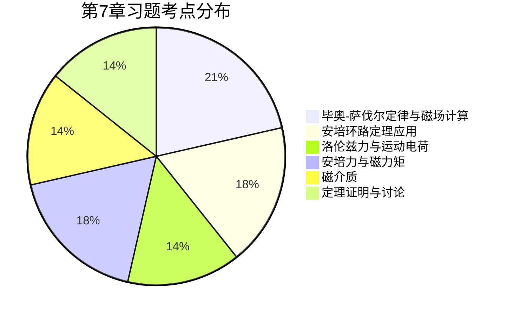

# MOC - 第7章习题

> [!info] 习题说明
> 本章习题覆盖 [[MOC - 第7章]] 四个小节：[[7.1 电流、磁感应强度、毕奥-萨伐尔定律|毕奥-萨伐尔定律]]、[[7.2 磁场高斯定理、安培环路定理|安培环路定理]]、[[7.3 磁场对电流、运动电荷的作用|洛伦兹力与安培力]]、[[7.4 磁介质基础|磁介质]]。重点训练毕奥-萨伐尔定律应用、安培环路定理求对称磁场、带电粒子在磁场中运动、安培力与磁力矩、有介质安培环路定理。所有计算题给出完整步骤、单位检验与必要理想化假设。基本常数：$\mu_{0}=4\pi\times10^{-7}\,\text{T·m/A}$，电子质量 $m_{e}=9.11\times10^{-31}\,\text{kg}$，电子电量 $e=1.602\times10^{-19}\,\text{C}$，质子质量 $m_{p}=1.673\times10^{-27}\,\text{kg}$。

## 一、填空题（6 题）

### 填空 1
真空中无限长直导线通有电流 $I=10\,\text{A}$，距导线 $a=0.20\,\text{m}$ 处的磁感应强度大小为 $\underline{\quad\quad}\,\text{T}$，方向 $\underline{\quad\quad}$。

答案

- 大小：$B=\dfrac{\mu_{0}I}{2\pi a}=\dfrac{4\pi\times10^{-7}\times10}{2\pi\times0.20}=\dfrac{2.0\times10^{-6}}{0.20}=1.0\times10^{-5}\,\text{T}$
- 方向：由右手定则判断，垂直于导线与场点构成的平面，环绕导线（拇指沿电流方向，四指弯曲方向即 $\vec B$ 方向）。

### 填空 2
半径 $R=0.10\,\text{m}$ 的圆形线圈通有电流 $I=2.0\,\text{A}$，圆心处的磁感应强度大小为 $\underline{\quad\quad}\,\text{T}$；轴线上距圆心 $x=R$ 处的磁感应强度大小为 $\underline{\quad\quad}\,\text{T}$。

答案

- 圆心处：$B_{0}=\dfrac{\mu_{0}I}{2R}=\dfrac{4\pi\times10^{-7}\times2.0}{2\times0.10}=\dfrac{8\pi\times10^{-7}}{0.20}\approx1.26\times10^{-5}\,\text{T}$
- 轴线上 $x=R$ 处：$B=\dfrac{\mu_{0}IR^{2}}{2(R^{2}+x^{2})^{3/2}}=\dfrac{\mu_{0}IR^{2}}{2(2R^{2})^{3/2}}=\dfrac{\mu_{0}I}{2\cdot2^{3/2}R}=\dfrac{B_{0}}{2\sqrt{2}}\approx4.44\times10^{-6}\,\text{T}$

### 填空 3
长直螺线管单位长度匝数 $n=2000\,\text{匝/m}$，电流 $I=0.50\,\text{A}$，则管内磁感应强度 $B=\underline{\quad\quad}\,\text{T}$，方向 $\underline{\quad\quad}$。

答案

- $B=\mu_{0}nI=4\pi\times10^{-7}\times2000\times0.50=4\pi\times10^{-7}\times1000\approx1.26\times10^{-3}\,\text{T}$
- 方向：沿螺线管轴线，由右手定则确定（四指沿电流方向弯曲，拇指方向为 $\vec B$ 方向）。

### 填空 4
电子以速度 $v=2.0\times10^{6}\,\text{m/s}$ 垂直射入 $B=0.050\,\text{T}$ 的均匀磁场，做圆周运动的半径 $R=\underline{\quad\quad}\,\text{m}$，周期 $T=\underline{\quad\quad}\,\text{s}$。

答案

- 半径：$R=\dfrac{m_{e}v}{eB}=\dfrac{9.11\times10^{-31}\times2.0\times10^{6}}{1.602\times10^{-19}\times0.050}=\dfrac{1.82\times10^{-24}}{8.01\times10^{-21}}\approx2.27\times10^{-4}\,\text{m}$
- 周期：$T=\dfrac{2\pi m_{e}}{eB}=\dfrac{2\pi\times9.11\times10^{-31}}{1.602\times10^{-19}\times0.050}\approx7.14\times10^{-10}\,\text{s}$

### 填空 5
矩形线圈面积 $S=50\,\text{cm}^{2}$、匝数 $N=100$、电流 $I=0.20\,\text{A}$，置于 $B=0.40\,\text{T}$ 的均匀磁场中，线圈法线与 $\vec B$ 夹角 $\theta=60^{\circ}$。磁矩大小 $m=\underline{\quad\quad}\,\text{A·m}^{2}$，所受力矩大小 $M=\underline{\quad\quad}\,\text{N·m}$。

答案

- 磁矩：$m=NIS=100\times0.20\times50\times10^{-4}=100\times0.20\times5.0\times10^{-3}=0.10\,\text{A·m}^{2}$
- 力矩：$M=mB\sin\theta=0.10\times0.40\times\sin60^{\circ}=0.040\times0.866\approx3.46\times10^{-2}\,\text{N·m}$

### 填空 6
相对磁导率 $\mu_{r}=2000$ 的铁磁材料中，磁场强度 $H=200\,\text{A/m}$，则磁感应强度 $B=\underline{\quad\quad}\,\text{T}$，磁化强度 $M=\underline{\quad\quad}\,\text{A/m}$（设线性近似成立）。

答案

- $B=\mu_{0}\mu_{r}H=4\pi\times10^{-7}\times2000\times200=4\pi\times10^{-7}\times4.0\times10^{5}\approx0.503\,\text{T}$
- $M=(\mu_{r}-1)H=1999\times200\approx3.998\times10^{5}\,\text{A/m}$
- 验算：$\dfrac{B}{\mu_{0}}-H=\dfrac{0.503}{4\pi\times10^{-7}}-200\approx4.0\times10^{5}-200\approx M$ ✓

## 二、选择题（6 题）

### 选择 1
关于磁感应线，下列说法正确的是：

A. 磁感应线始于 N 极止于 S 极
B. 任意两条磁感应线可以相交
C. 磁感应线是闭合曲线，无始无终
D. 磁感应线密度与 $B$ 大小成反比

答案

**C**。磁感应线是闭合曲线（无磁单极，磁场高斯定理 $\oint\vec B\cdot d\vec S=0$），不相交（场方向唯一），密度与 $B$ 大小成正比。N/S 极是磁荷观点的旧描述，实际磁感应线在磁体内部也连续闭合。

### 选择 2
关于安培环路定理 $\oint\vec B\cdot d\vec l=\mu_{0}\sum I_{\text{内}}$，下列说法正确的是：

A. 仅当电流分布具有对称性时才成立
B. $\sum I_{\text{内}}$ 与回路所张曲面的选取有关
C. 对恒定电流，回路不包围的电流对 $\vec B$ 没有贡献
D. 回路不包围的电流对 $\vec B$ 可能有贡献，但不影响环量

答案

**D**。安培环路定理本身对任意恒定电流分布成立（A 错）；对恒定闭合电流，$\sum I_{\text{内}}$ 与曲面选取无关（B 错）；回路外的电流在回路上各点产生的 $\vec B$ 一般不为零（C 错），但其环量贡献为零（D 对）。"对称性"只是把 $B$ 提出积分号外作为计算工具的条件，不是定理成立的条件。

### 选择 3
一带电粒子以速度 $\vec v$ 进入均匀磁场 $\vec B$，下列哪种情形下粒子动能保持不变？

A. $\vec v\perp\vec B$，粒子做圆周运动
B. $\vec v$ 与 $\vec B$ 夹角任意，粒子做螺旋线运动
C. $\vec v\parallel\vec B$，粒子做匀速直线运动
D. 以上都保持动能不变

答案

**D**。洛伦兹力 $\vec F=q\vec v\times\vec B$ 总与 $\vec v$ 垂直，功率 $P=\vec F\cdot\vec v=0$，故无论何种情形都不做功，动能恒定。A、B、C 都是恒定动能的特例。

### 选择 4
载流线圈在均匀磁场中所受：

A. 合力为零，合力矩为零
B. 合力为零，合力矩一般不为零
C. 合力一般不为零，合力矩为零
D. 合力一般不为零，合力矩一般不为零

答案

**B**。均匀磁场中任意闭合电流回路所受合力 $\vec F=\oint I\,d\vec l\times\vec B=I\left(\oint d\vec l\right)\times\vec B=0$；但力矩 $\vec M=\vec m\times\vec B$ 一般不为零（除非 $\vec m\parallel\vec B$）。

### 选择 5
关于三类磁介质，下列说法正确的是：

A. 顺磁质 $\mu_{r}<1$，抗磁质 $\mu_{r}>1$
B. 顺磁质 $\vec M$ 与 $\vec B$ 同向，抗磁质 $\vec M$ 与 $\vec B$ 反向
C. 铁磁质的 $\mu_{r}$ 是常数，与外磁场无关
D. 所有磁介质超过居里点都变成铁磁质

答案

**B**。顺磁质 $\mu_{r}\gtrsim1$、$\vec M\parallel\vec B$；抗磁质 $\mu_{r}\lesssim1$、$\vec M$ 反平行 $\vec B$（A 错，B 对）。铁磁质 $\mu_{r}$ 非线性且与磁场历史有关（C 错）。铁磁质超过居里点转为顺磁质（D 错）。

### 选择 6
两根平行长直导线相距 $d$，分别通有同向电流 $I_{1}$、$I_{2}$，单位长度导线 1 受力大小为：

A. $\dfrac{\mu_{0}I_{1}I_{2}}{4\pi d}$
B. $\dfrac{\mu_{0}I_{1}I_{2}}{2\pi d}$
C. $\dfrac{\mu_{0}I_{1}I_{2}}{\pi d}$
D. $\dfrac{\mu_{0}(I_{1}+I_{2})}{2\pi d}$

答案

**B**。导线 1 在导线 2 处产生 $B_{1}=\dfrac{\mu_{0}I_{1}}{2\pi d}$，导线 2 单位长度受力 $F/L=I_{2}B_{1}=\dfrac{\mu_{0}I_{1}I_{2}}{2\pi d}$。同向电流为吸引力，反向为排斥力。这是安培定义的依据。

## 三、计算题（10 题）

### 计算 1（圆电流轴线磁场）
半径 $R=0.080\,\text{m}$ 的圆形线圈通有电流 $I=3.0\,\text{A}$。求轴线上距圆心 $x=0.060\,\text{m}$ 处的磁感应强度大小与方向。

解答

**公式**（由 [[7.1 电流、磁感应强度、毕奥-萨伐尔定律#圆电流轴线上的磁场]]）：
$$B=\dfrac{\mu_{0}IR^{2}}{2(R^{2}+x^{2})^{3/2}}$$

**代入数据**：
- $R^{2}=0.0064\,\text{m}^{2}$，$x^{2}=0.0036\,\text{m}^{2}$
- $R^{2}+x^{2}=0.0100\,\text{m}^{2}$
- $(R^{2}+x^{2})^{3/2}=(0.0100)^{3/2}=1.0\times10^{-3}\,\text{m}^{3}$

$$B=\dfrac{4\pi\times10^{-7}\times3.0\times0.0064}{2\times1.0\times10^{-3}}=\dfrac{2.41\times10^{-8}}{2.0\times10^{-3}}\approx1.21\times10^{-5}\,\text{T}$$

**方向**：沿轴线方向，由右手定则确定（四指沿电流方向弯曲，拇指方向即 $\vec B$ 在轴线上方向）。

**单位检验**：$\dfrac{\text{T·m/A}\cdot\text{A}\cdot\text{m}^{2}}{\text{m}^{3}}=\text{T}$ ✓

**讨论**：圆心处 $B_{0}=\dfrac{\mu_{0}I}{2R}=\dfrac{4\pi\times10^{-7}\times3.0}{2\times0.080}\approx2.36\times10^{-5}\,\text{T}$，所求点 $B/B_{0}\approx0.514$（与 $\dfrac{R^{3}}{(R^{2}+x^{2})^{3/2}}=\dfrac{0.0064^{3/2}\cdot R^{?}}{...}$ 计算一致）。

### 计算 2（有限长直电流磁场）
长 $L=0.40\,\text{m}$ 的直导线通有电流 $I=5.0\,\text{A}$，场点 $P$ 在导线中垂线上距导线 $a=0.30\,\text{m}$。求 $P$ 处磁感应强度大小。

解答

**公式**（直线电流，[[7.1 电流、磁感应强度、毕奥-萨伐尔定律#直线电流的磁场]]）：
$$B=\dfrac{\mu_{0}I}{4\pi a}(\cos\theta_{1}-\cos\theta_{2})$$

由对称性（场点在中垂线上），$\theta_{1}=\arctan\dfrac{L/2}{a}=\arctan\dfrac{0.20}{0.30}=\arctan\dfrac{2}{3}\approx33.69^{\circ}$，$\theta_{2}=\pi-\theta_{1}$，$\cos\theta_{2}=-\cos\theta_{1}$。

$$\cos\theta_{1}=\dfrac{L/2}{\sqrt{a^{2}+(L/2)^{2}}}=\dfrac{0.20}{\sqrt{0.09+0.04}}=\dfrac{0.20}{\sqrt{0.13}}=\dfrac{0.20}{0.361}\approx0.555$$

$$B=\dfrac{4\pi\times10^{-7}\times5.0}{4\pi\times0.30}\times(0.555-(-0.555))=\dfrac{5.0\times10^{-7}}{0.30}\times1.110$$
$$B\approx1.67\times10^{-6}\times1.110\approx1.85\times10^{-6}\,\text{T}$$

**单位检验**：$\dfrac{\text{T·m/A}\cdot\text{A}}{\text{m}}=\text{T}$ ✓

**与无限长结果比较**：无限长 $B_{\infty}=\dfrac{\mu_{0}I}{2\pi a}=\dfrac{4\pi\times10^{-7}\times5.0}{2\pi\times0.30}\approx3.33\times10^{-6}\,\text{T}$，有限长结果约为无限长的 $55.5\%$，合理（导线短则磁场弱）。

### 计算 3（安培环路定理：圆柱电流）
半径 $R=0.040\,\text{m}$ 的无限长圆柱形导线通有总电流 $I=20\,\text{A}$（沿轴向均匀分布）。求：（1）$r=0.020\,\text{m}$（导线内）；（2）$r=0.060\,\text{m}$（导线外）的磁感应强度大小。

解答

**对称性**：柱对称，$\vec B$ 沿以轴为圆心的同心圆切向，大小仅依赖 $r$。取半径 $r$ 的圆形回路。

**电流密度**：$j=\dfrac{I}{\pi R^{2}}=\dfrac{20}{\pi\times0.040^{2}}=\dfrac{20}{5.03\times10^{-3}}\approx3980\,\text{A/m}^{2}$

**（1）导线内 $r=0.020\,\text{m}<R$**：
$$I_{\text{内}}=j\cdot\pi r^{2}=I\cdot\dfrac{r^{2}}{R^{2}}=20\times\dfrac{0.020^{2}}{0.040^{2}}=20\times0.25=5.0\,\text{A}$$
$$B=\dfrac{\mu_{0}I_{\text{内}}}{2\pi r}=\dfrac{4\pi\times10^{-7}\times5.0}{2\pi\times0.020}=\dfrac{2.0\times10^{-6}}{0.020}=1.0\times10^{-4}\,\text{T}$$

**（2）导线外 $r=0.060\,\text{m}>R$**：
$$I_{\text{内}}=I=20\,\text{A}$$
$$B=\dfrac{\mu_{0}I}{2\pi r}=\dfrac{4\pi\times10^{-7}\times20}{2\pi\times0.060}=\dfrac{4.0\times10^{-6}}{0.060}\approx6.67\times10^{-5}\,\text{T}$$

**单位检验**：$\text{T}=\dfrac{\text{T·m/A}\cdot\text{A}}{\text{m}}$ ✓

**结论**：内部 $B\propto r$（$r=R$ 时 $B=2.0\times10^{-4}\,\text{T}$ 最大），外部 $B\propto1/r$。

### 计算 4（同轴电缆磁场）
同轴电缆内导体半径 $R_{1}=1.0\,\text{mm}$，通电流 $I=5.0\,\text{A}$（沿 $+z$）；外导体薄壳半径 $R_{2}=4.0\,\text{mm}$，通反向电流 $I$（沿 $-z$）。求：（1）$r=2.0\,\text{mm}$；（2）$r=5.0\,\text{mm}$ 处的 $B$。

解答

**对称性**：柱对称，$\vec B$ 沿同心圆切向。

**（1）$r=2.0\,\text{mm}=2.0\times10^{-3}\,\text{m}$，位于两导体之间（$R_{1}<r<R_{2}$）**：
$$I_{\text{内}}=I=5.0\,\text{A}$$
$$B=\dfrac{\mu_{0}I}{2\pi r}=\dfrac{4\pi\times10^{-7}\times5.0}{2\pi\times2.0\times10^{-3}}=\dfrac{1.0\times10^{-6}}{2.0\times10^{-3}}=5.0\times10^{-4}\,\text{T}$$

**（2）$r=5.0\,\text{mm}=5.0\times10^{-3}\,\text{m}>R_{2}$（外部）**：
$$I_{\text{内}}=I-I=0$$
$$B=0$$

**结论**：同轴电缆外部磁场为零，体现磁屏蔽特性（电流往返相互抵消）。

**单位检验**：$\text{T}=\dfrac{\text{T·m/A}\cdot\text{A}}{\text{m}}$ ✓

### 计算 5（带电粒子螺旋运动）
质子以速度 $v=4.0\times10^{5}\,\text{m/s}$ 射入 $B=0.10\,\text{T}$ 的均匀磁场，$\vec v$ 与 $\vec B$ 夹角 $\theta=60^{\circ}$。求：（1）回旋半径；（2）周期；（3）螺距。

解答

**速度分解**：
- $v_{\perp}=v\sin\theta=4.0\times10^{5}\times\sin60^{\circ}=4.0\times10^{5}\times0.866=3.46\times10^{5}\,\text{m/s}$
- $v_{\parallel}=v\cos\theta=4.0\times10^{5}\times0.5=2.0\times10^{5}\,\text{m/s}$

**（1）回旋半径**（见 [[7.3 磁场对电流、运动电荷的作用#螺旋线运动]]）：
$$R=\dfrac{m_{p}v_{\perp}}{eB}=\dfrac{1.673\times10^{-27}\times3.46\times10^{5}}{1.602\times10^{-19}\times0.10}=\dfrac{5.79\times10^{-22}}{1.602\times10^{-20}}\approx3.61\times10^{-2}\,\text{m}=3.61\,\text{cm}$$

**（2）周期**：
$$T=\dfrac{2\pi m_{p}}{eB}=\dfrac{2\pi\times1.673\times10^{-27}}{1.602\times10^{-19}\times0.10}\approx6.57\times10^{-7}\,\text{s}=0.657\,\mu\text{s}$$

**（3）螺距**：
$$h=v_{\parallel}\cdot T=2.0\times10^{5}\times6.57\times10^{-7}\approx0.131\,\text{m}=13.1\,\text{cm}$$

**单位检验**：$R$ 单位 m ✓；$T$ 单位 s ✓；$h$ 单位 m ✓

**讨论**：质子比电子重约 1836 倍，故同样能量下半径大得多、周期长得多。

### 计算 6（霍耳效应）
铜片宽 $b=2.0\,\text{cm}$、厚 $d=1.0\,\text{mm}$，通有电流 $I=10\,\text{A}$，置于 $B=1.5\,\text{T}$ 的均匀磁场中（垂直电流方向）。铜的载流子密度 $n=8.5\times10^{28}\,\text{m}^{-3}$。求：（1）霍耳电压；（2）霍耳系数。

解答

**霍耳效应公式**（见 [[7.3 磁场对电流、运动电荷的作用#霍耳效应]]）：
$$U_{H}=\dfrac{IB}{n|q|d},\quad R_{H}=\dfrac{1}{n|q|}$$

**（1）霍耳电压**（$|q|=e=1.602\times10^{-19}\,\text{C}$）：
$$U_{H}=\dfrac{10\times1.5}{8.5\times10^{28}\times1.602\times10^{-19}\times1.0\times10^{-3}}=\dfrac{15}{1.362\times10^{7}}\approx1.10\times10^{-6}\,\text{V}=1.10\,\mu\text{V}$$

**（2）霍耳系数**：
$$R_{H}=\dfrac{1}{n|q|}=\dfrac{1}{8.5\times10^{28}\times1.602\times10^{-19}}=\dfrac{1}{1.362\times10^{10}}\approx7.34\times10^{-11}\,\text{m}^{3}\text{/C}$$

**单位检验**：$U_{H}$ 单位 $\text{V}=\dfrac{\text{A}\cdot\text{T}}{\text{m}^{-3}\cdot\text{C}\cdot\text{m}}=\dfrac{\text{A}\cdot\text{N/(A·m)}}{\text{C/m}^{3}\cdot\text{m}}=\dfrac{\text{N/m}}{\text{C/m}^{2}}=\dfrac{\text{J/m}}{\text{C/m}^{2}}=\text{V}$ ✓；$R_{H}$ 单位 $\text{m}^{3}\text{/C}$ ✓

**讨论**：铜的霍耳电压很小（$\mu\text{V}$ 量级），实际霍耳传感器多用半导体（$n$ 小 $5\sim6$ 个量级，$U_{H}$ 大）。

### 计算 7（安培力：弯曲导线）
半圆形导线半径 $R=0.15\,\text{m}$，通有电流 $I=8.0\,\text{A}$，置于均匀磁场 $B=0.30\,\text{T}$ 中，磁场垂直半圆平面。求导线所受安培力大小与方向。

解答

**分析**（见 [[7.3 磁场对电流、运动电荷的作用#几种典型情形]]）：均匀磁场中任意弯曲导线受力等于从起点到终点的直导线受力。半圆两端点距离为直径 $2R$，方向沿直径。

**公式**：$\vec F=I\vec L_{\text{有效}}\times\vec B$，$\vec L_{\text{有效}}$ 沿直径方向（从起点到终点）。

**大小**（直径垂直磁场，$\sin\theta=1$）：
$$F=BIL_{\text{有效}}=BI\cdot2R=0.30\times8.0\times2\times0.15=0.30\times8.0\times0.30=0.72\,\text{N}$$

**方向**：由 $\vec L_{\text{有效}}\times\vec B$ 给出。设电流从半圆一端沿半圆流向另一端，$\vec L_{\text{有效}}$ 沿直径方向；$\vec B$ 垂直半圆面；叉乘结果在半圆面内、垂直直径方向。

**单位检验**：$\text{N}=\text{T·A·m}$ ✓

**讨论**：用积分法（$d\vec F=I\,d\vec l\times\vec B$）逐元计算可得同样结果，但用"等效直导线"更简捷——这仅对均匀磁场成立。

### 计算 8（磁力矩与势能）
矩形线圈 $10\,\text{cm}\times5\,\text{cm}$，$N=50$ 匝，电流 $I=0.40\,\text{A}$，置于 $B=0.50\,\text{T}$ 的均匀磁场中。初始线圈法线与 $\vec B$ 夹角 $\theta_{0}=90^{\circ}$。求：（1）初始磁力矩；（2）把线圈转到 $\theta=0$（稳定平衡）磁力矩做的功；（3）外力需做的功。

解答

**磁矩**：
$$m=NIS=50\times0.40\times(0.10\times0.05)=50\times0.40\times5.0\times10^{-3}=0.10\,\text{A·m}^{2}$$

**（1）初始磁力矩**（$\theta_{0}=90^{\circ}$，最大力矩）：
$$M_{0}=mB\sin90^{\circ}=mB=0.10\times0.50=5.0\times10^{-2}\,\text{N·m}$$

**（2）磁力矩做的功**（线圈从 $\theta_{0}=90^{\circ}$ 转到 $\theta=0$）：
$$W_{\text{磁}}=\int_{90^{\circ}}^{0}M\,d\theta=\int_{90^{\circ}}^{0}mB\sin\theta\,d\theta=mB[-\cos\theta]\Big|_{90^{\circ}}^{0}=mB(-\cos0+\cos90^{\circ})=-mB$$
$$W_{\text{磁}}=-0.10\times0.50=-5.0\times10^{-2}\,\text{J}$$
（磁力矩做负功——因磁力矩指向使 $\theta$ 减小方向，但 $d\theta$ 取从 $90^{\circ}$ 到 $0$ 为负，故乘积为负；或理解为磁势能减少 $W_{\text{磁}}=-\Delta W_{m}$，$\Delta W_{m}=W_{m}(0)-W_{m}(90^{\circ})=-mB-0=-mB$，故 $W_{\text{磁}}=+mB$？需仔细）

**重新清晰推导**：磁力矩方向使 $\theta$ 减小，故线圈自然转向 $\theta=0$。磁力矩做功：
$$W_{\text{磁}}=-\Delta W_{m}=-(W_{m,\text{末}}-W_{m,\text{初}})=-(-mB\cos0-(-mB\cos90^{\circ}))=-(-mB-0)=+mB=+5.0\times10^{-2}\,\text{J}$$

即磁力矩做正功 $5.0\times10^{-2}\,\text{J}$（线圈自然转向平衡位置释放能量）。

**（3）外力做功**：若缓慢转动（动能不变），外力做功 = $-W_{\text{磁}}=-5.0\times10^{-2}\,\text{J}$。但题目意思可能是从 $\theta_{0}=90^{\circ}$ 让线圈自由转到 $\theta=0$，外力不做功，磁力矩做功转化为动能（若无阻尼）。若问"外力把线圈从 $\theta=0$ 转到 $\theta=90^{\circ}$ 所需做功"，则为 $+mB=+5.0\times10^{-2}\,\text{J}$。

**结论**：
- 初始磁力矩 $5.0\times10^{-2}\,\text{N·m}$
- 线圈从 $90^{\circ}$ 自由转到 $0^{\circ}$，磁力矩做正功 $5.0\times10^{-2}\,\text{J}$，对应磁势能减少 $mB$
- 外力反向缓慢拉回 $90^{\circ}$ 需做功 $5.0\times10^{-2}\,\text{J}$

**单位检验**：$\text{N·m}=\text{J}=\text{A·m}^{2}\cdot\text{T}$ ✓

### 计算 9（有介质安培环路定理）
环形铁芯螺线管总匝数 $N=400$，环平均周长 $l=0.40\,\text{m}$，截面 $S=1.0\times10^{-4}\,\text{m}^{2}$，相对磁导率 $\mu_{r}=1500$（设工作点未饱和），电流 $I=0.20\,\text{A}$。求：（1）铁芯中 $H$；（2）$B$；（3）穿过铁芯截面的磁通量 $\Phi_{B}$。

解答

**对称性**：环形铁芯中 $\vec H$、$\vec B$ 沿环切向、大小恒定。取平均半径圆形回路。

**（1）求 $H$**（有介质安培环路定理，见 [[7.4 磁介质基础#有磁介质时的安培环路定理]]）：
$$\oint\vec H\cdot d\vec l=H\cdot l=NI$$
$$H=\dfrac{NI}{l}=\dfrac{400\times0.20}{0.40}=200\,\text{A/m}$$

**（2）求 $B$**：
$$B=\mu_{0}\mu_{r}H=4\pi\times10^{-7}\times1500\times200=4\pi\times10^{-7}\times3.0\times10^{5}\approx0.377\,\text{T}$$

**（3）磁通量**：
$$\Phi_{B}=B\cdot S=0.377\times1.0\times10^{-4}=3.77\times10^{-5}\,\text{Wb}$$

**单位检验**：$H$ 单位 A/m ✓；$B$ 单位 T ✓；$\Phi_{B}$ 单位 Wb = T·m² ✓

**讨论**：若铁芯抽去（$\mu_{r}=1$），$B_{0}=\mu_{0}H=4\pi\times10^{-7}\times200\approx2.51\times10^{-4}\,\text{T}$，仅约 $6.7\times10^{-4}$ 倍于有铁芯情形——铁芯使磁通增大 1500 倍。

### 计算 10（两平行电流间作用力）
两根平行长直导线相距 $d=0.10\,\text{m}$，分别通有反向电流 $I_{1}=8.0\,\text{A}$、$I_{2}=4.0\,\text{A}$。求：（1）导线 1 上长 $L=0.50\,\text{m}$ 一段所受的力大小与方向；（2）单位长度上的力。

解答

**分析**（见 [[7.3 磁场对电流、运动电荷的作用#安培力]]）：导线 2 在导线 1 处产生磁场 $B_{2}=\dfrac{\mu_{0}I_{2}}{2\pi d}$，方向由右手定则（与两导线平面垂直）。导线 1 上的电流元受安培力 $dF=I_{1}B_{2}\,dl$。

**（1）长 $L$ 段受力**：
$$B_{2}=\dfrac{\mu_{0}I_{2}}{2\pi d}=\dfrac{4\pi\times10^{-7}\times4.0}{2\pi\times0.10}=\dfrac{8.0\times10^{-7}}{0.10}=8.0\times10^{-6}\,\text{T}$$
$$F=B_{2}I_{1}L=8.0\times10^{-6}\times8.0\times0.50=3.2\times10^{-5}\,\text{N}$$

**方向**：两电流反向时为**排斥力**（由右手定则：$I_{2}$ 在 $I_{1}$ 处 $\vec B$ 垂直纸面向外/内，$\vec F=I_{1}\vec L\times\vec B$ 指向远离 $I_{2}$ 方向）。

**（2）单位长度力**：
$$\dfrac{F}{L}=\dfrac{\mu_{0}I_{1}I_{2}}{2\pi d}=\dfrac{4\pi\times10^{-7}\times8.0\times4.0}{2\pi\times0.10}=\dfrac{6.4\times10^{-5}}{0.20}=3.2\times10^{-4}\,\text{N/m}$$

**单位检验**：$\text{N}=\text{T·A·m}$ ✓；$\text{N/m}=\text{T·A}$ ✓

**讨论**：同向电流为吸引，反向电流为排斥。这正是安培定义的基础：两根相距 1 m 的长直导线通有等大同向电流，若单位长度相互吸引力为 $2\times10^{-7}\,\text{N/m}$，则电流为 1 A。

## 四、证明与讨论题（4 题）

### 证明 1（运动电荷磁场公式）
由毕奥-萨伐尔定律推导以速度 $\vec v$ 匀速运动的点电荷 $q$ 在场点产生的磁场公式 $\vec B=\dfrac{\mu_{0}}{4\pi}\dfrac{q\vec v\times\hat r}{r^{2}}$，并说明适用条件。

证明

**步骤 1**：考虑一段载流导线，电流元 $I\,d\vec l$ 中包含载流子总数 $dN=nS\,dl$（$n$ 为数密度，$S$ 为截面积，$dl$ 为长度元）。每个载流子电量为 $q$、漂移速度 $\vec v$（沿 $d\vec l$ 方向）。

**步骤 2**：电流强度 $I=n|q|Sv$，故
$$I\,d\vec l=n|q|Sv\,d\vec l=dN\cdot|q|\vec v=dN\cdot q\vec v\cdot\text{sgn}(q)$$
（注意：当 $q>0$ 时 $\vec v\parallel d\vec l$；$q<0$ 时 $\vec v$ 与 $d\vec l$ 反向，但 $I$ 沿正电荷方向，故 $I\,d\vec l=dN\cdot q\vec v$ 恒成立）

**步骤 3**：代入毕奥-萨伐尔定律：
$$d\vec B=\dfrac{\mu_{0}}{4\pi}\dfrac{I\,d\vec l\times\hat r}{r^{2}}=\dfrac{\mu_{0}}{4\pi}\dfrac{dN\cdot q\vec v\times\hat r}{r^{2}}$$

**步骤 4**：对单个点电荷（$dN=1$）即得
$$\boxed{\vec B=\dfrac{\mu_{0}}{4\pi}\dfrac{q\vec v\times\hat r}{r^{2}}}$$

**适用条件**：
- $v\ll c$（非相对论），高速时需考虑推迟势与相对论变换；
- 匀速运动（无加速度）。加速电荷辐射电磁波，公式需修正（见近代物理）；
- 恒定电流的极限情形，瞬时公式对运动电荷在每个时刻成立。

$\square$

### 证明 2（安培环路定理用于长直螺线管）
利用安培环路定理证明：密绕长直螺线管内部磁感应强度 $B=\mu_{0}nI$，外部磁感应强度近似为零。说明所需的近似条件。

证明

**模型**：长直螺线管长度 $L$，半径 $R$，单位长度匝数 $n$，电流 $I$。设 $L\gg R$（无限长近似）。

**对称性分析**：
1. 由螺线管平移对称性（沿轴向）与旋转对称性（绕轴），$\vec B$ 方向沿轴线方向、大小仅依赖到轴距离 $r$；
2. 在 $L\to\infty$ 极限下，管外远离端部区域磁场趋于零（各圈贡献在远场相互抵消）。

**取回路**：矩形回路 $abcd$，长边 $ab$（长 $l$）在管内平行轴线，$cd$（长 $l$）在管外平行轴线，短边 $bc$、$da$ 跨越管壁（长 $R_{\text{外}}-R_{\text{内}}$，沿径向）。

**环路积分**：
$$\oint\vec B\cdot d\vec l=\int_{ab}\vec B\cdot d\vec l+\int_{bc}\vec B\cdot d\vec l+\int_{cd}\vec B\cdot d\vec l+\int_{da}\vec B\cdot d\vec l$$

- $ab$ 段：管内 $\vec B\parallel d\vec l$，贡献 $B_{\text{内}}\cdot l$；
- $cd$ 段：管外 $B_{\text{外}}\approx0$，贡献 $0$；
- $bc$、$da$ 段：管内 $\vec B$ 沿轴向、$d\vec l$ 沿径向，$\vec B\perp d\vec l$，贡献 $0$；管外 $B\approx0$，贡献 $0$。

故 $\oint\vec B\cdot d\vec l=B_{\text{内}}\cdot l$。

**包围电流**：回路穿过 $n\cdot l$ 匝线圈（每匝电流 $I$，方向由右手定则取正），$\sum I_{\text{内}}=nIl$。

**由安培环路定理**：
$$B_{\text{内}}\cdot l=\mu_{0}nIl\Rightarrow\boxed{B_{\text{内}}=\mu_{0}nI}$$

**管外**：取管外矩形回路（不穿过电流），$\sum I_{\text{内}}=0$，由对称性 $B_{\text{外}}=0$（在 $L\to\infty$ 极限）。

**近似条件**：
- $L\gg R$（无限长近似），端部效应可忽略；
- 密绕（匝间距 $\ll R$），电流可视为均匀面电流；
- 内部远离端部（端部 $B\approx\mu_{0}nI/2$，有过渡）。

$\square$

### 证明 3（任意弯曲导线在均匀磁场中的合力）
证明：在均匀磁场 $\vec B$ 中，从 $A$ 到 $B$ 的任意形状弯曲载流导线所受合力 $\vec F=I\vec L_{AB}\times\vec B$，其中 $\vec L_{AB}$ 为从 $A$ 到 $B$ 的位移矢量。讨论此结论的局限。

证明

**步骤 1**：将导线分成无穷多电流元 $I\,d\vec l$，每个电流元受力 $d\vec F=I\,d\vec l\times\vec B$。

**步骤 2**：合力
$$\vec F=\int_{A}^{B}d\vec F=I\int_{A}^{B}d\vec l\times\vec B$$

**步骤 3**：因 $\vec B$ 均匀（与位置无关），可提到积分号外：
$$\vec F=I\left(\int_{A}^{B}d\vec l\right)\times\vec B$$

**步骤 4**：$\displaystyle\int_{A}^{B}d\vec l=\vec L_{AB}$（位移矢量与路径无关），故
$$\boxed{\vec F=I\vec L_{AB}\times\vec B}$$

**物理含义**：均匀磁场中弯曲导线所受合力等于从起点到终点的直导线所受力，与导线形状无关。

**局限**：
1. 仅对**均匀磁场**成立——非均匀磁场中 $\vec B$ 不能提到积分号外，不同路径结果不同；
2. 仅给出**合力**，不给出**力矩**——力矩一般依赖于导线形状（即使合力为零，力矩可能不为零，如闭合线圈）；
3. 对**闭合回路**（$A=B$）$\vec L_{AB}=0$，故 $\vec F=0$——这与"均匀磁场中任意闭合电流回路合力为零"一致。

$\square$

### 讨论 4（永磁体内部 $\vec B$ 与 $\vec H$ 的方向）
讨论条形永久磁铁内部 $\vec B$ 与 $\vec H$ 的方向关系，并说明为什么 $\oint\vec H\cdot d\vec l=0$ 不意味着 $\vec H=0$。

讨论

**永磁体特点**：
- 无自由电流（$I_{\text{free}}=0$），但有磁化强度 $\vec M\ne0$（剩磁）；
- $\vec B=\mu_{0}(\vec H+\vec M)$ 恒成立；
- 内部 $\vec M$ 沿磁化方向（如 N→S 内部为 S→N？需厘清）。

**约定方向**：设条形磁铁 N 极在右、S 极在左，则内部 $\vec M$ 从 S 指向 N（即向右，与外部从 N 到 S 的 $\vec B$ 线连续闭合）。

**$\vec B$ 方向**：磁感应线闭合，内部 $\vec B$ 从 S→N（向右，与 $\vec M$ 同向）。

**$\vec H$ 方向**：$\vec H=\dfrac{\vec B}{\mu_{0}}-\vec M$。对硬磁材料（$\mu_{r}\approx1$，$\vec M\approx\vec B/\mu_{0}$），$\vec H\approx0$ 但略反向于 $\vec M$；一般永磁体内 $\vec H$ 与 $\vec M$ 反向（**去磁场**），与 $\vec B$ 反向。

具体地：$\vec B=\mu_{0}(\vec H+\vec M)$，若 $\vec B\parallel\vec M$ 且 $|\vec M|\gg|\vec B|/\mu_{0}$？实际关系由磁滞回线工作点决定，硬磁材料工作点在第二象限（$\vec M>0$，$\vec H<0$，$\vec B=\mu_{0}(\vec H+\vec M)>0$ 但小于 $\mu_{0}\vec M$）。

**结论**：永磁体内部
- $\vec B$ 与 $\vec M$ 同向（从 S→N 内部）；
- $\vec H$ 与 $\vec M$ 反向（即从 N→S 内部），是去磁场；
- $|\vec B|=\mu_{0}|\vec M+\vec H|<\mu_{0}|\vec M|$（去磁场削弱了 $\vec B$）。

**为什么 $\oint\vec H\cdot d\vec l=0$ 不意味着 $\vec H=0$**：

环路定理 $\oint\vec H\cdot d\vec l=\sum I_{\text{free}}=0$ 仅说明 $\vec H$ 的**环量**为零，不说明 $\vec H$ 处处为零。类比静电场环路定理 $\oint\vec E\cdot d\vec l=0$ 也不意味着 $\vec E=0$。

实际上，永磁体内部 $\vec H$ 由"磁荷"（束缚磁荷）产生：N 极可视为正磁荷源，S 极为负磁荷源（注意：此为等效描述，不意味着存在磁单极子）。$\vec H$ 线从 N 极发出，经磁体外部回到 S 极，再从磁体内部 S→N？需重新检查。

正确图像：在"磁荷"观点下，永磁体表面有等效束缚磁荷 $\sigma_{m}=\mu_{0}\vec M\cdot\hat n$（N 端为 $+\sigma_{m}$，S 端为 $-\sigma_{m}$）。$\vec H$ 由这些磁荷产生，$\nabla\cdot\vec H=-\nabla\cdot\vec M$。$\vec H$ 线从 $+\sigma_{m}$（N 极）发出，到 $-\sigma_{m}$（S 极）终止，**包括磁体内部也从 N→S**，故磁体内部 $\vec H$ 与 $\vec M$ 反向。

**核心区别**：
- $\vec B$ 无源（$\nabla\cdot\vec B=0$），$\vec B$ 线闭合；
- $\vec H$ 有源（$\nabla\cdot\vec H=-\nabla\cdot\vec M\ne0$），$\vec H$ 线不闭合，"源"为磁化强度的散度（等效磁荷）。

这是 $\vec H$ 与 $\vec B$ 在介质中物理含义的根本区别，也是工程上区分二者的重要意义。

$\square$

## 考点统计

| 题型 | 题数 | 主要考点 |
| ---- | ---- | ---- |
| 填空 | 6 | 直线电流磁场、圆电流轴线、螺线管内部磁场、电子回旋运动、磁矩与磁力矩、磁介质 $\mu_{r}$ 与 $H/B/M$ 关系 |
| 选择 | 6 | 磁感应线性质、安培环路定理理解、洛伦兹力做功、载流线圈受力、磁介质分类、平行电流作用力 |
| 计算 | 10 | 圆电流轴线、有限长直电流、安培环路定理求圆柱电流、同轴电缆、螺旋运动、霍耳效应、弯曲导线安培力、磁力矩与势能、有介质安培环路定理、两平行电流作用力 |
| 证明/讨论 | 4 | 运动电荷磁场公式、长螺线管磁场证明、均匀磁场弯曲导线合力、永磁体内部 $\vec B$ 与 $\vec H$ |

### 考点分布

### 重点题型

1. **毕奥-萨伐尔定律与磁场计算**：填空 1/2/3、计算 1/2、证明 1——直线电流、圆电流轴线、螺线管公式，运动电荷磁场推导。
2. **安培环路定理应用**：填空 3、计算 3/4/9、证明 2——圆柱电流、同轴电缆、有介质环形铁芯、长螺线管证明。**本章核心计算工具**。
3. **洛伦兹力与运动电荷**：填空 4、选择 3、计算 5/6——圆周/螺旋运动半径周期、霍耳效应、动能不变性。
4. **安培力与磁力矩**：填空 5、选择 4/6、计算 7/8/10、证明 3——弯曲导线安培力、磁力矩与势能、两平行电流作用力、合力证明。
5. **磁介质**：填空 6、选择 5、计算 9、讨论 4——$\mu_{r}$、$H/B/M$ 关系、有介质安培环路定理、铁磁质分类、永磁体 $\vec B$ 与 $\vec H$。

## 章节导航

- 上一级：[[MOC - 第7章]]
- 知识点：[[7.1 电流、磁感应强度、毕奥-萨伐尔定律]] · [[7.2 磁场高斯定理、安培环路定理]] · [[7.3 磁场对电流、运动电荷的作用]] · [[7.4 磁介质基础]]
- 上一章习题：`[[MOC - 第6章习题]]`
- 下一章习题：`[[MOC - 第8章习题]]`

## 相关标签

#大学物理 #习题 #磁感应强度 #安培环路定理 #洛伦兹力 #安培力 #磁介质
