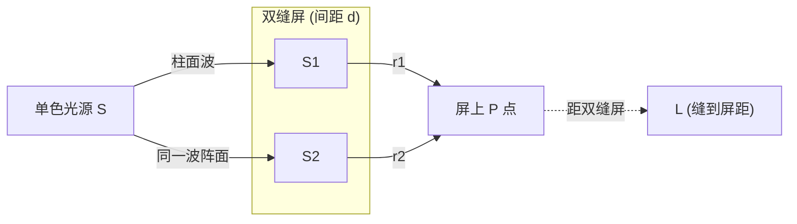

# 10.1 光的相干性、杨氏双缝干涉

> [!info] 本节定位
> 本节是波动光学的**理论起点**与**实验范式**。它解决的核心问题是：**普通光源发出的光为何不能直接产生干涉，又如何通过特殊装置获得相干光，进而观测并定量分析干涉条纹**。本节建立了贯穿全章的"**光程差 → 相位差 → 强度分布**"分析链条，是 [[10.2 薄膜干涉、劈尖、牛顿环|10.2]] 薄膜干涉、[[10.3 光的衍射：单缝衍射、光栅衍射|10.3]] 衍射乃至 [[10.4 光的偏振|10.4]] 偏振光干涉的共同方法论基础。先修内容为 [[MOC - 第9章|第9章]] 中波的叠加原理与相位差概念。

## 一、光的电磁本性与发光机理

> [!definition] 光的电磁本性
> 光是**电磁波**，是横波，电场强度 $\vec E$ 与磁感应强度 $\vec B$ 互相垂直且都垂直于传播方向。引起视觉与感光作用的主要是电场 $\vec E$，故称 $\vec E$ 为**光矢量**。
> - 真空中光速 $c=2.998\times10^{8}\,\text{m/s}$（精确值，定义值）；
> - 介质中光速 $v=c/n$，$n$ 为介质折射率（无量纲）；
> - 介质中光波长 $\lambda_n=\lambda/n$，频率 $\nu$ 不变；
> - 可见光波长范围约 $400\sim 760\,\text{nm}$，对应频率 $4.0\times10^{14}\sim 7.5\times10^{14}\,\text{Hz}$。

> [!note] 普通光源的发光机理：自发辐射
> 普通光源（如太阳、白炽灯、火焰）的发光来自原子或分子的**自发辐射**（spontaneous emission）：原子从高能级跃迁到低能级时，随机地辐射出一个有限长度的波列（wave train），持续时间约 $\tau\sim10^{-10}\sim10^{-8}\,\text{s}$，波列长度 $L=c\tau$ 约 $10^{-2}\sim1\,\text{m}$。
>
> 自发辐射具有以下特征：
> 1. **随机性**：不同原子、不同时刻的跃迁互不相关，波列的相位、振动方向、起始时间均无关联；
> 2. **断续性**：每个原子每次跃迁只发出一个有限波列，跃迁后需重新被激发才能再次发光；
> 3. **独立性**：不同原子发出的光波列之间**没有固定的相位关系**。

> [!warning] 为什么两个普通灯泡不能产生干涉
> 干涉要求两束光有**恒定的相位差**。而两个独立普通光源的波列相位差在 $\sim10^{-10}\,\text{s}$ 内随机变化，远快于人眼或普通探测器的响应时间（$\sim10^{-1}\,\text{s}$），故观测到的是强度的时间平均，相位差的余弦项平均为零，只能看到均匀照明而看不到干涉条纹。要从普通光源获得干涉，必须把同一波列"一分为二"再让它"自身相遇"。

## 二、相干条件与获得相干光的方法

> [!theorem] 相干光的三条件
> 两束光能产生稳定干涉现象，必须同时满足：
> 1. **频率相同**（频率不同则相位差随时间快速变化）；
> 2. **振动方向相同**（或有相同分量；振动方向垂直时无干涉项）；
> 3. **相位差恒定**（相位差随时间变化会使条纹移动而平均消失）。
>
> 满足上述条件的光称为**相干光**，对应的光源称为**相干光源**。

> [!definition] 获得相干光的两种基本方法
> 由于不同原子发光互不相干，必须让**同一波列**分为两束再相遇。按分波方式分为：
>
> 1. **分波前法**（wavefront splitting）：从同一波阵面上取出两个不同区域作为相干光源。典型装置：**杨氏双缝**、菲涅耳双面镜、菲涅耳双棱镜、劳埃德镜。
> 2. **分振幅法**（amplitude splitting）：利用薄膜上下表面的反射或折射，将同一波列分为反射部分与透射部分。典型装置：**薄膜干涉**、迈克尔逊干涉仪（见 [[10.2 薄膜干涉、劈尖、牛顿环|10.2]]）。
>
> 两种方法的共同点：被分开的两束光来自**同一波列**，因而相位差由几何路径决定，可保持恒定。

> [!note] 相干长度与相干时间
> 由于波列长度 $L$ 有限，两束光的光程差若超过 $L$，则相遇时已是不同波列，不再相干。$L$ 称为**相干长度**（coherence length），$\tau=L/c$ 称为**相干时间**。普通光源 $L\sim10^{-2}\sim1\,\text{m}$；激光 $L$ 可达数米至千米，相干性极好。

## 三、光程与光程差

> [!definition] 光程
> 光在折射率为 $n$ 的介质中走过几何路程 $l$，定义**光程**为
> $$\boxed{\;\text{光程}=nl\;}$$
> - **物理意义**：光程等于光在相同时间内于真空中走过的路程。光程把"介质中走 $l$"折算为"真空中走 $nl$"，便于统一比较相位；
> - **单位**：米（m），与真空路程相同；
> - **相位变化**：光走过光程 $nl$ 后相位变化 $\Delta\varphi=\dfrac{2\pi}{\lambda}\cdot nl$，其中 $\lambda$ 为真空波长。

> [!definition] 光程差与相位差
> 两束光的光程之差称为**光程差**，记为 $\delta$（单位 m）：
> $$\delta=(n_1 l_1)-(n_2 l_2)$$
> 对应的相位差
> $$\boxed{\;\Delta\varphi=\frac{2\pi}{\lambda}\,\delta\;}$$
> 其中 $\lambda$ 为**真空**波长。这是连接几何量与相位（进而与干涉条件）的核心公式。

> [!warning] 介质中波长的处理
> 计算相位差时务必用**真空波长** $\lambda$ 配合**光程差** $\delta$；或用**介质波长** $\lambda_n=\lambda/n$ 配合**几何路程差**。两种写法等价，但不可混用，否则差一个 $n$ 因子。

> [!note] 透镜的等光程性
> 理想透镜不产生附加光程差：从物点到像点的各条光线，尽管几何路程不同，但光程相等。这是用透镜将夫琅禾费衍射"远场变近场"的理论依据（见 [[10.3 光的衍射：单缝衍射、光栅衍射|10.3]]）。

## 四、杨氏双缝干涉实验

> [!theorem] 杨氏双缝干涉（Young's double-slit experiment，1801 年）
> 如图，单色光垂直照射狭缝 $S$，$S$ 作为线光源发出柱面波到达双缝 $S_1,S_2$（间距 $d$，约 $0.1\sim1\,\text{mm}$）。$S_1,S_2$ 位于同一波阵面上，构成两个**同相相干子波源**。光经双缝后到达屏（距双缝 $L$，$L\gg d$，约 $1\sim2\,\text{m}$）上叠加形成干涉条纹。
>
> 设屏上一点 $P$ 距 $S_1,S_2$ 的几何路程差为 $r_2-r_1$（空气中 $n\approx1$，光程差即几何程差）。

> [!proof] 光程差与明暗纹条件的推导
> 取 $S_1,S_2$ 中点为坐标原点，屏上 $P$ 点坐标为 $x$（自中央位置起算）。由几何关系：
> $$r_1^2=L^2+\left(x-\frac{d}{2}\right)^2,\quad r_2^2=L^2+\left(x+\frac{d}{2}\right)^2$$
> 两式相减：
> $$r_2^2-r_1^2=(r_2-r_1)(r_2+r_1)=2xd$$
> 在远场近似 $L\gg d,L\gg x$ 下，$r_2+r_1\approx 2L$，故
> $$\boxed{\;\delta=r_2-r_1\approx\frac{xd}{L}\;}$$
> 代入相干叠加条件即得条纹位置。

> [!theorem] 杨氏双缝的明暗纹条件
> 设两缝发出子波同相（初相差为零），空气中（$n\approx1$）：
>
> - **明纹**（加强）：$\delta=k\lambda$，对应 $x_k=k\dfrac{\lambda L}{d}$，$k=0,\pm1,\pm2,\ldots$
> - **暗纹**（减弱）：$\delta=(2k+1)\dfrac{\lambda}{2}$，对应 $x_k=(2k+1)\dfrac{\lambda L}{2d}$，$k=0,\pm1,\pm2,\ldots$
>
> 其中 $k$ 称为**级次**（order），$k=0$ 对应中央明纹（零级明纹）。

> [!theorem] 条纹间距
> 相邻明纹（或相邻暗纹）之间的距离称为**条纹间距**：
> $$\boxed{\;\Delta x=\frac{\lambda L}{d}\;}$$
> - $\Delta x$ 与 $x$ 无关，条纹**等间距**排列；
> - $\Delta x\propto\lambda$：红光条纹比紫光宽，故白光入射时除中央白色明纹外两侧出现彩色条纹；
> - $\Delta x\propto L$，$\Delta x\propto1/d$：增大缝到屏距离或减小双缝间距可使条纹变疏，便于观测。

> [!example] 例 1：由条纹间距测光波波长
> 杨氏双缝装置中，双缝间距 $d=0.4\,\text{mm}$，缝到屏 $L=1.2\,\text{m}$。测得屏上 $20$ 条明纹之间总距离为 $3.0\,\text{cm}$。求入射光波长并判断颜色。
>
> **分析**：$20$ 条明纹之间有 $19$ 个间距。
>
> **解**：
> $$\Delta x=\frac{3.0\,\text{cm}}{19}=\frac{30\,\text{mm}}{19}\approx1.579\,\text{mm}$$
> $$\lambda=\frac{\Delta x\cdot d}{L}=\frac{1.579\times10^{-3}\times0.4\times10^{-3}}{1.2}\approx5.26\times10^{-7}\,\text{m}=526\,\text{nm}$$
>
> **判断**：$526\,\text{nm}$ 为绿光波段。
>
> **单位检验**：$\dfrac{\text{m}\times\text{m}}{\text{m}}=\text{m}$ ✓；结果数量级符合可见光。

> [!example] 例 2：介质中插入薄片引起条纹移动
> 杨氏双缝装置中，$\lambda=600\,\text{nm}$，$d=0.5\,\text{mm}$，$L=1.0\,\text{m}$。在 $S_1$ 缝后贴一片折射率 $n=1.5$、厚度 $t=0.01\,\text{mm}$ 的透明薄片。求屏上中央明纹移动的方向与距离。
>
> **分析**：插入薄片改变了 $S_1$ 路径的光程。薄片引入附加光程 $(n-1)t$（原本该段为空气光程 $t$，现变为 $nt$）。
>
> **解**：
> 附加光程差 $\delta_{\text{附}}=(n-1)t=(1.5-1)\times0.01\times10^{-3}=5.0\times10^{-6}\,\text{m}$。
>
> 中央明纹条件为两路光程相等。原本中央在 $x=0$；现 $S_1$ 路径光程增大，需让 $S_2$ 几何路程相应增大以补偿，故中央明纹向**靠近 $S_1$ 一侧**（即 $S_1$ 对应屏的一侧）移动。
>
> 移动距离：由 $\delta_{\text{附}}=\dfrac{x\cdot d}{L}$，
> $$x=\frac{\delta_{\text{附}}\cdot L}{d}=\frac{5.0\times10^{-6}\times1.0}{0.5\times10^{-3}}=1.0\times10^{-2}\,\text{m}=10\,\text{mm}$$
>
> **关键**：每移动一个条纹间距 $\Delta x$，光程差变化一个 $\lambda$；故条纹移动数
> $$N=\frac{\delta_{\text{附}}}{\lambda}=\frac{5.0\times10^{-6}}{600\times10^{-9}}\approx8.33\,\text{条}$$
> 与 $x=N\Delta x=8.33\times\dfrac{600\times10^{-9}\times1.0}{0.5\times10^{-3}}=10\,\text{mm}$ 一致 ✓。

> [!example] 例 3：复色光的条纹重叠
> 用 $\lambda_1=400\,\text{nm}$ 和 $\lambda_2=600\,\text{nm}$ 两种单色光同时做杨氏双缝实验，$d=0.6\,\text{mm}$，$L=1.5\,\text{m}$。求屏上 $\lambda_1$ 的第 $3$ 级明纹与 $\lambda_2$ 的第几级明纹重合？重合位置距中央多远？
>
> **分析**：明纹重合条件 $x_{k_1}^{(1)}=x_{k_2}^{(2)}$，即 $k_1\lambda_1=k_2\lambda_2$。
>
> **解**：
> $$k_2=\frac{k_1\lambda_1}{\lambda_2}=\frac{3\times400}{600}=2$$
> 即与 $\lambda_2$ 的第 $2$ 级明纹重合。重合位置：
> $$x=k_1\frac{\lambda_1 L}{d}=3\times\frac{400\times10^{-9}\times1.5}{0.6\times10^{-3}}=3\times10^{-3}\,\text{m}=3.0\,\text{mm}$$
>
> **关键**：波长不同的光各自有独立的条纹系，重合是几何位置相同而非干涉加强。

## 五、其他分波前干涉装置简介

> [!note] 菲涅耳双面镜、双棱镜、劳埃德镜
> - **菲涅耳双面镜**：两平面镜夹很小角度 $\alpha$，光源 $S$ 经两镜成虚像 $S_1,S_2$，两虚像即相干光源，等效双缝间距 $d\approx2\alpha R$（$R$ 为光源到镜交线距离）；
> - **菲涅耳双棱镜**：两薄棱镜顶角很小，将光源折射成两个虚像；
> - **劳埃德镜**（Lloyd's mirror）：光源 $S_1$ 与其在镜中的虚像 $S_2$ 构成相干源。**重要现象**：将屏移至镜面边缘（$S_1,S_2$ 等光程位置）时，该处为**暗纹**而非明纹——证明光从光密介质（玻璃）表面反射时有**半波损失**（附加 $\lambda/2$ 光程）。这一结论对 [[10.2 薄膜干涉、劈尖、牛顿环|10.2]] 薄膜干涉至关重要。

## 六、本节小结

> [!summary] 核心结论
> - 相干三条件：频率相同、振动方向相同、相位差恒定。
> - 普通光源发光为自发辐射，需用**分波前**或**分振幅**法获得相干光。
> - **光程 $=nl$**，光程差 $\delta$ 与相位差 $\Delta\varphi=\dfrac{2\pi}{\lambda}\delta$（用真空波长）。
> - 杨氏双缝：$\delta=\dfrac{xd}{L}$；明纹 $\delta=k\lambda$，暗纹 $\delta=(2k+1)\dfrac{\lambda}{2}$；条纹间距 $\Delta x=\dfrac{\lambda L}{d}$。
> - 半波损失：光从光疏→光密反射时附加 $\lambda/2$ 光程（劳埃德镜实验验证）。

## 章节导航

> [!nav] 导航
> [[MOC - 第10章|本章目录]] · 上一节：（本章首节）· 本节：10.1 · 下一节：[[10.2 薄膜干涉、劈尖、牛顿环]] · [[10.3 光的衍射：单缝衍射、光栅衍射]] · [[10.4 光的偏振]] · 配套习题：[[MOC - 第10章习题|第10章 习题]]

#大学物理 #波动光学 #干涉 #杨氏双缝 #光程差
