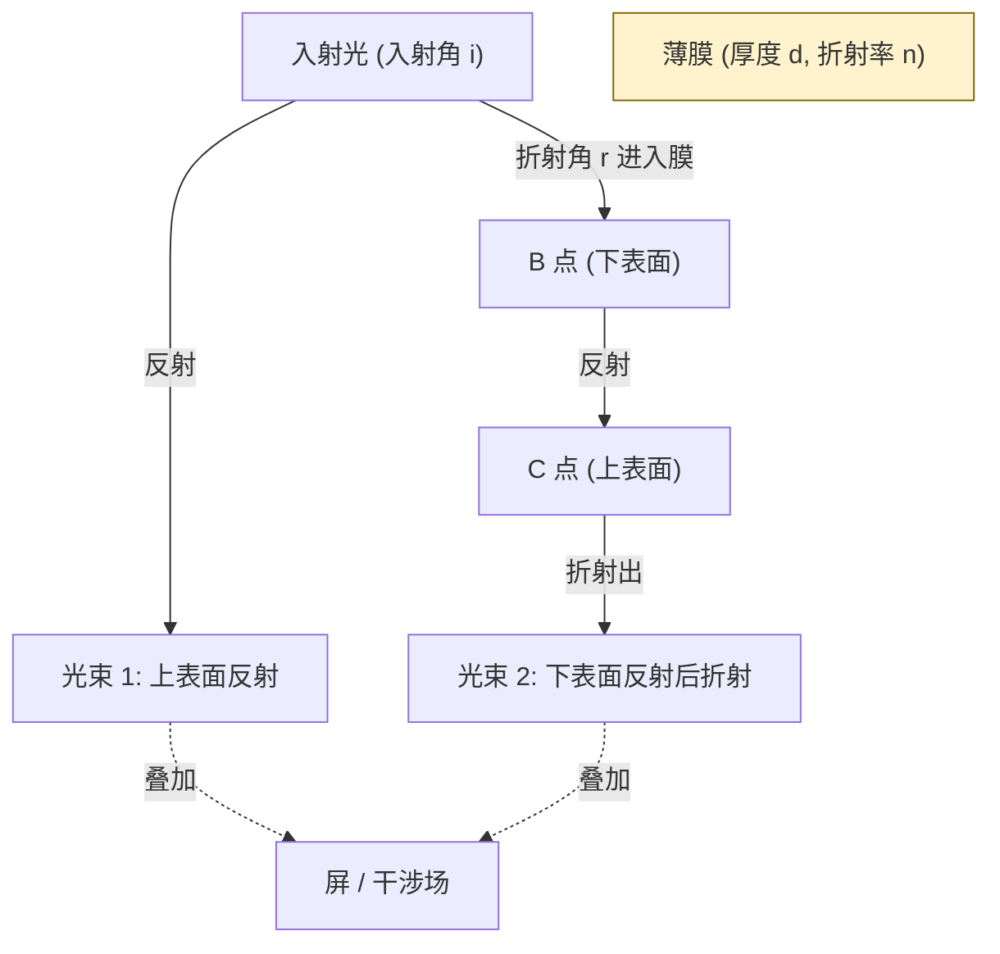
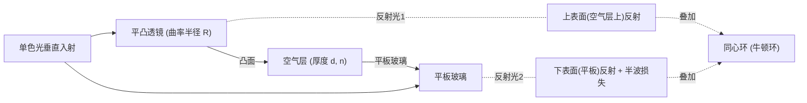

# 10.2 薄膜干涉、劈尖、牛顿环

> [!info] 本节定位
> 本节是 [[10.1 光的相干性、杨氏双缝干涉|10.1]] 中"**分振幅法**"的具体落实。它解决的核心问题是：**光在透明薄膜上下表面反射（或透射）后如何叠加干涉，如何利用这一原理测量微小厚度、检查表面平整度以及设计增透/增反膜**。本节引入了"半波损失"这一关键概念，并按"薄膜厚度是否均匀"区分**等倾干涉**与**等厚干涉**两条主线，是工程光学中应用最广的干涉原理。

## 一、半波损失

> [!theorem] 半波损失（half-wave loss）
> 光从**光疏介质**（折射率 $n_1$ 较小）射向**光密介质**（折射率 $n_2$ 较大，$n_2>n_1$）在分界面发生**反射**时，反射光的相位发生 $\pi$ 的突变，等效于光程**增加** $\lambda/2$。
> - 光从光密介质射向光疏介质反射时，**无**半波损失；
> - 折射光**不发生**半波损失；
> - 半波损失的本质是电场边界条件要求的相位反转，可由菲涅耳公式严格导出（本节从实验规律给出）。

> [!warning] 薄膜干涉中半波损失个数的判定
> 设薄膜折射率 $n$ 处于上下介质 $n_1,n_2$ 之间，需分别考察薄膜上下两表面反射光：
> - 若两表面反射的半波损失个数**之差为奇数**（即只有一处发生半波损失），则两反射光之间附加光程差 $\lambda/2$；
> - 若两表面反射的半波损失个数**之差为零或偶数**（两处都发生或都不发生），则**无附加** $\lambda/2$。
>
> 常见情形"空气—薄膜—空气"（$n_1=n_2=1<n$）：上表面反射有半波损失、下表面反射无半波损失，附加 $\lambda/2$。

## 二、薄膜干涉的光程差

> [!theorem] 薄膜干涉光程差公式
> 折射率为 $n$ 的薄膜，置于折射率为 $n_1$ 的介质中。单色光以入射角 $i$ 入射（折射角 $r$），薄膜厚度为 $d$。两反射光（上表面反射光与"进入薄膜经下表面反射再折射出"的光）的光程差为：
>
> $$\boxed{\;\delta=2d\sqrt{n^2-n_1^2\sin^2 i}+\left(\frac{\lambda}{2}\right)\;}$$
>
> 其中根号项由几何关系 $2d\cos r$ 配合折射定律 $n_1\sin i=n\sin r$ 转化而来：
> $$n\cos r=\sqrt{n^2-n^2\sin^2 r}=\sqrt{n^2-n_1^2\sin^2 i}$$
>
> 括号内 $\lambda/2$ 项**仅在两反射光存在奇数个半波损失差时才加上**（前述空气—薄膜—空气即需加）。

> [!proof] 光程差的推导
> 如图，光从 $A$ 点入射，上表面反射光为光束 1；进入薄膜的光在 $B$ 点反射，于 $C$ 点折射出，为光束 2。两束光自 $C$ 之后的几何光程相等（透视到上表面以上的同一波阵面比较）。
>
> 光束 2 在薄膜内多走了 $AB+BC=2d/\cos r$ 的几何路程，对应光程 $2nd/\cos r$；光束 1 从 $A$ 到对应波阵面（过 $C$）的几何路程为 $AD=AC\sin i$，光程 $n_1\cdot AC\sin i$。由 $AC=2d\tan r/\cos$...（几何细节）化简得：
> $$\delta_0=2nd\cos r$$
> 配合折射定律得 $2d\sqrt{n^2-n_1^2\sin^2 i}$。再加上（视情况）半波损失 $\lambda/2$ 即为总光程差。

## 三、等倾干涉与等厚干涉

> [!definition] 等倾干涉（equal inclination interference）
> 当薄膜厚度 $d$ **均匀**（平行平面膜），光程差 $\delta$ 仅随入射角 $i$ 变化。相同入射角的光形成同一级条纹，称为**等倾条纹**。
> - 用面光源照射时，条纹为同心圆环，内圈级次高（$i$ 小则 $\sqrt{n^2-\sin^2 i}$ 大，$\delta$ 大）；
> - 透射光与反射光条纹**互补**（能量守恒）。

> [!definition] 等厚干涉（equal thickness interference）
> 当薄膜厚度 $d$ **不均匀**（如劈尖、牛顿环），用**平行光**（入射角 $i$ 恒定，常取垂直入射 $i=0$）照射，光程差 $\delta$ 仅随厚度 $d$ 变化。相同厚度处形成同一级条纹，称为**等厚条纹**。
> - 劈尖条纹为平行于劈棱的等距直条纹；
> - 牛顿环条纹为同心圆环。
> - 工程应用：检查光学元件表面平整度、测量细丝直径或微小角度。

> [!warning] 等倾与等厚的近似条件
> 严格地讲，"等厚干涉要求 $d$ 较小且入射角接近垂直"——只有 $d$ 不太大时，同一条纹上不同点的入射角差异对 $\delta$ 的影响才可忽略。膜过厚时条纹会偏离等厚线，称为"混合条纹"。

## 四、劈尖干涉

> [!theorem] 劈尖干涉
> 两块平板玻璃一端接触、另一端夹细丝，形成夹角 $\theta$（很小，$\sim10^{-4}\sim10^{-3}\,\text{rad}$）的空气劈尖（折射率 $n$，$n=1$ 为空气）。单色平行光垂直入射（$i=0$）。
>
> 厚度为 $d$ 处，两反射光光程差（空气劈尖有半波损失）：
> $$\delta=2nd+\frac{\lambda}{2}$$
>
> - **明纹**：$2nd+\dfrac{\lambda}{2}=k\lambda$，即 $d=\dfrac{(2k-1)\lambda}{4n}$，$k=1,2,3,\ldots$
> - **暗纹**：$2nd+\dfrac{\lambda}{2}=(2k+1)\dfrac{\lambda}{2}$，即 $d=\dfrac{k\lambda}{2n}$，$k=0,1,2,\ldots$
>
> 劈棱处 $d=0$，$\delta=\lambda/2$，对应**暗纹**（$k=0$）。

> [!theorem] 劈尖条纹间距
> 相邻明纹（或相邻暗纹）对应的薄膜厚度差为 $\Delta d=\dfrac{\lambda}{2n}$（即光在膜内往返半个波长）。
> 由几何关系 $\Delta d=l\cdot\theta$（$\theta$ 很小，$\tan\theta\approx\theta$），条纹间距
> $$\boxed{\;l=\frac{\lambda}{2n\theta}\;}$$
> - 条纹与劈棱**平行**，等间距；
> - $\theta$ 增大则条纹变密；
> - 若膜中有台阶或凹凸，条纹会发生偏移，据此可检查表面平整度。

> [!example] 例 1：用劈尖测量细丝直径
> 空气劈尖（$n=1$）用 $\lambda=589.3\,\text{nm}$ 钠光垂直照射，玻璃片长 $D=5.0\,\text{cm}$，测得劈尖上共出现 $20$ 条暗纹（含劈棱处 $k=0$ 那一条）。求细丝直径 $d_{\max}$。
>
> **分析**：第 $k$ 级暗纹对应 $d_k=\dfrac{k\lambda}{2n}$。第 $20$ 条暗纹（从 $k=0$ 数起）对应 $k=19$。
>
> **解**：
> $$d_{\max}=d_{19}=\frac{19\lambda}{2n}=\frac{19\times589.3\times10^{-9}}{2}=5.598\times10^{-6}\,\text{m}\approx5.60\,\mu\text{m}$$
>
> **校核**：劈尖角 $\theta\approx\dfrac{d_{\max}}{D}=\dfrac{5.6\times10^{-6}}{5.0\times10^{-2}}=1.12\times10^{-4}\,\text{rad}$，确实很小，远场/小角近似有效。
>
> **单位检验**：$\dfrac{\text{m}}{1}=\text{m}$ ✓。

> [!example] 例 2：劈尖条纹偏移判断表面缺陷
> 空气劈尖上某处条纹如图向劈棱方向弯曲。判断该处工件表面是凹还是凸？
>
> **分析**：等厚条纹中，同一条纹对应相同膜厚 $d$。若工件某处下凹，则该处空气膜变厚，要达到同一厚度 $d$ 须向劈棱（厚度更小）方向"找补"，故条纹向劈棱弯曲表示工件**凸起**；反之条纹背离劈棱弯曲表示工件**凹陷**。
>
> **结论**：条纹向劈棱方向弯曲 → 该处工件表面**凸起**（"凸向薄处"）。定量上，若条纹最大弯曲量为 $\Delta l$（与一个条纹间距 $l$ 之比为 $a$），则缺陷高度 $h=a\cdot\dfrac{\lambda}{2n}$。

## 五、牛顿环

> [!theorem] 牛顿环（Newton's rings）
> 在平面玻璃板上放一曲率半径 $R$（很大，$\sim1\,\text{m}$）的平凸透镜，透镜凸面与平板之间形成空气薄层（折射率 $n$，厚度 $d$ 随到接触点距离 $\rho$ 增大）。单色光垂直照射，反射方向观察到以接触点为中心的同心圆环。
>
> 由几何关系（$R\gg d$）：$d\approx\dfrac{\rho^2}{2R}$。
> 代入薄膜光程差（含半波损失）：
> $$\delta=2nd+\frac{\lambda}{2}=\frac{n\rho^2}{R}+\frac{\lambda}{2}$$

> [!theorem] 牛顿环明暗环半径
> 由明暗纹条件 $\delta=k\lambda$（明）或 $\delta=(2k+1)\dfrac{\lambda}{2}$（暗），代入 $\delta=\dfrac{n\rho^2}{R}+\dfrac{\lambda}{2}$：
>
> - **暗环**（中心为暗斑，因 $d=0$ 时 $\delta=\lambda/2$）：
> $$\boxed{\;r_k=\sqrt{\frac{kR\lambda}{n}}\;},\quad k=0,1,2,\ldots$$
> - **明环**：
> $$r_k=\sqrt{\frac{(2k-1)R\lambda}{2n}},\quad k=1,2,3,\ldots$$
>
> - 暗环级次 $k$ 越大半径越大，但相邻环间距**越密**（$r_k\propto\sqrt{k}$）；
> - 测出第 $k$ 级暗环半径 $r_k$ 即可求透镜曲率半径 $R=\dfrac{nr_k^2}{k\lambda}$。

> [!warning] 牛顿环中心不是明斑而是暗斑
> 接触点 $d=0$，$\delta=\lambda/2$ 恰好满足暗纹条件，故中心为**暗斑**。实际中因接触压力或灰尘，中心可能不是严格接触，导致中心既非纯暗也非纯明，因此实验上常**测两环半径之差**（如 $r_{k+m}^2-r_k^2=mR\lambda/n$）以消除中心误差。

> [!example] 例 3：用牛顿环测透镜曲率半径
> 用 $\lambda=589.3\,\text{nm}$ 钠光观察牛顿环（空气层 $n=1$），测得第 $10$ 级暗环直径 $D_{10}=7.20\,\text{mm}$。求透镜曲率半径 $R$。
>
> **解**：$r_{10}=D_{10}/2=3.60\,\text{mm}=3.60\times10^{-3}\,\text{m}$。
> $$R=\frac{r_{10}^2}{k\lambda}=\frac{(3.60\times10^{-3})^2}{10\times589.3\times10^{-9}}=\frac{1.296\times10^{-5}}{5.893\times10^{-6}}\approx2.20\,\text{m}$$
>
> **单位检验**：$\dfrac{\text{m}^2}{\text{m}}=\text{m}$ ✓。
>
> **改进做法**：测 $D_{10}$ 与 $D_{30}$，用 $R=\dfrac{D_{30}^2-D_{10}^2}{4(k_{30}-k_{10})\lambda}=\dfrac{D_{30}^2-D_{10}^2}{80\lambda}$ 避开中心问题。

## 六、增透膜与增反膜

> [!theorem] 增透膜（anti-reflection coating）
> 在透镜表面镀一层折射率 $n$ 满足 $n_0<n<n_g$（$n_0$ 为入射侧、$n_g$ 为玻璃）的透明薄膜，使薄膜上下两表面反射光**干涉相消**，从而减少反射、增加透射。
>
> 常见设计：垂直入射（$i=0$），镀膜厚度 $d$ 满足
> $$2nd=\left(k+\frac{1}{2}\right)\lambda,\quad k=0,1,2,\ldots$$
> 取 $k=0$（最薄）：
> $$\boxed{\;d_{\min}=\frac{\lambda}{4n}\;}$$
> 称为**四分之一波长膜**。此时两反射光光程差恰为 $\lambda/2$（加上半波损失分析后总相位差 $\pi$），干涉相消。
>
> - **典型材料**：$n=1.38$ 的氟化镁（MgF₂）；
> - 增透膜只能对**某一波长**完全增透，常选人眼最敏感的 $\lambda=550\,\text{nm}$（黄绿光），故高级镜头呈紫红色（其他波长仍有少量反射）。

> [!theorem] 增反膜（high-reflection coating）
> 与增透膜相反，使反射光**干涉相长**以增强反射。镀层满足
> $$2nd=k\lambda,\quad k=1,2,\ldots$$
> 最薄 $d=\dfrac{\lambda}{2n}$。
> 实用中常用**多层高/低折射率交替**膜系（如 $\text{ZnS}/\text{MgF}_2$ 多层），反射率可达 $99\%$ 以上，用于激光器谐振腔镜。

> [!warning] 增透/增反膜的设计前提
> 上述 $d=\lambda/(4n)$ 仅在选定波长、垂直入射、单层膜且折射率匹配时严格成立。斜入射或多层膜需用菲涅耳系数做严格的多光束干涉计算。

## 七、本节小结

> [!summary] 核心结论
> - 薄膜干涉光程差：$\delta=2d\sqrt{n^2-\sin^2 i}+\left(\tfrac{\lambda}{2}\right)$（空气-膜-空气加 $\lambda/2$）。
> - **等倾干涉**：$d$ 均匀，条纹随 $i$ 分布（同心圆环）。
> - **等厚干涉**：$i$ 恒定（常垂直入射），条纹随 $d$ 分布。
> - 劈尖条纹间距 $l=\dfrac{\lambda}{2n\theta}$。
> - 牛顿环暗环 $r_k=\sqrt{\dfrac{kR\lambda}{n}}$，中心为暗斑。
> - 增透膜 $d=\dfrac{\lambda}{4n}$（反射相消）；增反膜 $d=\dfrac{\lambda}{2n}$（反射相长）。

## 章节导航

> [!nav] 导航
> [[MOC - 第10章|本章目录]] · 上一节：[[10.1 光的相干性、杨氏双缝干涉]] · 本节：10.2 · 下一节：[[10.3 光的衍射：单缝衍射、光栅衍射]] · [[10.4 光的偏振]] · 配套习题：[[MOC - 第10章习题|第10章 习题]]

#大学物理 #波动光学 #薄膜干涉 #劈尖 #牛顿环 #增透膜
