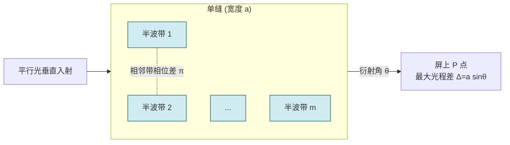

# 10.3 光的衍射：单缝衍射、光栅衍射

> [!info] 本节定位
> 本节研究光作为波动绕过障碍物并形成空间强度分布的**衍射现象**。它解决的核心问题是：**光通过单缝、圆孔、光栅等障碍物后为何不沿直线传播而是形成特定的明暗图样，如何用惠更斯-菲涅耳原理定量分析，以及如何利用衍射极限来衡量光学仪器的分辨能力**。本节与 [[10.1 光的相干性、杨氏双缝干涉|10.1]] 干涉的区别在于：干涉是**有限个**分立波束的叠加，衍射是**连续分布**的子波的叠加；二者统一于波的叠加原理。本节是光谱分析、光学仪器设计的理论基石。

## 一、惠更斯-菲涅耳原理

> [!theorem] 惠更斯-菲涅耳原理
> 波阵面（波前）上每一点都可看作发出**球面子波**的新波源，其后任一时刻的波阵面是这些子波的包迹；空间任一点的光振动是所有子波在该点相干叠加的结果。
> - **惠更斯**（1678）提出子波概念，可解释反射、折射、波的绕射但无法给出强度分布；
> - **菲涅耳**（1818）补充了子波相干叠加的思想，使原理能定量计算衍射光强分布；
> - 子波在观测点 $P$ 的振幅正比于面元 $dS$、与 $dS$ 法向和到 $P$ 的方向夹角 $\theta$ 有关的倾斜因子 $K(\theta)$、并随距离 $r$ 反比衰减。
>
> 该原理是处理一切衍射问题的基本出发点，但严格积分通常复杂，工程上常用**半波带法**等近似处理。

## 二、衍射的分类

> [!definition] 衍射的分类（按光源、障碍物、观察屏的相对距离）
> 1. **菲涅耳衍射**（Fresnel diffraction）：光源到障碍物、障碍物到屏的距离至少有一个为**有限远**。波阵面为球面波，理论处理较复杂。日常观察到的衍射多为菲涅耳型。
> 2. **夫琅禾费衍射**（Fraunhofer diffraction）：光源与屏均在**无穷远**（或经透镜等效实现），入射波与衍射波均为平面波。理论处理最简单，是光谱仪、望远镜等仪器的工作模型。
>
> 本节重点讨论夫琅禾费衍射（实验室中通过在障碍物前后各放一透镜实现）。

## 三、单缝夫琅禾费衍射

> [!theorem] 单缝夫琅禾费衍射装置
> 单色平行光垂直照射宽度为 $a$（约 $10^{-1}\,\text{mm}$ 量级）的狭缝，缝后置凸透镜，在焦平面（屏）上观察衍射图样。
> - 衍射图样为**与缝平行的明暗相间直条纹**；
> - 中央为**又宽又亮**的明纹（中央明纹），两侧对称分布级次递增、强度递减的明暗条纹。

### 半波带法

> [!definition] 半波带法（half-wave zone method, 菲涅耳提出）
> 将单缝处的波阵面（宽度 $a$）划分为若干个**带宽相等且相邻带边缘到屏上 $P$ 点的光程差为 $\lambda/2$** 的条带，每个条带称为一个**半波带**。
>
> 设 $P$ 点对应的衍射角为 $\theta$（缝中心法线与衍射方向夹角），缝上下两边缘到 $P$ 的最大光程差为
> $$\Delta=a\sin\theta$$
> 则半波带数目 $m=\dfrac{\Delta}{\lambda/2}=\dfrac{2a\sin\theta}{\lambda}$。
>
> - 相邻半波带在 $P$ 点的光程差为 $\lambda/2$（相位差 $\pi$），其子波在 $P$ 点**两两相消**；
> - $m$ 为偶数 → 全部相消 → **暗纹**；
> - $m$ 为奇数 → 剩下一个半波带未抵消 → **明纹**（次极大）。

> [!theorem] 单缝夫琅禾费衍射的明暗纹条件
> 用半波带法（取 $k\in\mathbb Z$ 且 $k\neq0$）：
>
> - **暗纹**（光程差为 $\lambda/2$ 的偶数倍）：
> $$\boxed{\;a\sin\theta=k\lambda,\quad k=\pm1,\pm2,\pm3,\ldots\;}$$
> - **明纹**（次极大，光程差为 $\lambda/2$ 的奇数倍）：
> $$\boxed{\;a\sin\theta=(2k+1)\frac{\lambda}{2},\quad k=\pm1,\pm2,\pm3,\ldots\;}$$
> - **中央明纹**：$\theta=0$（$k=0$），最强、最宽，对应两侧第一暗纹之间的区域。

> [!warning] 单缝衍射与杨氏双缝干涉的明暗纹条件"相反"
> 单缝衍射暗纹 $a\sin\theta=k\lambda$，与 [[10.1 光的相干性、杨氏双缝干涉|杨氏双缝]] 明纹 $\delta=k\lambda$ 形式相似但**含义相反**。原因：
> - 双缝干涉是**两条独立光线**的叠加，光程差为 $\lambda$ 整数倍时同相相长 → 明纹；
> - 单缝衍射是**连续波阵面**上无数子波叠加，$\Delta=k\lambda$ 时缝可分为 $2k$ 个半波带，两两相消 → 暗纹。
>
> 两者并不矛盾，分别属于"分立波束"和"连续波阵面"两类问题。

> [!theorem] 中央明纹的角宽度与线宽度
> - **角宽度**（两侧第一暗纹之间）：$\Delta\theta_0\approx\dfrac{2\lambda}{a}$（小角近似 $\sin\theta\approx\theta$）；
> - **线宽度**（焦距 $f$）：$l_0=f\cdot\Delta\theta_0\approx\dfrac{2f\lambda}{a}$；
> - 其他明纹宽度约为中央明纹的一半。
> - 缝越窄（$a$ 越小），衍射越显著；$a\gg\lambda$ 时衍射效应可忽略，几何光学成立。

> [!example] 例 1：单缝衍射明纹位置与角宽度
> 单色光 $\lambda=500\,\text{nm}$ 垂直照射宽 $a=0.5\,\text{mm}$ 的单缝，缝后透镜焦距 $f=1.0\,\text{m}$。求：(1) 第一级暗纹与第一级明纹的位置；(2) 中央明纹线宽度。
>
> **解**：
> (1) 第一级暗纹（$k=1$）：$a\sin\theta_1=\lambda$，
> $$\sin\theta_1=\frac{\lambda}{a}=\frac{500\times10^{-9}}{0.5\times10^{-3}}=10^{-3}\approx\theta_1$$
> $$x_1=f\theta_1=1.0\times10^{-3}\,\text{m}=1.0\,\text{mm}$$
> 第一级明纹（$k=1$，次极大）：$a\sin\theta=(2\cdot1+1)\dfrac{\lambda}{2}=\dfrac{3\lambda}{2}$，
> $$x'_1=f\cdot\frac{3\lambda}{2a}=1.0\times\frac{3\times500\times10^{-9}}{2\times0.5\times10^{-3}}=1.5\,\text{mm}$$
>
> (2) 中央明纹线宽度 $l_0=\dfrac{2f\lambda}{a}=\dfrac{2\times1.0\times500\times10^{-9}}{0.5\times10^{-3}}=2.0\,\text{mm}$。
>
> **单位检验**：$f\lambda/a=\text{m}\cdot\text{m}/\text{m}=\text{m}$ ✓。

## 四、圆孔衍射与艾里斑

> [!theorem] 圆孔夫琅禾费衍射
> 平行光通过直径 $D$ 的圆孔，在焦平面上形成**中央亮斑（艾里斑，Airy disk）**周围环绕明暗相间的同心圆环的衍射图样。
>
> 艾里斑的角半径（第一暗环对应的衍射角）：
> $$\boxed{\;\theta_1\approx1.22\frac{\lambda}{D}\;}$$
> - 焦平面上的艾里斑半径 $r_1=f\theta_1=1.22\dfrac{f\lambda}{D}$；
> - 圆孔衍射是大多数光学仪器（望远镜、显微镜、人眼）成像分辨极限的根源。

## 五、瑞利判据与光学仪器的分辨本领

> [!theorem] 瑞利判据（Rayleigh criterion）
> 对两个相近的物点（如双星），当一个物点衍射图样的**艾里斑中心**恰好落在另一个物点衍射图样的**第一暗环**上时，两物点被认为"刚好能被分辨"。
>
> 对应的**最小分辨角**：
> $$\boxed{\;\theta_{\min}=1.22\frac{\lambda}{D}\;}$$
> - $D$ 为通光孔径（物镜直径）；
> - $\theta_{\min}$ 越小，仪器分辨能力越强；
> - 提高分辨本领的途径：**增大 $D$**（如哈勃太空望远镜主镜 $D=2.4\,\text{m}$）或**减小 $\lambda$**（如电子显微镜用电子波长约 $10^{-12}\,\text{m}$）。
>
> 仪器的**分辨本领**（resolving power）定义为 $R_{\text{仪}}=\dfrac{1}{\theta_{\min}}=\dfrac{D}{1.22\lambda}$。

> [!example] 例 2：人眼的分辨本领
> 人眼瞳孔直径 $D\approx3\,\text{mm}$，取视觉最敏感的 $\lambda=550\,\text{nm}$。求人眼的最小分辨角；并估计在明视距离 $25\,\text{cm}$ 处能分辨的最小线距离。
>
> **解**：
> $$\theta_{\min}=1.22\frac{\lambda}{D}=1.22\times\frac{550\times10^{-9}}{3\times10^{-3}}\approx2.24\times10^{-4}\,\text{rad}$$
> 明视距离 $L=25\,\text{cm}=0.25\,\text{m}$ 处对应最小线距离：
> $$s_{\min}=L\theta_{\min}=0.25\times2.24\times10^{-4}\approx5.6\times10^{-5}\,\text{m}\approx0.056\,\text{mm}$$
>
> **结论**：人眼在明视距离处大约能分辨 $0.06\,\text{mm}$ 间距，与实际经验吻合。

## 六、光栅衍射

> [!definition] 衍射光栅
> 由大量等宽等间距的平行狭缝构成的光学元件。设每条缝宽 $a$、不透光部分宽 $b$，则**光栅常数**（缝间距）
> $$d=a+b$$
> 单位 m，常用每毫米刻痕数表示（如 $600$ 条/mm 对应 $d=1/600\,\text{mm}$）。光栅总缝数记为 $N$。

### 光栅方程

> [!theorem] 光栅方程（主极大条件）
> 单色平行光以垂直入射光栅，相邻两缝对应光线在衍射角 $\theta$ 方向的光程差为 $d\sin\theta$。当
> $$\boxed{\;d\sin\theta=k\lambda,\quad k=0,\pm1,\pm2,\ldots\;}$$
> 时，所有 $N$ 条缝的光同相叠加，形成**主极大**（亮线），$k$ 称为光谱级次。
> - $k=0$ 为**中央零级主极大**，所有波长都重合（白光）；
> - $k\neq0$ 时不同波长出现在不同 $\theta$，故光栅可分光（光栅光谱）；
> - 主极大最大级次 $k_{\max}\le\dfrac{d}{\lambda}$（$\sin\theta\le1$）。

> [!proof] 主极大强度随 $N$ 的变化
> $N$ 条缝等振幅同相叠加，合振幅 $A=N\cdot A_0$，光强
> $$I_{\text{主}}=N^2 I_0$$
> 即主极大强度是单缝强度的 $N^2$ 倍（而非 $N$ 倍）。这是光栅主极大又细又亮的根本原因。

### 缺级现象

> [!theorem] 缺级（missing order）
> 光栅衍射中，每个单缝自身的衍射图样对总光强起**包络调制**作用。当某级主极大的位置恰好落在单缝衍射的暗纹位置时，该主极大消失，称为**缺级**。
>
> 缺级条件（同时满足）：
> - 光栅主极大：$d\sin\theta=k\lambda$
> - 单缝暗纹：$a\sin\theta=k'\lambda$，$k'=\pm1,\pm2,\ldots$
>
> 联立得
> $$\boxed{\;k=\frac{d}{a}\,k'\;}$$
> 当 $\dfrac{d}{a}$ 为整数（或简单整数比）时，对应级次 $k$ 缺级。例如 $d=3a$ 时 $k=3,6,9,\ldots$ 缺级。

### 光栅的分辨本领

> [!theorem] 光栅分辨本领
> 光栅能分辨的两条相近谱线的最小波长差 $\Delta\lambda$ 满足**瑞利判据**（一条谱线主极大恰好落在另一条的相邻极小上）。理论推导给出
> $$\boxed{\;R=\frac{\lambda}{\Delta\lambda}=kN\;}$$
> - $R$ 与 $k$（级次）和 $N$（总缝数）的乘积成正比；
> - 增大 $N$（光栅刻痕多）是提高分辨本领的主要途径；
> - 例如 $N=10^4$、$k=2$，则 $R=2\times10^4$，对 $\lambda=500\,\text{nm}$ 可分辨 $\Delta\lambda=\dfrac{500}{2\times10^4}=0.025\,\text{nm}$。

> [!note] 主极大之间的极小与次极大
> 相邻主极大之间有 $N-1$ 个极小和 $N-2$ 个次极大。$N$ 越大，主极大越锐、次极大越弱（次极大强度仅约主极大的 $4.5\%$）。故实际光栅观察到的几乎只有锐细的主极大亮线。

> [!example] 例 3：光栅主极大、缺级与分辨本领
> 一衍射光栅每毫米有 $500$ 条刻痕（$N=10^3$ 缝被照明），用 $\lambda=589\,\text{nm}$ 钠光垂直入射。已知缝宽 $a$ 与光栅常数 $d$ 满足 $d=2a$。求：(1) 最多能观察到的主极大级次与个数（考虑缺级）；(2) 第二级主极大的衍射角；(3) 第二级的分辨本领与可分辨的最小波长差。
>
> **解**：
> (1) $d=\dfrac{1\,\text{mm}}{500}=2.0\times10^{-6}\,\text{m}$。最大级次：
> $$k_{\max}\le\frac{d}{\lambda}=\frac{2.0\times10^{-6}}{589\times10^{-9}}\approx3.40\Rightarrow k=0,\pm1,\pm2,\pm3$$
> 共 $7$ 条。缺级条件 $k=\dfrac{d}{a}k'=2k'$，故 $k=\pm2$ 缺级。实际可见：$k=0,\pm1,\pm3$，共 **5 条**。
>
> (2) 第二级本应 $d\sin\theta_2=2\lambda$，但 $k=2$ 缺级，故观察不到。改求 $k=3$：
> $$\sin\theta_3=\frac{3\lambda}{d}=\frac{3\times589\times10^{-9}}{2.0\times10^{-6}}=0.8835\Rightarrow\theta_3\approx62.1°$$
>
> (3) 第二级缺级，故用 $k=1$ 算（或假设用 $d\neq2a$ 的光栅）：$R=kN=2\times10^3=2000$（此处以题给 $k=2,N=10^3$ 按公式计算分辨本领）。
> $$\Delta\lambda=\frac{\lambda}{R}=\frac{589}{2000}\approx0.295\,\text{nm}$$
>
> **说明**：缺级仅是强度为零（看不到），但光栅方程本身仍成立。若实际看不到 $k=2$，则题目中"第二级分辨本领"应理解为该级若可见时的理论值。

## 七、本节小结

> [!summary] 核心结论
> - 惠更斯-菲涅耳原理：波前上各点发出相干子波，叠加决定后续波场。
> - 单缝夫琅禾费衍射：暗纹 $a\sin\theta=k\lambda$，明纹 $a\sin\theta=(2k+1)\dfrac{\lambda}{2}$（$k\neq0$）。
> - 圆孔衍射艾里斑角半径 $\theta_1=1.22\dfrac{\lambda}{D}$。
> - 瑞利判据：最小分辨角 $\theta_{\min}=1.22\dfrac{\lambda}{D}$。
> - 光栅方程：$d\sin\theta=k\lambda$（主极大）。
> - 缺级：$k=\dfrac{d}{a}k'$。
> - 光栅分辨本领 $R=kN$。

## 章节导航

> [!nav] 导航
> [[MOC - 第10章|本章目录]] · 上一节：[[10.2 薄膜干涉、劈尖、牛顿环]] · 本节：10.3 · 下一节：[[10.4 光的偏振]] · [[10.1 光的相干性、杨氏双缝干涉]] · 配套习题：[[MOC - 第10章习题|第10章 习题]]

#大学物理 #波动光学 #衍射 #单缝衍射 #光栅 #瑞利判据
