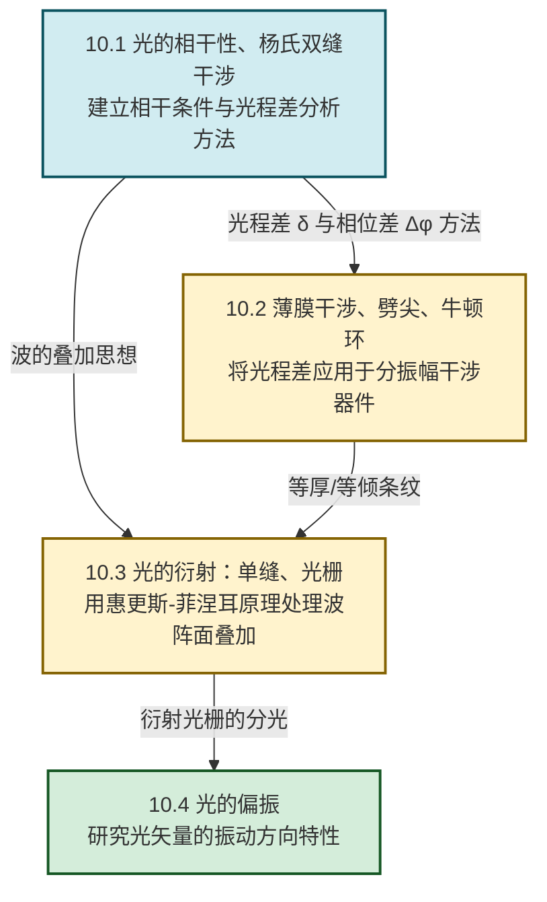

# MOC - 第10章 波动光学

> [!info] 本章定位
> 波动光学（Wave Optics）是以**光的波动性**为核心的光学理论。它回答的核心问题是：**光作为电磁波，如何产生干涉、衍射与偏振现象，以及如何用这些现象定量地测量波长、检查表面平整度、提高光学仪器分辨能力**。本章把 [[MOC - 第9章|第9章]] 中机械波的叠加原理、相位差、波程差等概念迁移到光波，建立起"**光程差 → 相位差 → 强度分布**"的统一分析链条。
>
> 本章默认条件：真空中光速 $c=2.998\times10^{8}\,\text{m/s}$；可见光波长范围约 $400\sim 760\,\text{nm}$；除非特别说明，讨论均限于**各向同性、无吸收**的介质与**远场**（夫琅禾费）近似。光在折射率为 $n$ 的介质中波长 $\lambda_n=\lambda/n$。

## 学习路线图

## 知识点导航

| 小节 | 标题 | 核心内容 | 关键物理量（SI单位） |
| ---- | ---- | -------- | -------------------- |
| [[10.1 光的相干性、杨氏双缝干涉\|10.1]] | 光的相干性、杨氏双缝干涉 | 光源发光机理、相干条件、分波前法、杨氏双缝实验、光程与光程差、明暗纹条件、条纹间距 | 光程差 $\delta$（m）、波长 $\lambda$（m）、条纹间距 $\Delta x$（m） |
| [[10.2 薄膜干涉、劈尖、牛顿环\|10.2]] | 薄膜干涉、劈尖、牛顿环 | 薄膜干涉光程差、半波损失、等倾与等厚干涉、劈尖条纹间距、牛顿环半径、增透/增反膜 | 膜厚 $d$（m）、折射率 $n$（无量纲）、环半径 $r_k$（m） |
| [[10.3 光的衍射：单缝衍射、光栅衍射\|10.3]] | 光的衍射：单缝、光栅 | 惠更斯-菲涅耳原理、半波带法、单缝明暗纹、圆孔衍射与艾里斑、瑞利判据、光栅方程、缺级、分辨本领 | 缝宽 $a$（m）、光栅常数 $d$（m）、分辨本领 $R$（无量纲） |
| [[10.4 光的偏振\|10.4]] | 光的偏振 | 自然光与偏振光、起偏检偏、马吕斯定律、布儒斯特定律、双折射、波片、偏振光干涉 | 偏振角 $\theta$（rad）、光强 $I$（W/m²）、布儒斯特角 $\theta_B$（rad） |

## 核心考点

> [!summary] 本章核心考点（7 点）
> 1. **光程与光程差**：光程 $=nl$（折射率 × 几何路程），光程差 $\delta$ 与相位差 $\Delta\varphi=\dfrac{2\pi}{\lambda}\delta$ 的换算。这是全章所有干涉问题的统一入口。
> 2. **杨氏双缝干涉**：明纹 $\delta=k\lambda$、暗纹 $\delta=(2k+1)\dfrac{\lambda}{2}$（$k\in\mathbb Z$），条纹间距 $\Delta x=\dfrac{\lambda L}{d}$。能由条纹位置反求波长或缝距。
> 3. **半波损失的判定**：光从光疏介质射向光密介质反射时反射光附加 $\lambda/2$ 光程。判定薄膜上下表面反射情况是薄膜干涉题的关键步骤。
> 4. **薄膜干涉光程差公式**：$\delta=2d\sqrt{n^2-\sin^2 i}+\left(\tfrac{\lambda}{2}\right)$，区分等倾（$d$ 定、$i$ 变）与等厚（$i$ 定、$d$ 变）干涉；劈尖 $l=\dfrac{\lambda}{2n\theta}$、牛顿环暗环 $r_k=\sqrt{kR\lambda}$。
> 5. **单缝夫琅禾费衍射的半波带法**：暗纹 $a\sin\theta=k\lambda$、明纹（次极大）$a\sin\theta=(2k+1)\dfrac{\lambda}{2}$。注意与双缝干涉明暗纹条件**恰好相反**的成因。
> 6. **光栅方程与缺级**：$d\sin\theta=k\lambda$（主极大）；当 $\dfrac{d}{a}=\dfrac{k}{k'}$ 为整数比时出现缺级。分辨本领 $R=kN$，说明光栅的"高分辨"来自缝数 $N$ 的乘积效应。
> 7. **马吕斯定律与布儒斯特定律**：$I=I_0\cos^2\theta$；$\tan\theta_B=\dfrac{n_2}{n_1}$ 时反射光为完全偏振光（垂直入射面）。结合起偏-检偏链路计算透射光强。

## 自测题

> [!question]- 自测 1：杨氏双缝条纹间距
> 杨氏双缝实验中，双缝间距 $d=0.5\,\text{mm}$，缝到屏的距离 $L=1.0\,\text{m}$，用 $\lambda=500\,\text{nm}$ 的绿光照明。求屏上条纹间距；若把整个装置浸入水（$n=1.33$）中，条纹间距变为多少？
>
> > [!check]- 答案
> > 空气中：$\Delta x=\dfrac{\lambda L}{d}=\dfrac{500\times10^{-9}\times1.0}{0.5\times10^{-3}}=1.0\times10^{-3}\,\text{m}=1.0\,\text{mm}$。
> > 水中光波长 $\lambda'=\dfrac{\lambda}{n}=\dfrac{500}{1.33}\approx 376\,\text{nm}$，
> > $\Delta x'=\dfrac{\lambda' L}{d}=\dfrac{376\times10^{-9}\times1.0}{0.5\times10^{-3}}\approx 0.752\,\text{mm}$。
> > **关键**：浸入介质后波长变短，条纹变密。

> [!question]- 自测 2：薄膜干涉明暗条件
> 折射率 $n=1.5$ 的透明薄膜置于空气中，厚度 $d=400\,\text{nm}$，用 $\lambda=600\,\text{nm}$ 单色光垂直入射。判断反射方向是明还是暗。
>
> > [!check]- 答案
> > 上表面反射（光疏→光密）有半波损失；下表面反射（光密→光疏）无半波损失，故总附加 $\lambda/2$。
> > 垂直入射（$i=0$）：$\delta=2nd+\dfrac{\lambda}{2}=2\times1.5\times400+300=1200+300=1500\,\text{nm}$。
> > $\dfrac{\delta}{\lambda}=\dfrac{1500}{600}=2.5=(2k+1)/2$，对应 $k=2$ 暗纹条件 $\delta=(2k+1)\dfrac{\lambda}{2}$，故反射方向为**暗**。

> [!question]- 自测 3：光栅主极大与缺级
> 一光栅每毫米有 $500$ 条刻痕，用 $\lambda=589\,\text{nm}$ 钠光垂直入射。求：(1) 光栅常数；(2) 屏上最多能看到几条主极大（已知缝宽 $a$ 与光栅常数 $d$ 满足 $d=3a$）。
>
> > [!check]- 答案
> > (1) $d=\dfrac{1\,\text{mm}}{500}=2.0\times10^{-6}\,\text{m}=2.0\,\mu\text{m}$。
> > (2) 主极大最大级次 $k_{\max}\le\dfrac{d}{\lambda}=\dfrac{2000}{589}\approx 3.40$，故 $k=0,\pm1,\pm2,\pm3$ 共 $7$ 条。
> > 缺级条件 $\dfrac{k}{k'}=\dfrac{d}{a}=3$，即 $k=3k'$（$k'=1,2,3,\ldots$）的主极大缺级，故 $k=\pm3$ 缺级。
> > 实际可见主极大：$k=0,\pm1,\pm2$ 共 **5 条**。

> [!question]- 自测 4：马吕斯定律
> 自然光通过起偏器后，再连续通过两个检偏器。第一检偏器偏振化方向与起偏器成 $30°$，第二检偏器与起偏器成 $60°$（与第一检偏器成 $30°$）。求最终透射光强与入射自然光强之比。
>
> > [!check]- 答案
> > 自然光经起偏器后强度减半：$I_1=\dfrac{I_0}{2}$。
> > 经第一检偏器（马吕斯定律）：$I_2=I_1\cos^2 30°=\dfrac{I_0}{2}\times\dfrac{3}{4}=\dfrac{3I_0}{8}$。
> > 经第二检偏器，其偏振化方向与第一检偏器成 $30°$：$I_3=I_2\cos^2 30°=\dfrac{3I_0}{8}\times\dfrac{3}{4}=\dfrac{9I_0}{32}\approx 0.281\,I_0$。
> > 即透射光强约为入射自然光强的 $28.1\%$。

## 章节导航

> [!nav] 导航
> 上级：[[MOC - 大学物理B|大学物理B 课程总览]]
> 上一章：[[MOC - 第9章|第9章 机械振动与机械波]]（波的叠加、相位差是本章先修）
> 下一章：[[MOC - 第11章|第11章 近代物理基础]]（光的粒子性将修正波动图像）
> 配套习题：[[MOC - 第10章习题|第10章 习题]]

#大学物理 #波动光学 #干涉 #衍射 #偏振
