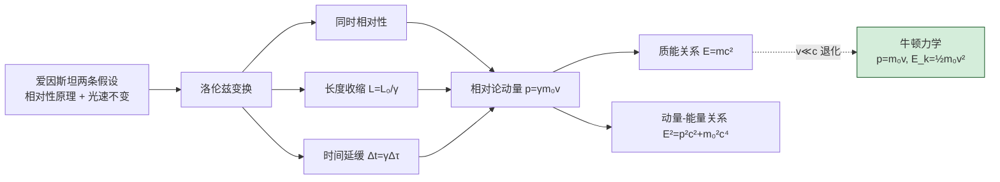

# 11.1 狭义相对论基础

> [!info] 本节定位
> 本节是整个第 11 章的**理论基础与逻辑起点**。它回答的核心问题是：**当物体运动速度接近光速时，牛顿的绝对时空观为何失效，爱因斯坦如何用两条基本假设重建自洽的时空理论**。
>
> 19 世纪末，麦克斯韦方程组预言真空光速 $c=\dfrac{1}{\sqrt{\mu_0\varepsilon_0}}\approx 2.998\times10^8\,\text{m/s}$ 仅由电磁常数决定，与参照系无关——这与伽利略速度合成 $\vec u=\vec u'+\vec v$ 直接矛盾。迈克尔逊-莫雷实验又以高精度测得"以太漂移"为零结果。1905 年，爱因斯坦在 [[MOC - 第8章|麦克斯韦方程组]] 与实验事实的基础上，抛弃以太与绝对时空，提出**狭义相对论**，用洛伦兹变换统一了时间与空间。
>
> 本节为 [[11.2 光电效应、爱因斯坦光子理论|光子理论]]（光速不变是其逻辑前提之一）和 [[11.4 玻尔氢原子模型简介|玻尔模型]]（质能关系为核物理奠基）提供时空框架，也是 [[MOC - 第2章|牛顿力学]] 在 $v\ll c$ 极限下的推广。本节讨论仅限于**惯性系**之间的变换，不涉及加速参考系与引力（广义相对论）。

## 一、伽利略变换与力学相对性原理

> [!definition] 伽利略变换
> 设惯性系 $S'$ 相对惯性系 $S$ 以恒定速度 $\vec v=v\hat x$ 平动（$t=t'=0$ 时两坐标系原点重合），则两系坐标间满足
> $$x'=x-vt,\qquad y'=y,\qquad z'=z,\qquad t'=t$$
> 速度变换为 $\vec u'=\vec u-\vec v$，加速度 $\vec a'=\vec a$。这是**绝对时空观**的数学表达：时间与空间相互独立，长度与时间间隔在所有惯性系中相同。

> [!theorem] 力学相对性原理（伽利略相对性原理）
> 一切力学定律在**伽利略变换下形式不变**。即无法通过任何力学实验判断所在惯性系是"静止"还是"匀速运动"。牛顿第二定律 $\vec F=m\vec a$ 在伽利略变换下保持形式不变（因 $m$、$\vec a$、$\vec F$ 均为不变量）。

> [!warning] 伽利略变换与电磁学的冲突
> 麦克斯韦方程组**不**在伽利略变换下保持形式不变——光速 $c$ 在方程中作为常数出现，但伽利略速度合成要求 $c$ 随参照系改变。若麦克斯韦方程组只对"以太参照系"成立，则应能通过电磁实验测出相对以太的速度。这正是迈克尔逊-莫雷实验的设计动机。

## 二、以太假设与迈克尔逊-莫雷实验

> [!note] 以太假设
> 19 世纪物理学家假定真空中存在一种介质——**以太（ether）**——作为电磁波的载体，并定义相对以太静止的参照系为"绝对静止系"。光速 $c$ 应仅在以太系中成立，在其他惯性系中按伽利略速度合成改变。

> [!example] 迈克尔逊-莫雷实验（1887）
> **目的**：测量地球相对以太的"漂移速度"，从而验证以太存在。
> **原理**：将迈克尔逊干涉仪两臂分别平行与垂直于地球公转方向。若存在以太风，两路光程差会引起干涉条纹移动。预期条纹移动量正比于 $\dfrac{v^2}{c^2}$（$v$ 为地球公转速度约 $30\,\text{km/s}$）。
> **结果**：干涉条纹移动**远小于预期**，"零结果"在多次重复与不同季节下均成立。
> **结论**：以太漂移不存在，光速在不同方向、不同惯性系下均相同。这直接否定了以太假说，成为狭义相对论的实验基础之一。

## 三、爱因斯坦两条基本假设

> [!theorem] 狭义相对论的两条基本假设（1905）
> 1. **相对性原理**：一切物理定律（包括力学与电磁学）在**所有惯性系**中具有相同的形式。不存在任何特殊的"绝对静止"惯性系。
> 2. **光速不变原理**：真空中的光速 $c$ 在**一切惯性系**中、沿**一切方向**都等于同一常数 $c$，与光源和观察者的运动状态无关。
>
> 实验常数：$c=2.99792458\times10^8\,\text{m/s}$（定义值）。

> [!warning] 光速不变原理的革命性
> 光速不变**直接否定**伽利略速度合成。例如：一束光相对地面以 $c$ 传播，一飞船以 $0.9c$ 同向飞行，则在飞船系中光速**仍为 $c$**（而非 $0.1c$）。这一结论违背日常直觉，但已被大量实验（双星观测、高速粒子辐射、粒子加速器等）反复证实。代价是：必须放弃"同时的绝对性"。

## 四、洛伦兹变换

> [!theorem] 洛伦兹变换
> 设惯性系 $S'$ 相对 $S$ 以速度 $v$ 沿 $x$ 轴正向平动，$t=t'=0$ 时原点重合。同一事件在两系中的时空坐标 $(x,y,z,t)$ 与 $(x',y',z',t')$ 满足
> $$\boxed{\,x'=\frac{x-vt}{\sqrt{1-\beta^2}},\quad y'=y,\quad z'=z,\quad t'=\frac{t-\dfrac{v}{c^2}x}{\sqrt{1-\beta^2}}\,}$$
> 其中 $\beta=\dfrac{v}{c}$，$\gamma=\dfrac{1}{\sqrt{1-\beta^2}}\ge1$ 称为**洛伦兹因子**。逆变换（$S'\to S$，把 $v$ 换成 $-v$）：
> $$x=\frac{x'+vt'}{\sqrt{1-\beta^2}},\qquad t=\frac{t'+\dfrac{v}{c^2}x'}{\sqrt{1-\beta^2}}$$

> [!note] 洛伦兹变换的关键特征
> 1. **时空耦合**：$t'$ 不仅依赖 $t$，还依赖 $x$；$x'$ 不仅依赖 $x$，还依赖 $t$。时间与空间不可分离，构成**四维时空**。
> 2. **低速极限**：当 $v\ll c$（即 $\beta\to0$、$\gamma\to1$）时，洛伦兹变换退化为伽利略变换。牛顿力学是相对论的一级近似。
> 3. **光速不变的内建**：设一光信号在 $S$ 系中 $x=ct$，代入得 $x'=\dfrac{ct-vt}{\sqrt{1-\beta^2}}=\dfrac{(c-v)t}{\sqrt{1-\beta^2}}$，$t'=\dfrac{t-\dfrac{v}{c^2}ct}{\sqrt{1-\beta^2}}=\dfrac{(1-\beta)t}{\sqrt{1-\beta^2}}$，故 $\dfrac{x'}{t'}=c$。光速在两系中相同。
> 4. **因果性约束**：要求 $v<c$（否则 $\gamma$ 虚数），即惯性系间相对速度不能超过光速。

## 五、同时的相对性

> [!theorem] 同时性的相对性
> 在一个惯性系中**同时**发生的两个事件，在另一相对运动的惯性系中**不一定同时**。设 $S$ 系中两事件 $A(x_1,t_0)$、$B(x_2,t_0)$ 同时（$\Delta t=0$，$\Delta x=x_2-x_1\ne0$），则在 $S'$ 系中
> $$\Delta t'=\frac{\Delta t-\dfrac{v}{c^2}\Delta x}{\sqrt{1-\beta^2}}=-\frac{v\,\Delta x}{c^2\sqrt{1-\beta^2}}\ne0$$
> 只有当 $\Delta x=0$（同地同时）时同时性才保持。

> [!example] 同时相对性示例
> 一列长列车以 $v=0.6c$ 行驶。车头与车尾各装一盏灯，在地面系中同时点亮。在车厢系中哪盏灯先亮？
>
> **解**：取列车沿 $+x$ 方向运动。地面系中 $\Delta t=0$，车头在 $x_2$、车尾在 $x_1$，$\Delta x=x_2-x_1>0$。代入
> $$\Delta t'=-\frac{v\,\Delta x}{c^2\sqrt{1-\beta^2}}<0$$
> 即 $\Delta t'=t'_2-t'_1<0$，车头灯（事件 2）在车厢系中**先亮**。物理图像：列车系中光信号从两灯发出但车头灯"迎向"前方观察者，先被记录。

## 六、长度收缩

> [!theorem] 长度收缩（动尺变短）
> 设一刚杆沿运动方向静止于 $S'$ 系，其**固有长度**（proper length）$L_0=x'_2-x'_1$。在 $S$ 系中**同时**测量两端坐标 $x_1$、$x_2$（$\Delta t=0$），测得长度
> $$\boxed{\,L=L_0\sqrt{1-\beta^2}=\frac{L_0}{\gamma}\,}$$
> 即运动方向上长度**收缩**。垂直于运动方向的长度不变。

> [!warning] 长度收缩的测量要求
> "运动长度"必须由**同一时刻**测得的两端坐标相减。若不同时测量，所得之差无物理意义。这正是"同时的相对性"导致长度也具有相对性的根源。固有长度 $L_0$ 是物体在其自身静止系中的长度，是**不变量**。

> [!example] 例题 1：动尺收缩
> 一根静止长度 $L_0=10.0\,\text{m}$ 的杆沿 $x$ 方向以 $v=0.80c$ 运动。地面观察者测得其长度是多少？
>
> **解**：$\gamma=\dfrac{1}{\sqrt{1-0.80^2}}=\dfrac{1}{0.60}=\dfrac{5}{3}$。
> $$L=\frac{L_0}{\gamma}=L_0\sqrt{1-\beta^2}=10.0\times0.60=6.0\,\text{m}$$
> 运动方向上杆变短为 $6.0\,\text{m}$。**单位检验**：$L_0$ 与 $L$ 单位均为 m，$\gamma$ 无量纲。

## 七、时间延缓

> [!theorem] 时间延缓（动钟变慢）
> 设两事件在 $S'$ 系中**同一地点**发生，时间间隔为**固有时间**（proper time）$\Delta\tau=t'_2-t'_1$（$\Delta x'=0$）。在 $S$ 系中测得
> $$\boxed{\,\Delta t=\frac{\Delta\tau}{\sqrt{1-\beta^2}}=\gamma\,\Delta\tau\,}$$
> 即运动参照系中的钟**变慢**。固有时间 $\Delta\tau$ 是同一地点的两事件间隔，是**不变量**中最短者。

> [!example] 例题 2：$\pi$ 介子衰变
> 静止 $\pi^+$ 介子平均寿命 $\Delta\tau=2.6\times10^{-8}\,\text{s}$。一束 $\pi^+$ 以 $v=0.90c$ 飞行，在实验室系中平均飞行距离是多少？
>
> **解**：$\gamma=\dfrac{1}{\sqrt{1-0.90^2}}=\dfrac{1}{\sqrt{0.19}}\approx2.29$。
> 实验室系寿命 $\Delta t=\gamma\Delta\tau=2.29\times2.6\times10^{-8}\approx5.96\times10^{-8}\,\text{s}$。
> 飞行距离 $L=v\Delta t=0.90\times3.0\times10^8\times5.96\times10^{-8}\approx16.1\,\text{m}$。
> 若无时间延缓，则 $L_0=v\Delta\tau=0.90\times3.0\times10^8\times2.6\times10^{-8}\approx7.0\,\text{m}$。实测与延缓结果一致，是相对论的直接证据。
> **单位检验**：$\text{m/s}\cdot\text{s}=\text{m}$，正确。

## 八、相对论动量与能量

> [!definition] 相对论动量
> 为使动量守恒定律在洛伦兹变换下保持形式不变，定义质量为 $m_0$（静止质量）的粒子的相对论动量为
> $$\boxed{\,p=\frac{m_0 v}{\sqrt{1-\beta^2}}=\gamma m_0 v\,}\quad(\text{kg·m/s})$$
> 对应"相对论质量" $m=\gamma m_0$（现代物理学习惯直接用 $m_0$ 与 $\gamma$，避免引入 $m$）。

> [!theorem] 相对论能量与质能关系
> 相对论动能定理推导出的总能量为
> $$\boxed{\,E=mc^2=\gamma m_0 c^2\,}\quad(\text{J})$$
> 静止时（$v=0$、$\gamma=1$）的能量称为**静能**：$E_0=m_0c^2$。
> 相对论动能为
> $$E_k=E-E_0=(\gamma-1)m_0c^2$$
> 经典动能 $\tfrac12 m_0v^2$ 是其在 $v\ll c$ 时的一级近似。

> [!proof] 质能关系的推导（概要）
> 由 $E_k=\int_0^v F\,\mathrm dx=\int_0^v \dfrac{\mathrm dp}{\mathrm dt}\,\mathrm dx=\int_0^v v\,\mathrm dp$，代入 $p=\gamma m_0 v$，
> $$E_k=\int_0^v v\,\mathrm d(\gamma m_0 v)=m_0\int_0^v v\,\mathrm d\!\left(\frac{v}{\sqrt{1-v^2/c^2}}\right)$$
> 分部积分后整理得 $E_k=(\gamma-1)m_0c^2$，故 $E=E_k+E_0=\gamma m_0c^2=m_0c^2+m_0c^2(\gamma-1)$。$\square$

> [!theorem] 动量-能量关系
> 由 $E=\gamma m_0c^2$ 与 $p=\gamma m_0v$ 消去 $\gamma$ 与 $v$，得
> $$\boxed{\,E^2=p^2c^2+m_0^2c^4\,}$$
> 对光子（$m_0=0$）：$E=pc$，即 $p=\dfrac{E}{c}=\dfrac{h\nu}{c}$。这是 [[11.2 光电效应、爱因斯坦光子理论|光子理论]] 中光子动量的来源。

> [!example] 例题 3：粒子加速器中的能量
> 一电子（$m_0=9.11\times10^{-31}\,\text{kg}$）被加速到 $v=0.999c$。求其相对论总能量、动能与动量。
>
> **解**：$\beta=0.999$，$\gamma=\dfrac{1}{\sqrt{1-0.999^2}}\approx\dfrac{1}{\sqrt{0.001999}}\approx22.37$。
> 静能 $E_0=m_0c^2=9.11\times10^{-31}\times(3.0\times10^8)^2\approx8.20\times10^{-14}\,\text{J}=0.511\,\text{MeV}$。
> 总能量 $E=\gamma E_0=22.37\times0.511\approx11.4\,\text{MeV}$。
> 动能 $E_k=(\gamma-1)E_0=21.37\times0.511\approx10.9\,\text{MeV}$。
> 动量 $p=\gamma m_0v\approx22.37\times9.11\times10^{-31}\times0.999\times3.0\times10^8\approx6.11\times10^{-21}\,\text{kg·m/s}$。
> 经典动能 $\tfrac12 m_0v^2\approx\dfrac12\times0.511\,\text{MeV}=0.256\,\text{MeV}$，远小于相对论动能，说明高速时必须用相对论。
> **单位检验**：$\text{kg}\cdot\text{m}^2/\text{s}^2=\text{J}$，$\text{kg}\cdot\text{m/s}$ 为动量单位，正确。

## 九、相对论与经典力学的衔接

> [!note] 牛顿力学作为低速极限
> 当 $v\ll c$ 时：$\gamma\to1$，洛伦兹变换→伽利略变换，$p\to m_0v$，$E_k=(\gamma-1)m_0c^2\to\dfrac12m_0v^2$。牛顿力学在低速、宏观、弱引力条件下仍是高度精确的近似，不可一概否定。

## 十、易错点

> [!warning] 易错点
> 1. **混淆固有量与运动量**：固长 $L_0$ 是物体在自身静止系中的长度；固时 $\Delta\tau$ 是同一地点两事件间隔。两者都是不变量，运动系测得的长度更短、时间更长。判别关键："长度是否在物体静止系测得"、"事件是否同地发生"。
> 2. **长度收缩只沿运动方向**：垂直于运动方向的尺寸**不收缩**。常见错误是把所有维度都乘 $1/\gamma$。
> 3. **同时的相对性需要 $\Delta x\ne0$**：同地同时的两事件在所有惯性系中都同时。"异地同时"才是相对的。
> 4. **光速不变不等于"光速是速度上限"的直接推论**：光速不变是假设，而"信息与物质传递速度不超过 $c$"是由因果性保持推出的结论（类空间隔的事件无法建立因果联系）。
> 5. **质能关系不是"质量变成能量"**：$E=mc^2$ 表示质量与能量是同一物理量的两种度量，质量守恒与能量守恒在相对论中统一为**质能守恒**。反应前后静质量可以变化，但总能量与总动量守恒。
> 6. **不能用 $F=ma$ 直接套用**：相对论中 $\vec F=\dfrac{\mathrm d\vec p}{\mathrm dt}$ 才是普适形式，$\vec F=m\vec a$ 仅在 $v\ll c$ 或 $\vec F\perp\vec v$ 等特殊情形下近似成立。

## 十一、与其他小节的联系

- 本节的洛伦兹变换与光速不变原理是 [[11.2 光电效应、爱因斯坦光子理论|光子理论]] 中"光子静质量为零、以光速运动"的物理基础；
- 质能关系 $E=mc^2$ 与动量-能量关系 $E^2=p^2c^2+m_0^2c^4$ 是 [[11.4 玻尔氢原子模型简介|玻尔模型]] 中原子能级跃迁能量计算与核物理应用的基础；
- 时间延缓与长度收缩的实验验证（$\mu$ 子寿命、粒子加速器）为近代物理提供了直接证据；
- 本章 MOC：[[MOC - 第11章]]。

## 章节导航

- 上一级：[[MOC - 第11章]]
- 先修：[[MOC - 第2章]]（牛顿力学）、[[MOC - 第8章]]（麦克斯韦方程组与光速）
- 下一节：[[11.2 光电效应、爱因斯坦光子理论]]
- 习题：[[MOC - 第11章习题]]
