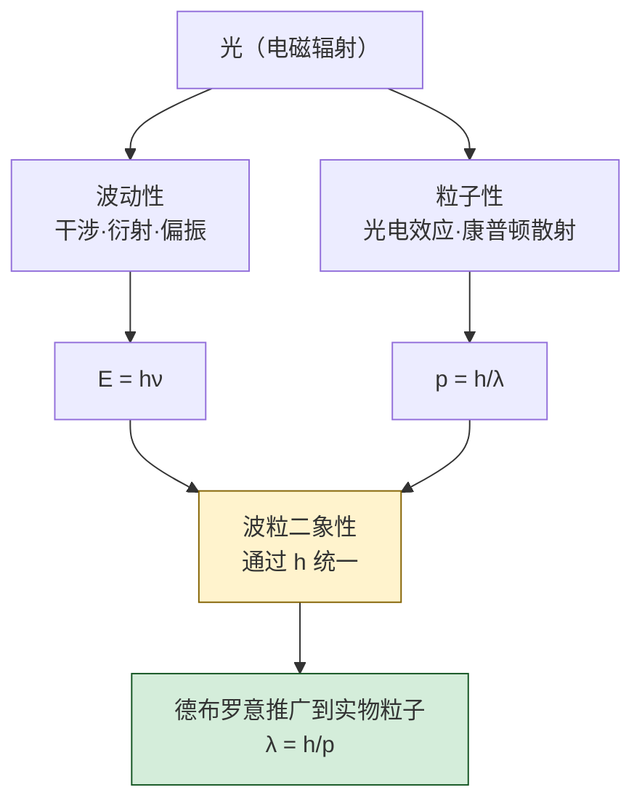

# 11.2 光电效应、爱因斯坦光子理论

> [!info] 本节定位
> 本节是量子论登场的**第一块基石**。它回答的核心问题是：**光在干涉、衍射实验中表现为波，为何在光电效应与康普顿散射中却表现出粒子性？经典波动理论为何无法解释光电效应，爱因斯坦如何用"光量子"假说一举解决？**
>
> 1887 年赫兹在研究电磁波时偶然发现：紫外光照射锌球会使其带电状态改变。勒纳德等人系统研究后总结出光电效应的四条实验规律，全部与经典波动理论矛盾。1905 年爱因斯坦将普朗克的能量子假设推广到电磁波本身，提出光由光子组成，每个光子携带能量 $E=h\nu$，并用一个极其简洁的方程 $h\nu=\tfrac12mv^2+A$ 完美解释了全部实验规律。1923 年康普顿的 X 射线散射实验进一步证实光子不仅具有能量，还具有动量 $p=\dfrac{h}{\lambda}$。
>
> 本节在 [[11.1 狭义相对论基础|狭义相对论]]（光子静质量为零、以光速运动）的基础上展开，为 [[11.3 德布罗意波、不确定性关系|德布罗意波]]（把波粒二象性从光推广到实物粒子）提供直接动机，是建立量子力学的关键一步。本节实验数据均注明测量条件与误差范围。

## 一、光电效应的实验规律

> [!definition] 光电效应
> 金属在光（特别是紫外光）照射下发射电子的现象称为**光电效应（photoelectric effect）**。逸出的电子称为**光电子（photoelectron）**，形成的电流称为**光电流（photocurrent）**。

> [!note] 实验装置
> 真空管内装有待测金属阴极 $K$ 与阳极 $A$，外加可调电压 $U$。单色光经石英窗口照射 $K$，光电子在电场作用下飞向 $A$ 形成光电流。电压可反向（遏止电压 $U_a$，使光电流恰好为零）以测量光电子最大动能。
>
> 测量条件：真空度 $\sim10^{-6}\,\text{Pa}$，光波长由棱镜或光栅单色仪选取（不确定度 $\sim0.1\,\text{nm}$），电流由静电计测量（灵敏度 $\sim10^{-12}\,\text{A}$）。

> [!theorem] 光电效应的四条实验规律
> 1. **存在截止频率**：对每种金属存在一个临界频率 $\nu_0$，只有入射光频率 $\nu>\nu_0$ 才能产生光电效应，与光强无关。$\nu_0$ 称为**截止频率**（或红限频率），对应波长 $\lambda_0=\dfrac{c}{\nu_0}$。
> 2. **瞬时性**：从光照到光电流出现的时间极短，约 $10^{-9}\,\text{s}$ 量级，几乎无延迟。即使光强极弱（$10^{-10}\,\text{W}$ 量级）也是如此。
> 3. **光电流与光强的关系**：当 $\nu>\nu_0$ 且电压足够大时，**饱和光电流** $I_m$ 与入射光强 $I$ 成正比（光强越大，单位时间到达阳极的光电子数越多）。
> 4. **遏止电压与频率的关系**：遏止电压 $U_a$ 与入射光频率 $\nu$ 成**线性关系**，与光强无关：
> $$U_a = k\nu - U_0$$
> 其中 $k$ 是与金属无关的普适常数，$U_0$ 与金属种类有关。光电子的最大初动能 $\tfrac12mv_{\max}^2=eU_a$。

## 二、经典波动理论的困难

> [!warning] 经典电磁理论无法解释光电效应
> 按经典波动理论，光波的能量连续分布于波前，光强越大能量密度越高。由此推出：
> 1. **不应有截止频率**：只要光强足够大、照射时间足够长，电子总可积累足够能量逸出。但实验表明低于 $\nu_0$ 时无论多强都不产生光电效应。
> 2. **应有明显延迟**：电子从光波中积累能量到逸出功 $A$ 量级需要时间。估算光强 $10^{-10}\,\text{W}$、吸收面积 $\sim10^{-19}\,\text{m}^2$ 时，积累 $1\,\text{eV}$ 需数小时，但实验延迟 $<10^{-9}\,\text{s}$。
> 3. **遏止电压应依赖光强**：经典理论认为光强大则电子获得能量多，$U_a$ 应随光强增大。但实验中 $U_a$ 仅与频率有关。
>
> 这三点矛盾表明，**经典波动理论在光电效应问题上彻底失效**，必须引入新的物理图像。

## 三、普朗克能量子假设（前奏）

> [!note] 普朗克黑体辐射公式与能量子
> 1900 年普朗克为解释黑体辐射谱，假设谐振子能量只能取离散值 $E=nh\nu$（$n=0,1,2,\dots$），其中
> $$h=6.62607015\times10^{-34}\,\text{J·s}\quad(\text{普朗克常数，定义值})$$
> 大学物理常用近似值 $h\approx6.63\times10^{-34}\,\text{J·s}$。普朗克最初把量子化仅视为振子性质，未敢推广到电磁场本身。爱因斯坦迈出了这关键一步。

## 四、爱因斯坦光子理论

> [!theorem] 爱因斯坦光量子假说（1905）
> 电磁波（光）本身由一份份离散的能量子——**光子（photon）**——组成。每个光子携带能量
> $$\boxed{\,E=h\nu=\frac{hc}{\lambda}\,}\quad(\text{J})$$
> 光子沿光速方向运动，**静质量为零**（$m_0=0$），动量 $p=\dfrac{E}{c}=\dfrac{h}{\lambda}$（由 [[11.1 狭义相对论基础|相对论]] 的 $E^2=p^2c^2+m_0^2c^4$ 退化而得）。
>
> 常用数值：$hc\approx1.24\times10^{-6}\,\text{eV·m}=1240\,\text{eV·nm}$，便于光谱计算。

> [!theorem] 爱因斯坦光电效应方程
> 一个光子被金属中一个电子整体吸收，能量 $h\nu$ 用于克服逸出功 $A$ 与提供电子最大初动能：
> $$\boxed{\,h\nu=\frac12 mv_{\max}^2 + A\,}$$
> 其中 $A$ 为金属的**逸出功**（work function），即电子从金属表面逸出所需最小能量（典型值 $1\sim5\,\text{eV}$），与材料种类和表面状态有关。

> [!proof] 光电效应方程对四条规律的统一解释
> 1. **截止频率**：当 $h\nu_0=A$ 时光电子动能为零，恰能逸出。故 $\nu_0=\dfrac{A}{h}$，$\lambda_0=\dfrac{hc}{A}$。低于 $\nu_0$ 时单个光子能量不足以克服逸出功，无论光强多大（光子数多但每个能量不足）都不产生光电流。
> 2. **瞬时性**：光子与电子一次性作用，无需能量积累时间，延迟仅由碰撞概率决定（$<10^{-9}\,\text{s}$）。
> 3. **饱和光电流正比于光强**：光强 $I=Nh\nu$（$N$ 为单位时间通过单位面积的光子数）。每个光子至多打出一个光电子，故光电子数正比于 $N$，即正比于光强。
> 4. **遏止电压与频率线性**：$eU_a=\tfrac12mv_{\max}^2=h\nu-A$，故 $U_a=\dfrac{h}{e}\nu-\dfrac{A}{e}$。斜率 $k=\dfrac{h}{e}$ 是普适常数，与金属无关；截距 $-U_0=-\dfrac{A}{e}$ 与金属有关。密立根实验精确测得 $k$，反推 $h$ 与普朗克黑体辐射结果一致。$\square$

> [!example] 例题 1：截止频率与遏止电压
> 钾的逸出功 $A=2.25\,\text{eV}$。用波长 $\lambda=300\,\text{nm}$ 的紫外光照射，求：(1) 截止频率 $\nu_0$ 与截止波长 $\lambda_0$；(2) 遏止电压 $U_a$；(3) 光电子最大初速度 $v_{\max}$。
>
> **解**：
> (1) $A=2.25\times1.60\times10^{-19}=3.60\times10^{-19}\,\text{J}$。
> $\nu_0=\dfrac{A}{h}=\dfrac{3.60\times10^{-19}}{6.63\times10^{-34}}\approx5.43\times10^{14}\,\text{Hz}$；
> $\lambda_0=\dfrac{c}{\nu_0}=\dfrac{3.0\times10^8}{5.43\times10^{14}}\approx5.52\times10^{-7}\,\text{m}=552\,\text{nm}$。
>
> (2) 光子能量 $E=h\nu=\dfrac{hc}{\lambda}=\dfrac{6.63\times10^{-34}\times3.0\times10^8}{3.00\times10^{-7}}=6.63\times10^{-19}\,\text{J}=4.14\,\text{eV}$。
> $eU_a=h\nu-A=4.14-2.25=1.89\,\text{eV}$，故 $U_a=1.89\,\text{V}$。
>
> (3) $\tfrac12mv_{\max}^2=eU_a=1.89\times1.60\times10^{-19}=3.02\times10^{-19}\,\text{J}$，
> $v_{\max}=\sqrt{\dfrac{2eU_a}{m}}=\sqrt{\dfrac{2\times3.02\times10^{-19}}{9.11\times10^{-31}}}\approx8.14\times10^{5}\,\text{m/s}$。
>
> **单位检验**：$h\nu$ 单位 $\text{J·s}\cdot\text{s}^{-1}=\text{J}$；$U_a$ 单位 $\text{J/C}=\text{V}$；$v$ 单位 $\sqrt{\text{J/kg}}=\text{m/s}$，正确。

## 五、康普顿效应

> [!definition] 康普顿散射
> 1923 年康普顿研究 X 射线被轻元素（石墨、石蜡）散射时发现：散射谱中除与入射波长相同的成分（不变线）外，还出现**波长变长**的成分（移位线）。波长改变量 $\Delta\lambda$ 仅依赖散射角 $\theta$，与散射物质无关。这一现象称为**康普顿效应（Compton effect）**。

> [!note] 实验装置与测量
> 单色 X 射线（如钼 $K_\alpha$ 线 $\lambda=0.071\,\text{nm}$）经准直后照射石墨靶，散射光由晶体谱仪在不同角度 $\theta$ 测量波长，探测器为电离室或计数管。波长分辨 $\sim10^{-3}\,\text{nm}$。

> [!theorem] 康普顿散射公式
> 把光子视为具有能量 $h\nu$ 和动量 $\dfrac{h}{\lambda}$ 的粒子，与静止自由电子发生弹性碰撞（满足能量守恒与动量守恒）。散射光波长改变量为
> $$\boxed{\,\Delta\lambda=\lambda'-\lambda=\frac{h}{m_0c}(1-\cos\theta)\,}$$
> 其中 $m_0$ 为电子静质量，$\theta$ 为光子散射角（入射方向与散射方向夹角）。
>
> **康普顿波长**（电子的）：
> $$\lambda_C=\frac{h}{m_0c}=\frac{6.63\times10^{-34}}{9.11\times10^{-31}\times3.0\times10^8}\approx2.43\times10^{-12}\,\text{m}=0.0243\,\text{Å}$$

> [!proof] 康普顿公式的推导（能量动量守恒）
> 设入射光子能量 $E=h\nu$、动量 $\dfrac{h}{\lambda}$；散射后光子能量 $E'=h\nu'$、动量 $\dfrac{h}{\lambda'}$；反冲电子能量 $E_e$、动量 $p_e$。能量守恒：
> $$h\nu + m_0c^2 = h\nu' + E_e$$
> 动量守恒（$x$、$y$ 分量）：
> $$\frac{h}{\lambda}=\frac{h}{\lambda'}\cos\theta + p_e\cos\varphi,\qquad 0=\frac{h}{\lambda'}\sin\theta - p_e\sin\varphi$$
> 加上相对论能量-动量关系 $E_e^2=p_e^2c^2+m_0^2c^4$，联立消去 $p_e$、$\varphi$、$E_e$，整理得
> $$\lambda'-\lambda=\frac{h}{m_0c}(1-\cos\theta)$$
> 当 $\theta=0$ 时 $\Delta\lambda=0$（前向散射，对应不变线）；$\theta=\pi$ 时 $\Delta\lambda=\dfrac{2h}{m_0c}\approx0.00486\,\text{nm}$（最大移位）。$\square$

> [!note] 不变线的来源
> 光子与外层弱束缚电子（自由电子近似）碰撞产生移位线；与原子内层紧束缚电子碰撞时，等效"被整个原子反冲"，$m_0$ 应换为原子质量 $M\gg m_0$，$\Delta\lambda\to0$，故波长不变。

> [!example] 例题 2：康普顿散射计算
> 波长 $\lambda=0.030\,\text{nm}$ 的 X 射线被自由电子散射，在 $\theta=60^\circ$ 方向观察到散射光。求：(1) 散射光波长 $\lambda'$；(2) 反冲电子动能 $E_k$。
>
> **解**：
> (1) $\Delta\lambda=\dfrac{h}{m_0c}(1-\cos60^\circ)=\lambda_C(1-0.5)=0.5\,\lambda_C=0.5\times0.0243\,\text{Å}=0.0122\,\text{Å}=1.22\times10^{-12}\,\text{m}$。
> $\lambda'=\lambda+\Delta\lambda=0.030\,\text{nm}+0.00122\,\text{nm}=0.0312\,\text{nm}$。
>
> (2) 由能量守恒，反冲电子动能等于光子损失的能量：
> $$E_k=h\nu-h\nu'=hc\left(\frac1\lambda-\frac1{\lambda'}\right)=6.63\times10^{-34}\times3.0\times10^8\left(\frac1{3.0\times10^{-11}}-\frac1{3.12\times10^{-11}}\right)$$
> $$=1.989\times10^{-25}\times(3.333\times10^{10}-3.205\times10^{10})=1.989\times10^{-25}\times1.28\times10^{8}\approx2.55\times10^{-17}\,\text{J}\approx159\,\text{eV}$$
>
> **单位检验**：$\lambda$ 单位 m；$E_k$ 单位 $\text{J·s}\cdot\text{m/s}\cdot\text{m}^{-1}=\text{J}$，正确。

## 六、光的波粒二象性

> [!theorem] 光的波粒二象性
> 光既具有**波动性**（干涉、衍射、偏振，由 [[MOC - 第9章|机械波]] 与 [[MOC - 第10章|波动光学]] 描述），又具有**粒子性**（光电效应、康普顿散射，由光子能量 $E=h\nu$ 与动量 $p=\dfrac{h}{\lambda}$ 描述）。二者通过普朗克常数 $h$ 联系：
> $$E=h\nu,\qquad p=\frac{h}{\lambda}$$
> 左侧（$E$、$p$）描述粒子属性，右侧（$\nu$、$\lambda$）描述波动属性。

> [!warning] 波粒二象性的理解要点
> 1. **"既非纯波也非纯粒"**：光既不是经典意义的波（能量连续分布），也不是经典意义的粒子（有确定轨道）。它是一种新的物理客体，在不同实验条件下显现不同侧面。
> 2. **不冲突而互补**：干涉实验中光表现为波；光电效应中表现为粒子。同一实验中通常只突出一面。玻尔的**互补原理**指出二者是描述同一客体的互补而非对立的方面。
> 3. **概率解释**：波动性给出光子出现的概率分布（光强大处光子到达概率大），单个光子仍以整体形式被探测。这一思想为 [[11.3 德布罗意波、不确定性关系|德布罗意波]] 与量子力学概率解释奠定基础。

## 七、光电效应与康普顿效应的对比

| 属性 | 光电效应 | 康普顿效应 |
 | ---- | -------- | ---------- |
| 作用对象 | 金属中束缚电子 | 自由（或弱束缚）电子 |
| 光子行为 | 被电子整体吸收，光子消失 | 与电子弹性碰撞，光子被散射 |
| 能量关系 | $h\nu=\tfrac12mv_{\max}^2+A$ | $h\nu+m_0c^2=h\nu'+E_e$ |
| 波长改变 | 入射光"消失"，发射电子 | 散射光波长变长 $\Delta\lambda=\lambda_C(1-\cos\theta)$ |
| 主要发生区 | 可见光、紫外（$h\nu\sim A$） | X 射线、$\gamma$ 射线（$h\nu\gg A$） |
| 关键证据 | 光子能量量子化 | 光子具有动量 |

## 八、易错点

> [!warning] 易错点
> 1. **混淆逸出功与电离能**：逸出功是电子从金属**表面**逸出所需能量（与费米能级有关）；电离能是原子中电子脱离原子所需能量。二者物理对象不同，不可混用。
> 2. **截止频率对应"光子能量等于逸出功"**：不是"光子动量"或"光强"等于某值。截止条件是 $h\nu_0=A$。
> 3. **遏止电压与光强无关**：$U_a=\dfrac{h\nu-A}{e}$，只依赖频率与材料。光强只影响光电子数目（饱和光电流），不改变单个光电子的最大动能。
> 4. **康普顿波长公式中的 $\theta$ 是散射角，不是入射角**：且 $\Delta\lambda$ 与入射波长本身无关，只与 $\theta$ 和 $m_0$ 有关。
> 5. **单位换算**：计算中常用 eV 与 nm，必须换算到 SI：$1\,\text{eV}=1.60\times10^{-19}\,\text{J}$，$1\,\text{nm}=10^{-9}\,\text{m}$。$hc$ 用 $\text{eV·nm}$ 时取 $1240\,\text{eV·nm}$ 最方便。
> 6. **光子静质量为零**：不要用 $p=m_0v$ 求光子动量（会得零）。光子动量必须由 $p=\dfrac{E}{c}=\dfrac{h}{\lambda}$ 计算。

## 九、与其他小节的联系

- 本节光子能量 $E=h\nu$ 与动量 $p=\dfrac{h}{\lambda}$ 的关系直接启发了 [[11.3 德布罗意波、不确定性关系|德布罗意]] 把波动性推广到实物粒子（$\lambda=\dfrac{h}{p}$）；
- 光子作为静质量为零的粒子，其能量-动量关系 $E=pc$ 来自 [[11.1 狭义相对论基础|狭义相对论]] 的 $E^2=p^2c^2+m_0^2c^4$；
- 光电效应方程 $h\nu=E_2-E_1$ 的形式与 [[11.4 玻尔氢原子模型简介|玻尔模型]] 的跃迁假设一致，是量子化能量交换的普适模式；
- 本章 MOC：[[MOC - 第11章]]。

## 章节导航

- 上一级：[[MOC - 第11章]]
- 上一节：[[11.1 狭义相对论基础]]
- 下一节：[[11.3 德布罗意波、不确定性关系]]
- 习题：[[MOC - 第11章习题]]
