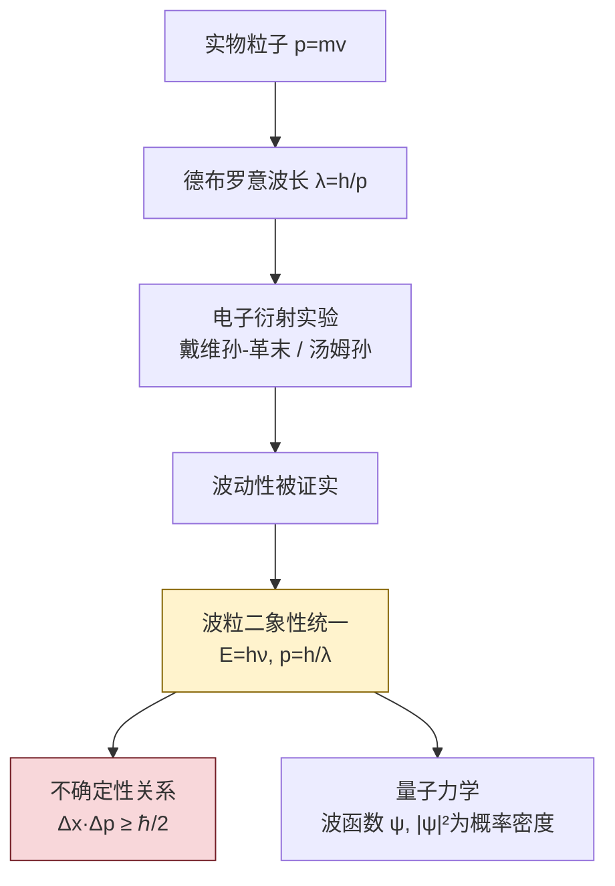

# 11.3 德布罗意波、不确定性关系

> [!info] 本节定位
> 本节是波粒二象性从光**推广到实物粒子**的关键一步，也是量子力学建立的逻辑枢纽。它回答的核心问题是：**既然光既具有波动性又具有粒子性，那么一向被视为粒子的电子、质子等实物粒子是否也具有波动性？如果具有，这种波动性会带来什么深刻的物理后果？**
>
> 1924 年德布罗意（L. de Broglie）在博士论文中提出大胆假设：实物粒子也伴随一种波——**物质波**（后称德布罗意波），其波长 $\lambda=\dfrac{h}{p}$ 与光的公式同构。1927 年戴维孙-革末的电子衍射实验直接证实了这一假设。1927 年海森堡（W. Heisenberg）进一步指出，波粒二象性的必然推论是：**粒子的位置与动量不能同时被精确确定**，即**不确定性关系** $\Delta x\cdot\Delta p\ge\dfrac{\hbar}{2}$。
>
> 本节在 [[11.2 光电效应、爱因斯坦光子理论|光子理论]]（$E=h\nu$、$p=\dfrac{h}{\lambda}$）的基础上展开，把波粒二象性提升为普遍原理，并为 [[11.4 玻尔氢原子模型简介|玻尔模型]] 的量子化条件提供物理解释（电子驻波），是连接旧量子论与现代量子力学的桥梁。本节实验数据均注明测量条件。

## 一、德布罗意假设

> [!theorem] 德布罗意假设（1924）
> 一切实物粒子（电子、质子、原子、分子等）都具有波动性。与能量为 $E$、动量为 $p$ 的粒子相伴随的波称为**德布罗意波（物质波）**，其频率与波长满足
> $$\boxed{\,\nu=\frac{E}{h},\qquad \lambda=\frac{h}{p}=\frac{h}{mv}\,}$$
> 其中 $m$ 在低速时为静止质量 $m_0$；高速时需用相对论动量 $p=\gamma m_0v$（见 [[11.1 狭义相对论基础|相对论动量]]）。这一关系称为**德布罗意公式**。

> [!note] 假设的动机：对称性
> 德布罗意的论证基于自然界的对称性：既然（原来认为是波的）光具有粒子性 $E=h\nu$、$p=\dfrac{h}{\lambda}$，那么（原来认为是粒子的）实物也应具有波动性，且用同一常数 $h$ 联系。这是物理学史上由"美学对称"导向重大发现的典型范例。

> [!example] 例题 1：电子德布罗意波长（经典情形）
> 求经电压 $U=100\,\text{V}$ 加速的电子的德布罗意波长。
>
> **解**：电子静能 $E_0=m_0c^2=0.511\,\text{MeV}=5.11\times10^{5}\,\text{eV}\gg100\,\text{eV}$，故可用经典近似。
> 由能量守恒 $\tfrac12m_0v^2=eU$，得 $p=\sqrt{2m_0eU}$，故
> $$\lambda=\frac{h}{\sqrt{2m_0eU}}=\frac{6.63\times10^{-34}}{\sqrt{2\times9.11\times10^{-31}\times1.60\times10^{-19}\times100}}$$
> 分母 $\sqrt{2\times9.11\times10^{-31}\times1.60\times10^{-19}\times100}=\sqrt{2.92\times10^{-47}}\approx5.40\times10^{-24}\,\text{kg·m/s}$。
> $$\lambda\approx\frac{6.63\times10^{-34}}{5.40\times10^{-24}}\approx1.23\times10^{-10}\,\text{m}=1.23\,\text{Å}$$
>
> **加速电压公式**（电子专用，经典近似）：
> $$\lambda(\text{nm})\approx\frac{1.23}{\sqrt{U(\text{V})}}\quad\text{或}\quad\lambda(\text{Å})\approx\sqrt{\frac{150}{U(\text{V})}}$$
> 本题 $\lambda=\sqrt{\dfrac{150}{100}}\,\text{Å}=\sqrt{1.5}\,\text{Å}\approx1.23\,\text{Å}$，与详细计算一致。
>
> **单位检验**：$\dfrac{\text{J·s}}{\sqrt{\text{kg·C·V}}}=\dfrac{\text{kg·m}^2/\text{s}}{\sqrt{\text{kg·kg·m}^2/\text{s}^2}}=\dfrac{\text{kg·m}^2/\text{s}}{\text{kg·m/s}}=\text{m}$，正确。

> [!example] 例题 2：宏观粒子的德布罗意波长
> 一颗质量 $m=10\,\text{g}=0.010\,\text{kg}$ 的子弹以 $v=400\,\text{m/s}$ 飞行，求其德布罗意波长。
>
> **解**：$\lambda=\dfrac{h}{mv}=\dfrac{6.63\times10^{-34}}{0.010\times400}=\dfrac{6.63\times10^{-34}}{4.0}\approx1.66\times10^{-33}\,\text{m}$。
> 此波长比原子核尺度（$\sim10^{-15}\,\text{m}$）还小 18 个量级，根本无法观测。这正是宏观物体不显波动性的原因——德布罗意波长极小，被经典粒子行为完全掩盖。

## 二、戴维孙-革末实验（1927）

> [!note] 实验装置
> 加热阴极发射电子，经电压 $U$ 加速后形成准直电子束，入射到镍单晶表面。探测器在反射方向测量散射电子强度随角度 $\theta$ 的分布。整个装置置于真空中（$\sim10^{-6}\,\text{Pa}$）。
>
> 关键测量量：加速电压 $U$（V，不确定度 $\sim0.1\,\text{V}$）、散射角 $\theta$（不确定度 $\sim0.1^\circ$）、散射电子强度（计数率）。

> [!theorem] 戴维孙-革末实验结果
> 当 $U=54\,\text{V}$、散射角 $\theta=50^\circ$ 时，散射电子强度出现**明显峰值**。这与 X 射线在晶体上的布拉格衍射规律完全类似。

> [!proof] 用德布罗意波长验证
> 电子动能为 $eU=54\,\text{eV}$，德布罗意波长（用加速电压公式）：
> $$\lambda=\sqrt{\frac{150}{54}}\,\text{Å}\approx\sqrt{2.78}\,\text{Å}\approx1.67\,\text{Å}$$
> 镍晶体的晶面间距 $d=2.15\,\text{Å}$。布拉格公式 $2d\sin\varphi=n\lambda$（$\varphi$ 为掠射角，与散射角 $\theta$ 关系 $\theta=2\varphi$）：
> - $\theta=50^\circ$，故 $\varphi=25^\circ$；
> - $n=1$ 时 $\lambda_{\text{理论}}=2d\sin\varphi=2\times2.15\times\sin25^\circ\approx4.30\times0.423\approx1.82\,\text{Å}$。
>
> 考虑电子在晶体中折射修正后，理论与实验在误差范围内吻合。这直接证实了电子具有波动性，德布罗意公式正确。$\square$

> [!note] 后续电子衍射实验
> - **汤姆孙实验（1927）**：电子束穿透多晶金属薄膜，得到与 X 射线德拜衍射相同的环状图样，再次证实电子波动性。
> - 后续实验证实中子、质子、原子甚至分子（$C_{60}$）都有衍射现象。波动性是所有微观粒子的普遍属性。

## 三、波粒二象性的统一

> [!theorem] 波粒二象性的普遍性
> 一切微观客体（光子、电子、原子等）都既具有粒子性（能量 $E$、动量 $p$），又具有波动性（频率 $\nu$、波长 $\lambda$），二者通过普朗克常数 $h$ 联系：
> $$E=h\nu,\qquad p=\frac{h}{\lambda}$$
> 这一关系对光与实物粒子**同样成立**，是自然界最深刻的对称性之一。

> [!warning] 物质波的概率解释
> 德布罗意波**不是经典波**，它不携带能量或质量的"实体流动"。玻恩（M. Born, 1926）提出：物质波是**概率波**，其振幅的模平方 $|\psi|^2$ 表示粒子在空间某处出现的**概率密度**。
> - 单个电子在屏幕上仍以整体形式被打到（粒子性）；
> - 大量电子的分布形成干涉/衍射图样（波动性）。
> 这一二象性的统一图景是量子力学的基本解释（哥本哈根诠释）。

## 四、海森堡不确定性关系

> [!theorem] 海森堡不确定性关系（1927）
> 由于波粒二象性，粒子的**位置**与**动量**不能同时被精确确定。两者不确定度满足
> $$\boxed{\,\Delta x\cdot\Delta p_x\ge\frac{\hbar}{2}\,}$$
> 其中 $\hbar=\dfrac{h}{2\pi}\approx1.055\times10^{-34}\,\text{J·s}$ 为约化普朗克常数。类似地有
> $$\Delta y\cdot\Delta p_y\ge\frac{\hbar}{2},\qquad \Delta z\cdot\Delta p_z\ge\frac{\hbar}{2}$$
> 以及能量-时间不确定性关系：
> $$\boxed{\,\Delta E\cdot\Delta t\ge\frac{\hbar}{2}\,}$$

> [!note] 不确定度的统计含义
> $\Delta x$ 与 $\Delta p$ 是对**大量同类测量**的统计标准差，而非单次测量的"误差"。它表示：即使测量仪器无限精确，重复测量粒子位置所得分布的宽度 $\Delta x$ 与同时测量动量所得分布的宽度 $\Delta p$ 之积仍受上述下界限制。

> [!proof] 不确定性关系的物理图像（单缝衍射启发）
> 设一束电子沿 $y$ 方向入射宽度为 $a$ 的单缝。电子穿过缝时，其 $x$ 坐标的不确定度 $\Delta x\approx a$。电子具有波动性，波长 $\lambda=\dfrac{h}{p}$，在缝后形成衍射图样（与光的单缝衍射相同）。中央主极大的半角宽度满足 $a\sin\theta\sim\lambda$（第一极小 $a\sin\theta=\lambda$）。
>
> 衍射使电子获得 $x$ 方向动量分量，其不确定度 $\Delta p_x\sim p\sin\theta=p\dfrac{\lambda}{a}=\dfrac{h}{a}$。故
> $$\Delta x\cdot\Delta p_x\sim a\cdot\frac{h}{a}=h\sim\hbar$$
> 严格推导（基于波函数分析）给出下界 $\dfrac{\hbar}{2}$。这说明不确定性根源于波粒二象性本身，而非仪器精度。$\square$

> [!warning] 不确定性关系的物理意义
> 1. **本质属性，非测量限制**：不确定性不是测量技术不够好，也不是测量过程对系统的扰动（虽然扰动也存在）。它是波粒二象性的**逻辑必然**——一个有确定动量（即确定波长 $\lambda=\dfrac{h}{p}$）的平面波必然在空间无限延伸（$\Delta x\to\infty$）；反之，空间高度定域的波包必然由众多波长叠加而成（$\Delta p$ 大）。
> 2. **不排斥单次精确测量**：可以瞬时把位置测得很准（$\Delta x\to0$），但代价是动量完全不确定（$\Delta p\to\infty$）。多次重复的统计分布仍满足上述关系。
> 3. **宏观物体为何不受其约束**：对 $m=0.01\,\text{kg}$、$v=400\,\text{m/s}$ 的子弹，若 $\Delta x\sim10^{-6}\,\text{m}$，则 $\Delta p\ge\dfrac{\hbar}{2\Delta x}\sim5\times10^{-29}\,\text{kg·m/s}$，对应 $\Delta v\sim5\times10^{-27}\,\text{m/s}$，远低于可测精度。故宏观物体表现出"经典粒子"行为。

> [!example] 例题 3：原子中电子的不确定性
> 估算氢原子中电子的动量不确定度与对应动能。设电子被限制在 $a_0=0.529\,\text{Å}=5.29\times10^{-11}\,\text{m}$ 范围内。
>
> **解**：取 $\Delta x\approx a_0=5.29\times10^{-11}\,\text{m}$。
> $$\Delta p\ge\frac{\hbar}{2\Delta x}=\frac{1.055\times10^{-34}}{2\times5.29\times10^{-11}}\approx9.97\times10^{-25}\,\text{kg·m/s}$$
> 对应动能（数量级估计，取 $p\sim\Delta p$）：
> $$E_k\sim\frac{(\Delta p)^2}{2m_0}=\frac{(9.97\times10^{-25})^2}{2\times9.11\times10^{-31}}\approx5.45\times10^{-19}\,\text{J}\approx3.4\,\text{eV}$$
> 这与氢原子基态能量量级 $13.6\,\text{eV}$ 同数量级，说明不确定性关系决定了原子的尺度与稳定性——电子不可能无限靠近原子核，否则动量极大、动能极高，体系不稳定。
>
> **单位检验**：$\dfrac{\text{J·s}}{\text{m}}=\text{kg·m/s}$ 为动量单位，正确。

## 五、不确定性关系的若干推论

> [!note] 能量-时间不确定性 $\Delta E\cdot\Delta t\ge\dfrac{\hbar}{2}$ 的应用
> 1. **激发态寿命与能级宽度**：原子激发态平均寿命 $\Delta t\sim10^{-8}\,\text{s}$，对应能级自然宽度
>    $$\Delta E\ge\frac{\hbar}{2\Delta t}=\frac{1.055\times10^{-34}}{2\times10^{-8}}\approx5.3\times10^{-27}\,\text{J}\approx3.3\times10^{-8}\,\text{eV}$$
>    这是原子谱线自然宽度的来源。
> 2. **虚粒子与真空涨落**：在极短时间 $\Delta t$ 内，能量可暂时"违背"守恒 $\Delta E$，量子场论据此解释虚粒子的产生与湮灭。
> 3. **零点能**：谐振子基态能量不为零 $E_0=\dfrac12\hbar\omega$，正是不确定性关系的必然结果（若 $E=0$ 则 $x=0$、$p=0$ 同时确定，违反 $\Delta x\Delta p\ge\dfrac{\hbar}{2}$）。

## 六、经典物理与量子物理的边界

| 比较项 | 经典物理（牛顿力学） | 量子物理（不确定性关系下） |
 | ------ | -------------------- | -------------------------- |
| 粒子状态 | 位置与动量同时确定 | $\Delta x\Delta p\ge\dfrac{\hbar}{2}$ |
| 轨道概念 | 有明确轨道 | 无确定轨道，只有概率分布 |
| 测量 | 可理想精确（不影响系统） | 测量改变系统状态 |
| 适用对象 | 宏观、低速 | 微观（原子、电子、光子） |
| 过渡判据 | — | 德布罗意波长 $\lambda$ 与体系特征尺度可比时 |

> [!tip] 何时必须用量子力学
> 当粒子的德布罗意波长 $\lambda=\dfrac{h}{p}$ 与体系特征尺度 $L$ 可比拟（$\lambda\gtrsim L$）时，波动性显著，必须用量子力学。例如：
> - 原子中电子：$\lambda\sim a_0\sim10^{-10}\,\text{m}$，与原子尺度同量级，量子效应显著；
> - 显微镜下尘埃：$\lambda\sim10^{-20}\,\text{m}$，远小于尘埃尺度，经典力学足够。

## 七、易错点

> [!warning] 易错点
> 1. **德布罗意波长公式中 $p$ 用相对论还是经典**：当 $v$ 接近 $c$ 或动能接近静能时，必须用 $p=\gamma m_0v$。电子经 $U$ 加速时，$eU\ll m_0c^2=0.511\,\text{MeV}$ 才能用经典 $p=\sqrt{2m_0eU}$。
> 2. **$\Delta x\Delta p\ge\dfrac{\hbar}{2}$ 不是 $\ge h$**：下界是 $\dfrac{\hbar}{2}=\dfrac{h}{4\pi}$，不是 $h$ 或 $\hbar$。粗略估算时常写 $\sim h$ 或 $\sim\hbar$，但严格关系是 $\dfrac{\hbar}{2}$。
> 3. **不确定性是本质属性，非测量误差**：不要把它理解为"仪器不够好导致测不准"。即使理想仪器，统计分布也满足此关系。
> 4. **位置和动量不确定性是"同一方向"上**：$\Delta x\Delta p_x$、$\Delta y\Delta p_y$、$\Delta z\Delta p_z$ 各自成对。$\Delta x$ 与 $\Delta p_y$ 之间无此约束。
> 5. **能量-时间不确定性的特殊性**：时间 $t$ 在量子力学中不是算符，$\Delta E\Delta t$ 的解释与 $\Delta x\Delta p$ 略有不同，常用于衰变寿命与能级宽度，不要滥用到"能量不守恒"的误解上。
> 6. **物质波不是经典波**：不要把它理解为"电子是一团散开的波"。单个电子仍是点状粒子，波动性体现在其概率分布上。

## 八、与其他小节的联系

- 本节的德布罗意公式 $\lambda=\dfrac{h}{p}$ 直接来自 [[11.2 光电效应、爱因斯坦光子理论|光子理论]] 中 $p=\dfrac{h}{\lambda}$ 的对称推广；
- 不确定性关系为 [[11.4 玻尔氢原子模型简介|玻尔模型]] 中电子轨道半径的存在（原子不坍缩）提供了根本解释；
- 用德布罗意波的驻波条件可"推导"玻尔量子化条件 $L=n\hbar$（详见 [[11.4 玻尔氢原子模型简介|下节]]）；
- 高速粒子的德布罗意波长需用 [[11.1 狭义相对论基础|相对论动量]] $p=\gamma m_0v$；
- 本章 MOC：[[MOC - 第11章]]。

## 章节导航

- 上一级：[[MOC - 第11章]]
- 上一节：[[11.2 光电效应、爱因斯坦光子理论]]
- 下一节：[[11.4 玻尔氢原子模型简介]]
- 习题：[[MOC - 第11章习题]]
