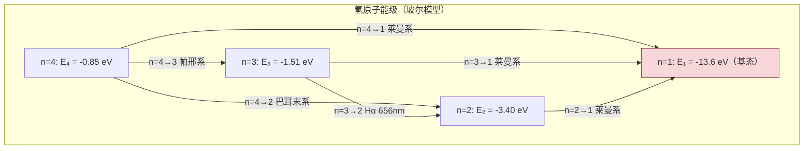

# 11.4 玻尔氢原子模型简介

> [!info] 本节定位
> 本节是旧量子论的**综合应用与顶峰**。它回答的核心问题是：**氢原子光谱为何呈现离散线状而非连续分布？电子为何不因辐射电磁波而坠入原子核？原子稳定性与光谱规律的物理根源是什么？**
>
> 19 世纪末，巴耳末等人发现氢原子光谱遵循极其简洁的经验公式，但经典物理完全无法解释：(1) 按经典电磁学，绕核加速运动的电子应连续辐射电磁波，能量损失导致轨道收缩，原子将在 $10^{-11}\,\text{s}$ 内坍缩；(2) 经典理论预言光谱连续，与实验观察到的离散线系矛盾。1913 年玻尔（N. Bohr）综合普朗克量子化、爱因斯坦光子理论与卢瑟福原子核式模型，提出三条基本假设，一举导出氢原子能级公式与光谱线系，开启了原子结构的量子理论。
>
> 本节在 [[11.2 光电效应、爱因斯坦光子理论|光子理论]]（$h\nu=E_2-E_1$）与 [[11.3 德布罗意波、不确定性关系|德布罗意波]]（驻波条件可"推导"量子化条件）的基础上展开，是本章知识的综合落脚点。本节明确指出玻尔模型的局限，作为通向现代量子力学的过渡。所有能量计算以 eV 为单位便于光谱应用，并给出 SI 换算。

## 一、氢原子光谱的实验规律

> [!definition] 线状光谱
> 氢原子放电管发出的光经光栅或棱镜分光后，得到一系列离散的谱线，称为**线状光谱（line spectrum）**。这与白炽灯的连续光谱截然不同，是原子内部能量量子化的直接证据。

> [!theorem] 里德伯公式（氢原子光谱经验公式）
> 氢原子所有谱线波长满足统一经验公式
> $$\boxed{\,\frac{1}{\lambda}=R\left(\frac{1}{n_1^2}-\frac{1}{n_2^2}\right),\quad n_2>n_1,\quad n_1,n_2\in\mathbb{N}\,}$$
> 其中 $R$ 为**里德伯常数**，实验值 $R_\infty=1.09737315\times10^{7}\,\text{m}^{-1}$（理论值考虑核质量修正后为 $R_H\approx1.09678\times10^{7}\,\text{m}^{-1}$）。$n_1$ 决定线系，$n_2$ 决定该系中的具体谱线。

> [!note] 氢原子光谱线系
> | 线系 | $n_1$ | $n_2$ 取值 | 发现年 | 区域 |
> | ---- | ----- | ---------- | ------ | ---- |
> | 莱曼系（Lyman） | 1 | 2,3,4,… | 1906 | 紫外区 |
> | 巴耳末系（Balmer） | 2 | 3,4,5,… | 1885 | 可见光区（含 $H_\alpha$ 红光 656.3 nm） |
> | 帕邢系（Paschen） | 3 | 4,5,6,… | 1908 | 红外区 |
> | 布拉开系（Brackett） | 4 | 5,6,7,… | 1922 | 远红外区 |
> | 普丰德系（Pfund） | 5 | 6,7,8,… | 1924 | 远红外区 |
>
> 每一线系随 $n_2$ 增大，波长递减并趋于一个**线系极限**（$n_2\to\infty$）：$\lambda_\infty=\dfrac{n_1^2}{R}$。

> [!example] 例题 1：巴耳末系前两条谱线
> 求巴耳末系（$n_1=2$）前两条谱线（$n_2=3$、$n_2=4$）的波长。
>
> **解**：取 $R=1.097\times10^{7}\,\text{m}^{-1}$。
> - $n_2=3$（$H_\alpha$ 线）：
>   $$\frac1\lambda=R\left(\frac1{4}-\frac1{9}\right)=1.097\times10^7\times\frac{5}{36}=1.524\times10^6\,\text{m}^{-1}$$
>   $\lambda=6.563\times10^{-7}\,\text{m}=656.3\,\text{nm}$（红光）。
> - $n_2=4$（$H_\beta$ 线）：
>   $$\frac1\lambda=R\left(\frac1{4}-\frac1{16}\right)=1.097\times10^7\times\frac{3}{16}=2.057\times10^6\,\text{m}^{-1}$$
>   $\lambda=4.862\times10^{-7}\,\text{m}=486.1\,\text{nm}$（蓝绿光）。
>
> **单位检验**：$\lambda$ 单位 $\text{m}^{-1}$ 的倒数，即 m，正确。

## 二、经典物理的困难

> [!warning] 卢瑟福模型的两大困难
> 1911 年卢瑟福提出原子核式结构模型：原子由带正电的致密核与绕核运动的电子组成。这一模型与 $\alpha$ 粒子散射实验一致，但遇到两个致命困难：
>
> 1. **原子不稳定（坍缩问题）**：按经典电磁学（[[MOC - 第8章|电磁感应]] 与 [[MOC - 第6章|静电场]]），绕核加速运动的电子会连续辐射电磁波，能量损失导致轨道半径不断缩小。估算坍缩时间 $\sim10^{-11}\,\text{s}$，与原子实际稳定性矛盾。
> 2. **光谱应为连续**：电子轨道连续收缩，辐射频率应连续变化，光谱应是连续谱。但实验观察到的是离散线状光谱。
>
> 这两个困难表明经典物理在原子尺度完全失效，必须引入量子假设。

## 三、玻尔的三条基本假设

> [!theorem] 玻尔假设（1913）
> 1. **定态假设**：电子只能在一系列离散的圆轨道上运动，不辐射电磁波。这些轨道称为**定态（stationary state）**，对应能量 $E_1<E_2<\dots<E_n$。原子处于定态时是稳定的。
> 2. **量子化条件**：定态轨道上电子的角动量 $L$ 是 $\hbar=\dfrac{h}{2\pi}$ 的整数倍：
>    $$\boxed{\,L=mvr=n\hbar=n\frac{h}{2\pi},\quad n=1,2,3,\dots\,}$$
>    $n$ 称为**主量子数**。
> 3. **跃迁假设（频率条件）**：电子从一个定态 $E_k$ 跃迁到另一个定态 $E_n$ 时，发射（$E_k>E_n$）或吸收（$E_k<E_n$）一个光子，其频率满足
>    $$\boxed{\,h\nu=|E_k-E_n|\,}$$
>    这与 [[11.2 光电效应、爱因斯坦光子理论|爱因斯坦光电效应方程]] 的能量量子交换思想一脉相承。

> [!note] 量子化条件的德布罗意解释（后见之明）
> 玻尔提出量子化条件时尚无德布罗意波。1924 年德布罗意提出物质波后，量子化条件获得自然的物理解释：电子在轨道上形成**驻波**，要求圆周长为电子波长的整数倍：
> $$2\pi r=n\lambda=n\frac{h}{mv}\Rightarrow mvr=\frac{nh}{2\pi}=n\hbar$$
> 这正是玻尔量子化条件。驻波条件保证了波在轨道上首尾相接不相消，对应稳定状态。这一解释把玻尔的"硬性"假设与 [[11.3 德布罗意波、不确定性关系|物质波]] 自然联系起来。

## 四、玻尔模型的推导

> [!proof] 玻尔模型推导氢原子能级与半径
> 电子（电荷 $-e$、质量 $m_e$）绕质子（电荷 $+e$、质量 $m_p\gg m_e$）做半径为 $r$ 的圆周运动。库仑力提供向心力：
> $$\frac{e^2}{4\pi\varepsilon_0 r^2}=\frac{m_e v^2}{r}\quad(1)$$
> 量子化条件：
> $$m_e v r=n\hbar\quad(2)$$
> 由 (2) 得 $v=\dfrac{n\hbar}{m_e r}$，代入 (1)：
> $$\frac{e^2}{4\pi\varepsilon_0 r^2}=\frac{m_e n^2\hbar^2}{m_e^2 r^3}=\frac{n^2\hbar^2}{m_e r^3}$$
> 解得**轨道半径**：
> $$\boxed{\,r_n=n^2\frac{4\pi\varepsilon_0\hbar^2}{m_e e^2}=n^2 a_0\,}$$
> 其中 $a_0=\dfrac{4\pi\varepsilon_0\hbar^2}{m_e e^2}$ 为**玻尔半径**。代入数据：
> $$a_0=\frac{4\pi\times8.85\times10^{-12}\times(1.055\times10^{-34})^2}{9.11\times10^{-31}\times(1.60\times10^{-19})^2}\approx5.29\times10^{-11}\,\text{m}=0.529\,\text{Å}$$
>
> 速度 $v_n=\dfrac{n\hbar}{m_e r_n}=\dfrac{e^2}{4\pi\varepsilon_0 n\hbar}=\dfrac{v_1}{n}$，其中 $v_1=\dfrac{e^2}{4\pi\varepsilon_0\hbar}\approx2.19\times10^6\,\text{m/s}\approx\dfrac{c}{137}$（精细结构常数 $\alpha\approx1/137$ 的体现，故可忽略相对论修正）。
>
> 能量为动能与势能之和：
> $$E_n=\frac12 m_e v_n^2-\frac{e^2}{4\pi\varepsilon_0 r_n}$$
> 由 (1) 得 $\dfrac12 m_e v_n^2=\dfrac{e^2}{8\pi\varepsilon_0 r_n}$，故 $E_n=\dfrac{e^2}{8\pi\varepsilon_0 r_n}-\dfrac{e^2}{4\pi\varepsilon_0 r_n}=-\dfrac{e^2}{8\pi\varepsilon_0 r_n}$。代入 $r_n$：
> $$\boxed{\,E_n=-\frac{m_e e^4}{2(4\pi\varepsilon_0)^2\hbar^2}\cdot\frac{1}{n^2}=-\frac{13.6}{n^2}\,\text{eV}\,}$$
> 负号表示电子受核束缚（能量为束缚态）。基态（$n=1$）能量 $E_1=-13.6\,\text{eV}$，即氢原子电离能。$\square$

> [!theorem] 氢原子能级与跃迁频率
> 氢原子能级（玻尔模型）：
> $$E_n=-\frac{13.6}{n^2}\,\text{eV}\quad(n=1,2,3,\dots)$$
> 由 $E_k$ 跃迁到 $E_n$（$k>n$）发射光子：
> $$\frac1\lambda=\frac{E_k-E_n}{hc}=\frac{13.6\,\text{eV}}{hc}\left(\frac1{n^2}-\frac1{k^2}\right)$$
> 代入 $hc=1240\,\text{eV·nm}$ 与 $13.6\,\text{eV}$，得 $\dfrac{13.6}{hc}\approx1.097\times10^7\,\text{m}^{-1}=R$，**与里德伯常数实验值吻合**。这是玻尔模型的最大成功。

> [!example] 例题 2：氢原子电离能
> 求氢原子从基态电离所需的最小光子能量与波长。
>
> **解**：基态 $E_1=-13.6\,\text{eV}$，电离到 $E_\infty=0$ 需能量
> $$E_{\text{ion}}=0-(-13.6)=13.6\,\text{eV}=13.6\times1.60\times10^{-19}=2.18\times10^{-18}\,\text{J}$$
> 对应光子波长
> $$\lambda=\frac{hc}{E}=\frac{1240\,\text{eV·nm}}{13.6\,\text{eV}}\approx91.2\,\text{nm}$$
> 此波长在紫外区（莱曼系极限 $\lambda_\infty=\dfrac{1}{R}=91.2\,\text{nm}$，一致）。
>
> **单位检验**：$hc/E$ 单位 $\text{eV·nm}/\text{eV}=\text{nm}$，正确。

> [!example] 例题 3：玻尔模型跃迁波长
> 氢原子从 $n=3$ 跃迁到 $n=1$，求发射光子的能量与波长。属于哪个线系？
>
> **解**：$E_3=-\dfrac{13.6}{9}=-1.51\,\text{eV}$，$E_1=-13.6\,\text{eV}$。
> $$\Delta E=E_3-E_1=-1.51-(-13.6)=12.1\,\text{eV}$$
> 光子能量 $h\nu=12.1\,\text{eV}$，波长
> $$\lambda=\frac{hc}{\Delta E}=\frac{1240}{12.1}\approx102.5\,\text{nm}$$
> 跃迁到 $n=1$，属于**莱曼系**（紫外区）。
>
> **单位检验**：$\lambda$ 单位 nm；$\Delta E$ 单位 eV，正确。

## 五、玻尔半径与原子尺度

> [!definition] 玻尔半径
> $$a_0=\frac{4\pi\varepsilon_0\hbar^2}{m_e e^2}\approx5.29\times10^{-11}\,\text{m}=0.529\,\text{Å}$$
> 是氢原子基态电子轨道半径，也是原子物理的特征长度单位。
>
> 各定态轨道半径 $r_n=n^2 a_0$：$r_1=0.529\,\text{Å}$、$r_2=2.12\,\text{Å}$、$r_3=4.76\,\text{Å}$ 等，随 $n^2$ 增长。

> [!note] 玻尔半径的物理意义
> $a_0$ 给出了原子尺度的下限，也解释了原子为何不坍缩——电子不能无限靠近原子核，最低只能处于 $n=1$ 的基态。结合 [[11.3 德布罗意波、不确定性关系|不确定性关系]] 的论证：把电子限制在 $a_0$ 范围内带来动量不确定度，对应动能恰好与库仑势能平衡，使总能量最小。这是基态稳定性的更深层解释。

## 六、玻尔模型的成功与局限

> [!summary] 玻尔模型的成功
> 1. **定量解释氢原子光谱**：从基本常数 $m_e$、$e$、$\hbar$、$\varepsilon_0$ 出发导出 $E_n=-\dfrac{13.6}{n^2}\,\text{eV}$，与里德伯公式完全一致，里德伯常数不再只是经验参数。
> 2. **解释原子稳定性**：定态假设排除了电子连续辐射，基态能量有下界，原子不坍缩。
> 3. **给出原子尺度**：玻尔半径 $a_0=0.529\,\text{Å}$ 与原子实际尺度（$\sim1\,\text{Å}$）一致。
> 4. **推广到类氢离子**：对 $He^+$、$Li^{2+}$ 等单电子离子，把 $e^2$ 换成 $Ze^2$，得 $E_n=-\dfrac{13.6Z^2}{n^2}\,\text{eV}$，与实验符合。
> 5. **与德布罗意波自洽**：量子化条件 $L=n\hbar$ 由驻波条件自然得到（[[11.3 德布罗意波、不确定性关系|上节]]）。

> [!warning] 玻尔模型的局限
> 1. **无法解释多电子原子**：对 $He$、$Li$ 等含两个及以上电子的原子，玻尔模型定量失败。原因是它未考虑电子-电子相互作用、泡利不相容原理、电子自旋等。
> 2. **无法解释光谱精细结构**：用高分辨光谱仪观察，氢原子谱线实际由若干相近的细线组成（精细结构）。玻尔模型只给出主线，需要引入相对论修正与自旋-轨道耦合（由狄拉克方程和量子电动力学解决）。
> 3. **无法解释塞曼效应**：在外磁场中原子谱线发生分裂的现象（塞曼效应），玻尔模型无能为力，需引入量子力学角动量与磁矩理论。
> 4. **无法解释斯塔克效应**：外电场中谱线分裂同样超出玻尔模型范围。
> 5. **无法处理谱线强度**：玻尔模型只给出谱线位置（频率），不能给出谱线强度、偏振、寿命等，这些需量子力学跃迁概率理论。
> 6. **理论内部不自洽**：玻尔模型既保留经典轨道（牛顿力学+库仑定律），又强加量子化假设，逻辑上不统一。真正的量子力学（薛定谔方程，1926 年）放弃了轨道概念，用波函数描述电子概率分布。

> [!note] 从玻尔模型到量子力学
> 玻尔模型是"旧量子论"的代表，过渡性质明显。现代量子力学通过薛定谔方程求解氢原子：
> - 主量子数 $n$、角量子数 $l$（$0\le l\le n-1$）、磁量子数 $m_l$（$-l\le m_l\le l$）、自旋 $m_s$ 共同描述电子状态；
> - 能量公式 $E_n=-\dfrac{13.6}{n^2}\,\text{eV}$ 在玻尔模型基础上保持不变（对氢原子），但物理解释已彻底改变——轨道被电子云（概率分布）取代；
> - 角动量量子化修正为 $L=\sqrt{l(l+1)}\hbar$（而非 $n\hbar$），且方向也是量子化的（空间量子化）。

## 七、易错点

> [!warning] 易错点
> 1. **能级公式 $E_n=-\dfrac{13.6}{n^2}\,\text{eV}$ 仅适用于氢原子与类氢离子**：多电子原子不适用。类氢离子（$He^+$、$Li^{2+}$）需乘 $Z^2$。
> 2. **跃迁条件 $h\nu=|E_k-E_n|$ 中能量差要取绝对值**：发射光子时 $E_k>E_n$，吸收时 $E_k<E_n$，公式都成立。注意 $n$ 为终态，$k$ 为初态。
> 3. **玻尔半径 $a_0$ 是基态（$n=1$）半径，不是任意轨道半径**：$r_n=n^2 a_0$，$n=2$ 时 $r_2=4a_0$。
> 4. **波长与波数公式区分**：里德伯公式给出的是 $\dfrac1\lambda$（波数），不是 $\lambda$ 本身。求波长要取倒数。
> 5. **玻尔模型中电子有确定轨道是过时图像**：现代量子力学中电子无确定轨道，只有概率分布。玻尔模型的"轨道"应理解为能量与角动量量子化的形象化描述。
> 6. **能级为负值是束缚态标志**：负号表示电子被核束缚，能量零点取在电子完全脱离核（$n\to\infty$）处。不要把负号当成"能量小于零"的奇怪现象。
> 7. **单位换算**：能级常用 eV，波长常用 nm 或 Å，注意 $hc=1240\,\text{eV·nm}$ 的便捷换算。

## 八、与其他小节的联系

- 玻尔跃迁假设 $h\nu=E_2-E_1$ 与 [[11.2 光电效应、爱因斯坦光子理论|光电效应方程]] 形式同构，体现了能量量子交换的普适性；
- 量子化条件 $L=n\hbar$ 由 [[11.3 德布罗意波、不确定性关系|德布罗意波]] 的驻波条件自然解释；
- 玻尔半径 $a_0$ 的存在性可由 [[11.3 德布罗意波、不确定性关系|不确定性关系]] 给出的动量-能量平衡论证；
- 原子能级与 [[11.1 狭义相对论基础|质能关系]] 在核反应能量计算中共同使用；
- 本章 MOC：[[MOC - 第11章]]。

## 章节导航

- 上一级：[[MOC - 第11章]]
- 上一节：[[11.3 德布罗意波、不确定性关系]]
- 先修：[[MOC - 第6章]]（库仑定律、静电势能）
- 习题：[[MOC - 第11章习题]]
