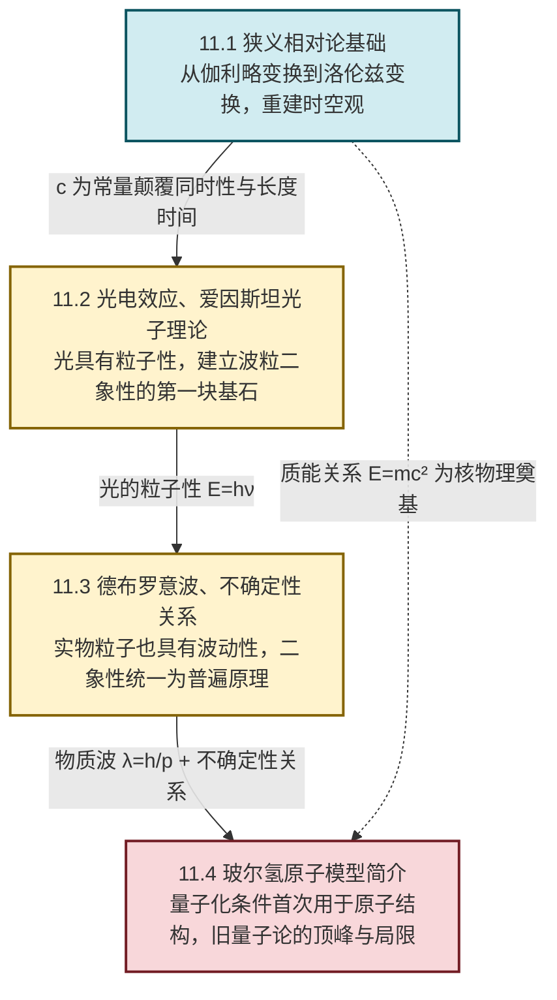

# MOC - 第11章 近代物理基础

> [!info] 本章定位
> 近代物理基础（Foundations of Modern Physics）是大学物理课程的**收束与革命之章**。它要解决的核心问题是：**当物体运动速度接近光速、当能量与空间尺度进入原子层次时，经典牛顿力学与麦克斯韦电磁学为何失效，物理学家如何用相对论与量子论重建对自然的基本描述**。
>
> 19 世纪末，经典物理似乎已"完备"：牛顿力学统一天上地下，麦克斯韦方程组统一电、磁、光。但两朵乌云——"以太漂移零结果"与"黑体辐射紫外灾难"——催生了 20 世纪物理学的两大支柱：**狭义相对论**（时空观的革命）与**量子论**（物质观的革命）。本章从这两条线索切入，依次建立相对论运动学与动力学、光的粒子性、物质的波动性、不确定性关系，并以玻尔氢原子模型作为量子论的早期综合应用，为后续量子力学课程铺设入口。
>
> 本章在 [[MOC - 第8章|电磁感应与电磁场]]（麦克斯韦方程组预言光速 $c=\dfrac{1}{\sqrt{\mu_0\varepsilon_0}}$ 与参照系无关）和 [[MOC - 第2章|牛顿运动定律]]（伽利略相对性原理、绝对时空观）的基础上展开，是经典物理向近代物理过渡的关键节点。本章讨论范围限定于**狭义相对论（不涉及广义相对论）**与**旧量子论（不涉及完整量子力学）**；公式中各物理量均采用 SI 单位。

## 学习路线图

## 知识点导航

| 小节 | 标题 | 核心内容 | 关键物理量（SI单位） |
| ---- | ---- | -------- | -------------------- |
| [[11.1 狭义相对论基础\|11.1]] | 狭义相对论基础 | 伽利略变换与力学相对性原理、迈克尔逊-莫雷实验、爱因斯坦两条基本假设、洛伦兹变换、同时的相对性、长度收缩 $L=L_0\sqrt{1-v^2/c^2}$、时间延缓 $\Delta t=\dfrac{\Delta\tau}{\sqrt{1-v^2/c^2}}$、相对论动量与能量、质能关系 $E=mc^2$ | 光速 $c$（m/s）、相对论因子 $\gamma$（无量纲）、静能 $E_0$（J） |
| [[11.2 光电效应、爱因斯坦光子理论\|11.2]] | 光电效应、爱因斯坦光子理论 | 光电效应实验规律、经典波动理论的困难、爱因斯坦光子理论 $E=h\nu$、光电效应方程 $h\nu=\tfrac12 mv^2+A$、康普顿效应 $\Delta\lambda=\dfrac{h}{m_0c}(1-\cos\theta)$、光的波粒二象性 | 普朗克常数 $h=6.63\times10^{-34}\,\text{J·s}$、光子能量 $E$（J）、逸出功 $A$（J/eV） |
| [[11.3 德布罗意波、不确定性关系\|11.3]] | 德布罗意波、不确定性关系 | 德布罗意假设 $\lambda=\dfrac{h}{p}=\dfrac{h}{mv}$、戴维孙-革末电子衍射实验、波粒二象性统一、海森堡不确定性关系 $\Delta x\cdot\Delta p\ge\dfrac{\hbar}{2}$、$\Delta E\cdot\Delta t\ge\dfrac{\hbar}{2}$ | 德布罗意波长 $\lambda$（m）、约化普朗克常数 $\hbar=\dfrac{h}{2\pi}$（J·s） |
| [[11.4 玻尔氢原子模型简介\|11.4]] | 玻尔氢原子模型简介 | 氢原子光谱线系、里德伯公式 $\dfrac1\lambda=R\left(\dfrac1{n_1^2}-\dfrac1{n_2^2}\right)$、玻尔三条基本假设、玻尔半径 $a_0=0.529\,\text{Å}$、氢原子能级 $E_n=-\dfrac{13.6}{n^2}\,\text{eV}$、玻尔模型的成就与局限 | 里德伯常数 $R$（m⁻¹）、玻尔半径 $a_0$（m）、能级 $E_n$（eV） |

## 核心考点

> [!summary] 本章核心考点（7 点）
> 1. **爱因斯坦两条基本假设**：相对性原理（物理定律在一切惯性系中形式相同）与光速不变原理（真空光速 $c$ 与光源或观察者运动无关）。这是整个狭义相对论的逻辑起点，必须与伽利略变换的"速度合成"明确区分。
> 2. **洛伦兹变换**：$x'=\dfrac{x-vt}{\sqrt{1-v^2/c^2}}$、$t'=\dfrac{t-vx/c^2}{\sqrt{1-v^2/c^2}}$。在 $v\ll c$ 时退化为伽利略变换。必须能正反方向使用，并注意时间与空间坐标的**耦合**（$t'$ 依赖 $x$）。
> 3. **同时的相对性、长度收缩、时间延缓**：三条运动学效应同源于光速不变。固长 $L_0$（物体静止时测得的长度）与固有时期 $\Delta\tau$（同地发生的两事件时间间隔）是不变量；运动观测下 $L=L_0/\gamma$ 变短，$\Delta t=\gamma\Delta\tau$ 变长，其中 $\gamma=\dfrac1{\sqrt{1-v^2/c^2}}\ge1$。
> 4. **相对论动量与能量、质能关系**：$p=\dfrac{mv}{\sqrt{1-v^2/c^2}}=\gamma mv$，$E=mc^2=\gamma m_0c^2$，静能 $E_0=m_0c^2$。动量-能量关系 $E^2=p^2c^2+m_0^2c^4$ 在静系退化为 $E_0=m_0c^2$。质能关系是核反应与粒子物理的能量账本。
> 5. **光电效应方程**：$h\nu=\dfrac12mv_{\max}^2+A$。截止频率 $\nu_0=\dfrac{A}{h}$；遏止电压 $U_a=\dfrac{h\nu-A}{e}$。光子概念解释了光电效应的瞬时性、截止频率与光强无关等经典波动理论无法说明的现象。
> 6. **康普顿效应与德布罗意波长**：康普顿散射 $\Delta\lambda=\dfrac{h}{m_0c}(1-\cos\theta)$ 直接验证光子具有动量 $p=\dfrac{h}{\lambda}$；德布罗意假设把波动性推广到实物粒子 $\lambda=\dfrac{h}{p}$，并被电子衍射实验证实。
> 7. **玻尔氢原子模型**：定态假设、量子化条件 $L=n\hbar$、跃迁假设 $h\nu=E_2-E_1$。导出 $E_n=-\dfrac{13.6}{n^2}\,\text{eV}$、$a_0=0.529\,\text{Å}$、里德伯常数。理解玻尔模型的成功（解释氢光谱）与局限（不能处理多电子原子、光谱精细结构、塞曼效应等）。

## 自测题

> [!question]- 自测 1：洛伦兹因子与低速极限
> 一粒子以 $v=0.60c$ 运动，求相对论因子 $\gamma$。当 $v\ll c$ 时 $\gamma$ 的近似值是多少？说明此近似对应的物理意义。
>
> > [!check]- 答案
> > $\gamma=\dfrac{1}{\sqrt{1-v^2/c^2}}=\dfrac{1}{\sqrt{1-0.36}}=\dfrac{1}{\sqrt{0.64}}=\dfrac{1}{0.80}=1.25$。
> > 当 $v\ll c$ 时，$\gamma\approx 1+\dfrac{v^2}{2c^2}\to 1$，相对论效应可忽略，退化回牛顿力学。这是经典力学适用范围的判据。

> [!question]- 自测 2：时间延缓与寿命
> 静止 $\mu$ 子的平均寿命 $\Delta\tau=2.2\,\mu\text{s}$。若 $\mu$ 子以 $v=0.995c$ 运动，在地面参考系中观察其平均飞行距离是多少？
>
> > [!check]- 答案
> > $\gamma=\dfrac{1}{\sqrt{1-0.995^2}}\approx 10.0$。
> > 地面系中寿命 $\Delta t=\gamma\Delta\tau=10.0\times2.2\,\mu\text{s}=22\,\mu\text{s}$。
> > 飞行距离 $L=v\Delta t\approx 0.995c\times22\times10^{-6}\,\text{s}\approx 6.6\times10^{3}\,\text{m}$。
> > 这正是宇宙线 $\mu$ 子能到达地面的原因，是时间延缓的典型证据。

> [!question]- 自测 3：光电效应截止频率
> 某金属逸出功 $A=2.20\,\text{eV}$。求其截止频率 $\nu_0$ 与对应波长 $\lambda_0$（取 $h=6.63\times10^{-34}\,\text{J·s}$，$1\,\text{eV}=1.60\times10^{-19}\,\text{J}$）。
>
> > [!check]- 答案
> > $A=2.20\times1.60\times10^{-19}=3.52\times10^{-19}\,\text{J}$。
> > $\nu_0=\dfrac{A}{h}=\dfrac{3.52\times10^{-19}}{6.63\times10^{-34}}\approx 5.31\times10^{14}\,\text{Hz}$。
> > $\lambda_0=\dfrac{c}{\nu_0}=\dfrac{3.0\times10^8}{5.31\times10^{14}}\approx 5.65\times10^{-7}\,\text{m}=565\,\text{nm}$（黄绿光）。
> > 频率低于 $\nu_0$（波长长于 $\lambda_0$）的光无论多强都不能产生光电效应。

> [!question]- 自测 4：玻尔模型跃迁
> 氢原子从 $n=4$ 跃迁到 $n=2$，发射光子的能量与波长各是多少？属于哪个线系？（取 $E_n=-\dfrac{13.6}{n^2}\,\text{eV}$）
>
> > [!check]- 答案
> > $\Delta E=E_4-E_2=\left(-\dfrac{13.6}{16}\right)-\left(-\dfrac{13.6}{4}\right)=(-0.85)-(-3.40)=2.55\,\text{eV}$。
> > 光子能量 $h\nu=2.55\,\text{eV}=2.55\times1.60\times10^{-19}=4.08\times10^{-19}\,\text{J}$。
> > $\lambda=\dfrac{hc}{\Delta E}=\dfrac{6.63\times10^{-34}\times3.0\times10^8}{4.08\times10^{-19}}\approx 4.88\times10^{-7}\,\text{m}=488\,\text{nm}$（蓝绿光）。
> > 跃迁到 $n=2$，属于**巴耳末系**（可见光区）。

## 章节导航

> [!nav] 导航
> 上级：[[MOC - 大学物理B|大学物理B 课程总览]]
> 先修：[[MOC - 第2章|第2章 牛顿运动定律]]、[[MOC - 第6章|第6章 静电场]]、[[MOC - 第8章|第8章 电磁感应与电磁场]]、[[MOC - 第9章|第9章 机械振动与机械波]]
> 配套习题：[[MOC - 第11章习题|第11章 习题]]
