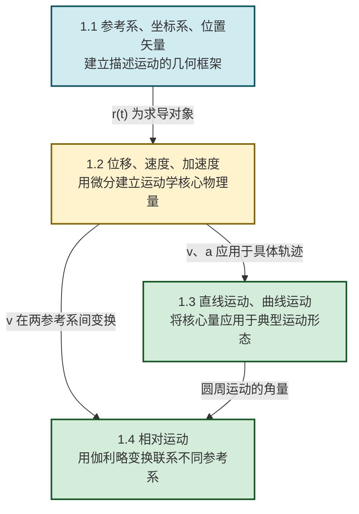

# MOC - 第1章 质点运动学

> [!info] 本章定位
> 质点运动学（Particle Kinematics）是整个力学乃至物理学的**描述性基础**。它回答的核心问题是：**如何用数学语言精确描述物体的空间位置随时间的变化**，而暂不涉及"为什么这样运动"（那是第2章[[MOC - 第2章|牛顿运动定律]]的职责）。本章建立起**位置矢量 → 速度 → 加速度**的微分链条，以及**伽利略变换**这一不同参考系之间的桥梁，为后续力学、电磁学、振动波动和相对论提供统一的运动描述框架。
>
> 本章仅讨论 $v \ll c$（光速）的经典极限，即牛顿绝对时空观成立范围内；高速情形见第11章近代物理基础。

## 学习路线图

## 知识点导航

| 小节 | 标题 | 核心内容 | 关键物理量（SI单位） |
| ---- | ---- | -------- | -------------------- |
| [[1.1 参考系、坐标系、位置矢量\|1.1]] | 参考系、坐标系、位置矢量 | 参考系、质点模型、位置矢量 $\vec r$、运动方程与轨迹方程 | 位置 $\vec r$（m）、坐标 $x,y,z$（m） |
| [[1.2 位移、速度、加速度\|1.2]] | 位移、速度、加速度 | 位移 $\Delta\vec r$ 与路程、平均/瞬时速度、平均/瞬时加速度 | 速度 $\vec v$（m/s）、加速度 $\vec a$（m/s²） |
| [[1.3 直线运动、曲线运动\|1.3]] | 直线运动、曲线运动 | 匀变速直线运动、抛体运动、圆周运动（角量与线量）、自然坐标下法向/切向加速度 | 角速度 $\omega$（rad/s）、向心加速度 $a_n$（m/s²） |
| [[1.4 相对运动\|1.4]] | 相对运动 | 伽利略变换（位置、速度、加速度）、动系平动、典型问题 | 相对速度 $\vec v'$（m/s）、牵连速度 $\vec u$（m/s） |

## 核心考点

> [!summary] 本章核心考点（6 点）
> 1. **运动方程求速度与加速度**：已知 $\vec r(t)$，通过求导得 $\vec v = \dfrac{\mathrm d\vec r}{\mathrm dt}$、$\vec a = \dfrac{\mathrm d\vec v}{\mathrm dt}$；反之由积分求运动方程。这是运动学最基本题型。
> 2. **位移与路程的区别**：位移 $\Delta\vec r$ 是矢量，仅取决于始末位置；路程 $s$ 是标量，沿轨迹实际长度。直线运动中两者数值未必相等，往返运动时 $s > |\Delta\vec r|$。
> 3. **圆周运动的角量与线量关系**：$v = R\omega$、$a_n = \dfrac{v^2}{R} = R\omega^2$、$a_t = \dfrac{\mathrm dv}{\mathrm dt} = R\alpha$。区分向心（法向）加速度与切向加速度的物理意义。
> 4. **抛体运动的独立性**：水平方向匀速、竖直方向匀变速，两方向运动相互独立，仅通过时间 $t$ 联系。
> 5. **伽利略速度变换**：$\vec v = \vec v' + \vec u$，注意三个速度（绝对、相对、牵连）的矢量关系与参考系归属。加速度在动系匀速平动时不变。
> 6. **自然坐标下加速度的分解**：$\vec a = a_t\hat\tau + a_n\hat n$，其中 $a_n$ 始终指向曲率中心，反映速度方向变化；$a_t$ 反映速度大小变化。

## 自测题

> [!question]- 自测 1：运动方程求导
> 已知质点运动方程为 $\vec r(t) = (3t^2)\hat i + (2t-1)\hat j + 5\hat k$（SI），求 $t=2\,\text{s}$ 时的速度与加速度。
>
> > [!check]- 答案
> > $\vec v = \dfrac{\mathrm d\vec r}{\mathrm dt} = 6t\,\hat i + 2\,\hat j$，$t=2\,\text{s}$ 时 $\vec v = 12\hat i + 2\hat j$（m/s）；
> > $\vec a = \dfrac{\mathrm d\vec v}{\mathrm dt} = 6\hat i$（m/s²）。

> [!question]- 自测 2：圆周运动线量与角量
> 质点做半径 $R=0.5\,\text{m}$ 的圆周运动，角位置 $\theta = 4t^2$（rad，$t$ 单位 s）。求 $t=2\,\text{s}$ 时的速率、向心加速度与切向加速度。
>
> > [!check]- 答案
> > $\omega = \dfrac{\mathrm d\theta}{\mathrm dt} = 8t = 16\,\text{rad/s}$；$v = R\omega = 0.5\times 16 = 8\,\text{m/s}$；
> > $a_n = R\omega^2 = 0.5\times 16^2 = 128\,\text{m/s}^2$；$\alpha = 8\,\text{rad/s}^2$，$a_t = R\alpha = 0.5\times 8 = 4\,\text{m/s}^2$。

> [!question]- 自测 3：伽利略速度变换
> 河宽 $d=100\,\text{m}$，水流速度 $\vec u = 3\hat i$（m/s），船相对静水速度 $v'=5\,\text{m/s}$。船头始终垂直河岸指向对岸，求船到达对岸的位置与渡河时间。
>
> > [!check]- 答案
> > 渡河时间由垂直河岸分量决定：$t = \dfrac{d}{v'} = \dfrac{100}{5} = 20\,\text{s}$；
> > 下漂距离 $x = u\,t = 3\times 20 = 60\,\text{m}$。船到达对岸下游 $60\,\text{m}$ 处。

> [!question]- 自测 4：位移与路程
> 质点沿 $x$ 轴运动，方程 $x = 3t^2 - t^3$（m），求 $t=0$ 到 $t=3\,\text{s}$ 的位移与路程。
>
> > [!check]- 答案
> > 位移 $\Delta x = x(3)-x(0) = (27-27)-0 = 0\,\text{m}$；
> > 速度 $v = 6t - 3t^2 = 3t(2-t)$，$t=2\,\text{s}$ 时 $v=0$（折返点）。
> > $x(2) = 12-8 = 4\,\text{m}$。
> > 路程 $s = |x(2)-x(0)| + |x(3)-x(2)| = 4 + 4 = 8\,\text{m}$。

## 章节导航

> [!nav] 导航
> 上级：[[MOC - 大学物理B|大学物理B 课程总览]]
> 上一级课程：[[MOC - 高等数学A(1)|高等数学A(1)]]（微积分先修）
> 下一章：[[MOC - 第2章|第2章 牛顿运动定律]]
> 配套习题：[[MOC - 第1章习题|第1章 习题]]
