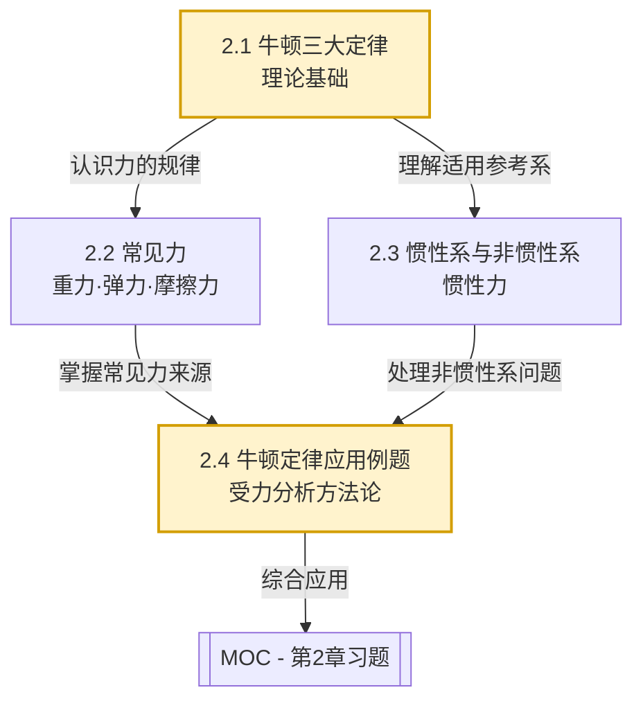

# MOC - 第2章 牛顿运动定律

> [!info] 本章定位
> 牛顿运动定律是经典力学的基石，它回答了第1章运动学留下的核心问题——**物体为什么这样运动**。第1章用 $\vec{r}, \vec{v}, \vec{a}$ 描述运动"是什么"，第2章则用 $\vec{F}=m\vec{a}$ 揭示运动"为什么变化"。本章要解决的核心问题是：在给定受力情况下如何求出物体的运动（动力学正问题），以及由运动状态如何反推受力（动力学逆问题）。它向上承接[[MOC - 第1章]]的运动学描述，向下为[[MOC - 第3章]]的动量与能量守恒、[[MOC - 第4章]]的刚体转动提供力的瞬时规律。

## 本章核心问题

1. 力是什么？如何用三大定律定量描述力与运动的关系？
2. 工程中常见的力（重力、弹力、摩擦力）有什么特征和适用条件？
3. 牛顿定律在什么参考系下成立？非惯性系中如何"修补"才能继续使用？
4. 面对一个具体问题，如何规范地做受力分析并建立方程求解？

## 学习路线图

## 知识点导航

| 小节 | 主题 | 入口 | 核心要点 |
| ---- | ---- | ---- | -------- |
| 2.1 | 牛顿三大定律 | [[2.1 牛顿三大定律]] | 惯性定律、$\vec{F}=m\vec{a}$、作用反作用、力的单位与适用条件 |
| 2.2 | 常见力：重力、弹力、摩擦力 | [[2.2 常见力：重力、弹力、摩擦力]] | $G=mg$、万有引力、胡克定律、静/滑动摩擦力 |
| 2.3 | 惯性系与非惯性系、惯性力 | [[2.3 惯性系与非惯性系、惯性力]] | 惯性系定义、$\vec{F}_{惯}=-m\vec{a}_0$、惯性离心力、科里奥利力 |
| 2.4 | 牛顿定律应用例题 | [[2.4 牛顿定律应用例题]] | 隔离体法、连接体、斜面、圆周运动向心力分析 |

## 核心考点

> [!summary] 高频考点（5-7点）
> 1. **牛顿第二定律的矢量性与瞬时性**：$\vec{F}=m\vec{a}$ 是矢量方程，某一时刻的力决定该时刻的加速度，而非速度；力变则加速度同时变。
> 2. **受力分析的隔离体法**：正确选取研究对象、画受力图、建立坐标、投影列方程是动力学求解的统一范式。
> 3. **摩擦力的方向与静/动判定**：静摩擦力 $f$ 由平衡或动力学方程决定（$0\le f\le \mu_s N$），方向与相对运动趋势相反；滑动摩擦力 $f=\mu N$，方向与相对运动方向相反。
> 4. **连接体问题中的内力与整体法**：整体法求共同加速度，隔离法求绳上张力等内力。
> 5. **圆周运动的向心力来源**：向心力是合力的法向分量，而非新增的力；需正确指明由哪个真实力提供。
> 6. **惯性力的引入与计算**：在加速平动系中 $\vec{F}_{惯}=-m\vec{a}_0$，在旋转系中存在惯性离心力 $\vec{F}=-m\omega^2\vec{r}$，方向背离转轴。
> 7. **牛顿定律的适用条件**：仅适用于惯性系、宏观物体、低速（$v\ll c$）运动，高速时需改用相对论力学。

## 自测题

> [!question]- 自测1：第一定律的意义
> 牛顿第一定律在什么参考系下成立？它定义了哪个物理量？
>
> > [!check]- 答案
> > 在惯性系下成立。第一定律定义了**惯性**——物体保持原有运动状态的性质，并定义了"力是改变运动状态的原因"。它不能由第二定律 $\vec{F}=0\Rightarrow \vec{a}=0$ 简单推出，因为第二定律本身依赖惯性系的前提。

> [!question]- 自测2：作用力与反作用力
> 书静止放在桌面上，书的重力与桌面对书的支持力是否构成一对作用力与反作用力？为什么？
>
> > [!check]- 答案
> > **不是**。书的重力受力物体是"书"，施力物体是"地球"；支持力受力物体也是"书"，施力物体是"桌面"。作用力与反作用力必须作用在**不同物体**上且性质相同。重力的反作用力是书对地球的引力，支持力的反作用力是书对桌面的压力。重力与支持力是一对平衡力（同物、等大、反向），不是作用反作用力。

> [!question]- 自测3：惯性力是真实力吗？
> 在加速行驶的车厢内，乘客感受到一个"向后"的力，这个惯性力是真实力吗？它有无反作用力？
>
> > [!check]- 答案
> > **不是真实力**，是虚拟力。惯性力是为了在非惯性系中使牛顿第二定律形式上成立而引入的修正项 $\vec{F}_{惯}=-m\vec{a}_0$。它没有施力物体，不满足牛顿第三定律，**没有反作用力**。但它产生的加速度效果（相对非惯性系）是可观测的。

> [!question]- 自测4：向心力来源
> 汽车在水平弯道上转弯，向心力由什么力提供？若路面结冰，为何容易打滑？
>
> > [!check]- 答案
> > 由地面给轮胎的**静摩擦力**提供，方向指向圆心。所需向心力 $f=m\dfrac{v^2}{R}$。路面结冰时 $\mu_s$ 减小，最大静摩擦力 $f_{max}=\mu_s N$ 减小，当所需向心力超过 $f_{max}$ 时汽车做离心运动而打滑。

## 与前后章节的关系

- **先修**：[[MOC - 第1章]]（位置、速度、加速度的矢量描述是应用 $\vec{F}=m\vec{a}$ 的前提）
- **后续**：[[MOC - 第3章]]（对力积分得到冲量与功，导出动量定理与动能定理）
- **横向**：[[MOC - 第4章]]（牛顿第二定律的转动形式 $\vec{M}=I\vec{\alpha}$ 是平动定律的类比）
- **近代**：[[MOC - 第11章]]（牛顿力学是相对论力学在 $v\ll c$ 时的极限）

## 章节导航

- 上一级：[[MOC - 大学物理B]]
- 上一章：[[MOC - 第1章]]
- 下一章：[[MOC - 第3章]]
- 本章习题：[[MOC - 第2章习题]]

## 相关标签

#大学物理 #力学 #牛顿定律 #重力 #弹力 #摩擦力 #惯性力
