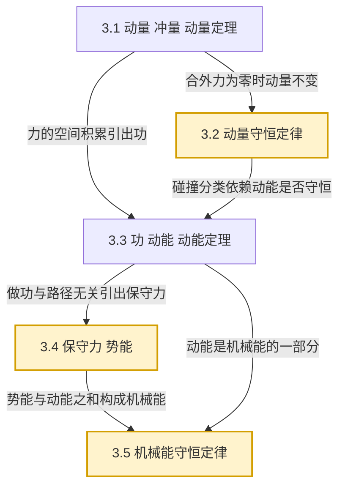

# MOC - 第3章 动量守恒与能量守恒

> [!info] 本章定位
> 第3章在 [[MOC - 第2章]]（牛顿运动定律）的瞬时力分析基础上，把力对质点的**时间积累效应**与**空间积累效应**分别抽象为**冲量**与**功**，并由此导出贯穿整个经典力学的两大守恒律——**动量守恒定律**与**机械能守恒定律**。本章是 [[3.1 动量、冲量、动量定理]] 的理论起点，并直接为 [[MOC - 第4章]] 刚体转动（角动量、转动动能）和 [[MOC - 第6章]] 静电场（电势、电势能）提供类比模板与计算工具。本章解决的核心问题是：**当系统内部发生相互作用（碰撞、爆炸、弹簧连接）时，如何在不追踪每个瞬时力的前提下，用守恒律预测系统始末状态**，以及**何种条件下动量或机械能保持不变**。

## 学习路线图

## 知识点导航

| 小节 | 主题 | 核心内容 | 重点 |
| ---- | ---- | -------- | ---- |
| [[3.1 动量、冲量、动量定理]] | 动量、冲量、动量定理 | $\vec p=m\vec v$（单位 $\mathrm{kg\cdot m/s}$）、$\vec I=\int\vec F\,dt$、质点与质点系动量定理、平均冲力 | 概念根基 |
| [[3.2 动量守恒定律]] | 动量守恒定律 | 守恒条件、某方向守恒、弹性/非弹性/完全非弹性碰撞、恢复系数、火箭飞行、反冲 | **重点** |
| [[3.3 功、动能、动能定理]] | 功、动能、动能定理 | $W=\int\vec F\cdot d\vec r$（单位 $\mathrm J$）、功率 $P=\vec F\cdot\vec v$、$E_k=\tfrac12mv^2$、质点与质点系动能定理 | 功的计算 |
| [[3.4 保守力、势能]] | 保守力、势能 | 保守力判据 $\oint\vec F\cdot d\vec r=0$、重力/弹性/引力势能、$\vec F=-\nabla E_p$ | **难点** |
| [[3.5 机械能守恒定律]] | 机械能守恒定律 | 功能原理 $W_外+W_{非保内}=\Delta E$、守恒条件、应用步骤、典型综合例题 | **综合重点** |

## 核心考点

1. **动量定理的矢量性**：$\vec I=\Delta\vec p$ 是矢量方程，需在选定坐标系下分量求解；冲量方向不一定与瞬时力方向相同，而是力对时间积分的合方向（[[3.1 动量、冲量、动量定理]]）。
2. **平均冲力**：$\bar F=\Delta p/\Delta t$，用于碰撞、打击等短时大力的估算；注意区分力的方向与速度方向（[[3.1 动量、冲量、动量定理]]）。
3. **动量守恒条件的严格判断**：要求系统所受**合外力为零**；内力（不论多大、是否保守）不改变系统总动量。某方向合外力分量为零时，仅该方向动量守恒（[[3.2 动量守恒定律]]）。
4. **三类碰撞的判别**：弹性碰撞（动量守恒 + 动能守恒，恢复系数 $e=1$）、非弹性碰撞（仅动量守恒，$0<e<1$）、完全非弹性碰撞（碰后粘合，$e=0$，动能损失最大）（[[3.2 动量守恒定律]]）。
5. **质点系动能定理中内力做功**：$W_外+W_内=\Delta E_k$，内力虽等大反向但两质点位移一般不同，故 $W_内\ne 0$（[[3.3 功、动能、动能定理]]）。
6. **保守力判据与势能定义**：环路积分为零 ⇔ 做功与路径无关；势能差 $E_p(B)-E_p(A)=-\int_A^B\vec F\cdot d\vec r$，势能零点可任选但一旦选定后势能为单值函数（[[3.4 保守力、势能]]）。
7. **$\vec F=-\nabla E_p$ 的运用**：由势能函数反求保守力，分量式 $F_x=-\partial E_p/\partial x$；重力 $F_y=-mg$，弹簧 $F_x=-kx$，引力 $F_r=-Gm_1m_2/r^2$（[[3.4 保守力、势能]]）。
8. **机械能守恒条件的应用**：只有保守内力做功（$W_外=0$ 且 $W_{非保内}=0$）时机械能守恒；常见反例：摩擦力做功、外力推动、爆炸化学能释放（[[3.5 机械能守恒定律]]）。

## 自测题

> [!question]- 自测1（动量定理矢量性）
> 质量为 $m=0.40\,\mathrm{kg}$ 的小球以 $v=6.0\,\mathrm{m/s}$ 沿水平方向撞击竖直墙壁后以相同速率反向弹回，碰撞时间 $\Delta t=0.020\,\mathrm s$。取垂直墙壁向内为 $x$ 正方向，求墙对小球的平均冲力。
>
> > [!success]- 解答
> > 始末动量沿 $x$ 方向：$p_1=+mv=+2.4\,\mathrm{kg\cdot m/s}$，$p_2=-mv=-2.4\,\mathrm{kg\cdot m/s}$。由动量定理
> > $$\bar F_x\Delta t=p_2-p_1=-4.8\,\mathrm{kg\cdot m/s},\quad \bar F_x=\frac{-4.8}{0.020}=-240\,\mathrm N.$$
> > 负号表示墙对球的力沿 $x$ 负方向（即向外推球，与入射方向相反），大小 $240\,\mathrm N$。由牛顿第三定律，球对墙的平均冲力大小同为 $240\,\mathrm N$，方向指向墙内。

> [!question]- 自测2（完全非弹性碰撞）
> 质量 $m_1=2.0\,\mathrm{kg}$、速度 $v_1=3.0\,\mathrm{m/s}$ 的物体与静止的 $m_2=4.0\,\mathrm{kg}$ 物体发生完全非弹性碰撞，求碰后共同速度及动能损失。
>
> > [!success]- 解答
> > 动量守恒（水平方向无外力）：
> > $$m_1v_1=(m_1+m_2)v'\Rightarrow v'=\frac{2.0\times 3.0}{6.0}=1.0\,\mathrm{m/s}.$$
> > 动能损失
> > $$\Delta E_k=\tfrac12 m_1v_1^2-\tfrac12(m_1+m_2)v'^2=9.0-3.0=6.0\,\mathrm J.$$
> > 等价于 $\Delta E_k=\tfrac12\mu(v_1-v_2)^2=\tfrac12\cdot\frac{8}{6}\cdot 9=6.0\,\mathrm J$（$\mu=\frac{m_1m_2}{m_1+m_2}$ 为约化质量）。

> [!question]- 自测3（保守力与势能）
> 已知一维势能函数 $E_p(x)=ax^3-bx$（$a,b>0$），求保守力 $F(x)$，并求其平衡位置。
>
> > [!success]- 解答
> > 由 $\vec F=-\nabla E_p$ 的一维形式 $F_x=-dE_p/dx$：
> > $$F(x)=-3ax^2+b.$$
> > 平衡位置满足 $F=0$，即 $x=\pm\sqrt{b/(3a)}$。稳定性由二阶导 $dF/dx=-6ax$ 判断：$x=+\sqrt{b/(3a)}$ 处 $dF/dx<0$ 为**稳定平衡**，$x=-\sqrt{b/(3a)}$ 处 $dF/dx>0$ 为**不稳定平衡**。

> [!question]- 自测4（机械能守恒综合）
> 质量为 $m$ 的小球（视为质点）从半径为 $R$ 的光滑固定半球面顶端由静止滑下。求小球脱离球面时的高度 $h$（距顶端下降的距离）及此时速率 $v$。
>
> > [!success]- 解答
> > 取球心为重力势能零点。设脱离时小球位于与竖直方向夹角 $\theta$ 处，此时高度 $H=R\cos\theta$，下降 $h=R(1-\cos\theta)$。
> > **脱离条件**：球面对小球的支持力 $N=0$。沿法向由牛顿第二定律 $mg\cos\theta-N=mv^2/R$，故 $mg\cos\theta=mv^2/R$。
> > **机械能守恒**（支持力不做功，仅重力做功）：$\tfrac12mv^2=mgR(1-\cos\theta)$。
> > 代入：$v^2=2gR(1-\cos\theta)$，又 $v^2=gR\cos\theta$，故 $2(1-\cos\theta)=\cos\theta$，$\cos\theta=2/3$。
> > $$h=R(1-\tfrac23)=\tfrac{R}{3},\qquad v=\sqrt{gR\cos\theta}=\sqrt{\tfrac{2gR}{3}}.$$

## 章节导航

- 上一级：[[MOC - 大学物理B]]
- 先修章节：[[MOC - 第2章]]（牛顿运动定律，是动量与功的力学基础）
- 上一章：[[MOC - 第2章]]
- 下一章：[[MOC - 第4章]]（刚体的转动，将动量与动能推广到转动情形，引出角动量守恒）
- 习题：[[MOC - 第3章习题]]

## 相关标签

#大学物理 #力学 #动量 #冲量 #动能 #势能 #机械能守恒 #碰撞
